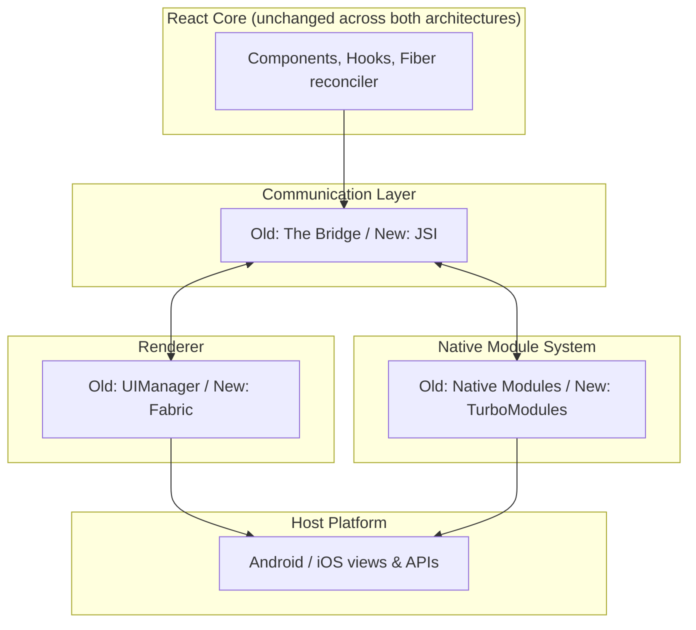
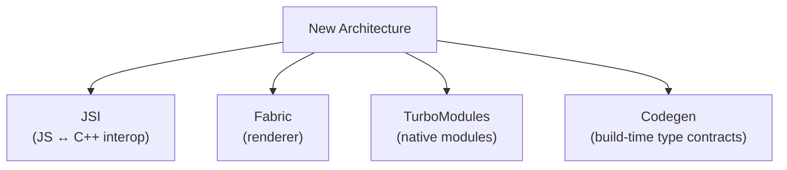
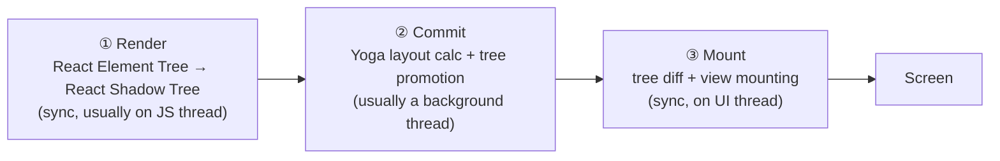
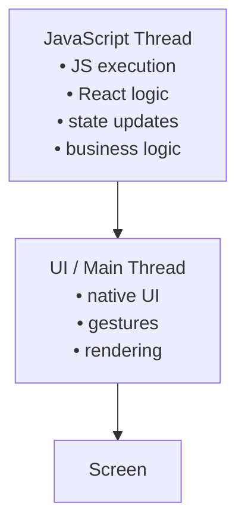

# React Native Architecture & Internals — Interview Guide

> Deep-dive reference covering the Bridge, JSI, TurboModules, Fabric, React reconciliation/Fiber, the RN rendering pipeline, and Hermes — written for interview preparation. Facts cross-checked against the official React Native architecture docs (reactnative.dev/architecture) and the Hermes repo.

## Table of Contents

1. [Overview](#1-overview)
2. [Quick Summary (TL;DR)](#2-quick-summary-tldr)
3. [What Is React Native Architecture](#3-what-is-react-native-architecture)
4. [The Old Architecture (Bridge Era)](#4-the-old-architecture-bridge-era)
5. [Why The Architecture Changed](#5-why-the-architecture-changed)
6. [The New Architecture Overview](#6-the-new-architecture-overview)
7. [JSI — JavaScript Interface](#7-jsi--javascript-interface)
8. [TurboModules](#8-turbomodules)
9. [Fabric](#9-fabric)
10. [Codegen](#10-codegen)
11. [How Fabric And TurboModules Fit Together](#11-how-fabric-and-turbomodules-fit-together)
12. [React Reconciliation And Fiber](#12-react-reconciliation-and-fiber)
13. [React Native Rendering Pipeline And Threading Model](#13-react-native-rendering-pipeline-and-threading-model)
14. [Hermes](#14-hermes)
15. [End-To-End Walkthrough (Button Tap)](#15-end-to-end-walkthrough-button-tap)
16. [Old vs New Architecture — Comparison Cheat Sheet](#16-old-vs-new-architecture--comparison-cheat-sheet)
17. [Rapid-Fire Interview Q&A](#17-rapid-fire-interview-qa)
18. [Key Terms Glossary](#18-key-terms-glossary)
19. [Further Reading](#19-further-reading)

---

## 1. Overview

React Native lets you write application logic once in JavaScript/TypeScript using React, and render it to **real native UI** (not a WebView). To do that, RN needs a way to:

1. Run JS (a JS engine).
2. Describe UI from JS (React elements → some intermediate tree).
3. Turn that intermediate tree into actual native views (Android `View`/iOS `UIView`) and lay them out.
4. Let JS call native platform APIs (camera, storage, geolocation...) and receive native events (touches, sensors, network callbacks) back.

**"React Native architecture"** is the umbrella term for how these four responsibilities are implemented and how the JavaScript side and the native side talk to each other. There have been two major generations of this design: the **Old Architecture** (Bridge-based, 2015–2024) and the **New Architecture** (JSI-based, default since RN 0.76, October 2024).

---

## 2. Quick Summary (TL;DR)

| Question | One-line answer |
|---|---|
| What is RN architecture? | The system connecting JS logic to native UI/APIs: a JS engine, a renderer, a native-module system, and a communication layer between them. |
| Old architecture? | Three conceptual threads (JS, Shadow/layout, UI) talking only through an **asynchronous, batched, JSON-serializing Bridge**. |
| New Architecture? | JS and native share memory and call each other directly through **JSI**, with **Fabric** as the renderer and **TurboModules** as the native-module system, both generated/validated by **Codegen**. |
| Why change? | The Bridge was async-only, serialized everything to JSON, and batched messages — causing latency, jank, slow startup, and no type safety. |
| Bridge problems? | Async-only (no sync layout measurement), JSON ser/deser cost, batching delay, eager module init, poor scaling for large payloads (images, frames). |
| JSI's role? | A C++ interface letting JS hold direct references to native (C++) objects/functions and call them **synchronously or asynchronously**, with no serialization — the foundation Fabric and TurboModules are built on. |
| Fabric + TurboModules? | Both sit on top of JSI and are both described/validated by Codegen. Fabric renders UI (Shadow Tree → host views); TurboModules expose imperative native APIs. Together with JSI + Codegen they form the "4 pillars" of the New Architecture. |

---

## 3. What Is React Native Architecture

React Native's architecture is the set of runtime pieces that make "write JS, render native UI" possible:

- **A JavaScript engine** — executes your JS bundle (historically JavaScriptCore "JSC"; now **Hermes** by default).
- **A renderer** — converts the React element tree your components return into native views, and computes layout (old: UIManager + per-platform Shadow Tree; new: **Fabric**).
- **A native module system** — exposes native/platform APIs to JS (old: **Native Modules**; new: **TurboModules**).
- **A communication layer** — the glue that lets 1↔2↔3 talk to each other (old: **the Bridge**; new: **JSI**).
- **A build-time contract generator** — ensures JS and native sides agree on method/prop signatures (new only: **Codegen**).

Both generations reuse the **same React core** (React, Fiber, reconciliation) — what changed across the Old/New Architecture split is everything *below* React: how React's output gets to the screen and how native capabilities get exposed back to JS.



---

## 4. The Old Architecture (Bridge Era)

### 4.1 Threading model (classic mental model)

The commonly-taught mental model for the Old Architecture has **three conceptual lanes of work**:

| Thread | Responsibility |
|---|---|
| **JS Thread** | Runs your application code: component render functions, business logic, state updates. Produces a description of what the UI should look like. |
| **Shadow Thread** (a background native thread) | Takes the UI description and runs **Yoga** (Facebook's C-based Flexbox layout engine) to calculate the position/size (x, y, width, height) of every node — this in-memory tree is the **Shadow Tree**. |
| **UI / Main Thread** | The platform's real main thread. Takes the laid-out tree and creates/updates actual native views (`android.view.View`, `UIView`), handles gestures, and draws to the screen. Must never be blocked, or the whole UI freezes. |

Every one of those lanes can only exchange data with another through **the Bridge**, and native modules often ran on *additional* background threads of their own (e.g., networking), adding even more asynchronous hops.

### 4.2 The Bridge — deep dive

The Bridge was a JavaScript object (`MessageQueue.js`) plus a native counterpart that formed the **only** channel between JS and native code. Its defining characteristics:

#### Asynchronous communication
Every call across the Bridge — invoking a native method, sending a UI mutation instruction, delivering a touch event back to JS — was **inherently async**. There was no way for JS to call a native function and get a return value back on the same stack frame. Everything was callback- or Promise-based, even operations that are conceptually instantaneous (e.g., "what is the width of this view right now?").

#### Serialization / deserialization
Because JS and native lived in separate runtimes with no shared memory, every argument and return value had to be:
1. **Serialized** to a plain, JSON-compatible representation on the sending side.
2. Copied across the Bridge.
3. **Deserialized** back into native (Java/Kotlin/Obj-C/Swift) or JS objects on the receiving side.

This cost scaled with payload size and frequency. Passing a large object (an image as base64, a big list of rows) meant stringifying it, copying the string, and parsing it again — real CPU and memory cost on both ends, on every call.

#### Batching
To avoid flooding the Bridge with one message per call, both sides **queued** outgoing messages and flushed them together — typically once per iteration of the JS event loop ("tick"), or once per native frame for UI operations. Batching reduced the *number* of bridge crossings, but:
- It added **latency**: a call issued early in a tick still had to wait for the batch to flush.
- If the JS thread was busy (a long synchronous computation, a big list re-render), the outgoing *and* incoming queues backed up, delaying both native method calls **and** event delivery (touches, scroll) back to JS — a major source of jank and "unresponsive" UI.

#### Message passing
Concretely, a native call from JS looked like pushing a tuple of `[moduleID, methodID, args]` onto a queue; native UI mutations (`createView`, `updateView`, `manageChildren`, …) worked the same way in reverse. Events (touch, text input, scroll) were serialized back into JS as plain objects and dispatched through the same queue mechanism.

#### Overhead of large data transfers
This is where the Bridge hurt the most. Anything with a large payload — camera frames, images, large JSON API responses, big lists — paid the full serialize → copy → deserialize cost **per call**. A real-world example often cited by the React Native team: a camera library processing frames in real time deals with ~30 MB per frame, i.e. roughly **2 GB/second** at typical frame rates — a volume the Bridge simply could not move fast enough for real-time use cases like live frame processing.

### 4.3 Problems with the Old Architecture / Bridge

Putting it together, the concrete pain points were:

- **No synchronous calls** → can't synchronously measure layout, can't synchronously read a native value, leading to APIs like `measure(callback)` and visible "jumps" when a layout-dependent decision is made a frame late.
- **Serialization tax** on every single cross-boundary call, regardless of size.
- **Batching latency** — updates are never immediate; worst case adds up to a full tick of delay.
- **JS-thread contention** — because *all* bridge traffic (events in, UI instructions out) flows through the same queue tied to the JS event loop, a busy JS thread stalls native event delivery too.
- **Eager module initialization** — every registered Native Module was instantiated at app startup whether or not it was ever used, hurting startup/TTI (time-to-interactive).
- **No type safety** — JSON has no static types; a mismatched argument type was a runtime crash/bug, not a build error.
- **Duplicated per-platform rendering logic** — the Shadow Tree/layout/view-flattening logic was implemented twice (once in Java for Android, once in Obj-C for iOS), doubling maintenance cost and causing platform-specific inconsistencies.
- **No concurrent rendering support** — the bridge/threading model couldn't support React 18 features like Suspense, transitions, or automatic batching.

---

## 5. Why The Architecture Changed

Meta's own stated motivations for the New Architecture (since 2018, rolled out for the Facebook app from 2021, opt-in from RN 0.68, **default since RN 0.76 / Oct 2024**) distill to three points:

1. **Synchronous layout and effects.** Previously, `onLayout` fired asynchronously, so any state update made in response to a measured layout would apply *after* the previous frame had already painted — causing a visible "jump." The New Architecture allows synchronous access to layout information with properly scheduled updates, so no intermediate/incorrect frame is ever visible.
2. **Support for concurrent rendering and React 18 features.** Suspense (for data fetching), transitions (`startTransition`/`useTransition`), and automatic batching all require a renderer that can pause, prioritize, and resume work — something the bridge-bound old renderer could not do.
3. **Fast JavaScript/native interfacing.** Replacing the async bridge with JSI removes serialization costs from essentially all JS↔native interop, including re-rendering core components like `View` and `Text`. This is also what makes libraries like VisionCamera practical — JSI can hand JS a direct reference to a native frame/image/database object instead of copying megabytes of data per call.

**Important nuance for interviews:** the React Native team is explicit that turning on the New Architecture doesn't automatically make an app faster — existing code may need to be refactored to actually use synchronous layout effects or concurrent features, and serialization may not have been *your* app's actual bottleneck. The New Architecture is an enabler, not a magic switch.

---

## 6. The New Architecture Overview

The New Architecture rests on four pillars, all built in (or around) a **shared C++ core** so platforms stop duplicating logic:



- **JSI** is the foundation — a C++ API that lets JS and native hold references to each other and call directly.
- **Fabric** is the new renderer, built on JSI, responsible for turning React's output into native views.
- **TurboModules** is the new native-module system, built on JSI, responsible for exposing imperative native APIs to JS.
- **Codegen** is a build-time tool that reads JS/TypeScript (or Flow) type specifications and generates the native-side C++/Java/Kotlin/Obj-C scaffolding for both Fabric components and TurboModules, guaranteeing both sides agree on the contract.

A **backward-compatibility interop layer** exists so legacy Native Modules and legacy native UI components can keep working (wrapped) while an app/library migrates incrementally — you don't have to rewrite everything on day one.

---

## 7. JSI — JavaScript Interface

**JSI (JavaScript Interface)** is a lightweight, general-purpose **C++ API for embedding a JS engine inside a C++ application**. It is the single most important enabler of the New Architecture.

### What JSI actually is
- JSI is **not** a new JavaScript engine. It's an **abstraction layer/interface** that any JS engine can implement. Hermes, JavaScriptCore, and V8 all speak JSI, which means the rest of React Native (Fabric, TurboModules) doesn't care which engine is running underneath.
- It defines core primitives — `jsi::Runtime`, `jsi::Value`, `jsi::Object`, `jsi::Function`, `jsi::HostObject`, `jsi::HostFunction` — that let C++ code create JS values, and let JS code hold a reference to a C++ object as if it were a normal JS object.

### C++ layer
JSI is implemented in C++ and sits directly inside the JS engine's embedding layer. Both Fabric and TurboModules are C++ systems that talk to JS **through** JSI rather than through any serialization format.

### JS runtime interaction
Through JSI, native C++ code can:
- Create a `HostObject` — a C++ class exposing `get`/`set`/`getPropertyNames` — and hand a reference to it to JS. From JS's point of view it behaves like a normal object with properties and callable methods.
- Create a `HostFunction` — a plain C++ lambda/function directly callable from JS.
- Call into JS functions/values from native code, and vice versa.

```cpp
// A minimal JSI HostObject exposing a synchronous "multiply" method to JS
class MathModule : public jsi::HostObject {
 public:
  jsi::Value get(jsi::Runtime& rt, const jsi::PropNameID& name) override {
    auto propName = name.utf8(rt);
    if (propName == "multiply") {
      return jsi::Function::createFromHostFunction(
        rt, name, /* paramCount */ 2,
        [](jsi::Runtime& rt, const jsi::Value&, const jsi::Value* args, size_t count) -> jsi::Value {
          return jsi::Value(args[0].asNumber() * args[1].asNumber());
        });
    }
    return jsi::Value::undefined();
  }
};
```
From JS, this looks like `global.MathModule.multiply(3, 4)` — a direct, synchronous function call with **zero serialization**.

### Synchronous calls where appropriate
Because JS holds an actual reference/pointer to the native object (instead of an opaque ID resolved later through a queue), calls can return a value **immediately, on the same call stack** — exactly like calling a normal JS function. This is what finally makes synchronous layout measurement and similar APIs possible. JSI doesn't forbid async — you can still return Promises/callbacks when a call is genuinely async (e.g., a network request); JSI just removes the *forced* asynchrony the Bridge imposed on everything.

### Reduced serialization overhead
No JSON stringify/parse round trip. Arguments are passed as native values/references; large objects (images, buffers, database handles) can be exposed as host objects and accessed directly, instead of being copied as strings. This is exactly why a library like VisionCamera can hand off ~30 MB video frames without the ~2 GB/s cost the Bridge would have imposed.

### Direct/native bindings & how libraries interact with native code
Any native library can implement a `HostObject`/`HostFunction` and **inject it directly into the JS global** at native-module install time — no need to go through `NativeModules`/`TurboModuleRegistry` at all if you don't want to. This is exactly how libraries like **react-native-reanimated** (worklets that run synchronously on the UI thread) and **react-native-mmkv** (synchronous key-value storage) achieve performance that was previously impossible: they bind C++ objects/functions straight into the JS runtime via JSI, bypassing the Bridge/async messaging entirely.

---

## 8. TurboModules

**TurboModules** are the New Architecture's replacement/evolution of legacy Native Modules — the mechanism for exposing imperative native APIs (storage, sensors, native SDKS, etc.) to JS.

### Replacement/evolution of legacy Native Modules
Conceptually TurboModules do the same job as `NativeModules` (expose a native class's methods to JS), but the transport is JSI instead of the Bridge, and the module itself is a C++/JSI `HostObject` under the hood rather than a bridge-registered ID.

### Lazy loading / lazy initialization
Legacy Native Modules were **all instantiated eagerly** at app startup — even modules the app never actually used on a given screen. TurboModules are **lazily initialized**: the native object is only created the first time JS actually references it (`TurboModuleRegistry.getEnforcing('MyModule')`). This directly reduces:
- **Startup work** — fewer objects constructed before the first frame.
- **Memory usage** — unused modules never allocate anything.
- This matters more as an app's module/library count grows — it's a **scalability** win, not just a one-time optimization.

### JSI integration
Each TurboModule is exposed to JS as a JSI `HostObject`. Calling `MyModule.multiply(3, 4)` from JS resolves to a direct, synchronous (or Promise-based, if declared async) C++ call — no queueing, no serialization.

### C++ layer
The TurboModule infrastructure itself (registry, lookup, marshaling helpers generated by Codegen) is implemented in shared C++, so the lazy-loading/dispatch logic is written once and reused across Android and iOS, instead of being reimplemented per platform as with legacy Native Modules.

### Codegen & type-safe interfaces
Instead of hand-writing bridging boilerplate, you declare a **spec file** using Flow or TypeScript types:

```typescript
// NativeMyModule.ts
import type { TurboModule } from 'react-native';
import { TurboModuleRegistry } from 'react-native';

export interface Spec extends TurboModule {
  multiply(a: number, b: number): number;
  getDeviceName(): Promise<string>;
}

export default TurboModuleRegistry.getEnforcing<Spec>('MyModule');
```

At build time, **Codegen** parses this spec and generates the native-side interfaces (C++ structs, Java/Kotlin interfaces, Obj-C++ protocols) that your native implementation must conform to. If your native implementation's method signature doesn't match the JS spec, **the build fails** — a compile-time guarantee instead of a runtime crash.

Compare with the legacy, untyped call:
```javascript
import { NativeModules } from 'react-native';
const { MyModule } = NativeModules;

MyModule.multiply(3, 4, (result) => {
  console.log(result); // always async; no compile-time guarantee this even exists
});
```

### Net benefits (explicitly, since this is commonly asked)
- **Lazy initialization** → faster app startup.
- **Reduced startup work** → fewer modules constructed before interactivity.
- **Better integration with JSI** → direct calls, sync where it makes sense, no serialization tax.
- **Type safety through Codegen** → JS/native contract mismatches are build errors, not runtime bugs.
- **Improved performance/scalability** → shared C++ dispatch logic scales better as the number of native modules in an app grows, unlike the old per-call bridge queue.

---

## 9. Fabric

**Fabric** is React Native's new rendering system — "a conceptual evolution of the legacy render system," per the official docs. Its core goals: unify render logic in C++, improve host-platform interoperability, and unlock new capabilities (concurrent rendering, synchronous measurement).

### Rendering pipeline (Render → Commit → Mount)
Fabric's pipeline has three explicit phases:



1. **Render** — React reduces your component tree down to **React Host Components** (`<View>`, `<Text>`, …) and, for each one, the renderer synchronously creates a corresponding **React Shadow Node** in C++ (e.g. a `<View>` → `ViewShadowNode`). Parent-child relationships in the element tree are mirrored in the **React Shadow Tree**. This step runs on the JS thread, synchronously, through JSI.
2. **Commit** — Two things happen: **(a) Layout calculation** — Yoga computes x/y/width/height for every Shadow Node (mostly pure C++; host-specific components like `Text`/`TextInput` still call back into the platform for text measurement); **(b) Tree promotion** — the finished Shadow Tree is marked as the "next tree" to mount. This typically runs asynchronously on a background thread.
3. **Mount** — The Shadow Tree (now with layout results) is turned into the real **Host View Tree**. This involves **tree diffing** (compute the minimal `createView`/`updateView`/`removeView`/`deleteView` operations, in C++, which is also where **View Flattening** happens), **tree promotion** (next tree → "previously rendered tree," for the next diff), and **view mounting** (applying the mutations to actual native views). This step runs synchronously on the UI thread. If the commit happened on a background thread, mounting waits for the next UI-thread tick; if the commit happened directly on the UI thread (high-priority path), mounting runs synchronously right after, same thread, same tick.

### Shadow Tree
The **React Shadow Tree** is the in-memory representation of what should be on screen: a tree of **React Shadow Nodes**, each holding props (from JS) and computed layout metrics (x, y, width, height from Yoga). Critically:
- In Fabric, Shadow Nodes live in **C++** (compact, cheap to allocate/clone).
- Before Fabric, the equivalent lived in the mobile runtime heap (e.g., the Android JVM) — more memory overhead, and implemented separately per platform.
- The Shadow Tree is **immutable** — updating anything means creating a new tree via structural sharing/cloning (only the path from the changed node to the root is cloned; unaffected subtrees are shared between old and new trees). This immutability is what makes the tree safe to read/write from multiple threads without locks.

### Mounting
"Mounting," in Fabric's vocabulary, specifically means **applying a diff of mutation operations to the real Host View Tree** (creating/updating/removing native views) — not to be confused with React's own "mounting" lifecycle concept (see [§12](#12-react-reconciliation-and-fiber)). It's always the final, synchronous, UI-thread step.

### Concurrent rendering
Because the Shadow Tree (and the React Element Tree feeding it) are immutable with structural sharing, Fabric can have **multiple tree versions in flight** without blocking or corrupting state — exactly what's needed for React 18's concurrent features (Suspense, transitions, automatic batching). The renderer can also **interrupt** an in-progress low-priority render phase to handle a higher-priority event, then resume — see the threading-model scenarios in [§13](#13-react-native-rendering-pipeline-and-threading-model).

### C++ architecture (shared cross-platform core)
Previously, Shadow Tree management, layout glue, and View Flattening were each implemented **twice** — once in Java for Android, once in Objective-C for iOS. Fabric moved all of this into a **single shared C++ core**, which:
- Cuts development/maintenance cost (one implementation, not two).
- Reduces memory footprint (a C++ struct is cheaper than an equivalent JVM/Kotlin/Swift object).
- Reduces JNI overhead on Android (Yoga is now integrated directly in the C++ core — no more crossing JNI just to run layout). JNI (Java Native Interface) is *not* eliminated entirely — it's still used for (1) measuring host-specific components like `Text`/`TextInput`, and (2) sending the final mutation list to Android views during mount — but it's far less than before.
- Makes it realistically possible to port React Native to **new host platforms** (Windows, TV/console OSes) by reusing the same renderer core.
- Enables **View Flattening** as a default, cross-platform optimization: "layout-only" nodes (e.g. a wrapper `<View style={{margin: 10}}>` with no visible paint properties) are merged into their parent during the diffing step, shrinking the host view tree (previously an Android-only trick, now shared, C++, zero extra cost since it's part of diffing anyway).

### Improved interoperability with React
Fabric is just another **React renderer** (conceptually a sibling of `react-dom`), implementing React's host-config interface against the C++ Shadow Tree APIs instead of the DOM. Because Fabric exposes **synchronous, thread-safe** APIs to React, React's own concurrent-mode machinery (interruptible rendering, priorities, Suspense) can be used on native the same way it's used on web — something the old async-bridge renderer architecturally could not support. This also fixed the classic "layout jump" bug where embedding a React Native view inside a native (host) view would visibly snap into place a frame late, because layout used to be asynchronous.

---

## 10. Codegen

**Codegen** is the build-time tool that turns JS/TypeScript (or Flow) type declarations into native scaffolding, for **both** TurboModules and Fabric components:

- For TurboModules: a `Spec` interface (see [§8](#8-turbomodules)) → generates C++/Java/Kotlin/Obj-C++ interfaces your native module implementation must satisfy.
- For Fabric components: a component declared via `codegenNativeComponent<Props>('Name')` → generates C++ structs for the component's props, so JS and native always agree on prop names/types.

```typescript
// MyNativeViewNativeComponent.ts
import codegenNativeComponent from 'react-native/Libraries/Utilities/codegenNativeComponent';
import type { ViewProps } from 'react-native';
import type { Int32 } from 'react-native/Libraries/Types/CodegenTypes';

interface NativeProps extends ViewProps {
  value?: Int32;
  onValueChange?: (event: { nativeEvent: { value: number } }) => void;
}

export default codegenNativeComponent<NativeProps>('MyNativeView');
```

The key guarantee: the JS declaration is the **single source of truth**. If the native implementation's props/methods don't match it, you get a **build error**, not a runtime crash discovered by a user. This is what "type safety across the JS/native boundary" concretely means in the New Architecture.

---

## 11. How Fabric And TurboModules Fit Together

This is explicitly worth stating clearly, since it's a common interview question:

- Both Fabric and TurboModules are built **on top of JSI** — neither could exist without it. JSI is the shared communication substrate; Fabric and TurboModules are two different *consumers* of that substrate.
- Both are **described and validated by the same Codegen pipeline** — one JS/TS spec file format, one build-time code generator, producing native contracts for either "a UI component" (Fabric) or "an imperative API" (TurboModules).
- They solve **different problems**: Fabric answers *"what should be on screen and how is it laid out"* (declarative UI); TurboModules answer *"how do I call this native capability"* (imperative APIs — camera, storage, Bluetooth, etc.).
- They're **complementary in practice** — a Fabric native component's implementation can internally use a TurboModule, and both commonly ship together inside the same native library (e.g., a camera library ships a Fabric view component **and** a TurboModule for imperative controls).
- Together with JSI and Codegen, they form the commonly-cited **"4 pillars"** of the New Architecture — all four are required together; you cannot adopt "just Fabric" or "just TurboModules" without JSI and Codegen underneath them.

---

## 12. React Reconciliation And Fiber

This part is **React core**, not React-Native-specific — the same reconciler (Fiber) that powers `react-dom` powers React Native. What differs is only the "host config" at the very bottom (DOM mutations vs. Fabric Shadow Tree mutations via JSI).

### Reconciliation
**Reconciliation** is the algorithm React uses to diff a previous element tree against a new one and compute the minimal set of changes needed, so React doesn't have to throw away and rebuild the whole UI on every render. Core heuristics:
- Elements of a **different type** at the same position → old subtree is torn down, new subtree built from scratch.
- Elements of the **same type** → the existing instance is kept, props/children are diffed and patched in place.
- **Keys** disambiguate list items so React can match items across renders (reorder/insert/remove) instead of recreating them.

### Fiber
**Fiber** is React's reconciliation engine (since React 16) — both an algorithm and a data structure. Each **Fiber node** is a plain JS object representing one unit of work, roughly one element/component instance, holding its type, pending props, memoized state, and pointers to its `child`, `sibling`, and `return` (parent), plus an `alternate` pointer linking it to its counterpart in the other tree.

React keeps **two Fiber trees**: the **current** tree (what's on screen) and a **work-in-progress** tree (being built for the next render). This "double buffering" lets React build the next tree without touching the one currently rendered, then atomically swap them at commit time. Representing work as discrete, linked units is what makes rendering **interruptible**: React can pause after any fiber, yield to the browser/UI thread for something more urgent, then resume — the basis for concurrent/time-sliced rendering.

### Render phase
Also called the reconciliation phase. React walks the tree **top-down** (`beginWork`) calling component render functions/hooks and diffing children against the current tree, then **bottom-up** (`completeWork`) finalizing each fiber and bubbling up a list of pending **effects**. Key properties:
- **Interruptible** — in concurrent mode, React can pause, abort, or restart this phase; it may run partially, get thrown away, and run again.
- **No visible side effects** — must be "pure" from the outside; nothing here should be observable by the user yet (no DOM/host mutations).

### Commit phase
Once the render phase completes, the resulting tree is **committed**: the commit phase is **synchronous** and **cannot be interrupted**. In `react-dom` this has three sub-steps (before-mutation/`getSnapshotBeforeUpdate`, mutation — actually applying host changes, and layout — `componentDidMount`/`componentDidUpdate`/`useLayoutEffect` fire here, synchronously, before paint). `useEffect` callbacks ("passive effects") are scheduled to run **after** paint, asynchronously. After mutation, the work-in-progress tree is swapped in to become the new "current" tree.

**React Native nuance (often conflated — good interview differentiator):** React's own render/commit phases are not the same pair as Fabric's render/commit/mount phases described in [§9](#9-fabric). React's **commit phase** (running the host-config mutation calls) is what triggers Fabric's **render step** (synchronously creating React Shadow Nodes via JSI). Fabric then runs its *own*, separate commit (layout) and mount (apply-to-host-views) steps afterward, potentially on different threads. In short: *React reconciliation* decides *what* changed; *Fabric's pipeline* decides *when/where* that change is laid out and painted.

### Mounting, updating, unmounting
- **Mounting** — a component instance is created and inserted for the first time: constructors/hook initializers run, refs are attached, and `componentDidMount`/`useEffect` (mount) fires after the commit.
- **Updating** — an existing instance receives new props/state: render phase diffs old vs. new output, commit phase applies only the necessary host mutations, then `componentDidUpdate`/`useEffect` (update) fires.
- **Unmounting** — an instance is removed from the tree: cleanup functions (`useEffect` cleanup, `componentWillUnmount`) run, refs are detached, and the corresponding host view(s) are removed during the mount/diff step.

---

## 13. React Native Rendering Pipeline And Threading Model

### The simple mental model (great for a quick answer)



- **JavaScript Thread** — runs your JS bundle: component functions, hooks, state/business logic, and (through Fabric) synchronously builds the React Shadow Tree.
- **UI / Main Thread** — the platform's real main thread: the *only* thread allowed to touch native views, handle gesture recognition, and actually draw frames.

If the JS thread is busy (expensive computation, a big synchronous render), UI thread work that depends on new JS output stalls — the classic cause of dropped frames/jank. This is why performance-critical interaction code (gesture-driven animations, for example) increasingly runs via JSI **directly on/near the UI thread** (see Reanimated/worklets in [§7](#7-jsi--javascript-interface)), bypassing the JS thread entirely for per-frame work.

### The official, more precise model

The current React Native docs formally name exactly two renderer threads — **UI thread** (the only thread that may manipulate host views) and **JavaScript thread** (where React's render phase and layout are executed) — but, crucially, **the full render pipeline can run on either thread depending on priority**, because the C++ implementation is thread-safe and immutable by design. Five documented scenarios:

| Scenario | What happens |
|---|---|
| **Render in the JS thread** (most common) | Full render pipeline (render → commit → mount handoff) runs starting on the JS thread, as usual. |
| **Render in the UI thread** | A high-priority event originates on the UI thread; the renderer can run the **entire** pipeline synchronously, on the UI thread, with no hop to the JS thread at all. |
| **Default/continuous event interruption** | A low-priority UI-thread event interrupts an in-progress JS-thread render phase; React/Fabric merge the UI event's state in, and rendering continues on the JS thread. |
| **Discrete event interruption** | A high-priority UI-thread event interrupts an in-progress JS-thread render phase; the render phase is resumed/finished **synchronously on the UI thread** instead. |
| **C++ State update** | A state change originates natively (e.g., `ScrollView`'s scroll offset) and is owned by C++, not React — it **skips the render phase entirely** and can originate/commit on any thread, including the UI thread. |

This flexibility (same pipeline, either thread, interruptible) is only possible because of Fabric's immutable, thread-safe C++ data structures — the old architecture's rigid "JS always here, UI always there, bridge in between" model could not do this.

### Why this matters in practice
- Heavy JS work no longer *has to* block synchronous, high-priority native interactions (e.g., a drag gesture) the way it did under the Bridge, because that work can be prioritized/interrupted or, for certain paths, run directly on the UI thread.
- Libraries that need guaranteed per-frame response (gesture handlers, animations) still prefer to run their hot path as **JSI worklets on/near the UI thread**, avoiding the JS thread scheduler altogether for that specific work.

---

## 14. Hermes

**Hermes** is an open-source JavaScript engine built by Meta, **optimized specifically for React Native**, with ahead-of-time static optimization and compact bytecode as its headline features. It implements JSI, so — like JSC or V8 — it can be plugged in underneath either architecture generation, though it's most closely co-developed with the New Architecture and is the default engine today.

### Startup performance
Hermes **precompiles JS to bytecode ahead of time** (via its compiler, `hermesc`, as part of the Metro/build pipeline) and ships that bytecode in the app bundle. At app launch, Hermes loads bytecode directly instead of parsing and compiling raw JS text on-device — this is the single biggest contributor to Hermes's faster startup/TTI compared to JSC, especially on lower-end Android devices.

### Bytecode
The compiled artifact is **Hermes Bytecode (HBC)** — a compact format designed to be small (reducing APK/IPA size and I/O at startup) and fast to load. Hermes is primarily an **interpreter** for this bytecode (not a tiered JIT like V8), which trades some raw peak throughput for lower memory use and faster, more predictable startup — a sound trade-off for UI-driven mobile apps that rarely run tight numeric hot loops the way a JIT is optimized for.

### Memory characteristics
Hermes was designed with mobile memory constraints front and center — generally a **smaller memory footprint** than JSC for typical RN workloads, which matters a lot on low-end/low-RAM Android devices.

### Garbage collection
Hermes uses a **generational garbage collector** (Meta's engineering blog refers to it as the "Hades" GC): young-generation collection is fast and frequent, and the old-generation collector runs **concurrently** with JS execution on a separate thread to minimize GC pause times that would otherwise stall the JS thread (and, transitively, the UI).

### Debugging/profiling considerations
- Supports **Chrome DevTools protocol** debugging (`chrome://inspect`) and integrates with Flipper.
- Supports a **sampling profiler** and **heap snapshots** for memory analysis.
- Source maps enable **symbolicated stack traces** even though the device only has bytecode.
- Because Hermes doesn't JIT, CPU-bound micro-benchmarks can look different (sometimes slower) than JSC/V8 for raw numeric throughput — a nuance worth mentioning if asked "is Hermes always faster?" (answer: faster to **start**, generally lower memory; not necessarily faster for raw compute-bound JS).

### "Bundled Hermes" (a build-system detail worth knowing)
Since RN 0.69, Hermes is released **bundled** with each React Native version — meaning the exact JSI implementation used by Hermes and by React Native is guaranteed to match (previously, mismatched Hermes/RN versions could cause ABI incompatibilities and crashes). On Android with the New Architecture enabled, Hermes is built from source as part of the app build, aligning the build mechanism for both.

---

## 15. End-To-End Walkthrough (Button Tap)

Tying every section together — what happens when a user taps a button that updates some state and changes what's on screen:

**Old Architecture:**
1. User taps the screen → **UI thread** detects the touch.
2. The touch event is serialized to JSON and queued → sent across **the Bridge** → deserialized on the **JS thread**.
3. JS runs your event handler, calls `setState`, React re-renders (reconciliation: render phase, then commit phase against the old UIManager host config).
4. The resulting UI instructions (`updateView`, …) are serialized to JSON, queued, and sent back across **the Bridge**.
5. Native deserializes the batch, the **Shadow thread** recomputes layout with Yoga.
6. The **UI thread** applies the updates to real views and paints.
Every arrow between threads above pays a serialization + batching cost.

**New Architecture:**
1. User taps the screen → **UI thread** detects the touch; this can be delivered to JS directly through JSI (no JSON).
2. JS runs the event handler, calls `setState`; React's Fiber reconciler runs its render phase, then its commit phase, which **synchronously** (via JSI) creates/updates **React Shadow Nodes** in C++ — Fabric's **Render** step, usually on the JS thread (or synchronously on the UI thread if this is a high-priority interruption, see [§13](#13-react-native-rendering-pipeline-and-threading-model)).
3. Fabric's **Commit** step runs Yoga layout on the new Shadow Tree and promotes it (usually on a background thread) — no serialization, just C++ struct creation/cloning.
4. Fabric's **Mount** step diffs the new tree against the previously-mounted tree in C++ (including View Flattening), then applies the minimal set of native view mutations **synchronously on the UI thread**, which paints the new frame.
Nothing here is JSON; everything is direct C++ structures accessed via JSI, and lazy TurboModules handle any imperative native API calls your handler makes along the way.

---

## 16. Old vs New Architecture — Comparison Cheat Sheet

| Dimension | Old Architecture | New Architecture |
|---|---|---|
| JS ↔ native communication | **The Bridge**: async-only, JSON-serialized, batched message queue | **JSI**: direct C++ references, sync or async, no mandatory serialization |
| Native module loading | All `NativeModules` eagerly instantiated at startup | **TurboModules** lazily instantiated on first JS access |
| Renderer | `UIManager` + per-platform (Java/Obj-C) Shadow Tree implementations | **Fabric**: single shared C++ renderer core |
| Layout measurement | Only asynchronous (`measure(callback)`) | Can be synchronous — no more layout "jump" |
| Type safety JS↔native | None — plain JSON, runtime errors only | **Codegen** generates native contracts at build time; mismatches fail the build |
| Concurrent rendering / React 18 | Not supported | Supported — Suspense, transitions, automatic batching |
| Cross-platform code reuse | Shadow Tree/layout/view-flattening logic duplicated per platform | Shared C++ core (Shadow Tree, Yoga integration, diffing, view flattening) |
| View flattening | Android-only optimization | Default on both Android & iOS (C++, part of diffing) |
| Large data transfers (images/frames) | Expensive — serialize/copy/deserialize per call | Cheap — pass host object references directly via JSI |
| Threading flexibility | Rigid: JS / Shadow / UI, bridged | Render pipeline can run on JS thread **or** UI thread depending on priority |
| Default since | Through RN 0.75 | **RN 0.76 (Oct 2024)** onward |

---

## 17. Rapid-Fire Interview Q&A

**Q: What is the Bridge, and why was it a bottleneck?**
A: A JSON-serializing, batched, strictly asynchronous message queue connecting the JS thread to native code. It was a bottleneck because every call paid a serialize/deserialize cost, batching added latency, and a busy JS thread delayed both outgoing native calls and incoming events, with no way to do synchronous calls at all.

**Q: What is JSI and how is it different from the Bridge?**
A: JSI (JavaScript Interface) is a C++ API letting JS hold direct references to native C++ objects/functions and call them with no serialization, synchronously when appropriate. Unlike the Bridge, it's not a queue or a format — it's shared-memory-style direct interop, and it's engine-agnostic (works with Hermes, JSC, V8).

**Q: Why couldn't the Bridge do synchronous calls?**
A: JS and native ran in separate runtimes/threads with no shared memory and communicated only via a batched, async message queue — there was no mechanism to block and wait for a same-stack-frame return value without redesigning the transport, which is exactly what JSI provides.

**Q: What are TurboModules and how do they improve on Native Modules?**
A: The New Architecture's native-module system, built on JSI. Improvements: lazy initialization (only created on first use, improving startup/memory), direct JSI calls instead of bridge serialization, and Codegen-enforced type-safe interfaces instead of untyped JSON.

**Q: What does "lazy loading" buy you concretely?**
A: Faster app startup (fewer native objects constructed before first interaction) and lower memory use (modules you never touch are never allocated) — this scales well as an app's dependency/module count grows.

**Q: What is Codegen and what problem does it solve?**
A: A build-time tool that reads JS/TypeScript specs (for TurboModules and Fabric components) and generates the matching native interfaces, making the JS declaration the single source of truth. It turns JS/native contract mismatches into build errors instead of runtime crashes.

**Q: What is Fabric?**
A: React Native's new renderer: a shared C++ core that builds an immutable React Shadow Tree from React's output, computes layout via Yoga, diffs it against the previously-mounted tree (including view flattening), and mounts the result onto real native views — synchronously on the UI thread.

**Q: What is the Shadow Tree, and how did it change under Fabric?**
A: An in-memory tree of nodes holding each view's props and computed layout (x/y/width/height). Under Fabric it's implemented in immutable C++ structures shared across platforms (instead of separate, mutable, per-platform native-heap objects), enabling thread-safe, synchronous, concurrent-friendly access.

**Q: Walk through Render → Commit → Mount.**
A: Render: JS synchronously creates React Shadow Nodes from the element tree (via JSI). Commit: Yoga calculates layout and the new tree is promoted to "next tree" (usually on a background thread). Mount: the next tree is diffed against the previously-rendered tree, view-flattened, and the resulting mutations are applied to real views synchronously on the UI thread.

**Q: How does Fabric support concurrent rendering?**
A: Its Shadow Tree is immutable with structural sharing, so multiple tree versions can exist/be computed without locks or corruption, and the render phase can be interrupted by higher-priority UI-thread events and resumed — exactly what React 18's Suspense/transitions need.

**Q: What's the difference between React's render/commit phases and Fabric's render/commit/mount phases?**
A: They're two different pairs of phases at two different layers. React's Fiber reconciler has its own render phase (diffing, interruptible) and commit phase (applying host-config mutations, synchronous) that run in JS. React's commit phase is what *triggers* Fabric's render step (building C++ Shadow Nodes); Fabric then runs its own separate commit (layout) and mount (apply to host views) afterward, possibly on a different thread.

**Q: What is Fiber and why did React move to it?**
A: Fiber is React's reconciliation engine/data structure (React 16+), representing each unit of work as a linked node with child/sibling/return pointers and an alternate pointer to its counterpart tree. It replaced the old stack-based reconciler because fiber-based work can be paused, aborted, reused, and prioritized — required for concurrent/time-sliced rendering.

**Q: Explain mounting, updating, and unmounting.**
A: Mounting: first creation/insertion of a component — initializers run, `componentDidMount`/mount-`useEffect` fires. Updating: new props/state trigger a diff and minimal host patch, then `componentDidUpdate`/update-`useEffect` fires. Unmounting: the instance is removed — cleanup functions run and host view(s) are removed.

**Q: Why does React Native use (at least) two threads, and what happens if the JS thread is blocked?**
A: The UI/main thread is the only one allowed to touch native views, handle gestures, and paint — it must stay responsive. The JS thread runs React/business logic. If the JS thread is blocked by expensive synchronous work, any UI update or event handling that depends on fresh JS output stalls, causing dropped frames/jank — which is why frame-critical work (gestures, animations) increasingly runs as JSI worklets closer to the UI thread instead.

**Q: What is Hermes and why was it created?**
A: A JS engine built by Meta specifically for React Native, prioritizing fast startup and low memory over raw peak throughput, via ahead-of-time bytecode compilation and compact bytecode format.

**Q: How does Hermes improve startup time?**
A: It precompiles JS to bytecode at build time, so app launch loads bytecode directly instead of parsing/compiling raw JS on-device — the dominant factor in its faster time-to-interactive, especially on low-end Android hardware.

**Q: What garbage collector does Hermes use?**
A: A generational collector (Meta calls it the "Hades" GC) — fast young-generation collection plus a concurrent old-generation collector that runs alongside JS execution to minimize pause times.

**Q: Is Hermes required for the New Architecture?**
A: No — JSI is engine-agnostic (JSC/V8 can implement it too), but Hermes is the default engine today and is co-released/version-matched with React Native ("Bundled Hermes") specifically to avoid JSI ABI mismatches.

**Q: How do libraries like Reanimated bypass the JS thread/bridge for animations?**
A: They use JSI to inject C++ host objects/functions directly into the JS runtime and run "worklets" — small JS functions compiled/executed in a way that can run synchronously on (or very close to) the UI thread, avoiding the JS-thread scheduler entirely for per-frame work.

**Q: What is View Flattening?**
A: A C++ diffing-stage optimization that merges "layout-only" nodes (views that affect only layout — e.g., a margin wrapper — with no visible paint properties) into their parent, reducing the depth/size of the real native view hierarchy with no visible difference to the user. Previously Android-only; now a default, shared, cross-platform optimization under Fabric.

**Q: What's the interop layer and why does it matter?**
A: A compatibility shim that lets legacy Native Modules and legacy native UI components keep working under the New Architecture, so apps/libraries can migrate incrementally instead of needing a big-bang rewrite.

**Q: Give a concrete real-world example of why JSI matters for performance.**
A: Camera libraries like VisionCamera process video frames in real time — roughly 30 MB per frame, ~2 GB/second at typical frame rates. The Bridge's serialize/copy/deserialize cost made that infeasible; JSI lets JS hold a direct reference to the native frame/image object instead, with no copy.

**Q: What is JNI, and how does it relate to JSI?**
A: JNI (Java Native Interface) is Android's mechanism for Java/Kotlin code to call into C/C++ and vice versa — platform-specific. JSI is React Native's own, engine-agnostic, cross-platform interface between JS and C++. Fabric's C++ core still uses JNI internally on Android for a couple of things (text measurement callbacks, sending final mutations to Android views), but JNI usage is far smaller than before since most logic now lives in shared C++.

**Q: Since RN 0.76 the New Architecture is the default — what does that mean practically?**
A: New projects get JSI/Fabric/TurboModules/Codegen out of the box; existing apps/libraries not yet migrated can still opt out (`newArchEnabled=false` on Android, `RCT_NEW_ARCH_ENABLED=0` on iOS) while they migrate, aided by the interop layer.

---

## 18. Key Terms Glossary

| Term | Meaning |
|---|---|
| **React Element Tree** | Plain JS objects (props, children, type) describing what should appear on screen; exists only in JS. |
| **React Host Component** | A component whose view implementation is provided by the host platform (`<View>`, `<Text>`) — as opposed to a **Composite Component** (your own function/class components that reduce down to host components). |
| **React Shadow Tree / Node** | C++ tree mirroring host components, holding props + computed layout metrics; created/owned by Fabric. |
| **Host View Tree / Host View** | The real native view hierarchy (`android.view.View`, `UIView`) ultimately drawn on screen. |
| **Yoga Tree / Node** | The Flexbox layout engine's own tree, used by Fabric to compute each Shadow Node's layout. |
| **Fabric Renderer** | The New Architecture's renderer; connects React to host views via a shared C++ core, exposed through JSI. |
| **JSI** | C++ API for embedding a JS engine; lets JS and native hold direct references to each other. |
| **JNI** | Java Native Interface — Android-specific Java↔C++ bridge, still used internally by Fabric for a few Android-specific operations. |
| **TurboModule** | A JSI-backed, lazily-loaded, Codegen-typed native module. |
| **Codegen** | Build-time generator turning JS/TS/Flow specs into native interfaces for TurboModules & Fabric components. |
| **View Flattening** | C++ optimization merging layout-only nodes into their parent to shrink the host view tree. |
| **Fiber** | React's reconciliation data structure/engine enabling interruptible, prioritized rendering. |
| **Hermes** | Meta's JS engine optimized for RN startup time and memory, using precompiled bytecode. |

---

## 19. Further Reading

- React Native Architecture Overview — https://reactnative.dev/architecture/overview
- About the New Architecture (motivations) — https://reactnative.dev/architecture/landing-page
- Fabric — https://reactnative.dev/architecture/fabric-renderer
- Render, Commit, and Mount — https://reactnative.dev/architecture/render-pipeline
- Threading Model — https://reactnative.dev/architecture/threading-model
- Cross Platform Implementation — https://reactnative.dev/architecture/xplat-implementation
- View Flattening — https://reactnative.dev/architecture/view-flattening
- Bundled Hermes — https://reactnative.dev/architecture/bundled-hermes
- Architecture Glossary — https://reactnative.dev/architecture/glossary
- Hermes engine source/README — https://github.com/facebook/hermes
