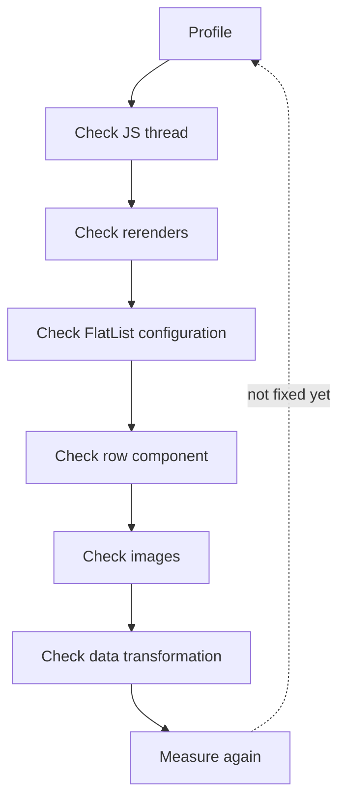
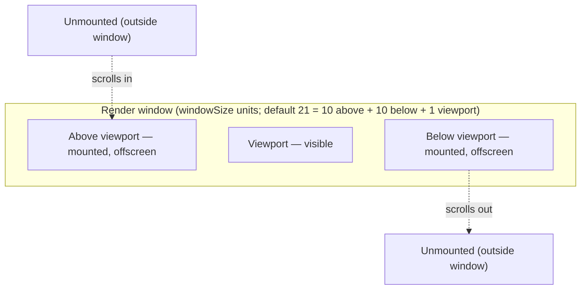
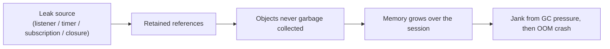
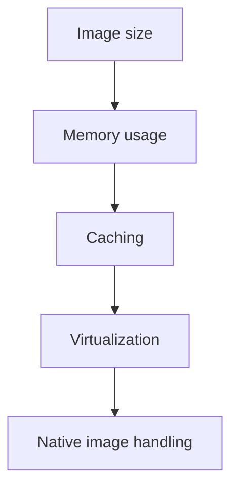

# React Native Performance — Interview Guide

> Deep-dive reference covering the performance checklist, FlatList/large-list tuning, re-render prevention, memory leaks, and image optimization — written for interview preparation. Facts cross-checked against the official React Native performance/FlatList docs and the official React docs for `memo`/`useMemo`/`useCallback`.

## Table of Contents

1. [Overview](#1-overview)
2. [Quick Summary (TL;DR)](#2-quick-summary-tldr)
3. [The Performance Checklist](#3-the-performance-checklist)
4. [Frame Budget Fundamentals (JS Thread vs UI Thread)](#4-frame-budget-fundamentals-js-thread-vs-ui-thread)
5. [The Systematic Debugging Flow](#5-the-systematic-debugging-flow)
6. [Preventing Unnecessary Rerenders — React.memo / useMemo / useCallback](#6-preventing-unnecessary-rerenders--reactmemo--usememo--usecallback)
7. [Large Lists And FlatList Deep Dive](#7-large-lists-and-flatlist-deep-dive)
8. [Memory Leaks](#8-memory-leaks)
9. [Image Optimization](#9-image-optimization)
10. [Case Study: App Crashes While Scrolling Product Images](#10-case-study-app-crashes-while-scrolling-product-images)
11. [Bundle Size And Startup Time](#11-bundle-size-and-startup-time)
12. [Network Bottlenecks](#12-network-bottlenecks)
13. [Native Thread Bottlenecks And Expensive Components](#13-native-thread-bottlenecks-and-expensive-components)
14. [Comparison Cheat Sheets](#14-comparison-cheat-sheets)
15. [Rapid-Fire Interview Q&A](#15-rapid-fire-interview-qa)
16. [Key Terms Glossary](#16-key-terms-glossary)
17. [Further Reading](#17-further-reading)

---

## 1. Overview

React Native performance work is really about protecting **two frame budgets at once**: the **JS thread** (React render logic, business logic) and the **UI/main thread** (native view updates, gestures, drawing) each have ~16.67ms per frame (for 60fps) to do their work. Almost every "performance problem" in RN reduces to one of:

- JS thread doing **too much work** (expensive renders, bad data transforms, huge synchronous computations).
- UI thread doing **too much work** (too many views, overdraw, expensive layout/animation).
- **Memory** growing unbounded (leaks, uncompressed images, unbounded lists/caches) until the OS kills the app.
- **Too much happening too early** (large bundles, eager native module/image loads) delaying startup.

This guide works through the checklist the way you'd actually debug it in an interview or on the job: a systematic flow, then deep dives into the highest-yield topics (lists, re-renders, memory, images), finished with a full worked troubleshooting scenario.

---

## 2. Quick Summary (TL;DR)

| Problem area | Usual root cause | First things to try |
|---|---|---|
| Unnecessary rerenders | New object/array/function identity passed as props every render; broad context/state subscriptions | `React.memo`, `useMemo`, `useCallback`, split context, selector-based state |
| Expensive components | Heavy computation or deep view trees inside render | Move work out of render (`useMemo`), simplify component tree, defer with `InteractionManager` |
| Large lists | Rendering/measuring everything, non-virtualized `.map()` in a `ScrollView` | `FlatList`/`FlashList` with tuned `windowSize`, `getItemLayout`, memoized rows |
| Memory leaks | Listeners/timers/subscriptions not cleaned up, retained closures | Always return a cleanup function from `useEffect`; audit native resource lifecycles |
| Image optimization | Full-resolution images for thumbnails, no caching | Server-side resizing/thumbnails, disk+memory caching, lazy loading |
| Network bottlenecks | Sequential waterfalls, over-fetching, no caching/cancellation | Parallelize requests, paginate, cache, debounce, cancel on unmount |
| JS thread blocking | Synchronous heavy loops/parsing on the JS thread | Chunk work, move off JS thread, defer with `requestAnimationFrame`/`InteractionManager` |
| Native thread bottlenecks | Deep view hierarchies, animating layout props, overdraw | Flatten views, animate `transform`/`opacity` with native driver, reduce transparency layers |
| Bundle size | Whole-library imports, unused assets, no Hermes | Tree-shake imports, Hermes bytecode, strip dev-only code, trim assets |
| Startup time | Heavy eager work before first paint | Defer non-critical init, lazy native modules (TurboModules), Hermes bytecode |
| Unnecessary state updates | Derived data stored in state, unthrottled high-frequency updates, unstable context value | Derive with `useMemo` instead of storing, throttle, memoize context value |

---

## 3. The Performance Checklist

A good mental checklist to run through (and a great structure for an interview answer to "how do you approach RN performance?"):

1. **Unnecessary rerenders** — components re-rendering when their output wouldn't actually change.
2. **Expensive components** — components that do real, non-trivial work (computation or node count) every render.
3. **Large lists** — rendering/measuring far more rows than are ever visible at once.
4. **Memory leaks** — anything that keeps growing memory usage over the app's lifetime.
5. **Image optimization** — oversized, uncached, or synchronously-handled images.
6. **Network bottlenecks** — slow, redundant, or poorly sequenced network activity.
7. **JS thread blocking** — long synchronous JS work starving React/event handling.
8. **Native thread bottlenecks** — too much native work per frame (view count, overdraw, layout thrash).
9. **Bundle size** — more JS/assets shipped and parsed than necessary.
10. **Startup time** — too much work done before the user can interact with the app.
11. **Unnecessary state updates** — state changing (or "changing" by reference) more often than the UI actually needs to update.

Each of these gets a dedicated section below; §6–§10 map directly onto the deep-dive topics you provided (re-render memoization, FlatList, memory leaks, images, and the crash scenario), and §11–§13 round out the remaining checklist items (bundle size/startup, network, native thread/expensive components, state updates).

---

## 4. Frame Budget Fundamentals (JS Thread vs UI Thread)

Devices target **60 frames per second**, which gives **~16.67ms per frame** to do all the work needed to produce that frame. React Native's Dev Menu "Perf Monitor" shows **two separate frame rates**, because two threads each have their own budget:

- **JS frame rate (JavaScript thread)** — where your React application lives: rendering, API calls, touch-event processing. Updates to native-backed views are batched and sent to native at the end of each JS event-loop iteration. If the JS thread is unresponsive for a frame (e.g., a state update re-renders an expensive subtree and takes 200ms), that's **~12 dropped frames** — any JS-driven animation visibly freezes, and gesture responders like `TouchableOpacity` can't react to touches because the JS thread can't process the raw touch events in time.
- **UI frame rate (main thread)** — native rendering, independent of JS. This is why native-stack navigators (`@react-navigation/native-stack`) feel smoother than JS-based ones (their transitions run on the native main thread, uninterrupted by JS frame drops), and why you can keep scrolling a `ScrollView` even while the JS thread is locked up — the scroll itself lives on the main thread; JS only receives the scroll events, it doesn't gate the scroll.

**Common, easy-to-forget sources of JS-thread slowdown (official, frequently asked):**
- **Running in dev mode.** JS-thread performance is *always* worse in development (extra checks/warnings) — never judge performance without a release build.
- **`console.log` calls in a bundled app** are a real bottleneck (including from libraries like `redux-logger`). Strip them in production with `babel-plugin-transform-remove-console`:
  ```json
  { "env": { "production": { "plugins": ["transform-remove-console"] } } }
  ```
- **Heavy work inside `onPress` that shares a frame with a visual response** (e.g., opacity/highlight change) can make the touchable feel unresponsive, because the visual update won't show until the handler returns. Fix: defer the expensive part:
  ```tsx
  function handleOnPress() {
    requestAnimationFrame(() => {
      doExpensiveAction();
    });
  }
  ```

---

## 5. The Systematic Debugging Flow

A disciplined, repeatable flow for diagnosing any RN performance complaint ("list is janky," "app feels slow"):



1. **Profile** — don't guess. Use the Dev Menu's Perf Monitor (JS vs UI fps), the React DevTools Profiler (render durations/commit counts), Hermes's sampling profiler, or native tools (Android Studio Profiler / Xcode Instruments Time Profiler) to see *where* time is actually going, always in a **release build**.
2. **Check JS thread** — is the JS frame rate the thing dropping (vs. UI)? If JS fps tanks during an interaction, the problem is in your JS/React code, not native rendering.
3. **Check rerenders** — use the Profiler's "ranked"/"flamegraph" view (or `why-did-you-render`) to find components re-rendering more often than their visible output changes. Look for unstable props (new object/array/function literals passed down every render).
4. **Check FlatList configuration** — for list-heavy screens, verify `windowSize`, `initialNumToRender`, `maxToRenderPerBatch`, `getItemLayout`, `keyExtractor` are tuned for this specific list (see [§7](#7-large-lists-and-flatlist-deep-dive)).
5. **Check row component** — is `renderItem`'s component memoized? Is it doing non-trivial work (formatting, nested FlatLists, heavy styles) per row? Is it a "basic"/"light" component per the official guidance, or is it carrying logic that belongs in a detail screen instead?
6. **Check images** — are list images right-sized thumbnails, cached, and off the JS thread for decoding? (RN decodes images off the main UI thread by default, but oversized source images still cost memory and bandwidth.)
7. **Check data transformation** — is `sort`/`filter`/`map`/normalization of API data happening inline in render on every render, instead of once in `useMemo` (or ideally server-side/at fetch time)?
8. **Measure again** — change one variable at a time and re-profile in a release build. Without re-measuring, you can't tell whether a "fix" actually helped or you just moved the bottleneck.

---

## 6. Preventing Unnecessary Rerenders — React.memo / useMemo / useCallback

### Why components rerender in the first place
By default, **React re-renders a component whenever its parent re-renders**, and `memo`/`useMemo`/`useCallback` all compare dependencies with `Object.is` (reference equality). Since object/array/function literals are a **new reference on every render**, passing any of them as a prop to a memoized child defeats the memoization — this single fact explains the majority of "why does my memoized component still rerender?" bugs.

### `React.memo` — skip re-rendering a component when its props are unchanged
```tsx
import { memo } from 'react';

const Greeting = memo(function Greeting({ name }: { name: string }) {
  return <Text>Hello, {name}!</Text>;
});
```
- `memo` returns a new, memoized component that **skips re-rendering if every prop is shallowly equal** (`Object.is`) to last time.
- It **still** re-renders if the component's own state changes, or if a context it reads changes — memoization only concerns props from the parent.
- You can pass a custom comparator as the second argument for cases where shallow equality isn't enough (e.g., comparing array contents) — but only if you're sure it's actually faster than just re-rendering; a deep-equality comparator can itself become a performance problem.
- **It's only valuable when a component re-renders often with the same props and its render logic is genuinely expensive.** If there's no perceptible lag, `memo` adds complexity for no benefit — and it's "completely useless" (official wording) if the props you pass are always-new objects/functions created during render, which is exactly why `memo` is so often paired with `useMemo`/`useCallback`.

### `useMemo` — cache an expensive **value** between renders
```tsx
const visibleTodos = useMemo(() => filterTodos(todos, tab), [todos, tab]);
```
- Caches the **result** of calling a function; only recomputes when a dependency changes (compared with `Object.is`).
- Two main use cases: (1) skip a genuinely slow calculation, (2) keep a value **referentially stable** so it doesn't break a child wrapped in `memo`, or so it doesn't retrigger a `useEffect` that depends on it.
- **How to tell if a calculation is "expensive" enough to bother:** log timing around it (`console.time`/`console.timeEnd`); if it adds up to ~1ms or more per interaction, it's a reasonable memoization candidate. Most RN state transforms are not expensive enough to matter — don't memoize reflexively.
- `useMemo` does **not** make the first render faster — it only helps skip unnecessary work on *updates*.
- React may discard the cached value for its own reasons (e.g., component suspends on mount) — treat `useMemo` purely as a performance optimization, never as a correctness guarantee (don't rely on it to avoid *calling* something with side effects).

### `useCallback` — cache a **function identity** between renders
```tsx
const handleSubmit = useCallback((orderDetails) => {
  post(`/product/${productId}/buy`, { referrer, orderDetails });
}, [productId, referrer]);
```
- Functionally, `useCallback(fn, deps)` is equivalent to `useMemo(() => fn, deps)` — it exists purely so you don't have to write the extra nested arrow function.
- Its entire value is unlocking `memo` on a child: if you pass an inline function to a `memo`-wrapped child, that prop is a new reference every render and the memoization never "hits." Wrapping the function in `useCallback` with the right dependencies keeps the same function reference across renders where nothing relevant changed.
- Without a dependency array, it returns a new function every render (no-op); with the wrong/missing dependencies, you can capture stale closures — prefer the updater-function form of `setState` (`setTodos(todos => [...todos, newTodo])`) to shrink dependency lists.

### Practical guidance (straight from the React team, applies directly to RN)
- Don't reach for memoization everywhere by default — it adds code you have to read and gets you nothing if the prop was never stable to begin with.
- Prefer structural fixes first: keep state as local as possible, let wrapper components accept `children` as JSX (so a wrapper's own state changes don't force its children to re-render), and keep render logic pure.
- **Only add memoization where you've actually measured a problem** with the React DevTools Profiler, in a production build.
- **React Compiler** (an increasingly available opt-in build tool for React/React Native projects) automatically inserts the equivalent of `memo`/`useMemo`/`useCallback` for you at build time by statically analyzing your components — when enabled, a lot of this manual memoization becomes unnecessary. It's still essential to understand *why* manual memoization works, both because many RN codebases don't have it enabled yet, and because interviewers will ask you to reason about reference equality directly.

### Applying this to list rows (ties directly into §7)
```tsx
const ProductRow = memo(function ProductRow({ title, price }: { title: string; price: number }) {
  return (
    <View style={styles.row}>
      <Text>{title}</Text>
      <Text>{price}</Text>
    </View>
  );
});

function ProductList({ products }: { products: Product[] }) {
  const keyExtractor = useCallback((item: Product) => item.id, []);
  const renderItem = useCallback(
    ({ item }: { item: Product }) => <ProductRow title={item.title} price={item.price} />,
    [],
  );
  return <FlatList data={products} keyExtractor={keyExtractor} renderItem={renderItem} />;
}
```
`renderItem` defined inline (a new closure every render) is one of the most common causes of every row in a `FlatList` re-rendering on every parent update — moving it to `useCallback` (or outside the component for class components) combined with a memoized row component is the standard fix.

---

## 7. Large Lists And FlatList Deep Dive

### Why lists need virtualization at all
Rendering every row of a 5,000-item array as real native views would mean 5,000 live views in memory and on the native side — expensive and, past a certain size, simply impossible without crashing. `FlatList` (built on `VirtualizedList`, RN's implementation of the windowed/"virtual list" concept) solves this by only mounting a **window** of rows around what's currently visible, recycling/unmounting the rest as you scroll.



Key vocabulary (official terms): **viewport** (visible area), **window** (the larger area around the viewport where items are mounted), **blank areas** (when the list can't render fast enough and you see unrendered gaps), **memory consumption**, and **responsiveness**.

### The tuning props, in detail

| Prop | Default | What it does | Trade-off |
|---|---|---|---|
| `windowSize` | `21` (10 viewports above + 10 below + 1 current) | Size of the mount window, in viewport-heights | Bigger → fewer blank areas but more memory; smaller → less memory but more risk of blank space while scrolling fast |
| `initialNumToRender` | `10` | How many items render in the very first batch | Should just cover the screen; too low → blank areas on first paint; too high → slower initial render. These items are **never unmounted**, to keep scroll-to-top instant |
| `maxToRenderPerBatch` | `10` | How many items are added per render batch while scrolling | Higher → better fill rate (less blank space) but longer JS execution per batch, which can delay touch handling |
| `updateCellsBatchingPeriod` | `50`ms | Delay between render batches | Combine with `maxToRenderPerBatch` to trade off "more items, less often" vs "fewer items, more often"; less frequent batching risks blank areas, more frequent risks responsiveness |
| `getItemLayout` | — | Lets you tell `FlatList` the exact `{length, offset, index}` for each row up front | Skips async measurement entirely — a major win for lists of several hundred+ items, but only works cleanly for **fixed-size** rows (remember to include separator length in the offset math) |
| `keyExtractor` | uses `item.key`/`item.id`/index | Unique key per item, used both as the React key (for reordering) and for internal caching | Without a stable key, React can't track item identity across reorders/updates |
| `removeClippedSubviews` | `true` on Android, `false` elsewhere | Detaches offscreen views from the native view hierarchy | Reduces main-thread work (fewer views to traverse/draw) — **but** views are only *detached*, not deallocated, so memory savings are modest, and it can cause missing-content bugs (mostly observed on iOS) with complex transforms/absolute positioning |

Other important, easy-to-miss props:
- **`extraData`** — `FlatList` is a `PureComponent`; if `renderItem` depends on anything outside the `data` array (external/parent state), pass it via `extraData` or `FlatList` won't know it needs to re-render those rows at all.
- **`initialScrollIndex`** — requires `getItemLayout`, since the list needs to know offsets without having measured everything first.

### List item best practices (official guidance)
- **Use basic, light components** for rows — avoid heavy nesting/logic; if a row component is reused elsewhere in the app with more features, create a stripped-down variant just for the list.
- **Wrap the row component in `memo()`** so it only re-renders when its own props actually change.
- **Use cached, optimized images** in rows (community image components like fast-image-style libraries) — every image is a new native image instance, and the faster it finishes loading, the sooner the JS thread is free.
- **Use `getItemLayout`** whenever rows are a fixed size.
- **Use `keyExtractor`**, not array index, so reordering/insertion doesn't cause spurious remounts.
- **Never define `renderItem` inline** — hoist it out and wrap in `useCallback` (function components) or define it outside `render()` (class components), otherwise it's a new function every render, which defeats row memoization.

### When FlatList still isn't enough
If a `FlatList` is still janky after tuning (very large lists, heavy rows), consider a recycling-based list library such as **FlashList** (Shopify) or **Legend List** — conceptually, instead of mounting/unmounting rows as they enter/leave the window (like `FlatList`/`VirtualizedList`), these recycle a small, fixed pool of row component instances the way native `RecyclerView`/`UICollectionView` do, which avoids mount/unmount cost entirely and tends to use less memory for very long lists.

---

## 8. Memory Leaks

A "memory leak" in RN means something keeps a reference alive after it's no longer needed, so the garbage collector can never reclaim it — memory climbs over the session until the OS kills the app (especially brutal on low-RAM Android devices). The fix is almost always the same shape: **everything you subscribe to in `useEffect` (or `componentDidMount`) must be undone in its cleanup function (or `componentWillUnmount`).**



### Event listeners not removed
Modern RN APIs (`Dimensions`, `AppState`, `BackHandler`, Keyboard events, React Navigation listeners) return a **subscription object with a `.remove()` method** from `addEventListener` — older code that called a separate `removeEventListener` (or didn't clean up at all) will leak the handler (and anything it closes over).
```tsx
// Leak: handler (and whatever it closes over) stays alive after unmount
useEffect(() => {
  Dimensions.addEventListener('change', onChange);
}, []);

// Fixed
useEffect(() => {
  const sub = Dimensions.addEventListener('change', onChange);
  return () => sub.remove();
}, []);
```

### Subscriptions not cleaned up
Redux store subscriptions, RxJS/event-emitter subscriptions, Firebase listeners (`onSnapshot`, `onValue`) all keep firing — and keep their captured closures alive — until explicitly unsubscribed.
```tsx
useEffect(() => {
  const unsubscribe = firestore().collection('products').onSnapshot(handleSnapshot);
  return unsubscribe;
}, []);
```

### Timers
`setInterval`/`setTimeout` keep running (and keep their closure's variables alive) after the component that created them unmounts, often trying to call `setState` on an unmounted component.
```tsx
useEffect(() => {
  const id = setInterval(tick, 1000);
  return () => clearInterval(id);
}, []);
```

### WebSocket connections
An open socket is a live native/OS resource plus a JS object graph (handlers, buffers) kept alive for as long as the connection is open — close it explicitly on unmount/navigation away.
```tsx
useEffect(() => {
  const ws = new WebSocket(url);
  ws.onmessage = handleMessage;
  return () => ws.close();
}, [url]);
```

### Retained closures
A closure captures its entire enclosing scope. A long-lived callback (passed to a singleton, a module-level event emitter, or a native module) that closes over a component's props/state/large data will keep that entire scope alive long after the component is gone — even if the component itself "unmounted." Prefer refs for values a long-lived callback needs, and always unregister the callback on cleanup.

### Navigation-related references
Screens left mounted in a navigator's history stack (e.g., deep stacks, or deliberately keeping screens alive for performance) can accumulate listeners/timers from every screen that was ever visited if those screens don't clean up on **blur**, not just **unmount**. With React Navigation, prefer the `focus`/`blur` events (not just mount/unmount) for subscriptions that should only be live while the screen is actually visible:
```tsx
useEffect(() => {
  const unsubscribe = navigation.addListener('focus', loadData);
  return unsubscribe;
}, [navigation]);
```

### Native resources
Camera sessions, audio/video players, Bluetooth/location watchers, and native animation drivers hold OS-level resources (file handles, hardware sessions) independent of JS garbage collection — these must be explicitly stopped/released (`camera.stopSession()`, `Geolocation.clearWatch(id)`, player `.release()`), or the leak is invisible to JS memory tools entirely while still draining battery/memory/hardware.

### Large objects retained unnecessarily
Keeping full API responses, decoded images, or entire previous screens' data in global state/context "just in case," with no eviction strategy, is a slow leak by design. Store only what's needed, prune caches (LRU eviction, max item counts, TTLs), and prefer paginated/streamed data over holding everything in memory at once.

| Leak source | Typical symptom | Fix |
|---|---|---|
| Event listeners | Handlers fire for unmounted screens; duplicate handling | Return `.remove()`/unsubscribe in cleanup |
| Subscriptions | Store/Firebase callbacks keep firing after unmount | Unsubscribe in cleanup |
| Timers | `setState` on unmounted component warnings, slow drift | `clearInterval`/`clearTimeout` in cleanup |
| WebSockets | Sockets accumulate, battery drain | `.close()` in cleanup |
| Retained closures | Large scopes never collected | Use refs, unregister callbacks |
| Navigation references | Leaks scale with screens ever visited | Clean up on `blur`, not just unmount |
| Native resources | Battery/hardware drain, invisible to JS heap tools | Explicit stop/release calls |
| Large retained objects | Steady memory growth over session | Evict/prune caches, avoid hoarding full responses |

---

## 9. Image Optimization

Images are one of the single biggest memory and bandwidth costs in a typical RN app, and a very common interview topic because the failure mode (OOM crash while scrolling) is so concrete.

- **Large image dimensions.** The decoded, in-memory size of a bitmap is driven by its **pixel dimensions**, not its file size — a 4000×3000 JPEG decodes to tens of megabytes in memory regardless of how well it was compressed on disk. Always request/display images sized close to their actual display size.
- **Memory consumption.** Every on-screen `Image` holds a decoded bitmap in memory; many large, simultaneously-mounted images (e.g., a non-virtualized gallery) is a direct path to an out-of-memory crash, especially on Android.
- **Caching.** RN's `Image` component supports a `cache` source property controlling how the network layer uses the HTTP cache: `default` (platform default), `reload` (always refetch), `force-cache` (always use cached data if present, regardless of age), `only-if-cached` (fail rather than hit the network). On iOS you can also tune the native image cache's size/cost limits directly (`RCTSetImageCacheLimits(imageSizeLimit, totalCostLimit)`). For heavier caching needs (persistent disk cache, better memory cache eviction, progressive loading), most teams reach for a community image library (e.g., an `expo-image`/fast-image-style component) rather than the bare `Image` component.
- **Thumbnails.** Never fetch a full-resolution image to show a 60×60 avatar or list thumbnail — request a server-resized thumbnail (or use an image CDN's resize query params) so the bytes transferred and the decode cost both match what's actually shown.
- **Lazy loading.** Only fetch/decode images as they're about to become visible (paired naturally with `FlatList`/`FlashList` virtualization — offscreen rows shouldn't be holding decoded images at all) rather than eagerly loading every image in a long list or carousel up front.
- **Appropriate formats.** Prefer modern, better-compressed formats (WebP where supported) over raw PNG for photographic content; use vector formats (SVG) for icons/illustrations instead of large raster assets at multiple resolutions.
- **Avoiding unnecessary full-resolution images.** For local/camera-roll images, iOS keeps multiple sizes of the same photo; RN will automatically pick the closest match to the requested display size (falling back to the first option at least ~50% bigger, to avoid visible blur from upscaling) — but this auto-selection only helps if you specified a sensible display size in the first place. For network images, there's no auto-sizing at all: you must specify dimensions, and whatever URL you request is exactly the bytes/resolution that gets downloaded and decoded — so building a thumbnail-vs-full-size URL strategy server-side is on you.

**Other official, easy-to-forget details:**
- RN already does **off-thread image decoding** by default (not on the JS or UI thread) — so decode time shows up as a late-arriving image, not as dropped frames, as long as you already handle the "image not loaded yet" placeholder case.
- **Animating the size of an `Image`** (width/height) is expensive on iOS — each change re-crops/rescales from the original — prefer animating `transform: [{ scale }]` instead (e.g., tap-to-zoom-to-fullscreen).
- Network images need explicit `width`/`height` in style (no auto-sizing), both for layout stability (avoiding "cumulative layout shift"-style jumps) and because RN can't know the size until the bytes arrive.

```tsx
// Thumbnail in a list row: server-resized, cached, explicit size
<Image
  source={{ uri: product.thumbnailUrl, cache: 'force-cache' }}
  style={{ width: 80, height: 80 }}
/>
```

---

## 10. Case Study: App Crashes While Scrolling Product Images

**Prompt:** *"The app crashes when scrolling through product images."*

This is a classic "think out loud, in order" interview scenario. A strong answer walks a structured chain of hypotheses rather than guessing randomly:



1. **Image size.** First question: what are the actual pixel dimensions of the images being requested vs. the dimensions they're displayed at? If a product grid shows 100×100 thumbnails but is loading 3000×3000 source photos, that's very likely the root cause by itself — decoded bitmap memory scales with pixel count, not display size or file size.
2. **Memory usage.** Confirm it's actually an OOM crash (check device logs — Android `OutOfMemoryError`/low-memory killer, iOS Xcode memory warnings/jetsam crash logs) rather than a JS exception. Reproduce while watching a memory profiler (Android Studio Profiler / Xcode Instruments "Allocations") while scrolling, and watch whether memory keeps climbing and never comes back down — a strong signal that old images aren't being released.
3. **Caching.** Check whether the image layer is using a bounded cache with eviction (LRU, size limit) or effectively caching everything forever (common failure: a naive in-memory `{url: base64}` cache you built yourself that never evicts, or a mis-configured `force-cache` policy holding every image indefinitely). Also check whether images are being **re-decoded** repeatedly (e.g., every re-render creates a new `Image` with a data-URI source) instead of reusing a cached decode.
4. **Virtualization.** Check how the images are actually being rendered: are they inside a virtualized `FlatList`/`FlashList` (bounded number of mounted rows), or inside a `ScrollView` + `.map()` rendering every product up front? Non-virtualized long lists of images are the single most common concrete cause of this exact crash report — every image in the dataset gets mounted and decoded simultaneously instead of just the visible window.
5. **Native image handling.** Finally, check the native layer: is the app using the bare `Image` component's default decode/cache behavior, or a dedicated image library with proper native-level memory management (bounded native caches, downsampling during decode rather than after, automatic cancellation of in-flight loads for images that scrolled away)? On Android specifically, confirm large bitmaps aren't being held via `resizeMethod="scale"` (decode-then-scale) when `"resize"` (scale-during-decode) would use far less peak memory.

**Consolidated fix list for this scenario:**
- Request/display correctly-sized (thumbnail) images from the server/CDN instead of originals.
- Swap the raw `Image` component for a library with robust caching/downsampling if not already using one.
- Make sure the image grid/list is virtualized (`FlatList`/`FlashList`, tuned `windowSize`/`initialNumToRender`), not a `ScrollView.map()`.
- Add a bounded, evicting cache (or rely on the image library's built-in one) instead of an unbounded custom cache.
- Re-measure memory usage while scrolling in a release build to confirm the fix actually flattens the memory curve instead of just moving the crash further down the list.

---

## 11. Bundle Size And Startup Time

### Bundle size
- **Enable Hermes** (default in modern RN) — it ships precompiled bytecode instead of raw JS text, which is both faster to start and typically smaller on disk.
- **Import only what you use.** `import _ from 'lodash'` pulls in the whole library; `import debounce from 'lodash/debounce'` (or an ESM-friendly equivalent) pulls in just the one function. This matters a lot for utility libraries, icon packs, and date libraries.
- **Strip dev-only code from release builds** — remove `console.*` calls (`babel-plugin-transform-remove-console`), make sure dev-only tooling (certain debugging/inspector code paths) is excluded from release bundles.
- **Trim assets** — unused images/fonts/locale files bloat the binary; audit with the platform's size-analysis tools (Xcode's App Thinning size report, Android's APK/AAB Analyzer).
- **Enable Android code shrinking** (Proguard/R8) and iOS dead-code stripping/bitcode-equivalent optimizations for release builds.
- **Defer rarely-used feature code** (e.g., a rarely-opened settings/debug screen) behind lazy `import()`/`React.lazy` + Suspense where your bundler/navigation setup supports it, instead of bundling everything into the initial load.
- Use images in modern, well-compressed formats (WebP) and avoid shipping multiple unused density variants.

### Startup time
- **Hermes's precompiled bytecode** is the single biggest lever — JS doesn't need to be parsed/compiled on-device at launch (see [Document 1, §14](01-architecture-and-internals.md#14-hermes)).
- **Lazy native modules.** Under the New Architecture, TurboModules are only instantiated on first use instead of all at startup (see [Document 1, §8](01-architecture-and-internals.md#8-turbomodules)) — avoid forcing eager initialization of rarely-needed native modules.
- **Defer non-critical work** past first interaction using `InteractionManager.runAfterInteractions(...)` (or `requestIdleCallback`) for things like analytics initialization, prefetching secondary data, or warming caches — don't make the user wait on work they don't need yet.
- **Minimize root-tree work before first paint** — show a lightweight splash/skeleton rather than blocking on, e.g., a synchronous bootstrap that reads and parses a large persisted store before rendering anything.
- **Measure, don't guess:** Dev Menu Perf Monitor, Android `adb shell am start -W` (reports TTID/TTFD — time to initial/full display), Xcode Instruments' Time Profiler/App Launch instrument, and Hermes's own sampling profiler all give concrete startup numbers instead of a feeling.

---

## 12. Network Bottlenecks

- **Sequential waterfalls** — `await`-ing independent requests one after another instead of firing them concurrently with `Promise.all`/`Promise.allSettled` multiplies total latency unnecessarily.
- **Over-fetching** — requesting more fields/records than a screen needs (common with naive REST endpoints or unconstrained GraphQL queries); prefer field selection, pagination, and endpoint design matched to what the UI actually renders.
- **No response caching** — re-fetching identical data repeatedly instead of caching it (in-memory, or via a data-fetching library with built-in caching/deduping) wastes bandwidth and adds visible latency on every screen revisit.
- **No compression** — make sure gzip/brotli is enabled server-side for JSON payloads; large uncompressed responses cost both transfer time and JS parse time.
- **No debouncing/throttling** on search-as-you-type or other high-frequency-triggered requests, flooding the network and racing responses against each other.
- **No request cancellation** — not aborting in-flight requests on unmount/navigation-away can let a stale response arrive late and overwrite newer state (a correctness bug, not just a performance one); use `AbortController` or your HTTP client's cancellation token tied to the component's lifecycle.
- **No retry/backoff or offline handling** — on flaky mobile networks, a naive "fire once and show an error" strategy feels broken; exponential backoff and offline queuing meaningfully improve perceived performance/reliability.
- **Images/videos fetched at unnecessarily high resolution** over the network — ties directly back to [§9](#9-image-optimization).

---

## 13. Native Thread Bottlenecks And Expensive Components

### Native thread bottlenecks
- **Deep, non-flattened view hierarchies** — more native views means more work traversing/measuring/drawing per frame; Fabric's View Flattening helps automatically (see [Document 1, §9](01-architecture-and-internals.md#9-fabric)), but minimizing unnecessary wrapper views still helps.
- **Overdraw** — many stacked, partially transparent views force the GPU to blend repeatedly for the same pixels; flatten/reduce transparent layers where possible.
- **Animating layout properties** (`width`, `height`, `top`, `left`) forces a real layout recalculation (Yoga) on every frame; prefer animating `transform`/`opacity`, and run the animation with `useNativeDriver: true` (Animated API) — or better, with `react-native-reanimated`, whose worklets execute directly on the UI thread via JSI (see [Document 1, §7](01-architecture-and-internals.md#7-jsi--javascript-interface)) and stay smooth even if the JS thread is busy.
- **`LayoutAnimation`** leverages native Core Animation and is unaffected by JS-thread or UI-thread frame drops, but only suits "fire-and-forget" animations — interruptible animations still need `Animated`/Reanimated.
- **Moving/rotating/scaling complex static views repeatedly** can benefit from `renderToHardwareTextureAndroid` (Android) — iOS's equivalent `shouldRasterizeIOS` is on by default — but overusing either can spike memory usage, so profile before and after and turn them off once a view stops moving.
- **Animating `Image` size** directly (vs. `transform: scale`) is expensive on iOS due to re-cropping/rescaling on every frame (see [§9](#9-image-optimization)).

### Expensive components
- Doing non-trivial computation (sorting, filtering, deep cloning, regex over large strings, formatting) **inline in the render/function body** instead of in `useMemo` means it reruns on every render, not just when the inputs change.
- Deeply nested component trees with lots of logic per node (especially inside list rows — see [§7](#7-large-lists-and-flatlist-deep-dive)) multiply the cost of every re-render.
- Large inline SVGs or complex custom-drawn graphics recomputed every render are a common, easy-to-miss expensive-component source.
- The fix is the same toolkit as [§6](#6-preventing-unnecessary-rerenders--reactmemo--usememo--usecallback): memoize the computation, memoize the component, and keep component trees as shallow/simple as the design allows.

### Unnecessary state updates
- **Storing derived data in state** instead of deriving it with `useMemo` during render creates two sources of truth that can drift and causes an extra render every time the derived value is recalculated and re-stored.
- **Setting state to a brand-new object/array every time**, even when the logical content hasn't changed, always triggers a re-render (reference inequality) — prefer updater functions that bail out when nothing actually changed, or compare before calling `setState`.
- **Unthrottled high-frequency updates** (e.g., updating React state on every pixel of an `onScroll` event) can trigger far more renders than the UI needs; throttle/debounce, or — for UI-thread-only concerns like parallax/fade effects — drive them with Reanimated shared values, which don't go through React re-renders at all.
- **An unstable context value** (a new `{...}` object literal created on every provider render) re-renders **every** consumer of that context on every provider render, regardless of whether individual consumers are wrapped in `memo` — always memoize the value passed to `Context.Provider` with `useMemo`, or split one large context into several smaller, independently-updating ones.
- **Global state libraries used without selectors** (e.g., subscribing to the entire store instead of a narrow slice) cause broad, unrelated re-renders; prefer selector-based subscriptions so a component only re-renders when the specific slice it reads actually changes.

---

## 14. Comparison Cheat Sheets

### FlatList tuning props
| Prop | Default | Increasing it… | Decreasing it… |
|---|---|---|---|
| `windowSize` | 21 | …reduces blank areas, raises memory | …saves memory, risks blank areas |
| `initialNumToRender` | 10 | …slower first render, fewer initial blank areas | …faster first render, risk of blank areas on mount |
| `maxToRenderPerBatch` | 10 | …better fill rate, more JS work per batch (can hurt responsiveness) | …less JS work per batch, more risk of blank areas |
| `updateCellsBatchingPeriod` | 50ms | …less frequent batches (risk of blank areas) | …more frequent batches (risk of responsiveness issues) |
| `removeClippedSubviews` | platform-dependent | — (boolean) | reduces main-thread view traversal; detaches (not deallocates) offscreen views; can cause iOS content bugs |

### `memo` vs `useMemo` vs `useCallback`
| Hook/API | Caches | Use when |
|---|---|---|
| `React.memo` | A **component's** render output | A component re-renders often with unchanged props and its render is non-trivial |
| `useMemo` | A **computed value** | A calculation is slow, or the value must stay referentially stable (as a prop to a `memo`'d child, or a hook dependency) |
| `useCallback` | A **function reference** | A function is passed to a `memo`'d child, or used as a dependency elsewhere, and must stay referentially stable |

### List rendering strategy
| Approach | Mounts | Best for |
|---|---|---|
| `ScrollView` + `.map()` | Every item, always | Small, fixed-size lists only (a handful of items) |
| `FlatList` | A window around the viewport (mount/unmount as you scroll) | Most medium/large lists |
| `FlashList` / `Legend List` | A small recycled pool of row instances (reuse, not mount/unmount) | Very large lists or heavy rows where `FlatList` tuning isn't enough |

---

## 15. Rapid-Fire Interview Q&A

**Q: Why does a component re-render even though you wrapped it in `React.memo`?**
A: Because one of its props is a new object/array/function reference every render (inline literals, unmemoized callbacks). `memo` uses shallow (`Object.is`) comparison, so a logically-identical-but-new reference still counts as "changed." Fix with `useMemo`/`useCallback` on whatever produces that prop.

**Q: What's the actual difference between `useMemo` and `useCallback`?**
A: `useMemo` caches the *return value* of calling a function; `useCallback` caches the *function itself* without calling it. `useCallback(fn, deps)` is equivalent to `useMemo(() => fn, deps)`.

**Q: Does `useMemo` make the first render faster?**
A: No — it only helps skip recomputation on *subsequent* renders when dependencies haven't changed.

**Q: What does `windowSize` actually control in FlatList?**
A: The size of the mount window around the viewport, measured in viewport-heights (default 21 = 10 above + 10 below + the current viewport). Larger values reduce blank space while scrolling fast at the cost of memory; smaller values save memory but risk visible blank areas.

**Q: Why would you use `getItemLayout`?**
A: It tells `FlatList` each row's exact size/offset up front, skipping asynchronous measurement entirely — a significant performance win for lists of several hundred+ items, but it requires fixed-size rows (and you must include separator height/width in the offset math).

**Q: Does `removeClippedSubviews` save memory?**
A: Not significantly — it only *detaches* offscreen views from the native hierarchy (reducing main-thread traversal/draw work); the views aren't deallocated. It can also cause missing-content bugs, mainly on iOS, with complex transforms/absolute positioning.

**Q: Your FlatList is still janky after tuning the standard props — what next?**
A: Check whether rows are memoized and `renderItem`/`keyExtractor` are stable (`useCallback`), whether images in rows are right-sized/cached, and whether per-row data transformation is memoized. If it's still not enough, consider a recycling-based list library (FlashList/Legend List) instead of `FlatList`'s mount/unmount virtualization.

**Q: Name five ways a React Native app can leak memory.**
A: Event listeners/subscriptions not unsubscribed in a `useEffect` cleanup, timers not cleared, open WebSocket connections not closed, native resources (camera/location/audio) not explicitly released, and unbounded caches/retained large objects with no eviction strategy.

**Q: Why do modern `Dimensions`/`AppState`-style APIs return a subscription object instead of using `removeEventListener`?**
A: So cleanup is explicit and localized — `addEventListener` returns an object with a `.remove()` method you call directly in your effect's cleanup function, removing ambiguity about which handler reference to remove.

**Q: Why does a large local image still slow things down even if the app "only displays a small thumbnail"?**
A: Decoded in-memory bitmap size is driven by pixel dimensions, not display size or file size — if you don't resize at the source (server/CDN), you pay the full decode/memory cost of the original image regardless of how small it's drawn.

**Q: Walk me through diagnosing "app crashes while scrolling product images."**
A: Check actual image pixel dimensions vs. display size; confirm it's an OOM crash via native memory profiling; check whether image caching is bounded/evicting or unbounded; check whether the image list is virtualized (`FlatList`/`FlashList`) or rendering everything via `ScrollView.map()`; check native image-handling specifics (decode-while-scaling vs. scale-after-decode); then re-measure.

**Q: Why is `console.log` a real performance problem in a shipped app, not just a dev annoyance?**
A: Each call still executes in the bundled app and adds up as a JS-thread bottleneck at scale (especially from libraries like `redux-logger`); it should be stripped from production builds via a babel plugin, not just "not called much."

**Q: Why does a JS-based stack navigator feel less smooth than a native-stack navigator under JS load?**
A: Native-stack transition animations run entirely on the native main thread, so they're unaffected by JS-thread frame drops; JS-based navigators animate via the JS thread and stall along with it.

**Q: Why should you animate `transform`/`opacity` instead of `width`/`height`/`top`/`left`?**
A: Transform/opacity changes can be handled by the native UI thread (and with `useNativeDriver`/Reanimated, entirely without touching the JS thread per frame); animating layout properties forces a real Yoga layout recalculation on every frame, which is far more expensive and can't fully bypass the JS thread the same way.

**Q: What's wrong with storing derived data in state?**
A: It creates two sources of truth that can drift out of sync and causes an extra render cycle every time you recompute-then-`setState`; deriving the value during render with `useMemo` is simpler and can't go stale.

**Q: Why can a Context value cause broad, hard-to-spot re-renders?**
A: If the value passed to `Context.Provider` is a new object literal every render, every consumer re-renders on every provider render, regardless of whether those consumers are wrapped in `memo` — memoize the context value itself or split the context.

**Q: What's the single highest-leverage lever for RN startup time?**
A: Hermes's precompiled bytecode (skips on-device JS parsing/compilation), combined with lazy TurboModule initialization and deferring non-critical work with `InteractionManager` until after first interaction.

---

## 16. Key Terms Glossary

| Term | Meaning |
|---|---|
| **Virtualization** | Only mounting a window of list items around the visible viewport instead of the entire dataset. |
| **Viewport / Window** | Viewport = visible area; window = the (larger) area around it where items are kept mounted. |
| **Blank areas** | Visible gaps when the list can't render fast enough to keep up with scrolling. |
| **Shallow equality** | Comparing each prop/value with `Object.is` rather than deep/recursive comparison — what `memo`/`useMemo`/`useCallback` use by default. |
| **Memoization** | Caching a computed value/function/render output so it's reused instead of recomputed when inputs haven't changed. |
| **Memory leak** | A reference kept alive longer than needed, preventing garbage collection and causing memory to grow unbounded. |
| **Overdraw** | The GPU redrawing/blending the same pixels multiple times due to stacked (often transparent) views. |
| **TTI / TTID / TTFD** | Time-to-interactive / time-to-initial-display / time-to-full-display — startup performance measurements. |
| **Recycling (list)** | Reusing a small, fixed pool of row component instances (FlashList-style) instead of mounting/unmounting rows (FlatList-style). |

---

## 17. Further Reading

- Performance Overview — https://reactnative.dev/docs/performance
- Optimizing FlatList Configuration — https://reactnative.dev/docs/optimizing-flatlist-configuration
- FlatList API reference — https://reactnative.dev/docs/flatlist
- Images guide — https://reactnative.dev/docs/images
- Dimensions API (subscription-based event listeners) — https://reactnative.dev/docs/dimensions
- React `memo` — https://react.dev/reference/react/memo
- React `useMemo` — https://react.dev/reference/react/useMemo
- React `useCallback` — https://react.dev/reference/react/useCallback
- Related: [Document 1 — React Native Architecture & Internals](01-architecture-and-internals.md) (JSI, Fabric, TurboModules, threading model, Hermes)
