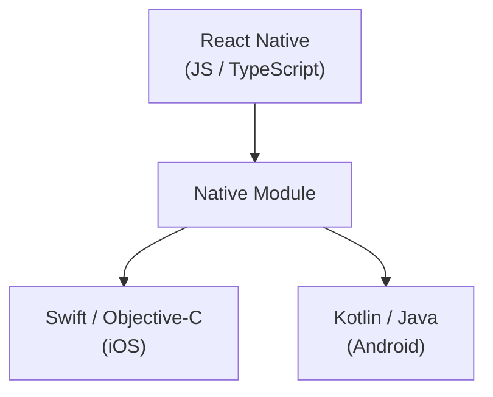
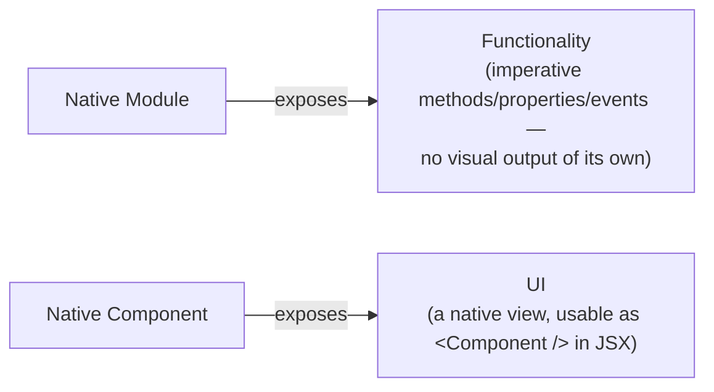
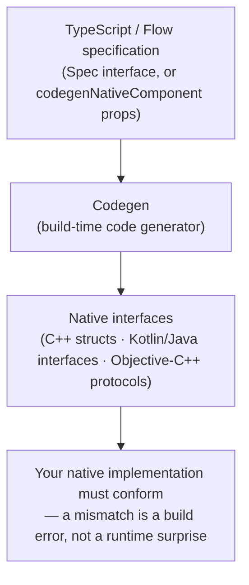

# React Native Native Integration — Interview Guide (Document 3)

> Deep-dive reference covering Native Modules, Native Components, platform-specific code, and Codegen — written for interview preparation. Mechanically overlaps with [Document 1 (Architecture & Internals)](01-architecture-and-internals.md), which this guide cross-references rather than repeats; this document focuses on the practical "how/when/why do I integrate with native code" angle. Facts verified against the official React Native docs. Implementation-level native code is kept intentionally light — the goal is to reason correctly about the concepts, not memorize native syntax.

## Table of Contents

1. [Overview](#1-overview)
2. [Quick Summary (TL;DR)](#2-quick-summary-tldr)
3. [The Big Picture: From JS To Native](#3-the-big-picture-from-js-to-native)
4. [Native Modules — Exposing Functionality](#4-native-modules--exposing-functionality)
5. [Native Components — Exposing UI](#5-native-components--exposing-ui)
6. [Native Modules vs Native Components](#6-native-modules-vs-native-components)
7. [Platform Differences](#7-platform-differences)
8. [Shared JS vs Platform-Specific Code](#8-shared-js-vs-platform-specific-code)
9. [Codegen — Why It Exists](#9-codegen--why-it-exists)
10. [Putting It Together: A Practical Decision Guide](#10-putting-it-together-a-practical-decision-guide)
11. [Comparison Cheat Sheets](#11-comparison-cheat-sheets)
12. [Rapid-Fire Interview Q&A](#12-rapid-fire-interview-qa)
13. [Key Terms Glossary](#13-key-terms-glossary)
14. [Further Reading](#14-further-reading)

---

## 1. Overview

"Native Integration" is the umbrella term for everything that lets React Native JS code reach into platform-native code — and everything that keeps that reach **safe and predictable** across two very different platforms (iOS/Swift-Objective-C and Android/Kotlin-Java). It breaks down into four related ideas, which map directly onto the outline for this document:

1. **Native Modules** — exposing native *functionality* (no UI) to JS: battery level, Keychain access, a payments SDK, a heavy native computation.
2. **Native Components** — exposing native *UI* to JS: a native map, a video player, a camera preview, a charting library.
3. **Platform differences** — React Native is cross-platform by default, but iOS and Android are genuinely different operating systems; you need deliberate tools (`Platform.OS`, `Platform.select`, platform-specific files) to handle the cases where behavior or implementation must diverge.
4. **Codegen** — the build-time tool that keeps the JS side and native side of (1) and (2) from silently drifting out of sync, by generating native interfaces directly from a single JS/TypeScript type declaration.

This document assumes the architectural background from [Document 1](01-architecture-and-internals.md) (Bridge vs JSI, TurboModules, Fabric) and focuses on the practical layer on top: **what shape does this code take, when do you reach for which tool, and why does each piece exist.**

---

## 2. Quick Summary (TL;DR)

| Concept | What it's for | Key API / mechanism |
|---|---|---|
| Native Module | Expose native **functionality** (methods, no view) to JS | Legacy: `NativeModules` / Bridge. New: **TurboModule** via JSI, typed by a `Spec` |
| Native Component | Expose native **UI** (a view) to JS | Legacy: `requireNativeComponent` + `ViewManager`. New: **Fabric Component** via `codegenNativeComponent` |
| Platform differences (small) | Branch a tiny bit of logic/style per OS, at runtime | `Platform.OS`, `Platform.select({ios, android, native, default})` |
| Platform differences (large) | Ship entirely different implementations per OS, at build time | `Component.ios.tsx` / `Component.android.tsx` file extensions |
| Shared with web/Node | Share code across RN and a web bundler, only RN needs to differ | `Component.native.tsx` extension |
| Codegen | Keep JS and native **in sync**, catch mismatches at build time, not runtime | JS/TS `Spec`/props interface → generated C++/Kotlin/Obj-C++ interfaces |

---

## 3. The Big Picture: From JS To Native



Every piece of native integration ultimately answers one of two questions: *"I need this native capability"* or *"I need this native view."* These map to two distinct constructs with distinct responsibilities:



Keeping this distinction crisp is the single most important mental model for this whole topic: if you ever catch yourself trying to "return a view" from a Native Module, or trying to call an imperative method *on* a Native Component as if it were a service, you've conflated the two.

---

## 4. Native Modules — Exposing Functionality

A **Native Module** is how JS calls into native code that has **no UI** — a service, not a view. Think: reading the battery level, writing to Keychain/Keystore, starting a Bluetooth scan, triggering a native payments SDK flow, or running a CPU-heavy routine written in native code.

### Two eras (ties to Document 1)
- **Legacy `NativeModules`** — Bridge-based, every call serialized to JSON and queued across the async bridge, always callback/Promise-based (no true synchronous calls), all modules eagerly instantiated at startup, no compile-time contract between JS and native.
- **TurboModules** (New Architecture, default since RN 0.76) — JSI-based: the module is a C++ `HostObject` that JS holds a **direct reference** to, no serialization, lazily instantiated on first use, and — critically — generated from a typed `Spec` via Codegen (see [§9](#9-codegen--why-it-exists)). Full mechanics (lazy loading, `HostObject`, the shared C++ dispatch layer) are covered in [Document 1 §8](01-architecture-and-internals.md#8-turbomodules); this section stays at the practical/consumer level.

### The shape of a Native Module (conceptual, not a tutorial)
The JS-visible contract is a small TypeScript interface — this is the part worth being fluent in; treat the native-side implementation as "exists, conforms to the generated interface" rather than something to memorize line-by-line:

```ts
// NativeDeviceInfo.ts — the single source of truth
import type { TurboModule } from 'react-native';
import { TurboModuleRegistry } from 'react-native';

export interface Spec extends TurboModule {
  getBatteryLevel(): Promise<number>;
  isTablet(): boolean;
}

export default TurboModuleRegistry.getEnforcing<Spec>('DeviceInfo');
```

```ts
// Usage anywhere in the app
import DeviceInfo from './NativeDeviceInfo';

const level = await DeviceInfo.getBatteryLevel();
```

On the native side, each platform provides an implementation that **must** satisfy the interface Codegen generated from the spec above:
- **Android (Kotlin/Java):** a class implementing the generated `NativeDeviceInfoSpec`, registered through a `ReactPackage` so the app knows to load it.
- **iOS (Swift/Objective-C):** a class conforming to the generated protocol, exported with `RCT_EXPORT_MODULE()`; Swift implementations need a small Objective-C bridging file since the export macros are Objective-C.

The exact annotations (`@ReactMethod`, `RCT_EXPORT_METHOD`, etc., for the still-common legacy style) are stable, well-documented boilerplate — worth recognizing in a codebase, not worth over-rehearsing for an interview that's testing architectural understanding.

### Sync vs async calls
Legacy Bridge modules were **always asynchronous** (callback or Promise) because every call crossed a serialized, queued message channel — even a trivial `add(2, 2)` had to round-trip through JSON. TurboModules, via JSI's direct references, **can** expose genuinely synchronous methods (e.g., `isTablet()` returning a plain `boolean`, no `Promise`) — but synchronous native calls block the JS thread until they return, so they should be reserved for fast, cheap operations.

### Native → JS events
Return values answer "what did the native side respond with," but native code often needs to **push** events JS didn't ask for (a Bluetooth device appearing, a payment SDK callback, a sensor reading). That's handled via an event emitter mechanism (`NativeEventEmitter` on the JS side, `RCTEventEmitter`/an equivalent emitter on the native side) layered on top of the module, rather than a method return value.

### Why this matters at scale: the VisionCamera example
The official docs cite `react-native-vision-camera`, a frame-processing camera library, as a concrete illustration of why JSI-based Native Modules matter beyond "slightly faster calls": a single camera frame buffer is roughly **~30MB**, and at typical frame rates that's on the order of **~2GB of data per second** that needs to cross the JS/native boundary. That volume is only feasible because JSI gives JS a direct memory reference to the native object — the old Bridge's JSON-serialize-and-queue model could not support this at all.

---

## 5. Native Components — Exposing UI

A **Native Component** is how a native **view** becomes usable as a React element (`<MyNativeView />`) — used whenever RN's built-in components don't cover a need: maps, video playback, camera previews, charting, or wrapping an existing native UI SDK.

### Two eras (ties to Document 1)
- **Legacy:** Android implements a `ViewManager` (commonly subclassing `SimpleViewManager<T>`), creating and configuring the native `View`, with props exposed via `@ReactProp`; iOS implements an `RCTViewManager` subclass that returns a `UIView`, with props exposed via `RCT_EXPORT_VIEW_PROPERTY`. JS pulls it in via `requireNativeComponent('MyNativeView')` — a stringly-typed lookup with no compile-time prop checking.
- **Fabric Components** (New Architecture): declared with `codegenNativeComponent<Props>()`, which Codegen turns into C++ Shadow Node/props structs the native implementation must conform to (full rendering-pipeline mechanics — Shadow Tree, render/commit/mount — are covered in [Document 1 §9](01-architecture-and-internals.md#9-fabric)).

### The shape of a Native Component
```tsx
// MapViewNativeComponent.ts — the single source of truth for this component's props
import codegenNativeComponent from 'react-native/Libraries/Utilities/codegenNativeComponent';
import type { ViewProps } from 'react-native';
import type { Double } from 'react-native/Libraries/Types/CodegenTypes';

interface NativeProps extends ViewProps {
  latitude?: Double;
  longitude?: Double;
  onRegionChange?: (event: { nativeEvent: { latitude: number; longitude: number } }) => void;
}

export default codegenNativeComponent<NativeProps>('MapView');
```
```tsx
// Usage
<MapView
  latitude={37.33}
  longitude={-122.03}
  onRegionChange={(e) => console.log(e.nativeEvent)}
/>
```

### Data flow is one-directional, like any React component
- **Props flow JS → native**, declaratively — you don't imperatively call "setLatitude" on a native instance; you re-render with a new `latitude` prop and the native view updates to match (the same mental model as any other React component, just backed by a native view instead of more React elements).
- **Events flow native → JS** via callback props (`onRegionChange`, `onValueChange`, etc.) — the native side invokes the callback with an event payload, exactly like a DOM `onClick` conceptually, just native-sourced.

---

## 6. Native Modules vs Native Components

| | Native Module | Native Component |
|---|---|---|
| Exposes | **Functionality** (methods/properties/events) | **UI** (a renderable native view) |
| JS shape | An object with methods (`DeviceInfo.getBatteryLevel()`) | A React component (`<MapView />`) |
| Has visual output? | No | Yes |
| Legacy mechanism | `NativeModules` over the Bridge | `requireNativeComponent` + `ViewManager`/`RCTViewManager` |
| New Architecture mechanism | TurboModule (JSI `HostObject`) | Fabric Component (C++ Shadow Node) |
| Typed via Codegen using | A `Spec extends TurboModule` interface | A `codegenNativeComponent<Props>()` props interface |
| Typical real examples | Keychain/Keystore access, analytics SDK calls, Bluetooth control, native crypto | `react-native-maps`, `react-native-video`, camera previews, native charts |
| Often shipped together? | Yes — a single library (e.g., a camera SDK) commonly ships **both**: a component for the preview view and a module for imperative controls (start/stop, flash toggle) |

---

## 7. Platform Differences

### `Platform.OS`
The simplest tool — a runtime string: `'ios'` on iOS, `'android'` on Android (and `'windows'`/`'macos'`/`'web'` on out-of-tree platforms). Official guidance: use this "when only small parts of a component are platform-specific."
```tsx
import { Platform, StyleSheet } from 'react-native';

const styles = StyleSheet.create({
  header: { height: Platform.OS === 'ios' ? 200 : 100 },
});
```

### `Platform.select(...)`
Given an object keyed by `'ios' | 'android' | 'native' | 'default'`, returns the value for the best-matching key. **Precedence:** on a phone, the specific `ios`/`android` key wins if present; if not present, `native` is used; if that's also absent, `default` is used.
```tsx
const styles = StyleSheet.create({
  container: {
    flex: 1,
    ...Platform.select({
      ios: { backgroundColor: 'red' },
      android: { backgroundColor: 'green' },
      default: { backgroundColor: 'blue' }, // other platforms, e.g. web
    }),
  },
});
```
It isn't limited to style objects — because it accepts `any` value, it's also used to select an entire **component** per platform:
```tsx
const Component = Platform.select({
  ios: () => require('ComponentIOS'),
  android: () => require('ComponentAndroid'),
})();

<Component />;
```

### `Platform.Version`
A frequently-misunderstood detail: this means **different things per platform**.
- **Android:** the API level (an integer, e.g. `25`), *not* the marketing OS version — you need a lookup table (Android Version History) to map API level → "Android N."
- **iOS:** a version *string* from `UIDevice.systemVersion`, e.g. `"10.3"` — typically parsed with `parseInt(Platform.Version, 10)` to compare major versions.

### Platform-only component props
Some RN component props only function on one platform — the official docs mark these with an explicit `@platform` annotation/badge so you don't assume a prop is universal.

---

## 8. Shared JS vs Platform-Specific Code

### Platform-specific file extensions
When the divergence between platforms is bigger than "one style value" — a genuinely different implementation, pulling in different native libraries, or just enough logic that branching inline would hurt readability — split into separate files using the `.ios.` / `.android.` extensions. Metro detects these and loads the right one automatically:
```
BigButton.ios.tsx
BigButton.android.tsx
```
```tsx
import BigButton from './BigButton'; // resolved per-platform at bundle time — no extension needed
```

### `.native.` extension (sharing with web/Node)
For code shared between React Native and a **web/Node** bundler (common in monorepos that share code between a React Native app and a React web app), where there's no iOS/Android difference — only a RN-vs-web difference — use `.native.`:
```
Container.tsx        # picked up by webpack/Rollup/your web bundler
Container.native.tsx # picked up by Metro for both iOS and Android
```
```tsx
import Container from './Container'; // works from either side
```
Tip from the official docs: configure the web bundler to **ignore** `.native.*` files, so RN-only code doesn't bloat the web production bundle.

### The runtime-vs-build-time distinction (a common interview trap)
- `Platform.OS` / `Platform.select` are a **runtime** decision — both branches are compiled into the **same** JS bundle, and the choice happens when the code executes. Simple, but it means iOS-only code (and any native modules it imports) is technically present in the Android bundle too (usually negligible, but relevant if the iOS-only branch imports a library that doesn't exist/work on Android at all — that import can break Android even if the branch never runs).
- File-extension splitting is a **build-time** decision — Metro resolves `./BigButton` to exactly one file per platform **before** bundling; the other platform's file is never bundled or imported at all. This is the safer choice when one branch imports a platform-only native library.

### Decision framework
| Situation | Use |
|---|---|
| One style value or a tiny inline branch differs | `Platform.OS === 'ios' ? a : b` |
| A moderate, localized difference, several keys | `Platform.select({ios, android, default})` |
| A whole component's implementation differs substantially (different native libs, very different logic) | `Component.ios.tsx` / `Component.android.tsx` |
| Shared with a web/Node codebase, no iOS/Android difference | `Component.native.tsx` |
| No difference at all | Just write shared code — don't reach for any of the above |

---

## 9. Codegen — Why It Exists

### The problem, stated plainly
In the legacy Bridge world, the **JS side** and the **native side** of a module or component were two independently hand-written pieces of code, with **no shared source of truth**. Nothing stopped them from drifting apart: a parameter added on one side and not the other, a return type that's a `string` on native but expected as a `number` in JS, a prop renamed in the JS component but not in the native `ViewManager`. These mismatches were **invisible until runtime** — frequently surfacing only as a crash, a silent `undefined`, or subtly wrong behavior a user hit in production.

### What Codegen does
Codegen takes a single JS/TypeScript (or Flow) type declaration — a `Spec extends TurboModule` interface for modules, or a `codegenNativeComponent<Props>()` props interface for components — and generates, at **build time**, the matching native-side interfaces the native implementation must satisfy:



### The main idea (worth stating exactly, it's the core of what interviewers probe)
Codegen's entire purpose is to **reduce runtime ambiguity and provide type-safe native interfaces**. The JS spec becomes the **single source of truth**; the native implementation is checked against generated code derived from it, so a contract mismatch is caught by the compiler/build tool — a build failure the developer sees immediately — instead of a runtime bug a user discovers later.

### Secondary benefits worth mentioning
- Eliminates hand-written marshaling boilerplate (argument/return-type conversions) — Codegen generates it.
- One JS spec can consistently target multiple native platforms, instead of two platform teams maintaining parallel, possibly-diverging native interfaces by hand.
- The spec file doubles as living documentation of the JS/native contract — no separate doc can go stale, because the "doc" is literally what's compiled against.
- It's not limited to TurboModules — the **same** Codegen pipeline and mental model also type-checks Fabric Components' props (see [§5](#5-native-components--exposing-ui)), and both are detailed mechanically in [Document 1 §10](01-architecture-and-internals.md#10-codegen).

### Where it runs
Codegen executes as part of the native build (a Gradle task on Android, an Xcode build phase/script on iOS), scanning for spec files by naming convention (e.g., `NativeDeviceInfo.ts`, `MapViewNativeComponent.ts`) across your app's JS source and any linked libraries — so third-party native modules/components get the same type-safety guarantee as your own code.

---

## 10. Putting It Together: A Practical Decision Guide

A quick reference for "which tool do I reach for":

- **"I need to call a native SDK method, no UI involved."** → Native Module (TurboModule), described by a `Spec`.
- **"I need to render a native view RN doesn't provide."** → Native Component (Fabric Component), described by `codegenNativeComponent`.
- **"My code differs by a small amount between iOS and Android."** → `Platform.OS` / `Platform.select`.
- **"My code differs substantially, or pulls in different native libraries per platform."** → `.ios.`/`.android.` files.
- **"I'm sharing code with a web app, and only the RN side needs to differ."** → `.native.` files.
- **"I'm building a module/component for others to consume."** → Always go through a typed spec/Codegen — consumers get compile-time safety, and it's required to work correctly under the (now-default) New Architecture.

### Worked example: a hypothetical native barcode-scanner library
- A **Fabric Component** (`<BarcodeScannerView onScan={...} />`) renders the native camera preview and reports scan results via an `onScan` callback prop.
- A **TurboModule** (`BarcodeScanner.torchOn()` / `.torchOff()`) exposes imperative controls that don't belong on the view itself.
- Both are declared via typed specs, so Codegen generates matching native interfaces for iOS and Android.
- If the underlying camera APIs genuinely diverge enough between platforms (e.g., very different permission/session setup), the **native** implementation files naturally live in separate `ios/`/`android/` native source trees — but if some *JS-level* glue also needs to diverge non-trivially, `.ios.ts`/`.android.ts` files keep that split clean on the JS side too.

---

## 11. Comparison Cheat Sheets

### Legacy vs New Architecture, side by side
| | Legacy | New Architecture |
|---|---|---|
| Module transport | Bridge (serialized, async-only) | JSI (direct reference, sync-capable) |
| Module instantiation | Eager, all at startup | Lazy, on first use |
| Component rendering | Async layout via Java/ObjC view managers | Fabric, C++ Shadow Tree, synchronous layout |
| JS/native contract | Hand-written on both sides, unchecked | Single JS spec → Codegen-generated native interfaces |
| Mismatch surfaces as | Runtime bug/crash | Build-time error |

### Platform-handling tools
| Tool | Granularity | Resolved | Best for |
|---|---|---|---|
| `Platform.OS` | Expression-level | Runtime | A single value/line differs |
| `Platform.select(...)` | Object/value-level | Runtime | A handful of related values differ |
| `.ios.` / `.android.` files | File-level | Build time (Metro) | A whole component/module implementation differs |
| `.native.` files | File-level | Build time (per bundler) | RN vs web/Node, no iOS/Android difference |

### Native Module vs Native Component (recap)
| | Purpose | New Architecture backing |
|---|---|---|
| Native Module | Expose functionality | TurboModule (JSI `HostObject`) |
| Native Component | Expose UI | Fabric Component (C++ Shadow Node) |

---

## 12. Rapid-Fire Interview Q&A

**Q: What's the fundamental difference between a Native Module and a Native Component?**
A: A Native Module exposes native *functionality* (methods/properties/events, no visual output); a Native Component exposes native *UI* (a renderable view usable in JSX).

**Q: Can a Native Module render UI?**
A: No — by definition, if it renders something, it's a Native Component. A library often ships both, for a single feature (e.g., a camera preview component plus a module for imperative controls).

**Q: What replaced legacy `NativeModules` in the New Architecture, and what's the core mechanical difference?**
A: TurboModules. Legacy modules communicated over the serialized, async-only Bridge and were eagerly instantiated; TurboModules use JSI (a direct C++ object reference from JS, no serialization), support synchronous calls, and are lazily instantiated on first use.

**Q: Why does `react-native-vision-camera`'s frame-processing use case specifically require JSI?**
A: A single camera frame is roughly 30MB, and at normal frame rates that's on the order of 2GB/sec needing to cross the JS/native boundary — the old Bridge's JSON-serialize-and-queue model can't support that throughput; JSI's direct memory reference can.

**Q: What replaced legacy `ViewManager`/`requireNativeComponent` in the New Architecture?**
A: Fabric Components, declared via `codegenNativeComponent<Props>()`, backed by C++ Shadow Nodes instead of per-platform view managers.

**Q: How do events flow in a Native Component?**
A: Native → JS, via callback props (e.g., `onRegionChange`) — the same one-directional data flow model as any other React component; props still flow JS → native declaratively.

**Q: What does `Platform.select` return when both a platform-specific key and a `native` key are present?**
A: The platform-specific key (`ios`/`android`) wins; `native` is only used as a fallback when there's no platform-specific key, and `default` is the final fallback.

**Q: What's the mechanical difference between `Platform.OS` checks and `.ios.`/`.android.` file extensions?**
A: `Platform.OS` is a runtime branch — both branches ship in the same JS bundle. File extensions are a build-time resolution — Metro picks exactly one file per platform, and the other is never bundled at all. This matters most when a branch imports a platform-only native library.

**Q: When would you use the `.native.` file extension instead of `.ios.`/`.android.`?**
A: When code is shared between React Native and a web/Node bundler in the same codebase (e.g., a monorepo with a web app), and there's no iOS/Android difference — only a RN-vs-web one.

**Q: Why is `Platform.Version` risky to use without care?**
A: It means different things per platform — an integer API level on Android (not the marketing OS version) vs. a version string (e.g., `"10.3"`) parsed from `UIDevice.systemVersion` on iOS.

**Q: What problem does Codegen actually solve?**
A: It removes the possibility of the JS side and native side of a module/component silently drifting out of sync. Without it, mismatches (wrong types, renamed props, changed signatures) are invisible until they cause a runtime bug; Codegen generates native interfaces directly from a JS/TS spec, so a mismatch is a build error instead.

**Q: Is Codegen specific to TurboModules?**
A: No — the same pipeline generates native interfaces for both TurboModules (from a `Spec`) and Fabric Components (from a `codegenNativeComponent` props interface).

**Q: What's the single source of truth in a Codegen-based module or component?**
A: The JS/TypeScript (or Flow) spec file — native implementations are generated-interface-conformant to it, not the other way around.

**Q: Why can TurboModules expose synchronous methods when legacy modules couldn't?**
A: Legacy calls crossed a serialized, queued async Bridge, so even trivial calls had round-trip/serialization cost. JSI gives JS a direct reference to the native object, enabling true synchronous calls — though these still block the JS thread, so they should be reserved for fast operations.

**Q: How does a native module push an event to JS that JS didn't explicitly request (e.g., a Bluetooth device discovered)?**
A: Through an event-emitter mechanism (`NativeEventEmitter` on the JS side), not a method return value — method calls answer a specific request; emitters handle native-initiated pushes.

**Q: Give an example of when file-extension splitting is strictly safer than `Platform.select`.**
A: When one platform's branch needs to import a native library that doesn't exist (or isn't linked) on the other platform — with `Platform.select`, that import can still be bundled/evaluated on the "wrong" platform and break it; with file-extension splitting, the other platform's file (and its imports) is never bundled at all.

**Q: Why are Native Modules and Native Components often shipped together in the same third-party library?**
A: Because many native SDKs naturally have both a visual element (camera preview, map view) and imperative controls (start/stop, settings) that don't belong on the view itself — e.g., a camera library pairs a Fabric preview component with a TurboModule for flash/zoom controls.

**Q: What are the `@platform`-annotated props you see in RN component docs?**
A: Component props that only function on one platform — the official docs flag these explicitly so you don't assume universal behavior across iOS and Android.

**Q: How do you check (or toggle) whether a project is running the New Architecture?**
A: Android: the `newArchEnabled` flag in `android/gradle.properties`. iOS: the `RCT_NEW_ARCH_ENABLED` environment variable in the `ios/Podfile`. It has been the default (`true`/enabled) since React Native 0.76.

---

## 13. Key Terms Glossary

| Term | Meaning |
|---|---|
| **Native Module** | JS-callable native code exposing functionality (methods/properties/events), no UI. |
| **Native Component** | A native view wrapped so it can be used as a React component in JSX. |
| **TurboModule** | The New Architecture's Native Module: JSI-backed, lazily loaded, Codegen-typed. |
| **Fabric Component** | The New Architecture's Native Component: backed by C++ Shadow Nodes, Codegen-typed. |
| **Spec** | The JS/TypeScript (or Flow) interface describing a TurboModule's methods — the single source of truth Codegen reads from. |
| **Codegen** | Build-time tool generating native interfaces (C++/Kotlin/Obj-C++) from a JS/TS spec, for both modules and components. |
| **ViewManager** | The legacy Android/iOS construct (`SimpleViewManager`/`RCTViewManager`) responsible for creating and configuring a native view for a Native Component. |
| **`Platform.OS`** | Runtime string identifying the current platform (`'ios'`, `'android'`, etc.). |
| **`Platform.select`** | Runtime helper picking the best-matching value from an `{ios, android, native, default}` object. |
| **Platform-specific extension** | `.ios.`/`.android.` filename suffix; resolved per-platform at build time by Metro. |
| **`.native.` extension** | Filename suffix distinguishing RN code from web/Node code sharing the same module name. |

---

## 14. Further Reading

- Platform-Specific Code — https://reactnative.dev/docs/platform-specific-code
- About the New Architecture (motivations, JSI, VisionCamera example) — https://reactnative.dev/architecture/landing-page
- Related: [Document 1 — React Native Architecture & Internals](01-architecture-and-internals.md) (JSI, TurboModules, Fabric, Codegen mechanics in depth)
- Related: [Document 2 — React Native Performance](02-performance.md) (performance implications of native integration choices)
