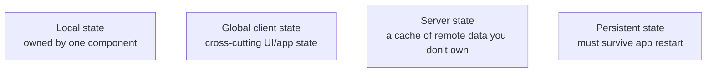
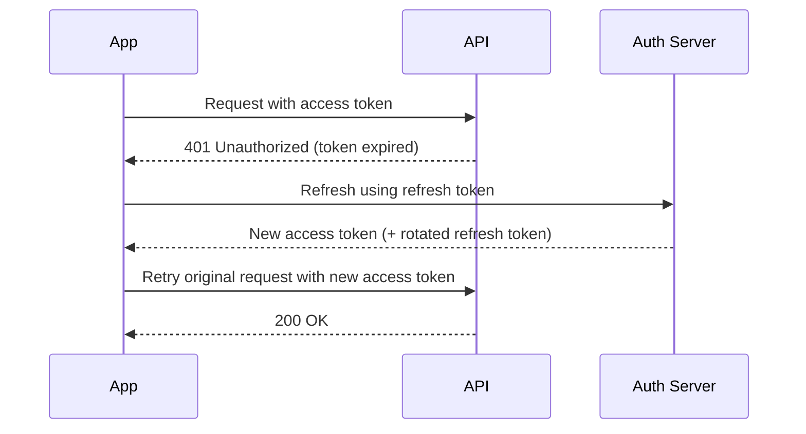
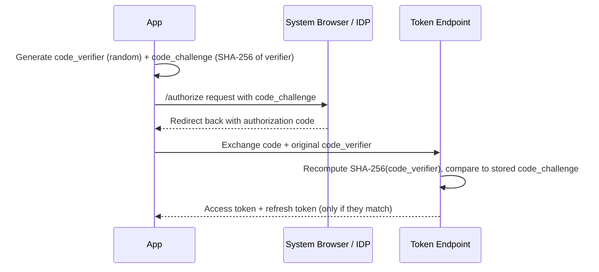
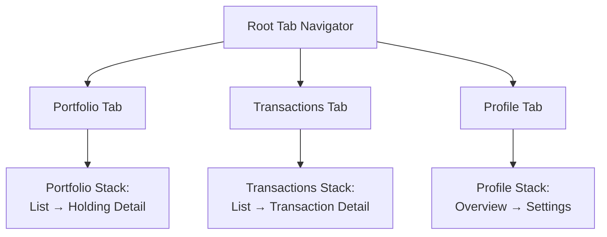
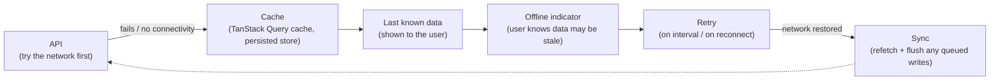
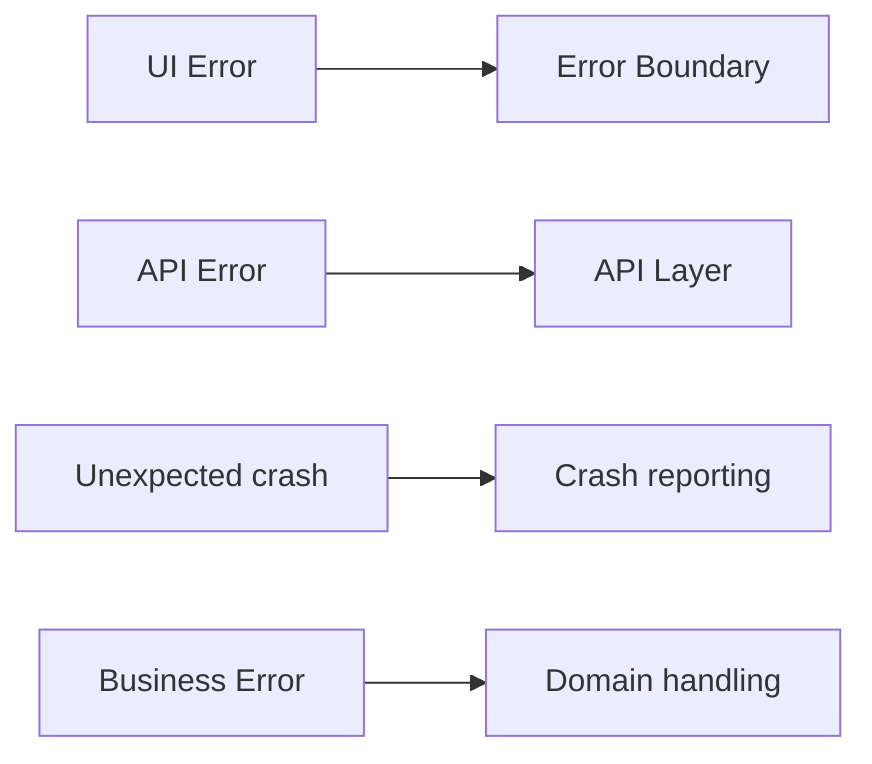

# React Native App Architecture & Production Concerns — Interview Guide

> Deep-dive reference covering app architecture/folder structure, state management, networking, security (treated as high priority — this is for a wealth-management company), navigation, offline-first design, error handling, testing, and CI/CD — written for interview preparation. Facts verified against the official React docs, Redux Toolkit docs, Zustand docs, TanStack Query docs, React Native docs, and React Navigation docs.

## Table of Contents

1. [Overview](#1-overview)
2. [Quick Summary (TL;DR)](#2-quick-summary-tldr)
3. [App Architecture](#3-app-architecture)
4. [State Management](#4-state-management)
5. [Networking](#5-networking)
6. [Security (High Priority For A Wealth-Management App)](#6-security-high-priority-for-a-wealth-management-app)
7. [Navigation](#7-navigation)
8. [Offline-First And Poor Network Conditions](#8-offline-first-and-poor-network-conditions)
9. [Error Handling](#9-error-handling)
10. [Testing](#10-testing)
11. [CI/CD](#11-cicd)
12. [Comparison Cheat Sheets](#12-comparison-cheat-sheets)
13. [Rapid-Fire Interview Q&A](#13-rapid-fire-interview-qa)
14. [Key Terms Glossary](#14-key-terms-glossary)
15. [Further Reading](#15-further-reading)

---

## 1. Overview

This document is about everything that sits *around* a React Native component tree: how a production-grade app is organized on disk, how it manages different kinds of state, how it talks to the network, how it protects user data (treated with extra weight here, since a wealth-management app is an unusually high-value target), how it navigates between screens, how it behaves when the network disappears, how it handles the four distinct shapes of "error," and how it gets safely built, tested, and shipped.

None of these topics are React Native-specific in the way JSI or Fabric are (see [Document 1](01-architecture-and-internals.md)) — they're general mobile/app-engineering concerns, but a wealth-management interview will expect you to reason about all of them fluently, with security given real weight rather than being an afterthought. The structure below mirrors how an experienced engineer would actually *think* through these concerns, one at a time, each with the concrete tools/APIs involved.

---

## 2. Quick Summary (TL;DR)

| Topic | Core idea | Reach for |
|---|---|---|
| App architecture | Organize by **feature**, not by file type | `app/`, `features/*`, shared `components/`/`hooks/`/`services/` |
| State management | Match the tool to the **kind** of state | Local: `useState`. Global client: Context/Redux Toolkit/Zustand. Server: TanStack Query. Persistent: a persistence middleware on top of one of the above |
| Networking | Centralize transport concerns, don't scatter them | An API client module with interceptors, retries, timeout, cancellation, baked in once |
| Security | Assume the device is hostile; never trust the client alone | Keychain/Keystore (not AsyncStorage) for secrets, OAuth2+PKCE, pinning, root/jailbreak checks, server-side secrets |
| Navigation | Compose navigators; gate screens by auth state, don't guard with `if`s inside screens | React Navigation stack/tab/nested + conditional screen trees for auth flow |
| Offline-first | Always have a fallback below "fresh network data" | Cache → last-known data → offline indicator → retry → sync |
| Error handling | Different errors need different handlers | UI → Error Boundary. API → API layer. Crash → crash reporting. Business → domain handling |
| Testing | Different layers need different tools | Static analysis → unit (Jest) → integration → component (RNTL) → E2E (Detox/Maestro) |
| CI/CD | Fail fast, gate releases behind checks | PR → lint → typecheck → unit tests → build → security scan → review build → QA → release |

---

## 3. App Architecture

```
src/
├── app/
│   ├── navigation/
│   ├── providers/
│   └── config/
│
├── features/
│   ├── authentication/
│   ├── portfolio/
│   ├── profile/
│   └── transactions/
│
├── components/
├── hooks/
├── services/
├── state/
├── utils/
├── constants/
└── types/
```

This layout is a **feature-first** (a.k.a. "vertical slice") architecture, as opposed to a purely **layered/horizontal** one (where you'd instead have top-level folders like `screens/`, `reducers/`, `apis/` and every feature's code is scattered across all of them). The reasoning behind each piece:

- **`app/`** — the app shell: things that exist exactly once, at the root. `navigation/` holds the root navigator composition (see [§7](#7-navigation)); `providers/` holds the stack of context/providers wrapping the whole tree (theme, auth, a TanStack Query `QueryClientProvider`, a Redux `Provider`, a navigation container); `config/` holds environment/config/feature-flag setup (see [§11.2](#112-environment-variables-and-secrets)).
- **`features/*`** — each feature (`authentication`, `portfolio`, `profile`, `transactions`) is a **vertical slice**: its own screens, its own components, its own hooks, its own API calls, and its own feature-scoped state, all living together. This is the core of the pattern — a change to how transactions are displayed should only touch the `transactions/` folder.
- **`components/`** — presentational, reusable components used **across** features (buttons, inputs, cards, a loading spinner). If a component encodes feature-specific business logic, it belongs inside that feature's folder instead, not here.
- **`hooks/`** — reusable hooks with no feature affiliation (`useDebounce`, `useAppState`, `useNetworkStatus`).
- **`services/`** — cross-cutting infrastructure clients consumed by multiple features: the API client (see [§5.1](#51-api-abstraction-layer)), secure storage wrapper, analytics, biometrics wrapper.
- **`state/`** — global state setup that isn't specific to one feature: the Redux store composition or shared Zustand stores (see [§4](#4-state-management)).
- **`utils/`** — pure helper functions (formatters, validators) with no side effects or external dependencies.
- **`constants/`** — static values: route names, enums, configuration constants.
- **`types/`** — shared TypeScript types/interfaces used across more than one feature.

### Why feature-first, and the pitfall to call out
As an app and team grow, a layered structure means every new feature touches the same handful of top-level folders (`screens/`, `reducers/`, `components/`), which causes constant merge conflicts between unrelated teams and makes it hard to answer "what does the transactions feature actually consist of?" without grepping the whole codebase. Feature-first folders let a team **own** a feature end-to-end, make it easy to delete or extract a feature cleanly, and keep the blast radius of a change small.

The pitfall worth naming in an interview: the shared folders (`components/`, `hooks/`, `services/`, `utils/`) only work if they stay genuinely cross-feature. A common anti-pattern is dumping anything inconvenient into `components/`/`utils/` out of laziness — that slowly turns the "shared" layer into a second, undisciplined dumping ground and erodes the whole benefit of feature folders. The discipline is: if only one feature uses it, it lives in that feature's folder, full stop.

---

## 4. State Management

### 4.1 The Four Kinds of State
A strong interview answer starts by naming that "state" is not one thing — these four kinds have different lifecycles, different owners, and (as covered below) often want different tools:



### 4.2 Local State
State that only one component (and perhaps its direct children) cares about: a text input's current value, whether a modal is open, which tab of a small local toggle is active. This is `useState`/`useReducer`, kept as close as possible to where it's used. The single most common state-management mistake in interviews and in real codebases is **promoting local state to global state too early** — if nothing outside the component (or its immediate subtree) needs it, it doesn't belong in Redux/Zustand/Context.

### 4.3 Global Client State: Context
React's `createContext`/`useContext`/`Provider` lets a parent component make a value available to the **entire tree below it** without manually threading it through every intermediate component ("prop drilling"). The official guidance is explicit about when to reach for it: **try passing props, and try restructuring to pass JSX as `children`, before reaching for context** — context is for data genuinely needed by many components at different depths (theming, the current signed-in user, routing state, a shared reducer for moderately complex state).

Context's real limitation as a general state-management tool: every consumer of a context re-renders whenever the **value object** passed to the nearest `Provider` changes, regardless of whether that specific consumer cares about the part that changed — and if that value is a fresh object literal created on every render, *every* consumer re-renders on *every* render of the provider (this exact pitfall, and the fix of memoizing the context value, is covered in [Document 2 §13](02-performance.md#13-native-thread-bottlenecks-and-expensive-components)). Context also has no built-in devtools, middleware, or selector mechanism — it's "just React," which is both its appeal (zero dependencies) and its ceiling.

### 4.4 Global Client State: Redux Toolkit
**Redux Toolkit (RTK)** is, per its own docs, "the standard way to write Redux logic," created specifically to address the historical complaints about Redux (too much boilerplate, too much manual store configuration, too many extra packages needed). The core APIs:

- **`configureStore()`** — wraps `createStore` with sane defaults: automatically combines slice reducers, wires up `redux-thunk` middleware by default, and enables the Redux DevTools extension.
- **`createSlice()`** — given a slice name, initial state, and an object of reducer functions, generates the reducer **and** the matching action creators/action types for you. Under the hood it uses **Immer**, so reducers can be written with normal-looking mutative code (`state.todos[3].completed = true`) while Redux still receives a proper immutable update.
- **`createAsyncThunk`** — wraps an async function, automatically dispatching `pending`/`fulfilled`/`rejected` actions around it — the traditional way to express a data-fetch inside Redux before reaching for RTK Query.
- **`createEntityAdapter`** — generates reusable reducers/selectors for normalized collections (e.g., transactions keyed by id).
- **`createSelector`** (re-exported from **Reselect**) — memoized selectors, so derived/computed data isn't recalculated unless its inputs actually changed.
- **RTK Query** (`@reduxjs/toolkit/query`) — an optional, purpose-built data-fetching and caching addon bundled with RTK. You describe endpoints via `createApi()` (with `fetchBaseQuery()` as the typical thin-fetch wrapper), and it auto-generates hooks, caching, and cache-invalidation — functionally a sibling to TanStack Query (see [§4.6](#46-server-state-react-query--tanstack-query)), but living inside the Redux store.

RTK is the strongest choice when a team wants a single, predictable, centrally-inspectable store with time-travel debugging, strict conventions that scale across a large team, and/or complex derived state via memoized selectors.

### 4.5 Global Client State: Zustand
**Zustand** takes almost the opposite philosophy: a small, unopinionated, hook-based store with (by design) far less ceremony.

```ts
import { create } from 'zustand';

const usePortfolioStore = create((set, get) => ({
  selectedAccountId: null,
  setSelectedAccountId: (id) => set({ selectedAccountId: id }),
}));

// anywhere, no <Provider> needed
const selectedAccountId = usePortfolioStore((state) => state.selectedAccountId);
```

Key properties, straight from its own docs:
- The store **is** a hook — no `<Provider>` wrapping is required anywhere in the tree.
- Components **select** the slice of state they need (`useStore((state) => state.x)`); Zustand compares the selected value with strict equality (`===`) by default and only re-renders that component when its selected slice actually changes — this is the main performance advantage over naively subscribing to a whole store. For selecting multiple fields at once, `useShallow` avoids re-renders unless the shallow-compared result changed.
- State can be read and written **outside of React entirely** (`store.getState()`, `store.setState()`, `store.subscribe()`), and "transient updates" can bind a value to a ref via `subscribe` without going through a React re-render at all.
- Common middleware: `persist` (pluggable storage via `createJSONStorage`, see [§4.7](#47-persistent-state)), `immer` (mutative-looking updates, same idea as RTK's built-in Immer), `devtools` (Redux DevTools integration), `subscribeWithSelector`.
- Zustand's own stated advantages over Redux: simpler, unopinionated, hooks-first, no context providers; over plain Context: less boilerplate, renders only on change, centralized action-based updates instead of scattered `useState`/`useReducer` calls.

Zustand trades away RTK's enforced structure and its larger ecosystem of conventions — that's a reasonable trade for small-to-mid apps or teams who find Redux's ceremony unnecessary, but it does mean the team has to supply its own discipline (e.g., a slices pattern for organizing a large store) since Zustand won't enforce one for you.

### 4.6 Server State: React Query / TanStack Query
**Server state is fundamentally different from client state**, and this distinction is itself a strong interview point. Per TanStack's own motivation docs, server state:
- is persisted **remotely**, in a location you don't fully own or control;
- requires **asynchronous** APIs to read and write;
- implies **shared ownership** — it can change from under you, from another device, another user, a background job;
- can silently become **"out of date"** in your app if you're not deliberately managing that.

Traditional client-state tools (plain Redux, plain Context) have no built-in concept of any of this — caching, deduping concurrent requests for the same data, refetching stale data in the background, pagination, and garbage-collecting unused cache entries all have to be hand-built, and usually hand-built poorly. **TanStack Query** (formerly React Query) is purpose-built for exactly this:

```ts
const { data, error, isPending } = useQuery({
  queryKey: ['portfolio', accountId],
  queryFn: () => fetchPortfolio(accountId),
});
```

The defaults are worth knowing precisely, since they're a very common interview probe:
- **`staleTime` defaults to `0`** — a query's cached data is considered stale immediately, though it's still shown instantly from cache while a background refetch happens (that's what makes it feel "cached" at all). Setting a longer `staleTime` (e.g., two minutes, or `Infinity` to only ever refetch on manual invalidation) is the main lever for controlling refetch frequency.
- Stale queries automatically refetch in the background when: a new component instance mounts, the window/app regains focus, or the network reconnects.
- **`gcTime` defaults to 5 minutes** (`1000 * 60 * 5`) — once a query has no active observers (nothing on screen is using it), it's kept around for this long before being garbage-collected, in case it's needed again soon.
- **Failed queries retry 3 times by default, with exponential backoff**, before the error is surfaced to the UI.
- Query results are **structurally shared** between refetches — if the new data is deep-equal to the old data, the same object reference is kept, which plays nicely with `useMemo`/`useCallback` downstream and avoids unnecessary re-renders.

Mutations (`useMutation`) follow the same model for writes, including the **optimistic update** lifecycle (`onMutate`/`onError`/`onSettled`) covered in [§5.8](#58-optimistic-updates), and `useInfiniteQuery` is the standard mechanism for pagination (see [§5.7](#57-pagination)). RTK Query ([§4.4](#44-global-client-state-redux-toolkit)) solves the same core problem if you're already committed to Redux as your single store.

### 4.7 Persistent State
"Persistent" isn't a fifth separate mechanism so much as a **behavior layered on top of** the other three kinds of state — the question is simply "does this survive an app restart or kill?"
- **Redux:** `redux-persist` wraps a reducer so its state is written to (and rehydrated from) a storage engine (commonly AsyncStorage), with allow-list/deny-list transforms to control exactly what gets persisted.
- **Zustand:** the built-in `persist` middleware, with a pluggable `storage` option (`createJSONStorage(() => AsyncStorage)` on React Native, or any other storage engine).
- **Server state:** TanStack Query supports persisting its cache across restarts (`persistQueryClient` and related utilities) so a user sees their last-known portfolio data instantly on cold start, before the first refetch completes — directly relevant to [§8](#8-offline-first-and-poor-network-conditions).
- **Navigation state:** React Navigation's own persistence pattern — `onStateChange` to write the current navigation state (to AsyncStorage, typically) and `initialState` to rehydrate it on launch — is exactly how "handling app restart" is implemented for navigation specifically (see [§7.6](#76-navigation-state-and-handling-app-restart)).

**The critical security caveat, worth stating explicitly in a wealth-management interview:** never blindly persist an entire store. The official React Native security guide calls out precisely this mistake — "saving sensitive form data in Redux state and persisting the whole state tree in Async Storage" is a realistic, easy-to-make vulnerability. Persisted/unpersisted is itself a meaningful security axis: persisted data sits on disk and is readable across app launches (and potentially by an attacker with device access), while unpersisted data never touches disk at all. Tokens and other secrets should never ride along in a generic persisted client-state blob — they belong in Keychain/Keystore-backed secure storage instead (see [§6.3](#63-storage-asyncstorage-vs-keychainkeystore)), with the persisted Redux/Zustand store scoped (via an allow-list) to hold only genuinely non-sensitive data.

### 4.8 "Why Shouldn't We Put Everything In Redux?"
This is an extremely common follow-up question, and it rewards a structured answer rather than a one-liner:

1. **Server state isn't really state you own** — it's a cache of remote data with its own concerns (staleness, refetching, deduping, pagination) that plain Redux has no concept of. Hand-building this (loading/error/data reducers and thunks per endpoint) reinvents — usually worse — what TanStack Query/RTK Query already give you for free.
2. **Not all state is global.** A text field's current value or whether an accordion is open belongs in local component state. Lifting it into Redux adds action creators, a reducer, a selector, and a `dispatch` call for something that one component could have handled with a single `useState`.
3. **Over-centralization hurts both performance and maintainability.** A single sprawling store means more reducers and selectors to reason about, more risk of imprecise selectors causing unrelated re-renders, and a "God object" that's hard to split across teams or features.
4. **Not everything needs to be shared.** If only one feature or screen ever reads a piece of state, keeping it feature-scoped (see [§3](#3-app-architecture)) keeps the blast radius small and keeps that feature independently understandable and deletable.
5. **Different state wants different lifecycles.** Auth state should survive until logout; server-cache state wants background refetching; a lot of UI state should reset the moment a screen unmounts. Forcing all three into one store with one mental model fights these differences instead of embracing them.

**The interview-ready one-liner:** *use the right tool for the kind of state — local component state for local concerns, a dedicated server-state library for anything that comes from an API, and a global client-state store only for the genuinely cross-cutting slice (auth session, theme, feature flags). Redux (or Zustand) should hold that last slice, not everything.*

### 4.9 Choosing The Right State Tool
| State kind | Example | Reach for |
|---|---|---|
| Local | Text input value, modal open/closed | `useState`/`useReducer` |
| Global client, small/simple | Theme, locale, feature flags | Context |
| Global client, large/complex | Auth session shared app-wide, cross-feature UI state | Redux Toolkit or Zustand |
| Server | Portfolio balances, transaction history, profile data | TanStack Query (or RTK Query) |
| Persistent | Auth tokens (securely), last-viewed screen, cached portfolio snapshot | A persistence layer on top of the above, with secrets routed to Keychain/Keystore instead |

---

## 5. Networking

### 5.1 API Abstraction Layer
Rather than scattering raw `fetch`/`axios` calls through components, wrap the HTTP client in a single module (in `services/`, per [§3](#3-app-architecture)) that exposes domain-specific functions — `getPortfolio()`, `getTransactions(accountId)`, `transferFunds(payload)` — instead of exposing the transport mechanism itself. This gives you exactly one place to add auth headers, logging, retry/timeout policy, and error normalization, and it means swapping the underlying HTTP client later doesn't ripple through every screen.

### 5.2 Axios vs Fetch
`fetch` is built into the runtime (no dependency, smaller bundle) but is deliberately low-level: it has no interceptors, no built-in timeout, no automatic JSON parsing, and — a classic interview gotcha — **it does not reject on HTTP error status codes** (a 404 or 500 still resolves successfully; you must check `response.ok` yourself). **Axios** adds request/response interceptors, automatic JSON transformation, a `timeout` option, automatic rejection on non-2xx responses, and straightforward request cancellation. Many modern teams now use bare `fetch` (or TanStack Query's thin built-in fetch wrapper) specifically to save the dependency/bundle weight, re-implementing only the handful of axios conveniences they actually need as a thin wrapper — worth mentioning as the current trend, while still knowing axios cold since it remains extremely common in production codebases.

### 5.3 Request Interceptors
Axios's `interceptors.request.use(...)`/`interceptors.response.use(...)` let you run logic around every request/response without repeating it at every call site: attaching the current access token as a bearer header, structured logging, or transforming response shapes. The most important production use of a **response** interceptor is handling `401 Unauthorized` centrally — see the refresh flow below.

### 5.4 Authentication And The Refresh Token Flow

The access token (short-lived, sent as a `Bearer` header) is what authorizes each API call; the refresh token (longer-lived, stored more securely) is used **only** to obtain new access tokens without forcing the user to log in again. A response interceptor watches for `401`s, pauses the failing request, performs the refresh, then retries the original request transparently.

**The classic gotcha interviewers probe for:** if five requests are in flight when the token expires, naively refreshing in each request's own interceptor fires five parallel refresh calls. The fix is to share a single in-flight refresh **promise** — the first `401` triggers the refresh and all concurrent `401`s await that same promise instead of starting their own, then all retry once it resolves. For extra safety, refresh tokens are often **rotated** on every use (the server issues a new refresh token each time and invalidates the old one); if an already-used refresh token is ever replayed, that's a strong signal of theft, and the whole token family should be revoked.

### 5.5 Retries, Timeout, And Cancellation
- **Retries:** exponential backoff is standard (TanStack Query's default is 3 attempts with exponential delay). Be careful retrying **non-idempotent** writes blindly — retrying a failed "transfer funds" POST could double-execute it; pair retries on mutations with an **idempotency key** so the server can recognize and dedupe a repeated attempt.
- **Timeout:** axios's `timeout` option, or `fetch` combined with `AbortController` and a `setTimeout`, prevents a hung request from blocking the UI indefinitely.
- **Cancellation:** `AbortController` (native to `fetch`, and supported by modern axios) cancels an in-flight request — on component unmount, on navigating away, or when a newer request (e.g., a fresh keystroke in search-as-you-type) should supersede an older, now-irrelevant one in flight.

### 5.6 Caching
Library-level caching (TanStack Query's `staleTime`/`gcTime`, or RTK Query's analogous cache) is the practical caching layer most RN apps rely on day to day — see [§4.6](#46-server-state-react-query--tanstack-query) for the exact default behavior. HTTP-level caching (`ETag`/`Cache-Control` headers) is less commonly hand-rolled directly in a mobile client, but still matters at the API-design level and is what a library's `fetchBaseQuery`/fetch wrapper can respect if the backend sends the right headers.

### 5.7 Pagination
Offset-based pagination (`?page=2&pageSize=20`) is simple but fragile against data that shifts between requests (a new transaction inserted at the top shifts every subsequent page, causing skips or duplicates) — a real risk for a live transaction feed. **Cursor-based pagination** (`?cursor=<opaque-id>`) is the more robust choice for exactly that kind of data. TanStack Query's `useInfiniteQuery` (with `getNextPageParam`/`getPreviousPageParam`) is the standard client-side pattern for either approach, handling the accumulation of pages and the "fetch next page" trigger for you.

### 5.8 Optimistic Updates
The pattern: update the local cache **immediately**, assuming the mutation will succeed, so the UI feels instant — then roll back if the server disagrees. TanStack Query's mutation lifecycle (`onMutate` → snapshot the previous value and apply the optimistic change; `onError` → restore the snapshot; `onSettled` → refetch to reconcile with the server's actual state) is the standard shape of this.

**Wealth-management-specific nuance worth raising unprompted:** optimistic updates are a great fit for low-stakes UI (marking a notification read, reordering a watchlist) but are often the **wrong** choice for anything that moves money or changes a position — you generally do not want to show a transfer or trade as "succeeded" before the server has actually confirmed it. The safer pattern there is an explicit **pending state** in the UI ("Transfer Pending…") that only flips to "Complete" on a confirmed server response, rather than assuming success. Knowing when *not* to use optimistic updates is as important as knowing how to implement them.

### 5.9 Error Handling
Normalize errors at the API layer into one consistent shape (e.g., `{ code, message, status }`) regardless of whether the underlying failure was a network error (no connectivity, DNS failure), an HTTP error (4xx/5xx), or a parsing error (malformed JSON) — so UI components branch on a single predictable error shape instead of needing to know which transport library produced it. This ties directly into the "API Error" category of error handling in [§9.3](#93-api-errors-and-the-api-layer), and into offline handling in [§8](#8-offline-first-and-poor-network-conditions).

---

## 6. Security (High Priority For A Wealth-Management Company)

### 6.1 Why Security Gets Extra Weight Here
A wealth-management app handles account balances, holdings, transaction history, and the credentials needed to move money — a materially higher-value target than a typical consumer app, and typically subject to real regulatory expectations (KYC/AML, data-protection law, SOC2-style controls). The official React Native security guidance frames this well: there's no bulletproof security, so **invest in security proportional to the sensitivity of the data and the damage a breach could cause** — for this domain, that means treating most of the "nice to have" items below as closer to mandatory.

### 6.2 Authentication: OAuth/OIDC, Tokens, Biometrics, Session Expiry

**OAuth2 vs OIDC.** OAuth2 is an **authorization** framework — it answers "can this app access this resource on the user's behalf," not "who is this user." **OpenID Connect (OIDC)** is a thin identity layer built on top of OAuth2 that adds standardized authentication: an **ID Token** (a JWT carrying identity claims), a `/userinfo` endpoint, and standardized scopes (`openid profile email`). Knowing this distinction cold — "OAuth2 alone is not an authentication protocol" — is a frequently-asked interview trap.

**OAuth2 + PKCE on mobile.** On the web, the OAuth2 redirect step is secure because web URLs are centrally, uniquely registered. Native apps have no such central registry for URL schemes, so an additional safeguard — **PKCE** (Proof of Key Code Exchange) — is required:


Even if a malicious app intercepts the authorization code via a hijacked redirect, it cannot complete the exchange without the original `code_verifier`, which never leaves the legitimate app. **`react-native-app-auth`** (wrapping the native `AppAuth-iOS`/`AppAuth-Android` libraries) is the library the official docs point to for this, and it supports PKCE as long as the identity provider does.

**Access tokens vs refresh tokens vs session expiry.** Access tokens are short-lived (minutes) and sent with every request; refresh tokens are longer-lived and stored more securely, used only to mint new access tokens (see the flow in [§5.4](#54-authentication-and-the-refresh-token-flow)), ideally **rotated** on every use with reuse-detection to catch theft. Session expiry in a financial app typically layers two concepts: an **idle timeout** (log out after N minutes of inactivity) and/or an **absolute timeout** (log out after N hours regardless of activity), plus **step-up authentication** — re-prompting for biometrics/password before a high-risk action (e.g., a large transfer) even if the session is technically still valid.

**Biometric authentication.** In practice, Face ID/Touch ID/Android `BiometricPrompt` is rarely the credential itself — it's typically used to **gate access to a securely stored credential**, such as unlocking a Keychain/Keystore-protected refresh token or encryption key, via platform access-control options (iOS Keychain's biometry-gated access control, Android Keystore's `setUserAuthenticationRequired`). Common libraries: `react-native-biometrics`, `expo-local-authentication`, or biometric-gated options built into `react-native-keychain`.

### 6.3 Storage: AsyncStorage vs Keychain/Keystore
This is one of the most concrete, checkable facts in the whole document, straight from the official React Native security guide:

| | AsyncStorage | Secure Storage (Keychain / Keystore) |
|---|---|---|
| Encryption | **Unencrypted** by default | iOS: Keychain Services. Android: Keystore-backed / Encrypted Shared Preferences |
| Good for | Non-sensitive persisted data: Redux/GraphQL state, app-wide preferences | Tokens, passwords, certificates, anything sensitive |
| Scope | Sandboxed per-app (not shared between apps) | Sandboxed per-app, OS-enforced hardware-backed protection |
| RN equivalent of | Web's `localStorage` | — |

React Native does **not** ship any built-in secure-storage mechanism — you either bridge Keychain Services (iOS) / the Keystore system (Android) yourself, or use a library: **`expo-secure-store`** or **`react-native-keychain`** are the two the official docs recommend. On Android specifically, plain `SharedPreferences` is unencrypted by default; **Encrypted Shared Preferences** wraps it to automatically encrypt both keys and values, while the **Android Keystore** itself is the lower-level system for storing cryptographic keys in hardware-backed containers so they're hard to extract from the device even with root access.

**The caution the docs call out explicitly, worth repeating in an interview:** sensitive data can leak *accidentally* — e.g., persisting an entire Redux state tree (including a form field that happened to hold sensitive data) to AsyncStorage, or forwarding tokens/PII to an application-monitoring service like Sentry or Crashlytics without scrubbing them first (directly relevant to [§6.8](#68-sensitive-data-in-logs)).

### 6.4 Certificate Pinning
HTTPS alone protects data in transit, but it trusts **any** certificate signed by a Certificate Authority preinstalled on the device — if an attacker gets a malicious root CA installed on the device (a real scenario via social engineering or a compromised MDM profile), standard HTTPS validation can be defeated in a man-in-the-middle attack. **SSL/certificate pinning** closes this gap by embedding the expected certificate(s) (or public key) in the app itself at build time, so the app only trusts connections signed by that specific pinned certificate, rejecting everything else — including otherwise-valid certificates from other legitimate CAs.

The operational cost to flag: certificates expire (typically every 1–2 years), and a pinned app with an expired or rotated server certificate simply stops working until the app itself is updated with the new pin — this requires deliberate certificate-rotation planning (commonly: pin the CA/intermediate cert rather than the leaf cert, or pin multiple certs including a not-yet-active backup, to avoid an app being bricked by a routine cert renewal).

### 6.5 Deep-Link Security
Deep links (`app://products/1`) are a mobile-specific attack surface that simply doesn't exist on the web, for one structural reason: **there is no centralized registry of URL schemes** on mobile. Any app can register for almost any scheme, so a malicious app can register the same scheme your app uses and potentially intercept links meant for you. Android mitigates this somewhat by showing the user a disambiguation dialog when multiple apps claim the same link; iOS historically resolved it silently (first-come-first-served since iOS 11), leaving the user unaware another app might have been chosen.

**The actionable rule: never put sensitive data (tokens, account numbers, anything secret) directly inside a deep link.** Prefer **Universal Links** (iOS) / **Verified App Links** (Android) over plain custom URL schemes wherever possible — these are cryptographically tied to a domain you control (via a hosted association file) rather than an unprotected, squattable scheme string, which meaningfully closes the hijacking gap. This also connects to [§6.2](#62-authentication-oauthoidc-tokens-biometrics-session-expiry): it's precisely *because* deep links aren't secure that the OAuth2 redirect step needs PKCE as an additional safeguard on mobile.

### 6.6 Root/Jailbreak Considerations
A rooted Android device or jailbroken iOS device has had its OS-level security sandbox weakened or removed — which can undermine assumptions like "the Keystore/Keychain is hardware-protected" or "other apps can't read my app's sandboxed storage." Libraries like `jail-monkey` (cross-platform) perform heuristic checks (presence of root-management apps, writable system partitions, suspicious installed packages, debugger/emulator detection) to flag a likely-compromised device.

The honest nuance to raise: this detection is an **arms race**, not a guarantee — it can be bypassed by a sufficiently motivated attacker, and it can occasionally false-positive on legitimate power-user configurations. For a wealth-management app, a common, defensible policy is to treat it as one signal among several (**defense in depth**) — e.g., warn the user, disable the most sensitive operations (large transfers), or refuse to cache tokens on a flagged device — rather than relying on it as the sole control, and rather than necessarily hard-blocking the app outright (a product/compliance decision, not a purely technical one).

### 6.7 Screenshot Protection
This is a genuinely asymmetric platform capability, and a good concrete fact to know cold:
- **Android** has a real, OS-enforced capability: setting `WindowManager.LayoutParams.FLAG_SECURE` on a window **actually blocks** screenshots and screen recording of that screen system-wide, and also blanks its thumbnail in the recent-apps switcher.
- **iOS has no equivalent blocking API.** You can only **detect** a screenshot after the fact (`UIApplicationUserDidTakeScreenshotNotification`) and react (e.g., log it, warn the user) — you cannot prevent the screenshot itself. You *can*, however, blank or blur the app's content in the **app-switcher preview** by swapping to a neutral view when the app resigns active/enters background (`applicationWillResignActive`/`applicationDidEnterBackground`), which prevents sensitive balances from being visible in a casual app-switcher glance or a screen-recording of the switcher.

Libraries like `expo-screen-capture` or `react-native-screenshot-prevent` wrap these platform differences behind one API. Apply this selectively — typically to screens showing balances, account numbers, or statements — rather than globally, since it does affect legitimate user actions (e.g., a user wanting to screenshot their own portfolio summary).

### 6.8 Sensitive Data In Logs
Logging is a frequently-overlooked leak vector. Rules worth stating explicitly: never log tokens, full account numbers, balances, or other PII, even at "debug" level, since debug logs have a way of ending up in production crash reports or support tickets; scrub request/response bodies before any verbose network logging; and specifically audit what breadcrumbs crash-reporting tools (Sentry, Crashlytics) capture by default — these tools often auto-capture console logs and network activity as breadcrumbs leading up to a crash, which can silently exfiltrate exactly the sensitive data you were careful to keep out of the UI. This is the same concern the official RN security guide raises directly: "sending user tokens and personal info to an application monitoring service... is a security concern."

### 6.9 Encryption
- **In transit:** TLS/HTTPS is the non-negotiable baseline (see [§6.4](#64-certificate-pinning) for strengthening it further with pinning).
- **At rest:** Keychain (iOS) and Keystore-backed storage (Android) are already encrypted by the OS as part of what makes them "secure storage" (see [§6.3](#63-storage-asyncstorage-vs-keychainkeystore)). For sensitive data that needs to live in a local database/cache rather than simple key-value secure storage (e.g., a locally cached transaction history for offline viewing — see [§8](#8-offline-first-and-poor-network-conditions)), reach for an encrypting storage engine (SQLCipher for SQLite, or MMKV's built-in encryption) rather than plain unencrypted SQLite/AsyncStorage.
- **General principle:** rely on platform-provided, well-reviewed cryptographic primitives (Keychain/Keystore, TLS, a maintained encrypting storage library) rather than hand-rolling custom cryptography — this is standard security guidance (don't roll your own crypto) and applies directly here.

### 6.10 Secure API Communication
A consolidation of the above as it applies specifically to talking to the backend: always HTTPS, consider certificate pinning for an app this sensitive, attach short-lived access tokens (never long-lived API keys) to requests, never put secrets in a URL (including in deep links, [§6.5](#65-deep-link-security)), validate/sanitize on the server regardless of client-side checks (the client can always be bypassed), and keep the refresh-token flow ([§5.4](#54-authentication-and-the-refresh-token-flow)) airtight against concurrent-refresh races.

### 6.11 Secrets Management
**The foundational fact: anything shipped inside the app bundle is effectively public.** Mobile app binaries can be decompiled/inspected, so an API key or secret embedded in JS or native code — even "hidden" via obfuscation — should be assumed readable by a sufficiently motivated attacker. Tools like `react-native-dotenv`/`react-native-config` are for **environment-specific configuration** (API base URLs per environment, public client IDs), not for protecting actual secrets — they should never be confused with true server-side secrets.

If an app genuinely needs to use an API key/secret to access some resource, the recommended pattern is an **orchestration layer**: a serverless function (AWS Lambda, Google Cloud Function) or backend-for-frontend service that holds the real secret server-side and forwards the authorized request on the app's behalf — the app never sees the secret at all. For CI/CD-time secrets specifically (signing credentials, store API keys), use your CI platform's encrypted secrets store (GitHub Actions secrets, EAS Secrets, Fastlane `match` for signing certificates) rather than committing anything to source — expanded on in [§11.2](#112-environment-variables-and-secrets) and [§11.3](#113-signing).

---

## 7. Navigation

### 7.1 Stack Navigation
A **stack navigator** (`createNativeStackNavigator` in React Navigation) manages screens the way a call stack manages function calls: pushing a new screen on top, popping back off it, with built-in platform-appropriate transitions and a header. This is the default way to move forward/backward through a flow (e.g., portfolio list → holding detail → transaction detail).

### 7.2 Tab Navigation
A **tab navigator** (`createBottomTabNavigator`) shows several top-level destinations side by side (Portfolio, Transactions, Profile), switching between persistent, parallel "roots" rather than pushing/popping a single stack.

### 7.3 Nested Navigators
Real apps compose navigators: a bottom tab navigator where **each tab is itself a stack navigator**, so navigating deeper within the "Portfolio" tab pushes onto that tab's own stack without disturbing the other tabs' navigation state. This nesting is exactly how a feature-first app architecture ([§3](#3-app-architecture)) maps onto navigation — each feature typically owns its own stack, composed together under one root tab/drawer navigator in `app/navigation/`.



### 7.4 Deep Linking
Deep linking lets an external source (a push notification, an email, a web link) open the app directly to a specific screen. React Navigation integrates via a `linking` config: a list of URL `prefixes` (your custom scheme and/or your universal-link domain) plus a path-to-screen mapping, handling two distinct scenarios — the app wasn't running (the link becomes the **initial** navigation state) and the app was already open (the link **updates** the current state). See [§6.5](#65-deep-link-security) for why sensitive data must never ride inside the link itself, and prefer Universal Links/App Links over a bare custom scheme for anything security-sensitive.

One sharp edge worth knowing: standard deep/universal links only work if the app is **already installed** — if it isn't, the user is routed to the store, and the original link context (e.g., which security a referral pointed at) is typically lost unless you implement **deferred deep linking** via a third-party attribution provider, since React Navigation has no built-in way to recover link context across an install.

### 7.5 Authentication Flows And Protected Screens
The recommended React Navigation pattern is **not** to manually `navigate()` between an "auth stack" and an "app stack" based on an `if` check sprinkled through code — it's to conditionally include screens in the navigator tree itself, driven by a hook/value representing sign-in state, and let the library handle the transition:

```tsx
const useIsSignedIn = () => useContext(SignInContext);
const useIsSignedOut = () => !useIsSignedIn();

const RootStack = createNativeStackNavigator({
  screens: {
    Home: { if: useIsSignedIn, screen: HomeScreen },
    SignIn: { if: useIsSignedOut, screen: SignInScreen },
  },
});
```
When the signed-in condition flips, React Navigation automatically removes the screens that no longer match and shows whichever screen now matches — critically, **the hardware back button can't navigate back into the authentication flow after sign-in**, because those screens are no longer part of the tree at all, not merely hidden. A typical real implementation adds a `SplashScreen` rendered *before* any navigator while a stored token is being restored (from secure storage, see [§6.3](#63-storage-asyncstorage-vs-keychainkeystore)) via `useReducer` + context exposing `signIn`/`signOut`/`signUp`. Shared screens that should be reachable from both signed-in and signed-out states (e.g., "Help") need special handling (grouping + a changing `navigationKey`) so they properly reset when the auth state changes rather than silently persisting stale navigation context.

### 7.6 Navigation State And Handling App Restart
To return a user to where they left off after an app restart (most valuable during development, usable with care in production), React Navigation exposes `onStateChange` (fires on every navigation state change — persist it, typically to AsyncStorage) and `initialState` (pass the restored state back in on the next launch) on the navigation container. Because restoration is asynchronous, the app must render a loading view until the stored state has been read. Every route name and param **must be JSON-serializable** for this to work — no functions, class instances, or circular references — and React Navigation will warn in development if it detects non-serializable values in the state. In production, this should always be paired with an **error boundary** that clears the persisted state on a crash, so a screen that reliably throws doesn't trap the user in an unrecoverable restart loop.

---

## 8. Offline-First And Poor Network Conditions

### 8.1 The Mental Model

The core idea: **never let "no network" mean "blank screen."** Always have a fallback a layer down — a fresh API response is the best case, but a reasonably recent cached copy (clearly marked as possibly-stale) is almost always better than nothing. Each stage above maps onto concrete tools already covered: the **cache** is TanStack Query's query cache (or RTK Query's); **last known data** is just rendering from that cache instead of a loading spinner when a request fails; the **offline indicator** is a small UI affordance (a banner, a "last updated" timestamp) driven by `NetInfo`/the OS's connectivity APIs; **retry** is TanStack Query's automatic refetch-on-reconnect behavior ([§4.6](#46-server-state-react-query--tanstack-query)); and **sync** is reconciling any writes the user made while offline (see below).

### 8.2 Worked Answer: Losing Network While Viewing A Portfolio
This is close to a direct quote of a real interview prompt, so it's worth having a complete, structured answer ready:

1. **Detect it.** Use a connectivity API (e.g., `@react-native-community/netinfo`) to know the device has lost connectivity, rather than waiting for a request to time out to find out.
2. **Don't clear the screen.** The portfolio screen should already be backed by a cache (TanStack Query) — on a failed refetch, keep rendering the last successful data instead of replacing it with an error state or a blank screen.
3. **Tell the user clearly.** Show a small, non-blocking offline indicator (a banner, or a muted "last updated 4 minutes ago" label) — the user should know the numbers they're looking at might not reflect the current moment, which matters a great deal for financial data specifically.
4. **Don't let the user take actions that require a live connection, without being explicit about it.** Disable or clearly label actions like "place a trade" as unavailable offline — this is a case where failing to communicate clearly could mean a user believes an action succeeded when it didn't ([§5.8](#58-optimistic-updates)'s caution against optimistic updates for money-moving actions is directly relevant here).
5. **Retry intelligently, not aggressively.** Let the library's built-in retry/refetch-on-reconnect behavior handle it rather than hand-rolling a polling loop; TanStack Query already refetches stale queries automatically when the network reconnects.
6. **Sync any pending writes once back online.** If the app supports offline actions at all (e.g., queuing a non-critical preference change), reconcile a write queue once connectivity returns, and handle conflicts explicitly rather than assuming the queued write is still valid against current server state.
7. **Know the limits.** For anything genuinely safety-critical (trade execution, fund transfers), the honest answer is that some actions simply **should not** be available offline at all — surfacing "you're offline, this action isn't available right now" is better engineering than any clever offline-queueing trick for operations that must reflect real-time, authoritative server state.

---

## 9. Error Handling

### 9.1 The Four Error Categories

A strong interview answer recognizes these are genuinely different problems needing different handlers — trying to catch everything with one mechanism (e.g., one giant `try/catch` or one error boundary) is itself a design smell.

### 9.2 UI Errors And Error Boundaries
A **UI error** is a JavaScript exception thrown during rendering — a broken render path, not a bad API response. React's answer is an **Error Boundary**: a component implementing the static `getDerivedStateFromError` (to swap in fallback UI) and/or `componentDidCatch` (to log the error, e.g., to crash reporting) lifecycle methods.

```tsx
class ErrorBoundary extends React.Component<Props, { hasError: boolean }> {
  state = { hasError: false };
  static getDerivedStateFromError() {
    return { hasError: true };
  }
  componentDidCatch(error: Error, info: React.ErrorInfo) {
    logErrorToMyService(error, info.componentStack);
  }
  render() {
    return this.state.hasError ? this.props.fallback : this.props.children;
  }
}
```
Precise, frequently-tested caveats straight from the React docs: **there is currently no way to write an Error Boundary as a function component** — it must be a class (or you use the community `react-error-boundary` package, which wraps this for you). Error boundaries do **not** catch errors in event handlers, errors during server-side rendering, errors thrown inside the boundary itself, or asynchronous code like `setTimeout` callbacks (the one exception: errors thrown inside a `startTransition` callback **are** caught). You don't need to wrap every component individually — place boundaries at meaningful granularity (e.g., around a whole screen, or around an independent widget like one chat message), not around every single leaf component.

### 9.3 API Errors And The API Layer
An **API error** (a non-2xx response, a network failure, a malformed response) should be caught and normalized at the networking layer itself ([§5.9](#59-error-handling)), not allowed to bubble up as an uncaught exception. The API layer's job is to turn "whatever went wrong at the transport level" into a predictable shape the UI can branch on (show an inline error, a retry button, a toast) — this is a handled, expected-to-happen condition, fundamentally different from a UI error, and should never itself crash the app.

### 9.4 Unexpected Crashes And Crash Reporting
Some failures are neither a caught render error nor a caught API error — a native crash, an unhandled promise rejection, a truly unexpected exception. A crash-reporting tool (Sentry, Firebase Crashlytics, Bugsnag) captures these in production: native crash logs, JS exceptions with symbolicated stack traces (via sourcemaps, since production JS is minified), breadcrumbs leading up to the crash, and release/version tagging so a crash spike can be correlated with a specific deploy. [§6.8](#68-sensitive-data-in-logs) applies directly here — audit exactly what these tools capture as breadcrumbs by default, since it's easy to leak sensitive data into a third-party crash-reporting service unintentionally.

### 9.5 Business Errors And Domain Handling
A **business error** (or "domain error") is not a bug at all — "insufficient funds," "market is closed," "this transfer exceeds your daily limit," "additional verification required" are *expected*, valid outcomes of a request that happened to succeed at the transport level. These should be modeled as explicit, typed results from the API layer (a specific error code/field in an otherwise-successful response, or a typed error variant) rather than thrown as generic exceptions — and the UI should explain the specific *why* to the user (which limit, which requirement) rather than showing a generic "something went wrong" toast, which is both a worse user experience and, in a financial product, can mask information the user actually needs to act on.

---

## 10. Testing

### 10.1 Static Analysis
The first, cheapest layer, running before any test executes: **linting** (ESLint — catches unused code, stylistic issues, common pitfalls) and **type checking** (TypeScript — catches whole classes of bugs, like passing a string where a function expects a number, before the code ever runs). React Native projects ship with both configured out of the box, and both map directly onto the first two stages of the CI/CD pipeline in [§11.1](#111-the-pipeline).

### 10.2 Unit Tests
Unit tests cover the smallest pieces of code — individual functions or classes — in isolation, mocking out any external dependency (a native module, a network call) so the test is fast, deterministic, and doesn't depend on something flaky like a real network request. React Native ships Jest by default, pre-configured for the environment. Good unit tests follow **AAA** (Arrange, Act, Assert — equivalently, Given/When/Then), are independent of each other, and are grouped with `describe`/`beforeEach`.

### 10.3 Integration Tests
Integration tests combine several **real** (non-mocked) units together and verify they cooperate correctly — the official guidance's working definition is a test that combines multiple modules, talks to an external system, makes a real network call, or does file/database I/O. The boundary between "unit" and "integration" is inherently a little fuzzy, and that's fine — what matters is recognizing that some mocking is unavoidable even here (e.g., still mocking a third-party weather service) but far less of it than in pure unit tests.

### 10.4 Component Tests
Component tests verify both **interaction** (does the component behave correctly when a user taps/types) and **rendering** (does the output look right). The official, actively recommended tool is **React Native Testing Library** (built on top of React's test renderer), explicitly favoring user-centric queries:

```tsx
test('user can add an item to the list', () => {
  const { getByPlaceholderText, getByText, getAllByText } = render(<GroceryShoppingList />);
  fireEvent.changeText(getByPlaceholderText('Enter grocery item'), 'banana');
  fireEvent.press(getByText('Add the item to list'));
  expect(getAllByText('banana')).toHaveLength(1);
});
```
The explicit guidance: assert on what a user can **see or hear** (rendered text, accessibility roles/labels) — **avoid** asserting on component props/internal state or querying by `testID` as a first choice, since those couple the test to implementation details that break on harmless refactors (e.g., converting a class component to a function component). **Snapshot testing** (Jest's serialized-render-output comparison) is powerful but double-edged: a snapshot is "correct" the moment it's created — even if the rendered output was actually wrong — and large snapshots become difficult for a reviewer to meaningfully evaluate; keep snapshots small and prefer explicit assertions when in doubt. Component tests are **pure JavaScript**, running in Node — they cannot catch a bug that only exists in the native iOS/Android code backing a component.

### 10.5 End-To-End Tests
E2E tests run against a real built app (release configuration) on a simulator/emulator/device, interacting with it exactly the way a user would — tapping real buttons, typing into real text inputs — with no visibility into React components, RN APIs, or any store/business logic directly. This gives the **highest possible confidence** that a flow genuinely works, at the cost of being slower to write, slower to run, and more prone to flakiness than any other test layer. The official guidance: reserve E2E coverage for an app's **vital** flows — authentication, core functionality, payments — and lean on faster JS-level tests for everything else. **Detox** is the RN-community-standard E2E framework (purpose-built for React Native); **Appium** and **Maestro** are popular general mobile alternatives.

| Layer | Tool | Speed | Confidence | Scope |
|---|---|---|---|---|
| Static analysis | ESLint, TypeScript | Instant | Catches a narrow class of bugs | Whole codebase |
| Unit | Jest | Fastest | Lowest (isolated) | One function/class |
| Integration | Jest | Fast | Medium | Several real modules together |
| Component | React Native Testing Library | Fast | Medium-high (JS only) | One component's render + interaction |
| E2E | Detox / Appium / Maestro | Slowest | Highest | A full real user flow, on-device |

---

## 11. CI/CD

### 11.1 The Pipeline

Each stage is a **gate** — a cheaper, faster check runs before a more expensive one, so a PR fails fast on a typo (lint) long before it burns CI minutes on a full native build. **Lint** and **type check** are the static-analysis layer from [§10.1](#101-static-analysis); **unit tests** are the fast, isolated layer from [§10.2](#102-unit-tests); **build** compiles the actual Android/iOS binaries ([§11.4](#114-android-and-ios-builds)); **security/static analysis** at this stage typically means dependency vulnerability scanning (e.g., `npm audit`/Dependabot-style scanning) and secret-scanning the diff; **review app** distributes a real installable build to stakeholders (TestFlight internal testing, Firebase App Distribution, or an EAS/Expo preview build) for sign-off before formal **QA**; and **release** is the final, gated push to the stores or an OTA channel.

### 11.2 Environment Variables And Secrets
Environment-specific **configuration** (API base URLs per environment, public client IDs, feature-flag defaults) is typically handled via `react-native-config`/`react-native-dotenv`, or an Expo app config with environment-driven values. This is explicitly **not** the same thing as secrets management ([§6.11](#611-secrets-management)) — anything that ends up bundled into the app is effectively public, so true secrets (signing keys, server-side API keys) must live only in the CI platform's encrypted secret store (GitHub Actions secrets, EAS Secrets, a dedicated secrets manager) and never in a committed `.env` file or in client-bundled config.

### 11.3 Signing
- **Android:** a keystore file plus a key alias and passwords, used to sign the release build. With Play App Signing (Google's current recommended model), you sign your upload with your own **upload key**, and Google re-signs the final artifact distributed to users with a separate key it holds — meaning a lost upload key is recoverable (unlike the old model, where losing your one signing key permanently orphaned your app listing).
- **iOS:** a signing certificate plus a provisioning profile, tied to an App ID registered with Apple. This can be managed via Xcode's "automatic signing," or more robustly in CI via **Fastlane `match`**, which syncs certificates and profiles across a team through an encrypted private git repository, avoiding the classic "it only builds on one person's machine" problem.

### 11.4 Android And iOS Builds
Android release builds are produced via Gradle (`assembleRelease` for an APK, `bundleRelease` for an **Android App Bundle** — the format Google Play has required for new apps since 2021, letting Google generate optimized per-device APKs). iOS builds go through an Xcode **archive**, then an **export** step to produce the signed `.ipa`. A CI pipeline for a cross-platform app typically runs both build jobs per release candidate, often on separate runners (iOS builds specifically require macOS).

### 11.5 Release Channels And App Store / Play Store
"Release channels" (Expo/EAS terminology, but the concept generalizes) let different build variants — dev, staging, production — coexist, often as separately-installable apps (distinct bundle IDs/App IDs) so a tester can have the staging and production builds on the same device simultaneously. Both major stores support **staged/phased rollout** — releasing to a small percentage of users first, then ramping up — which is the main lever for catching a bad release early without an immediate roll **back** (see [§11.7](#117-rollback-strategy)). Apple's review process is manual-ish and can take longer; Google's is more automated but still enforces policy review, and both can reject a build for policy reasons that have nothing to do with code quality — plan release timing accordingly.

### 11.6 OTA Updates
**Over-the-air (OTA) updates** (Expo Updates, or historically CodePush-style tools) ship a new JS bundle and assets directly to installed apps, **without** going through app-store review or requiring the user to download a new native binary. This is powerful for shipping JS-only fixes quickly, but has a hard boundary worth stating precisely: **OTA updates cannot change native code** — a new native module, a new permission, or any change requiring a different compiled binary still requires a full store release. Both Apple's and Google's policies also constrain *how much* an OTA update can change an app's behavior relative to what was originally reviewed — treating OTA as a channel for meaningful new features (rather than fixes/content updates) risks running afoul of store policy.

### 11.7 Rollback Strategy
Several independent levers, often used together: **pulling back a staged store rollout** (stop a phased rollout percentage from increasing further, or halt it, if crash-rate telemetry spikes); **republishing a previous OTA bundle/channel pointer** to undo a bad JS-only release almost immediately, without waiting on store review; **feature flags** as the fastest lever of all — toggling a flag off is faster than any redeploy and doesn't require shipping anything; and **API versioning** on the backend, so an older client version left in the field after a rollback (or simply not yet updated) doesn't break against a backend that's moved on.

---

## 12. Comparison Cheat Sheets

### The four kinds of state
| Kind | Lives in | Example | Typical tool |
|---|---|---|---|
| Local | One component | Text input value | `useState` |
| Global client | Whole app | Auth session flag, theme | Context / Redux Toolkit / Zustand |
| Server | Remote, mirrored locally | Portfolio balance | TanStack Query / RTK Query |
| Persistent | Disk, across restarts | Last screen, cached snapshot | Persistence middleware + secure storage for secrets |

### Context vs Redux Toolkit vs Zustand
| | Context | Redux Toolkit | Zustand |
|---|---|---|---|
| Boilerplate | Lowest (built into React) | Moderate (slices, store setup) | Low |
| Provider required | Yes | Yes | No |
| Re-render granularity | Whole-value per provider (needs manual splitting/memoizing) | Selector-based (precise) | Selector-based (precise) |
| DevTools / middleware | None built-in | Rich (DevTools, thunk, custom middleware) | Optional middleware (`devtools`, `persist`, `immer`) |
| Built-in server-state story | None | RTK Query (optional addon) | None (pair with TanStack Query) |
| Best for | Low-frequency, broadly-needed values | Large teams, strict conventions, complex derived state | Small/mid apps, minimal ceremony |

### AsyncStorage vs Secure Storage
| | AsyncStorage | Keychain (iOS) / Keystore-backed (Android) |
|---|---|---|
| Encrypted | No | Yes |
| Use for | Non-sensitive app/UI state | Tokens, passwords, certificates |
| Library | `@react-native-async-storage/async-storage` | `react-native-keychain`, `expo-secure-store` |

### The four error categories
| Error kind | Expected? | Handler |
|---|---|---|
| UI error | No (a render bug) | Error Boundary |
| API error | Yes (network/HTTP is unreliable by nature) | API layer normalization |
| Unexpected crash | No | Crash reporting (Sentry/Crashlytics) |
| Business error | Yes (a valid domain outcome) | Explicit domain/UI handling |

### Testing pyramid, RN-flavored
| Layer | Confidence | Speed | Tool |
|---|---|---|---|
| Static analysis | Low | Fastest | ESLint, TypeScript |
| Unit | Low–medium | Fastest | Jest |
| Integration | Medium | Fast | Jest |
| Component | Medium–high | Fast | React Native Testing Library |
| E2E | Highest | Slowest | Detox / Appium / Maestro |

---

## 13. Rapid-Fire Interview Q&A

**Q: What's the main benefit of a feature-first folder structure over organizing by file type?**
A: Related code for one feature lives together, so changes stay localized, merge conflicts between teams drop, and a whole feature can be understood, tested, or removed as one unit — at the cost of needing discipline to keep the shared folders (`components/`, `utils/`) genuinely cross-feature.

**Q: Why shouldn't we put everything in Redux?**
A: Server state isn't really client state and is better handled by a dedicated library (TanStack/RTK Query); not all state is global (local UI state belongs in `useState`); over-centralizing hurts performance and maintainability; and different state has different lifecycles (auth vs UI vs server cache) that one store's mental model fights against.

**Q: What's the key difference between Context and a dedicated state library like Redux/Zustand for frequently-changing global state?**
A: Context re-renders every consumer whenever the provided value changes (unless carefully split/memoized), with no selector mechanism; Redux Toolkit and Zustand both support precise, selector-based subscriptions, so only components that read the specific changed slice re-render.

**Q: Why is server state treated differently from client state?**
A: It's persisted remotely (not owned by the client), inherently asynchronous, has shared ownership (can change without the client's knowledge), and can silently go stale — concerns a plain client-state store (Context/Redux) has no built-in concept of, which is exactly what TanStack Query/RTK Query solve.

**Q: What are TanStack Query's default `staleTime`, `gcTime`, and retry behavior?**
A: `staleTime` defaults to `0` (data is immediately considered stale, though still served instantly from cache while refetching in the background); `gcTime` defaults to 5 minutes before an unused query is garbage-collected; failed queries retry 3 times with exponential backoff by default.

**Q: Why is persisting an entire Redux store to AsyncStorage risky?**
A: It can accidentally persist sensitive data (tokens, form fields) into unencrypted storage — the fix is an allow-list of what gets persisted, with true secrets routed to Keychain/Keystore-backed secure storage instead.

**Q: What's wrong with using `fetch` directly without a wrapper?**
A: It doesn't reject on HTTP error status codes (you must check `response.ok` yourself), and it has no built-in interceptors, timeout, or automatic JSON handling — easy to forget and a common source of silently-swallowed API errors.

**Q: How do you avoid firing multiple parallel token-refresh requests when several API calls 401 at once?**
A: Share a single in-flight refresh promise — the first 401 triggers the refresh, and every other concurrent 401 awaits that same promise instead of starting its own, then all retry once it resolves.

**Q: Why are optimistic updates often a bad fit for financial actions like transfers or trades?**
A: They show success before the server has actually confirmed it, which is risky for anything moving money — a "pending" state that only flips to "complete" on confirmed server response is the safer pattern there.

**Q: Why is cursor-based pagination often preferred over offset-based for a transaction feed?**
A: Offset-based pagination can skip or duplicate rows if new items are inserted between page requests (common for a live transaction list); cursor-based pagination is stable against that kind of shifting data.

**Q: What's the real difference between OAuth2 and OIDC?**
A: OAuth2 is an authorization framework (delegated resource access) and does not by itself define user authentication; OpenID Connect is an identity layer built on top of OAuth2 that adds a standardized ID Token and user-info mechanism.

**Q: Why does mobile OAuth2 need PKCE when web OAuth2 often doesn't?**
A: Mobile has no centralized registry of URL schemes, so the redirect step is inherently less trustworthy than on the web; PKCE ensures that even an intercepted authorization code is useless without the original `code_verifier`, which never leaves the legitimate app.

**Q: Why shouldn't sensitive data ever be stored in AsyncStorage?**
A: AsyncStorage is unencrypted by default — it's the RN equivalent of web `localStorage`, suitable for non-sensitive persisted state only; secrets belong in Keychain (iOS) or Keystore-backed storage (Android).

**Q: Why is screenshot protection asymmetric between iOS and Android?**
A: Android's `FLAG_SECURE` can genuinely block screenshots/screen recording and blank the recent-apps thumbnail system-wide; iOS has no equivalent blocking API — you can only detect a screenshot after the fact and separately blank the app-switcher preview image.

**Q: Why is embedding an API key in app code considered insecure even if it's "hidden"?**
A: Mobile app bundles can be decompiled/inspected, so anything shipped in the client is effectively public; true secrets need a server-side orchestration layer that never exposes the secret to the client at all.

**Q: Why shouldn't a deep link ever carry a sensitive token?**
A: There's no centralized registry of URL schemes on mobile, so another app can register the same scheme and potentially intercept the link — Universal Links/App Links (tied to a verified domain) close this gap much further than a bare custom scheme.

**Q: How does React Navigation recommend implementing an authentication flow?**
A: Conditionally include screens in the navigator tree based on a sign-in hook/value (not manual `navigate()` calls driven by `if` checks) — the library automatically shows the right screen and removes the others when the condition changes, which also prevents navigating back into auth screens after sign-in.

**Q: What four things does "offline-first" require, beyond just catching the fetch error?**
A: A cache to fall back to, continuing to show last-known data instead of a blank/error screen, a clear offline indicator so the user knows data may be stale, and an automatic retry/sync once connectivity returns.

**Q: Why can't you write an Error Boundary as a function component?**
A: React doesn't yet support the equivalent lifecycle hooks (`getDerivedStateFromError`/`componentDidCatch`) for function components — you either write a class component or use the community `react-error-boundary` package.

**Q: What's the difference between an API error and a business error, and why does it matter?**
A: An API error is a transport-level failure (network down, 500, malformed response) handled generically at the API layer; a business error (insufficient funds, market closed) is a valid domain outcome of an otherwise-successful request and should be modeled explicitly and explained to the user, not treated as a generic failure.

**Q: Why are E2E tests reserved for "vital" flows instead of full coverage?**
A: They're the slowest to run, the most time-consuming to write, and the most prone to flakiness of any test layer — the official guidance is to spend that cost on flows like authentication, core functionality, and payments, and rely on faster JS-level tests for the rest.

**Q: What's the key limitation of OTA updates (Expo Updates/CodePush-style)?**
A: They can only ship JS/asset changes — any change requiring new native code, new permissions, or a new native module still requires a full store release and review.

---

## 14. Key Terms Glossary

| Term | Meaning |
|---|---|
| **Feature-first architecture** | Organizing code by domain/feature (vertical slices) rather than by file type (layers). |
| **Server state** | Data that actually lives on a remote server and is just mirrored/cached on the client. |
| **Stale time** | How long cached data is considered "fresh" before a library will refetch it in the background. |
| **Optimistic update** | Updating the UI/cache immediately on a mutation, before server confirmation, with a rollback path on failure. |
| **PKCE** | Proof of Key Code Exchange — an OAuth2 extension that protects the mobile authorization-code redirect step. |
| **Access token / refresh token** | Short-lived credential sent with each request / longer-lived credential used only to mint new access tokens. |
| **Keychain / Keystore** | iOS / Android OS-level, encrypted secure storage for small sensitive values like tokens. |
| **Certificate pinning** | Trusting only a specific embedded certificate/public key for a host, instead of any CA-signed certificate. |
| **Universal Link / App Link** | A deep link cryptographically tied to a verified domain, more hijack-resistant than a bare custom URL scheme. |
| **Error Boundary** | A React class component that catches rendering errors in its child tree and shows fallback UI. |
| **Idempotency key** | A client-generated identifier attached to a write request so a server can safely dedupe a retried request. |
| **Staged rollout** | Releasing a store update to a small percentage of users first, ramping up if no issues appear. |
| **OTA update** | Shipping a new JS bundle/assets directly to installed apps without app-store review, bounded to non-native changes. |

---

## 15. Further Reading

- Passing Data Deeply with Context — https://react.dev/learn/passing-data-deeply-with-context
- `Component` (Error Boundaries reference) — https://react.dev/reference/react/Component#catching-rendering-errors-with-an-error-boundary
- Getting Started with Redux Toolkit — https://redux.js.org/toolkit/introduction/getting-started
- Zustand (official README) — https://github.com/pmndrs/zustand
- TanStack Query Overview — https://tanstack.com/query/latest/docs/framework/react/overview
- TanStack Query Important Defaults — https://tanstack.com/query/latest/docs/framework/react/guides/important-defaults
- React Native Security — https://reactnative.dev/docs/security
- React Native Testing Overview — https://reactnative.dev/docs/testing-overview
- React Navigation — Getting Started — https://reactnavigation.org/docs/getting-started
- React Navigation — Authentication Flows — https://reactnavigation.org/docs/auth-flow
- React Navigation — Deep Linking — https://reactnavigation.org/docs/deep-linking
- React Navigation — State Persistence — https://reactnavigation.org/docs/state-persistence
- Related: [Document 1 — React Native Architecture & Internals](01-architecture-and-internals.md)
- Related: [Document 2 — React Native Performance](02-performance.md) (context re-render pitfalls referenced in [§4.3](#43-global-client-state-context))
- Related: [Document 3 — Native Integration](03-native-integration.md)
