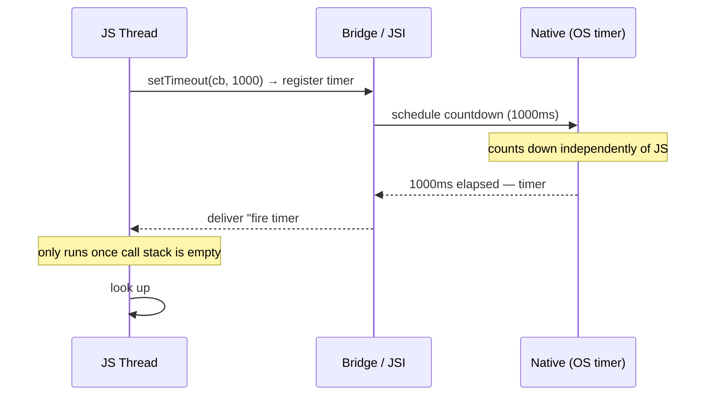
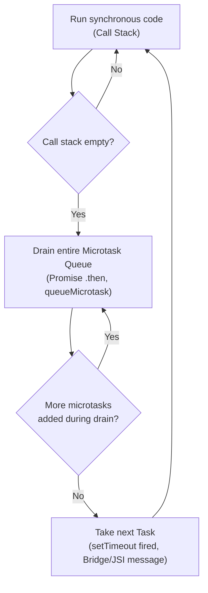

# React Native Senior Interview Q&A Handbook (Tier 1 Must Know: JS ↔ React Native ↔ Native)

> A running, tiered handbook of senior-level React Native interview questions with detailed answers. Unlike the topic-based deep dives ([Document 1](01-architecture-and-internals.md), [Document 2](02-performance.md), [Document 3](03-native-integration.md), [Document 4](04-app-architecture-and-production-concerns.md)), this handbook is organized as direct question → answer pairs, grouped into tiers, and grows as new tiers are added. Facts verified against the official React Native docs (`javascript-environment`, `timers`, `hermes`) and the ECMAScript microtask/event-loop model.

## Table of Contents

1. [How To Use This Handbook](#1-how-to-use-this-handbook)
2. [Tier 1 — Must Know: JS ↔ React Native ↔ Native](#2-tier-1--must-know-js--react-native--native)
3. [Key Terms Glossary](#3-key-terms-glossary)
4. [Further Reading](#4-further-reading)

---

## 1. How To Use This Handbook

Each tier is a batch of questions on a related theme. Questions are kept in their original order and numbered to match how they were given, so you can jump straight to a question or review a tier top-to-bottom as a mini-exam. Where a question overlaps with deeper architectural material already covered in Documents 1–4, this handbook gives a complete, self-contained answer here (this is meant to be read question-first, the way an interviewer asks it) and links out for the deeper mechanics rather than repeating them in full.

---

## 2. Tier 1 — Must Know: JS ↔ React Native ↔ Native

This tier is really four clusters of questions wearing twenty different hats: **timers (Q1–5)**, **engine vs. runtime (Q6–9)**, **the event loop and microtasks (Q10–15)**, and **threading (Q16–20)**. They all point at the same underlying idea: *React Native is JavaScript running in a single-threaded VM, cooperating with a separate, genuinely multi-threaded native host.* Almost every answer below traces back to that one sentence.

### 1. What actually happens when you call `setTimeout()` in React Native?

`setTimeout` is **not** a JavaScript-engine feature — it isn't part of the ECMAScript specification at all. In React Native, it's a polyfill the framework installs globally (the official docs state it plainly: *"React Native implements the browser timers"*). A call to `setTimeout(callback, 1000)` goes through a multi-step round trip:

1. Your JS code calls the global `setTimeout`. The polyfill records your callback and delay in a JS-side registry keyed by a generated timer ID, and returns that ID immediately — exactly like a browser.
2. The polyfill reaches across the JS↔Native boundary (the asynchronous Bridge in the Old Architecture, or a direct JSI call in the New Architecture — see [Document 1 §7–§9](01-architecture-and-internals.md#7-jsi--javascript-interface)) and tells native: *"call me back in 1000ms, this is timer #42."*
3. Native code schedules that countdown using the **platform's own timer facility** — a genuine OS-level mechanism, not JS. This countdown runs independently of whatever the JS thread happens to be doing.
4. When 1000ms elapses, native sends a "timer #42 fired" message back toward the JS thread.
5. The JS thread can only act on that message once its call stack is empty and it's that message's turn in the JS thread's own processing queue. If the JS thread is busy, the callback simply waits.
6. Once picked up, the JS thread looks up timer #42 in its registry and invokes your original callback.



The delay you pass is therefore a **minimum**, never a guarantee — it's "don't call me back before 1000ms," not "call me back at exactly 1000ms."

### 2. Who is responsible for executing `setTimeout()` — JavaScript, React Native, native code, or the OS?

Trick question by design — it's **all four, each for a different part of the job**:
- **JavaScript** registers the callback and (eventually) executes it.
- **React Native's polyfill layer** is the glue that turns the JS-facing `setTimeout` call into a cross-boundary request, and turns the eventual "fired" signal back into a JS callback invocation.
- **Native code** (a native timing module/service) receives the "start a timer" request.
- **The OS** actually counts down the delay, using real OS-level timer/scheduling primitives.

No single layer "owns" `setTimeout` — it's a collaboration across the JS/bridge/native boundary. That collaboration, and specifically the fact that the *counting down* happens natively/on the OS while the *executing* happens on the JS thread, is the crux of nearly every other question in this tier.

### 3. How does `setTimeout()` differ between a browser and React Native?

Conceptually, almost not at all — both treat it as a **host-provided API** (not engine-provided), both queue the callback as a macrotask that only runs once the call stack is empty, and in both, the delay is a minimum, not a promise. The concrete differences:

- **Who the "host" is.** In a browser it's the browser's own internals; in React Native it's RN's own native module system (a native timing facility reached via the Bridge/JSI) — different plumbing, same contract.
- **`requestAnimationFrame` semantics.** In both environments RAF is tied to the actual display refresh (`CADisplayLink`/`Choreographer` natively) rather than a fixed delay, but React Native has no browser compositor underneath — it's tied to RN's own rendering/commit cycle instead.
- **`setImmediate` exists in RN but not in browsers.** Per the official RN docs, `setImmediate` fires "at the end of the current JavaScript execution block, right before sending the batched response back to native," and nesting a `setImmediate` call inside another one runs it right away without yielding back to native first. This is **RN's own concept** — it is *not* the same as Node.js's `setImmediate` (which runs in a distinct phase of libuv's event loop), a common point of confusion for engineers coming from a Node background.
- **Debugging mode is a real gotcha.** When using (legacy) Chrome debugging, all of your JS — including every timer — actually executes inside Chrome on your development machine, talking to the physical device only over a WebSocket. The official docs explicitly warn that if the clock between your debugger machine and the device drifts, "animation, event behavior, etc. might not work properly." In other words: in that mode, `setTimeout` isn't running on the device at all.
- **Backgrounding behavior.** Browsers typically throttle/clamp timers in inactive tabs. React Native's analogous concept is the app being backgrounded by the OS, where JS execution can be suspended outright rather than merely throttled.

### 4. What happens internally when a timer expires while the JS thread is blocked?

The native-side countdown is unaffected — it's running on the OS, independently of JS — so it completes exactly on schedule and the "timer fired" message is sent/queued toward the JS thread right on time. What's delayed is **execution of the callback**: it sits waiting in the JS thread's queue until the blocking synchronous code finally finishes and the call stack empties. The callback then runs immediately, just later than requested — the timer didn't "miss" its firing, the JS thread was simply unavailable to act on it.

### 5. Does `setTimeout(fn, 0)` execute immediately in React Native?

No. Even with a `0ms` delay, the call still goes through the full round trip described in Q1: it's still asynchronous, it still requires a hand-off to native and back, and it still must wait for the **current synchronous code to finish and every pending microtask to drain** before it can run (see Q15). "0ms" means "run this as soon as possible after everything currently queued ahead of it finishes" — not "run this synchronously, right now." The official docs make the "as fast as possible, not instant" nature concrete when contrasting it with `requestAnimationFrame`: a `setTimeout(fn, 0)` can fire "over 1000x per second on an iPhone 5S" — very fast, but never zero-time/synchronous.

---

### 6. What is the React Native JavaScript runtime?

React Native can execute your JS in up to **three different environments**, per the official docs:
1. **Hermes** (the default) — an open-source JS engine built specifically for React Native.
2. **JavaScriptCore (JSC)** — the engine that powers Safari, used if Hermes is disabled. Notably, on iOS, JSC runs **without a JIT**, because iOS doesn't allow apps to hold writable-and-executable memory.
3. **V8**, but *only* when using (legacy) Chrome debugging — in that mode your JS runs inside Chrome itself on your development machine, not on the device, communicating with native code over a WebSocket.

The docs' own guidance: these three are similar but not identical, and relying on engine-specific quirks is a real source of "works in debug, breaks in release" bugs.

### 7. What is Hermes, and what exactly does Hermes do?

Hermes is Meta's open-source JavaScript engine purpose-built for React Native. Per the official docs, for many apps it results in **improved start-up time, decreased memory usage, and smaller app size** compared to JSC. Concretely, Hermes:
- **Compiles JS to bytecode ahead of time** (at build time, producing a `.hbc` file), so the device doesn't need to parse/compile raw JS source on every app launch — this is the main driver of its faster startup.
- Ships its own compact bytecode interpreter and a garbage collector tuned for mobile memory constraints (see [Document 1 §14](01-architecture-and-internals.md#14-hermes) for the deeper internals).
- Is used **by default** in React Native with no extra configuration, and exposes a `global.HermesInternal` variable you can check to confirm it's active.

### 8. Is Hermes responsible for APIs such as `setTimeout`, `fetch`, and `requestAnimationFrame`?

No — and this is one of the most important distinctions in this whole tier. `setTimeout`, `fetch`, and `requestAnimationFrame` are **not part of the ECMAScript language spec**, so no JS engine (Hermes, JSC, or V8) implements them as engine built-ins. They're **host APIs**: React Native itself supplies them as polyfills (confirmed directly by the official docs' "Polyfills" section, which explicitly lists `{set, clear}{Timeout, Interval, Immediate}`, `{request, cancel}AnimationFrame`, and `fetch`/`XMLHttpRequest` as RN-provided, browser-equivalent polyfills), which in turn call into native code to do the real work (an OS timer, a real network stack, a real display frame callback). Hermes's job is limited to executing the JavaScript language itself — syntax, objects, closures, `Promise` mechanics, garbage collection — not supplying these environment APIs.

### 9. What is the difference between a JavaScript engine and a JavaScript runtime?

- A **JS engine** (Hermes, JSC, V8, SpiderMonkey) implements the **ECMAScript language specification** — parsing and executing JS syntax, core built-ins, and (important for Q13–15) the spec-mandated microtask/Job queue that backs `Promise`. That's it: no networking, no timers, no filesystem.
- A **JS runtime** is the engine **plus** the surrounding host environment that makes it useful in a particular context. Node's runtime is V8 + libuv + Node's own APIs (`fs`, `http`, timers backed by libuv). A browser's runtime is its JS engine + the DOM + Web APIs (`fetch`, `setTimeout`, `requestAnimationFrame`) + the browser's own event loop and rendering pipeline. **React Native's runtime is Hermes (or JSC/V8) + React Native's own host environment** — the timer/network polyfills, the Bridge/JSI boundary, and RN's own JS-thread processing loop standing in for "the event loop."

Worth noting precisely: React Native's own docs title the section listing Hermes/JSC/V8 as "JavaScript Runtime," using "runtime" loosely to mean "which engine is in use." The more precise, universally-used technical distinction — engine vs. engine-plus-host-APIs — is the one above, and is the one interviewers are almost always testing for with this question.

---

### 10. What is the Event Loop, and how does it work in React Native?

The **Event Loop** is the repeating process that lets a single-threaded JS environment handle asynchronous work: run everything currently on the call stack, then drain every pending microtask, then pick up the next queued task, and repeat. In React Native, the same spec-level discipline applies (it's implemented by whichever engine you're running — see Q12/Q13), but the *sources* feeding the queues are RN-specific rather than browser-specific: instead of DOM events and browser-scheduled timer callbacks, the "tasks" arriving at the JS thread are things like fired timers, resolved native-module calls, and incoming messages from the Bridge/JSI — all funneled through RN's own JS-thread processing loop, which plays the same role a browser's event loop plays, just fed by a different native host.

### 11. Does React Native have the same Event Loop as a browser?

Conceptually equivalent, but not literally the same implementation. The **shape** is identical because it's dictated by the ECMAScript spec itself (call stack → drain all microtasks → next task), and that part is implemented by the JS engine regardless of host (Hermes behaves the same way V8 does here). What's different is everything **feeding** that loop: there's no `window`, no DOM, no browser rendering/compositing tied to it. The "next task" in React Native is typically a message arriving from native (a fired timer, a resolved native call) via the Bridge/JSI, rather than a browser-specific task source — same algorithm, different native host underneath it.

### 12. What are the Call Stack, Task Queue, Microtask Queue, and Event Loop?

- **Call Stack** — where synchronous function calls are tracked, LIFO (last in, first out). Whatever's executing right now is on top of it.
- **Task Queue** (a.k.a. macrotask queue / callback queue) — holds callbacks from things like `setTimeout`/`setInterval` firing, or an incoming Bridge/JSI message. Processed **one task at a time**.
- **Microtask Queue** (the spec calls these "Jobs") — holds `Promise` reactions (`.then`/`.catch`/`.finally`), `queueMicrotask()` callbacks, and `async`/`await` continuations. This queue is always **fully drained** — including any new microtasks added while draining — before the loop is allowed to move on to the next task.
- **Event Loop** — the overall repeating process tying these together: run the call stack to empty → drain the entire microtask queue → take the next task off the task queue → repeat.



### 13. What happens internally when a Promise resolves in React Native?

Calling `resolve(value)` (or an `await`ed promise settling) does **not** synchronously invoke the attached `.then()` callbacks. Per the ECMAScript spec — which Hermes implements the same way V8 and JSC do — resolving a promise schedules a **PromiseReactionJob** onto the microtask queue. That job runs after the currently executing synchronous code finishes, but **before** any other macrotask (a fired timer, an incoming native message) gets a chance to run, because the whole microtask queue is always drained first.

One historical nuance worth knowing for a senior-level conversation: React Native's own official "Timers" documentation states that *"the Promise implementation uses `setImmediate` as its asynchronicity implementation"* — a description of the legacy, pre-native-Promise era, when RN shipped its own JS `Promise` polyfill (for engines/configurations without a spec-native `Promise`) that scheduled its callbacks via RN's own `setImmediate` concept (end of the current JS execution block, before yielding to native) rather than a strict spec-level Job queue. With **Hermes as the default engine today, `Promise` is implemented natively by the engine itself**, with a genuine spec-compliant microtask queue — so the practical guarantee ("promise callbacks run before a real `setTimeout`, even `setTimeout(fn, 0)`") holds either way, but it's worth being able to name *why* it holds, and that the underlying mechanism has differed across RN's history.

### 14. How are `Promise.then()`, `queueMicrotask()`, and `setTimeout()` scheduled differently?

- **`Promise.then()`** schedules its callback as a **microtask** (a PromiseReactionJob, per spec) — runs after current sync code, before any macrotask.
- **`queueMicrotask()`** schedules its callback onto that **exact same microtask queue** directly — it exists specifically to let you opt into "run this as soon as the current operation finishes, before anything else" timing without needing to create a throwaway `Promise` just to get `.then()` semantics.
- **`setTimeout()`** is a **host/environment API**, not an engine feature at all (see Q6–Q9). Its callback is always scheduled as a **macrotask**, meaning it is only picked up after the entire microtask queue has been fully drained — and in React Native specifically, it additionally requires a genuine round trip through native code (see Q1), which a microtask never needs.

### 15. Which executes first: a Promise callback or a `setTimeout(..., 0)` callback?

**The Promise callback, always** — regardless of the order they were written in, and regardless of the timeout being `0`. The engine fully drains the microtask queue before it's allowed to move on to the next macrotask, and a `Promise` reaction is a microtask while `setTimeout` is a macrotask. This is provable directly:

```js
console.log('1: sync start');

setTimeout(() => console.log('2: setTimeout callback'), 0);

Promise.resolve().then(() => console.log('3: promise .then callback'));

queueMicrotask(() => console.log('4: queueMicrotask callback'));

console.log('5: sync end');

// Output, in order: 1, 5, 3, 4, 2
```
All synchronous code (`1`, `5`) runs first since nothing else can preempt the call stack. Then both microtasks (`3`, `4`) run, in the order they were enqueued. Only then — last — does the macrotask (`2`) run, even though its delay was `0`.

---

### 16. What happens when the JS thread is blocked for 5 seconds?

**No JavaScript executes at all for those 5 seconds** — not timer callbacks (even ones whose delay already elapsed, per Q4), not Promise reactions, not touch-handler logic, not a single state update. From the user's perspective the app appears frozen for anything that requires fresh JS-driven output. Meanwhile, two things are still true: native code on *other* threads keeps running (Q17), and once the block finally clears, every callback that was queued up during those 5 seconds fires back-to-back in a burst — which is often the visible symptom that tips you off that the JS thread was blocked in the first place (a sudden pile of state updates / animations all landing at once). A related, commonly-paired API worth knowing: `InteractionManager.runAfterInteractions()` lets you deliberately defer expensive JS work until running animations/interactions finish, precisely to avoid *causing* this kind of block at the worst possible moment.

### 17. Can native code execute while the JS thread is blocked?

Yes, unconditionally — the JS thread is one OS thread among several (Q20), and a block on it has no direct effect on other threads. The native UI/Main thread, any native module running on its own thread, and OS-level work (like continuing to draw frames that were already committed, or running a `useNativeDriver: true` animation that was already handed off to native) all keep executing normally.

### 18. Can the UI thread continue rendering while the JS thread is blocked?

Yes, but only for work that doesn't depend on a *fresh* instruction from JS. The UI/Main thread can keep drawing already-committed native views and keep running animations that were already handed off to native (native-driven `Animated` values, Reanimated worklets running on the UI thread) — none of that needs anything further from JS once it's been handed off. What it **cannot** do is show *new* content: a state update, a newly computed layout, anything that depends on React re-rendering — because that computation only happens in JS, and JS isn't available to do it until it unblocks.

### 19. What is the relationship between the JS thread and the UI/Main thread?

They are two **separate OS threads** that only communicate through a defined boundary — the asynchronous, serializing Bridge in the Old Architecture, or direct JSI calls in the New Architecture (see [Document 1 §13](01-architecture-and-internals.md#13-react-native-rendering-pipeline-and-threading-model)). The JS thread's job is to figure out *what the UI should look like* (run your application logic, React's reconciliation, event-handling logic); the UI/Main thread's job is to actually *draw it* — mutate the real native view hierarchy, run the platform's native UI framework, and handle raw touch input at the OS level. In the Old Architecture, the JS thread would compute a batch of UI instructions and send them asynchronously across the Bridge for the UI thread to apply; in the New Architecture, JSI allows a much more direct, lower-latency path between JS and the native/C++ rendering core (Fabric), but the JS thread and UI thread remain genuinely separate threads either way — a slow JS thread can never literally freeze the UI thread itself, it can only starve it of new instructions to render.

### 20. Does React Native have a single thread or multiple threads?

**Multiple threads — this is one of the most common misconceptions in the ecosystem**, usually caused by conflating "JavaScript is single-threaded" (true, of the JS *execution model* — one call stack) with "React Native is single-threaded" (false). A typical React Native app involves:

1. **The Main/UI thread** — an OS-owned native thread that runs the platform's UI framework, renders views, and handles raw input events.
2. **The JS thread** — runs the single-threaded JS VM (Hermes/JSC), executing all application logic, React reconciliation, and event-handler code. This is the *only* thread running your JavaScript.
3. **A Shadow/Layout thread** (Old Architecture terminology; more tightly integrated into Fabric's C++ core in the New Architecture) — computes layout via Yoga off the Main thread, so layout math doesn't block drawing already-computed frames.
4. **Native module threads** — native module methods are often dispatched to their own background thread so slow native/I/O work doesn't block the Main thread (some modules explicitly opt to run on the Main thread instead, when they must touch UI APIs directly).
5. Assorted **additional native threads** spawned by individual libraries (networking, media, etc.) and OS/GPU-level threads outside RN's direct control.

```mermaid
flowchart LR
    subgraph OS["Operating System"]
        UI["Main / UI Thread<br/>(renders views, raw input)"]
        Shadow["Shadow / Layout Thread<br/>(Yoga layout)"]
        NM["Native Module Thread(s)"]
    end
    JS["JS Thread<br/>(single-threaded VM: Hermes/JSC)"]
    JS <-->|Bridge (async, serialized) / JSI (direct)| UI
    JS <-->|layout requests| Shadow
    JS <-->|module calls| NM
```

So the precise, senior-level answer is: **JavaScript execution in React Native is single-threaded (one JS thread, one call stack), but the React Native application as a whole is inherently multi-threaded** — which is exactly why a blocked JS thread can freeze new UI updates while already-running native animations keep animating smoothly (Q16–18).

---

## 3. Key Terms Glossary

| Term | Meaning |
|---|---|
| **Polyfill** | A JS-level implementation of an API that isn't natively provided by the engine — e.g., RN's `setTimeout`/`fetch`, which exist only because RN supplies them, not because Hermes does. |
| **JS engine** | Software implementing the ECMAScript language spec (Hermes, JSC, V8) — syntax, built-ins, GC, the Promise microtask queue. Nothing about timers, networking, or UI. |
| **JS runtime** | A JS engine plus the host environment around it (polyfills, native bridge, event sources) that together make it useful in a specific context (RN, a browser, Node). |
| **Macrotask (Task)** | Work scheduled from outside the currently running JS (a fired timer, an incoming native message) — one is processed per trip through the event loop. |
| **Microtask (Job)** | Promise reactions and `queueMicrotask()` callbacks — the entire microtask queue is drained before the next macrotask runs. |
| **Bridge** | The Old Architecture's asynchronous, batched, JSON-serializing communication layer between the JS thread and native. |
| **JSI** | The New Architecture's C++ interface letting JS hold direct references to native objects/functions, calling them synchronously or asynchronously with no serialization. |
| **Hermes** | Meta's JS engine built for React Native; precompiles JS to bytecode ahead of time for faster startup, lower memory use, and smaller app size. |
| **`InteractionManager`** | An RN API for deferring expensive JS work until running animations/interactions have finished, to avoid blocking the JS thread at the worst moment. |

---

## 4. Further Reading

- JavaScript Environment — https://reactnative.dev/docs/javascript-environment
- Timers — https://reactnative.dev/docs/timers
- Using Hermes — https://reactnative.dev/docs/hermes
- Related: [Document 1 — React Native Architecture & Internals](01-architecture-and-internals.md) (Bridge, JSI, Fabric, rendering pipeline/threading, Hermes internals in depth)
- Related: [Document 2 — React Native Performance](02-performance.md) (JS-thread blocking as a performance anti-pattern)
