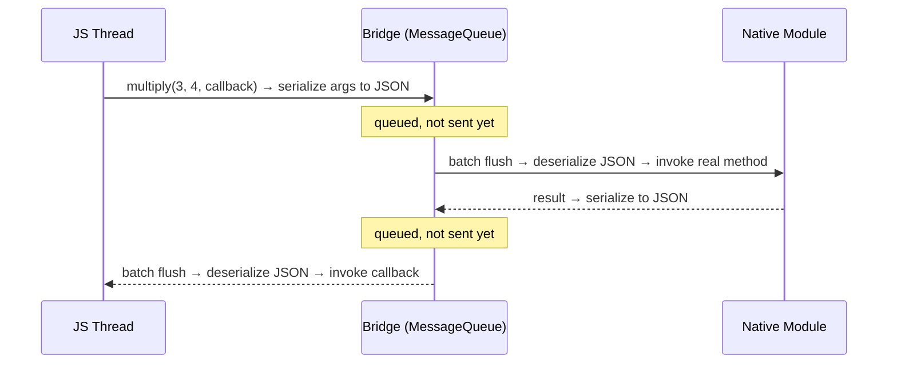
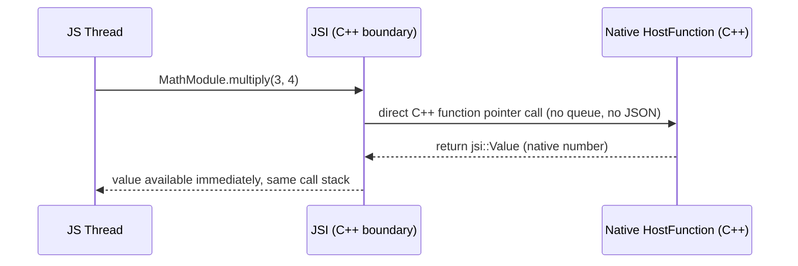
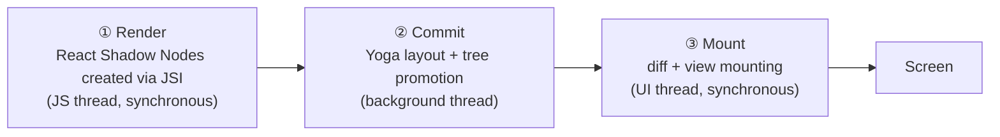
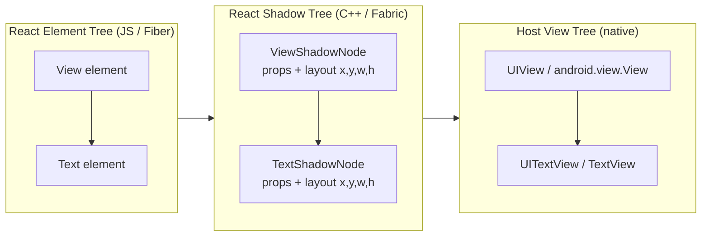

# React Native Senior Interview Q&A Handbook (Tier 2 — Old Architecture vs New Architecture)

> Tier 2 of the running, tiered senior React Native interview Q&A series — see [Tier 1](05-tire1-must-know-js-rn-native.md) for the JS engine/runtime/event-loop foundations this tier builds on. This tier covers the Bridge, JSI, TurboModules, Codegen, and Fabric — the full story of why and how React Native moved from the old architecture to the new one. Answers here are direct and self-contained (read question-first, the way an interviewer asks it), but cross-reference [Document 1 — Architecture & Internals](01-architecture-and-internals.md) for the exhaustive mechanics rather than repeating its full prose. Facts are drawn from Document 1, which was independently verified against the official React Native architecture docs (`reactnative.dev/architecture/*`).

## Table of Contents

1. [How To Use This Tier](#1-how-to-use-this-tier)
2. [Tier 2 — Old Architecture vs New Architecture](#2-tier-2--old-architecture-vs-new-architecture)
3. [Key Terms Glossary](#3-key-terms-glossary)
4. [Further Reading](#4-further-reading)

---

## 1. How To Use This Tier

Questions are kept in their original order and numbered 1–30 to match how they were given, so you can jump to a specific question or read top-to-bottom as a mini-exam. They cluster into five themes — the Bridge and its problems (Q1–6), JSI (Q7–14), TurboModules (Q15–17), Codegen (Q18–19), and Fabric/rendering (Q20–29) — closing with a synthesis question (Q30). Where a question overlaps with deeper mechanics already written up in [Document 1](01-architecture-and-internals.md), this tier gives a complete, direct answer and links to the relevant section for the full deep dive rather than repeating it.

---

## 2. Tier 2 — Old Architecture vs New Architecture

This tier traces the whole story from the Bridge to the New Architecture in five clusters: **the Bridge and its problems (Q1–6)**, **JSI (Q7–14)**, **TurboModules (Q15–17)**, **Codegen (Q18–19)**, and **Fabric & rendering (Q20–29)**, closing with a synthesis question tying it all together (Q30).

### 1. What exactly is the React Native Bridge?

The Bridge was the Old Architecture's **sole communication channel** between the JS thread and native code — a JS object (`MessageQueue.js`) paired with a native counterpart. It defined three characteristics that shape everything else in this tier:
- **Asynchronous only** — no call could return a value on the same stack frame; everything was callback- or Promise-based, even conceptually instant operations.
- **JSON-serializing** — every argument/return value was converted to a JSON-compatible string on the sending side and parsed back on the receiving side.
- **Batched** — messages were queued and flushed together (typically once per JS tick, or once per native frame for UI operations) rather than sent immediately.

See [Document 1 §4.2](01-architecture-and-internals.md#42-the-bridge--deep-dive) for the full deep dive, including the exact message shape (`[moduleID, methodID, args]`) and the overhead numbers for large payloads.

### 2. Why was the Bridge required in React Native?

Because JS and native code run in **separate runtimes with no shared memory** — historically, the JS engine (JavaScriptCore) had no built-in way to call into Java/Kotlin or Objective-C/Swift directly, or vice versa. Something had to own: translating a JS call into a real native call, carrying arguments across that boundary, and carrying native events (touches, callback results) back to JS. The Bridge was that translation/transport layer, invented because **no API like JSI existed yet** to let a JS engine hold a direct reference to a native/C++ object.

### 3. What happens when JavaScript calls a native module in the old architecture?

Step by step:

1. JS calls e.g. `MyModule.multiply(3, 4, callback)`.
2. The Bridge's JS side looks up `MyModule`'s moduleID and `multiply`'s methodID, serializes `[moduleID, methodID, args]` to JSON, and pushes it onto an **outgoing queue** — it is not sent immediately.
3. On the next batch flush (end of a JS tick), the serialized queue crosses to native.
4. Native deserializes the JSON, looks up the real native module instance (already eagerly instantiated at startup — see Q6), and invokes the real method.
5. The native result is serialized back to JSON, queued, and flushed back to JS on its own next batch.
6. JS deserializes the result and invokes your original `callback`.

Every call is asynchronous no matter how "instant" the native work itself was, because the transport can't do a same-stack synchronous return.

### 4. How does data travel from JavaScript → Bridge → Native?

Generalizing Q3's trace: **Serialize** (JS args/object → JSON string) → **Queue** (pushed onto an outgoing message queue, not sent per-call) → **Batch flush** (the whole queue crosses the boundary together, periodically) → **Deserialize** (native parses JSON back into native types) → **Dispatch** (native looks up the target module/method by ID and invokes it). The same path runs in reverse for UI mutation instructions (`createView`/`updateView`/`manageChildren`, …) issued by native-side layout, and for events flowing back to JS (touches, text input, scroll, native callback results).

### 5. Why was JSON serialization/deserialization a problem?

Because it's pure **CPU and memory overhead that scales with payload size and call frequency**, paid on *both* ends of *every* cross-boundary call — stringify on the sender, allocate-and-parse on the receiver. It becomes a real bottleneck for:
- **High-frequency calls** — e.g. scroll-position updates firing many times per second.
- **Large payloads** — base64-encoded images, big API responses, large list data. Document 1 cites a concrete figure: a camera library processing frames in real time deals with roughly 30 MB/frame — around **2 GB/second** at typical frame rates — a volume the Bridge architecturally could not move.
- **Loss of richer types** — functions, class instances, and binary buffers aren't JSON-representable, so there's no way to pass a native object "by reference"; everything must become a JSON primitive.

### 6. What were the biggest performance limitations of the old Bridge?

Consolidating [Document 1 §4.3](01-architecture-and-internals.md#43-problems-with-the-old-architecture--bridge):
- **No synchronous calls** → async-only APIs like `measure(callback)`, and visible layout "jumps."
- **Serialization tax** on every single cross-boundary call, regardless of size.
- **Batching latency** — updates could wait up to a full tick before being sent.
- **JS-thread contention** — all Bridge traffic (outgoing calls *and* incoming events) shares one queue tied to the JS event loop, so a busy JS thread delays native calls *and* touch/scroll event delivery alike.
- **Eager module initialization** — every registered Native Module was instantiated at startup whether used or not, hurting startup/TTI.
- **No type safety** — JSON has no static types; a mismatched argument was a runtime bug, not a build error.
- **Duplicated per-platform rendering logic** — the Shadow Tree/layout/view-flattening logic was implemented twice (once in Java, once in Obj-C).
- **No concurrent-rendering support** — the threading/bridge model couldn't support React 18's Suspense, transitions, or automatic batching.

---

### 7. What is JSI?

**JSI (JavaScript Interface)** is a lightweight, general-purpose C++ API for embedding a JS engine inside a C++ application and letting the two sides **hold direct references to each other**. It's the foundation of the entire New Architecture — both Fabric and TurboModules are built directly on top of it, and Codegen generates the contracts that flow through it. See [Document 1 §7](01-architecture-and-internals.md#7-jsi--javascript-interface) for the core primitives (`jsi::Runtime`, `jsi::HostObject`, `jsi::HostFunction`, …) and a working C++ example.

### 8. Why was JSI introduced?

To remove the Bridge's three structural problems — forced-async, forced-JSON, forced-batched — by giving JS and native a way to exchange **direct references** instead of only serialized messages. Per [Document 1 §5](01-architecture-and-internals.md#5-why-the-architecture-changed), Meta's three stated motivations were: (1) synchronous layout/effects, eliminating the visible "jump" frame; (2) support for React 18 concurrent rendering, which an async-bridge-bound renderer architecturally cannot provide; and (3) fast JS/native interop generally — letting libraries hand over large native objects (camera frames, buffers) by reference instead of copying them.

### 9. How is JSI different from the old Bridge?

| | Bridge | JSI |
|---|---|---|
| Transport | Message queue | Direct C++ references |
| Sync calls | Never possible | Possible, when appropriate |
| Serialization | Always (JSON) | None required |
| Batching | Yes — adds latency | No |
| What it *is* | A wire format + a queue | An interface/API any engine can implement |

The Bridge was a **format and a queue**; JSI is an **interface** — it doesn't define a wire format at all, because there's no wire: JS literally holds a pointer/reference to a C++ object. See [Document 1 §16](01-architecture-and-internals.md#16-old-vs-new-architecture--comparison-cheat-sheet) for the full side-by-side comparison table.

### 10. Does JSI itself replace the JavaScript engine?

No — a common misconception. **JSI is not a JS engine.** It's an abstraction layer/interface that a JS engine *implements*. Hermes, JavaScriptCore, and V8 all implement JSI, which is exactly why Fabric/TurboModule code written against JSI's C++ API works unchanged regardless of which engine is actually running underneath (see Tier 1 Q6–9 for the broader engine-vs-runtime distinction). Whichever engine executes your JS is a separate concern from JSI; JSI is the boundary between that engine and the native C++ world, not a replacement for it.

### 11. How does Hermes interact with JSI?

Hermes **implements** the JSI interface, exactly as JSC and V8 do — meaning native code written against JSI's API works whether Hermes, JSC, or V8 is underneath. Hermes isn't special-cased by JSI; the entire point of JSI as an abstraction is that Fabric/TurboModules don't need to know or care which engine implements it. In practice, Hermes and the New Architecture are closely co-developed and Hermes is the default engine today, but JSI itself doesn't require Hermes specifically — see [Document 1 §14](01-architecture-and-internals.md#14-hermes).

### 12. Can JavaScript directly call C++ through JSI?

Yes — that's the entire point. Native C++ code exposes either:
- A **`HostObject`** (a C++ class implementing `get`/`set`/`getPropertyNames`), which JS sees and uses as if it were a normal JS object with properties/methods, or
- A **`HostFunction`** (a plain C++ lambda), which JS can call directly as a function.

From JS's point of view, `global.MathModule.multiply(3, 4)` looks exactly like calling an ordinary JS function — but underneath, that call crosses directly into a C++ function pointer, with **no serialization and no queue**. See [Document 1 §7](01-architecture-and-internals.md#7-jsi--javascript-interface) for the full `MathModule` HostObject code example.

### 13. What happens internally when JS calls a JSI Host Function?

1. JS evaluates `MathModule.multiply(3, 4)` — `MathModule` is a JS-visible reference to a native `HostObject`.
2. The JS engine's JSI implementation resolves `multiply` to a C++ `HostFunction` — a function pointer, not a queued message.
3. The engine marshals the arguments directly into `jsi::Value`s (a native tagged-union representation, not a JSON string) and invokes the C++ lambda **on the same call stack**.
4. The C++ function computes the result and returns a `jsi::Value` directly.
5. The JS engine converts that back into a JS-visible value and resumes the calling JS code with the answer — all in one synchronous round trip.

Contrast directly with Q3's Bridge sequence: no queue, no batching, no JSON — and the result is available on the same call stack instead of arriving later via callback.

### 14. Does JSI automatically make every native operation synchronous?

No — a frequently-tested nuance. JSI **enables** synchronous calls where they make sense (e.g., measuring a view's current layout), but it doesn't forbid or eliminate asynchronous native work. A `HostFunction` can just as easily return a `Promise` or invoke a JS callback later, exactly like before — that's still the right choice for anything genuinely async (a network request, a file read). JSI's real contribution is **removing the Bridge's forced asynchrony and forced serialization**, giving native code the *option* of a synchronous, zero-copy call — a capability, not a blanket behavior change applied to every native call.

---

### 15. What is TurboModules?

TurboModules are the New Architecture's replacement for legacy Native Modules — the mechanism for exposing imperative native APIs (storage, sensors, native SDKs, etc.) to JS, built on top of JSI instead of the Bridge. Under the hood, each TurboModule is a JSI `HostObject`. See [Document 1 §8](01-architecture-and-internals.md#8-turbomodules).

### 16. Why were TurboModules introduced?

To fix two separate problems with legacy Native Modules: (1) they were **all eagerly instantiated at startup**, whether used or not, hurting startup time and memory; and (2) every call went through the Bridge, paying the full serialize/batch/deserialize cost even for simple calls. TurboModules fix both by being **lazily initialized** (only constructed the first time JS actually references them, e.g. via `TurboModuleRegistry.getEnforcing('MyModule')`) and by communicating through **JSI directly** instead of the Bridge.

### 17. How are TurboModules different from legacy Native Modules?

| | Legacy Native Modules | TurboModules |
|---|---|---|
| Initialization | Eager — all at startup | Lazy — first JS reference |
| Transport | Bridge (async, JSON) | JSI (direct, sync-capable) |
| Type safety | None — plain JSON | Codegen-generated, build-time checked |
| Underlying shape | Bridge-registered ID | JSI `HostObject` |

See [Document 1 §8 "Net benefits"](01-architecture-and-internals.md#8-turbomodules) for the complete list, including the scalability argument (shared C++ dispatch logic vs. per-call bridge queueing).

---

### 18. What is Codegen in React Native?

Codegen is a **build-time tool** that reads JS/TypeScript (or Flow) type declarations — a `Spec` interface for a TurboModule, or a `codegenNativeComponent<Props>()` declaration for a Fabric component — and generates the matching native-side scaffolding (C++ structs, Java/Kotlin interfaces, Obj-C++ protocols) that the real native implementation must conform to. See [Document 1 §10](01-architecture-and-internals.md#10-codegen) for both code-example shapes.

### 19. Why does the New Architecture need Codegen?

Because JSI's whole premise — direct references instead of a serialized format — removes the one place where the old Bridge's JSON implicitly enforced *some* loose structure. Without a contract, a mismatched native implementation (wrong argument type, missing method) would simply misbehave or crash at runtime, silently. Codegen makes the **JS/TS declaration the single source of truth**: if the native implementation doesn't match it, the **build fails** — turning a whole class of bugs into compile-time errors instead of runtime crashes discovered by a user. It's also what lets Fabric and TurboModules share a single generation pipeline instead of each inventing their own.

---

### 20. What is Fabric?

Fabric is React Native's current rendering system — the component that turns React's output into real native views. It replaces the old `UIManager` plus per-platform Shadow Tree implementations with a single shared C++ core, built on JSI, structured around three explicit phases:

See [Document 1 §9](01-architecture-and-internals.md#9-fabric) for the full pipeline breakdown.

### 21. Why was Fabric introduced?

The same motivations as JSI generally ([Document 1 §5](01-architecture-and-internals.md#5-why-the-architecture-changed)), applied specifically to rendering: enable **synchronous layout measurement** (fixing the classic "layout jump" bug caused by asynchronous `onLayout`), support **React 18 concurrent features** (Suspense, transitions, automatic batching) which require an interruptible, thread-safe renderer, and **unify** the previously duplicated Java/Obj-C Shadow Tree implementations into one shared, cheaper C++ core.

### 22. How does React rendering differ between the old architecture and Fabric?

The React-core reconciler (Fiber) itself is **identical** in both — same render/commit phases, same diffing algorithm (see [Document 1 §12](01-architecture-and-internals.md#12-react-reconciliation-and-fiber)). What differs is purely the **host config** underneath it: in the old architecture, React's commit phase called into `UIManager`, which serialized instructions across the Bridge to per-platform Shadow Tree implementations. Under Fabric, React's commit phase synchronously creates C++ **React Shadow Nodes** directly through JSI — no serialization — and Fabric then runs its own, separate Commit (Yoga layout) and Mount (diff + apply to real views) steps, possibly on a different thread.

A good interview differentiator: React's own render/commit pair (deciding *what* changed) is **not** the same pair as Fabric's render/commit/mount pipeline (deciding *when/where* it's laid out and painted) — React's commit *triggers* Fabric's render step, not the other way around.

### 23. What is the Shadow Tree?

The **React Shadow Tree** is an in-memory tree of **React Shadow Nodes** — one per host component (`View`, `Text`, …) — each holding that component's props (from JS) plus its computed layout metrics (x, y, width, height from Yoga). In Fabric it lives entirely in **C++** (cheap to allocate/clone) and is **immutable**: any update creates a new tree via structural sharing (only the path from the changed node to the root is cloned), which is exactly what makes it safe to read/write across threads without locks, and what enables concurrent rendering. See [Document 1 §9 "Shadow Tree"](01-architecture-and-internals.md#9-fabric).

### 24. What is the difference between the React Tree, Shadow Tree, and Native View hierarchy?

Three distinct trees, each with a different owner and purpose:

- **React Element Tree / Fiber Tree** — pure JS, owned by React's reconciler; describes *what you asked for* (components, props, hooks, state), with no concept of pixels at all.
- **React Shadow Tree** — C++, owned by Fabric; one Shadow Node per host component, holding props **plus computed layout**. This is *what the renderer has figured out should visually exist*.
- **Host View Tree** — real platform objects (`android.view.View` / `UIView`), owned by the OS; *what's actually drawn on screen right now*.

Data flows in one direction, one tree feeding the next: React's commit phase synchronously creates the Shadow Tree via JSI (Fabric's **Render** step); Fabric's **Commit** step runs Yoga layout on it; Fabric's **Mount** step diffs it against the previously-mounted Shadow Tree and applies the minimal mutations to the real Host View Tree.

### 25. What is the role of Yoga in React Native?

Yoga is Meta's C-based **Flexbox layout engine** — given a tree of nodes with Flexbox-style style props (`flexDirection`, `justifyContent`, `padding`, …), it computes the final x/y/width/height for every node. In the old architecture it ran on a separate Shadow thread, called from per-platform (Java/Obj-C) glue code; in Fabric it's integrated directly into the shared C++ core (no JNI hop needed just to run layout on Android), and runs as part of Fabric's **Commit** phase. Yoga doesn't render anything itself — it purely computes geometry; Fabric's Mount step is what turns that geometry into real drawn views.

### 26. How does a React component eventually become a native UIView/Android View?

Tracing one component through Fabric's three phases ([Document 1 §9](01-architecture-and-internals.md#9-fabric)):

1. **Render** — React reduces it to a React Host Component (e.g. `<View>`), and Fabric synchronously creates a corresponding `ViewShadowNode` in C++ via JSI — becoming part of the React Shadow Tree.
2. **Commit** — Yoga computes that node's x/y/width/height, and the finished Shadow Tree is marked as the next tree to mount.
3. **Mount** — Fabric diffs the new Shadow Tree against the previously mounted one, computing the minimal `createView`/`updateView`/`removeView` operations (in C++), then applies them to the real Host View Tree **synchronously on the UI thread** — the moment an actual `UIView`/`android.view.View` is created or updated on screen.

### 27. What actually happens when React Native renders `<View />`?

The same three-phase pipeline as Q26, concretely for `View`: React resolves `<View>` to a React Host Component → Fabric's **Render** step creates a `ViewShadowNode` (props like `style`, `onLayout`, plus a placeholder layout) → Fabric's **Commit** step runs Yoga on it to produce real x/y/width/height → Fabric's **Mount** step diffs it against the prior tree. This diffing step is also exactly where **View Flattening** can decide to skip creating a real native view at all, if the `<View>` is layout-only with no visible paint properties (merging it into its parent). If a real view is needed, the Mount step creates/updates the actual `UIView`/`android.view.View` on the UI thread.

### 28. What happens when React state changes in a React Native application?

End-to-end ([Document 1 §12](01-architecture-and-internals.md#12-react-reconciliation-and-fiber), [§9](01-architecture-and-internals.md#9-fabric), [§15](01-architecture-and-internals.md#15-end-to-end-walkthrough-button-tap)):

1. `setState`/a hook state setter is called on the JS thread.
2. React's Fiber reconciler runs its **render phase** — re-running the affected component functions and diffing the new element output against the current Fiber tree (interruptible; can be paused/resumed in concurrent mode).
3. React's **commit phase** applies the result via Fabric's host config — synchronously, via JSI, creating/updating the relevant **React Shadow Nodes** in C++. From Fabric's point of view, this is its own **Render** step.
4. Fabric's **Commit** step runs Yoga layout on the affected nodes and promotes the new Shadow Tree.
5. Fabric's **Mount** step diffs against the previously mounted tree and applies the minimal native view mutations, synchronously on the UI thread — the frame where the user actually sees the change.

Worth stating explicitly: not every "state change" goes through all of this — a native-owned state change (e.g. `ScrollView`'s scroll offset, see [Document 1 §13](01-architecture-and-internals.md#13-react-native-rendering-pipeline-and-threading-model)'s "C++ State update" scenario) can skip React's render phase entirely and commit directly in C++.

### 29. What parts of the rendering process happen on the JS side versus native side?

Mapped onto Fabric's own pipeline phases ([Document 1 §13](01-architecture-and-internals.md#13-react-native-rendering-pipeline-and-threading-model)):

- **JS side** — React's render phase (component functions, hooks, diffing) and, through JSI, the synchronous creation of React Shadow Nodes. This is Fabric's **Render** step, and it most commonly runs on the JS thread — though the *entire* pipeline can instead run synchronously on the UI thread for a high-priority event, since the underlying C++ data structures are thread-safe.
- **Native/C++ side** — Yoga layout calculation and Shadow Tree promotion (Fabric's **Commit** step, typically a background thread), and tree diffing plus view mounting (Fabric's **Mount** step, always synchronously on the UI thread).
- **Pure OS/native side** — actually drawing pixels to the screen, raw touch/input detection, and running already-handed-off native work (committed animations, `useNativeDriver: true`, Reanimated worklets). None of this needs JS at all once Fabric has handed over the mutations.

### 30. What problems does the New Architecture actually solve?

Tying the whole tier together ([Document 1 §5](01-architecture-and-internals.md#5-why-the-architecture-changed) + [§16](01-architecture-and-internals.md#16-old-vs-new-architecture--comparison-cheat-sheet)):

- Removes the Bridge's **forced asynchrony** → synchronous layout measurement becomes possible, fixing the classic "layout jump" bug.
- Removes the Bridge's **forced JSON serialization** → large payloads (images, camera frames, buffers) can be passed by reference instead of copied, at genuinely real-time-capable speed.
- Removes the Bridge's **batching latency** → updates aren't stuck waiting for the next tick's flush.
- Enables **React 18 concurrent rendering** (Suspense, transitions, automatic batching) — architecturally impossible on the old bridge-bound renderer.
- Replaces **eager** module initialization with **lazy** TurboModules → faster startup, lower memory, better scaling as an app's module count grows.
- Replaces **untyped JSON** contracts with **Codegen-enforced, build-time-checked** contracts → JS/native mismatches become build errors, not runtime crashes.
- Replaces **duplicated per-platform** (Java + Obj-C) rendering logic with a **single shared C++ core** → lower maintenance cost, lower memory footprint, and realistically portable to new host platforms (Windows, TV/console OSes).

**Important nuance worth repeating in an interview:** turning on the New Architecture doesn't automatically make a given app faster — these are *enablers*. An app has to actually use synchronous effects/concurrent features to benefit, and serialization may not have even been that app's actual bottleneck in the first place ([Document 1 §5](01-architecture-and-internals.md#5-why-the-architecture-changed)).

---

## 3. Key Terms Glossary

| Term | Meaning |
|---|---|
| **Bridge** | The Old Architecture's asynchronous, batched, JSON-serializing communication layer between the JS thread and native. |
| **JSI** | A C++ API letting JS hold direct references to native (C++) objects/functions and call them synchronously or asynchronously, with no serialization. |
| **HostObject** | A C++ class exposing `get`/`set`/`getPropertyNames`, injected into the JS runtime via JSI so JS can use it like a normal object. |
| **HostFunction** | A plain C++ function/lambda directly callable from JS via JSI, with no queue or serialization. |
| **TurboModule** | A JSI-backed, lazily-loaded, Codegen-typed native module — the New Architecture's replacement for legacy Native Modules. |
| **Codegen** | A build-time tool that turns JS/TS/Flow type specs into native interfaces for TurboModules and Fabric components, making mismatches build errors. |
| **Fabric** | The New Architecture's renderer: a shared C++ core implementing Render → Commit → Mount. |
| **Shadow Tree / Shadow Node** | The in-memory C++ tree (and its nodes) holding each host component's props plus computed layout; immutable, with structural sharing. |
| **Yoga** | Meta's C-based Flexbox layout engine, computing x/y/width/height for every Shadow Node. |
| **View Flattening** | A C++ diffing-stage optimization that merges layout-only nodes into their parent, shrinking the real native view hierarchy. |
| **Reconciliation** | React's algorithm for diffing a previous element tree against a new one to compute the minimal set of changes. |
| **Fiber** | React's reconciliation engine/data structure (since React 16), enabling interruptible, prioritized rendering. |

*(See [Tier 1's glossary](05-tire1-must-know-js-rn-native.md#3-key-terms-glossary) for JS engine/runtime, macrotask/microtask, and `InteractionManager` definitions.)*

---

## 4. Further Reading

- React Native Architecture Overview — https://reactnative.dev/architecture/overview
- About the New Architecture (motivations) — https://reactnative.dev/architecture/landing-page
- Fabric — https://reactnative.dev/architecture/fabric-renderer
- Render, Commit, and Mount — https://reactnative.dev/architecture/render-pipeline
- Threading Model — https://reactnative.dev/architecture/threading-model
- Cross-Platform Implementation — https://reactnative.dev/architecture/xplat-implementation
- Architecture Glossary — https://reactnative.dev/architecture/glossary
- Related: [Document 1 — React Native Architecture & Internals](01-architecture-and-internals.md) (the full deep dive this tier draws from: Bridge, JSI, TurboModules, Fabric, Codegen, Fiber reconciliation, threading model, Hermes)
- Related: [Tier 1 — Must Know: JS ↔ React Native ↔ Native](05-tire1-must-know-js-rn-native.md) (JS engine/runtime, event loop, threading foundations)
