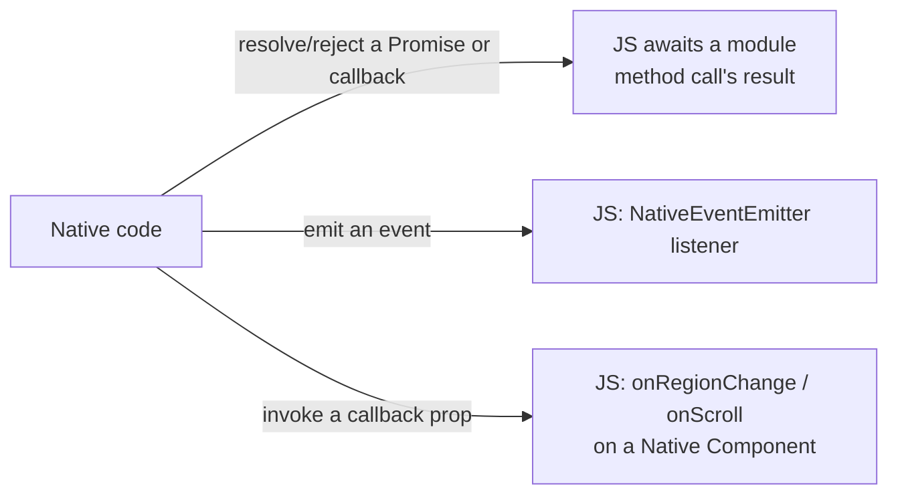
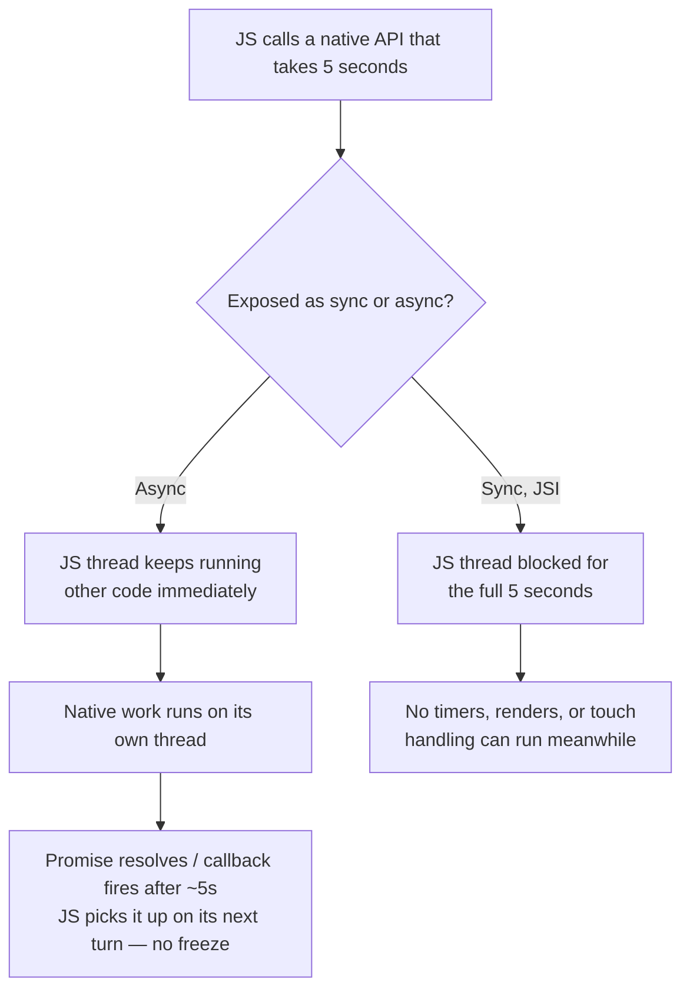

# React Native Senior Interview Q&A Handbook (Tier 3 — Native ↔ JS Communication)

> Tier 3 of the running, tiered senior React Native interview Q&A series — see [Tier 1](05-tire1-must-know-js-rn-native.md) for JS engine/runtime/threading foundations and [Tier 2](06-tire2-old-vs-new-architecture.md) for the Bridge/JSI/TurboModule/Fabric architecture story. This tier focuses on the practical side of native integration: how JS and native code actually call each other, what thread that happens on, and how to design native modules that don't wreck performance. Answers cross-reference [Document 1 — Architecture & Internals](01-architecture-and-internals.md) and [Document 3 — Native Integration](03-native-integration.md) for exhaustive mechanics rather than repeating their full prose; both were independently verified against the official React Native docs.

## Table of Contents

1. [How To Use This Tier](#1-how-to-use-this-tier)
2. [Tier 3 — Native ↔ JS Communication](#2-tier-3--native--js-communication)
3. [Key Terms Glossary](#3-key-terms-glossary)
4. [Further Reading](#4-further-reading)

---

## 1. How To Use This Tier

Questions are kept in their original order and numbered 1–20 to match how they were given. They cluster into four themes — core mechanics & vocabulary (Q1–6), platform-specific exposure (Q7–10), threading & blocking implications (Q11–17), and designing for performance at scale (Q18–20). Where a question overlaps with deeper mechanics already written up in [Document 1](01-architecture-and-internals.md) or [Document 3](03-native-integration.md), this tier gives a complete, direct answer and links to the relevant section for the full deep dive rather than repeating it.

---

## 2. Tier 3 — Native ↔ JS Communication

This tier covers four clusters: the core mechanics and vocabulary of JS↔Native communication (**Q1–6**), how that communication is actually exposed per platform (**Q7–10**), the threading and blocking implications of native calls (**Q11–17**), and designing for performance at scale (**Q18–20**).

### 1. How can JavaScript call native iOS/Android code in React Native?

Through a **Native Module** — JS never calls Swift/Kotlin directly; it calls a JS-visible object whose methods are backed by native code. Two eras: legacy `NativeModules`, where the call is serialized to JSON, queued, and sent across the asynchronous Bridge to a native method on the other side (see [Tier 2 Q3](06-tire2-old-vs-new-architecture.md#3-what-happens-when-javascript-calls-a-native-module-in-the-old-architecture)); or a **TurboModule**, where JS holds a direct JSI reference to a C++ `HostObject`/`HostFunction` wrapping the native implementation, callable synchronously or asynchronously with no serialization (see [Document 1 §7](01-architecture-and-internals.md#7-jsi--javascript-interface)). Either way, the JS-visible shape is the same: an imported object with methods (`DeviceInfo.getBatteryLevel()`), typed and generated by Codegen in the New Architecture — see [Document 3 §4](03-native-integration.md#4-native-modules--exposing-functionality).

### 2. How can native iOS/Android code call JavaScript?

Native code reaches back into JS in three main ways:

- **Resolving a Promise or invoking a callback** that JS passed into a native-module method call — the normal "answering a request" path.
- **Emitting an event JS didn't explicitly ask for** — via `NativeEventEmitter` on the JS side paired with a native emitter, for things like a Bluetooth device appearing or a sensor reading (see [Document 3 §4 "Native → JS events"](03-native-integration.md#4-native-modules--exposing-functionality)).
- **Invoking a callback prop on a Native Component** — a native view calls a JS function passed as a prop (e.g. `onRegionChange`), conceptually like a DOM `onClick`, just native-sourced (see [Document 3 §5](03-native-integration.md#5-native-components--exposing-ui)).

Under JSI, native code can also hold a direct reference to a JS function/value and invoke it directly — no serialization needed in either direction.

### 3. What is a Native Module?

A **Native Module** is how JS calls into native code that has **no UI** — a service, not a view: reading battery level, Keychain/Keystore access, a payments SDK, a CPU-heavy native routine. See [Document 3 §4](03-native-integration.md#4-native-modules--exposing-functionality) for the full shape (legacy `NativeModules` vs. TurboModule, the `Spec` interface, sync-vs-async calls, native→JS events).

### 4. What is a TurboModule?

TurboModules are the New Architecture's Native Modules: JSI-backed (a C++ `HostObject` JS holds a direct reference to), lazily instantiated on first use, and typed by a `Spec` interface that Codegen turns into native-side interfaces. See [Tier 2 Q15–17](06-tire2-old-vs-new-architecture.md#15-what-is-turbomodules) and [Document 1 §8](01-architecture-and-internals.md#8-turbomodules) for the full mechanics.

### 5. What is a Native Component?

A **Native Component** is how a native **view** becomes usable as a React element (`<MyNativeView />`) — used for maps, video players, camera previews, charting, or wrapping any native UI SDK RN doesn't provide out of the box. Legacy: `ViewManager`/`RCTViewManager` + `requireNativeComponent`. New Architecture: a **Fabric Component**, declared with `codegenNativeComponent<Props>()`, backed by a C++ Shadow Node. Data flows the same one-directional way as any React component: props JS → native, events native → JS via callback props. See [Document 3 §5](03-native-integration.md#5-native-components--exposing-ui).

### 6. What is a Native Event?

A **Native Event** is data pushed from native code to JS that JS didn't synchronously request as a return value — as opposed to a method call's return value, which answers a specific request. Two flavors:
- From a **Native Module**: an event emitted via `NativeEventEmitter` (e.g. "Bluetooth device discovered," "payment SDK callback fired") — see [Document 3 §4](03-native-integration.md#4-native-modules--exposing-functionality).
- From a **Native Component**: an event delivered through a callback prop (e.g. `onRegionChange`, `onScroll`) — see [Document 3 §5](03-native-integration.md#5-native-components--exposing-ui).

Both are fundamentally "native code calling back into JS" (Q2), just through different plumbing depending on whether the source is a module or a view.

---

### 7. How would you expose a Swift function to React Native?

At a conceptual level (the exact native syntax is stable boilerplate, not the interesting part for an interview — see [Document 3 §4](03-native-integration.md#4-native-modules--exposing-functionality)):

1. Declare the method's shape in a `Spec extends TurboModule` TypeScript interface — the single source of truth.
2. Codegen generates the Objective-C++ protocol the native implementation must conform to.
3. Write the implementation in Swift, conforming to that generated protocol.
4. Because RN's export macros (`RCT_EXPORT_MODULE()`, `RCT_EXPORT_METHOD()`) are Objective-C, Swift implementations need a small **Objective-C bridging header** to expose the Swift class to the Objective-C-based registration machinery.
5. Return values that are naturally async (most native work) resolve/reject a `Promise`; simple, fast, synchronous values (e.g. `isTablet() -> Bool`) can be returned directly via JSI.

### 8. How would you expose a Kotlin function to React Native?

Same conceptual shape as Q7, Android side:

1. Declare the method's shape in the `Spec` TypeScript interface.
2. Codegen generates the Kotlin/Java interface (`NativeXSpec`) the implementation must conform to.
3. Write a Kotlin class implementing that generated interface.
4. Register the module through a `ReactPackage` so the app's native side knows to load it (lazily, under the New Architecture).
5. As with Swift, prefer `Promise`-based (async) returns for anything beyond a trivial computation; JSI supports synchronous returns, but they block the JS thread until they return (Q13).

### 9. How does React Native communicate with Objective-C/Swift?

Through the same JS↔native machinery as any platform (Bridge historically, JSI/TurboModules today), with the iOS-specific detail being the **export mechanism**: native code must explicitly expose itself using RN's Objective-C macros (`RCT_EXPORT_MODULE()` for the module, `RCT_EXPORT_METHOD()` per legacy method, or conforming to a Codegen-generated protocol for TurboModules) so the native runtime can discover and register it. Swift code participates in this via an Objective-C bridging header, since the export macros themselves are Objective-C.

### 10. How does React Native communicate with Java/Kotlin?

Same underlying machinery, Android-specific mechanism: a native class (Java or Kotlin) implements the relevant interface — legacy: extends `ReactContextBaseJavaModule` with `@ReactMethod`-annotated methods; New Architecture: implements the Codegen-generated `Spec` interface — and is registered via a `ReactPackage`, which tells the app's native side to construct it (eagerly, legacy, or lazily, TurboModule) and expose it to JS.

---

### 11. What happens if a native module performs a long-running operation?

It depends entirely on whether the method is exposed as **synchronous or asynchronous**:
- If **asynchronous** (a `Promise` or callback — the right choice for anything non-trivial), the actual work typically runs on its own native thread/dispatch queue, the JS thread is free to keep running other JS in the meantime, and the Promise resolves/callback fires whenever the native work finishes — the JS thread was never blocked.
- If it were (incorrectly) exposed as a **synchronous** JSI call, the JS thread would sit blocked for the entire duration, unable to run any other JS — timers, renders, touch handling, everything — until the native call returns (see Q13, Q17).

The correct design for anything long-running is always the async path.

### 12. On which thread does a native module execute?

Not the JS thread and not (necessarily) the UI thread — native modules are typically dispatched to their **own native thread(s)**, separate from both (see [Document 1 §13](01-architecture-and-internals.md#13-react-native-rendering-pipeline-and-threading-model)). This is deliberate: it keeps slow native/I/O work from blocking the UI thread's rendering responsibilities. The one documented exception: a module can explicitly opt to run **on the Main/UI thread instead**, when its job specifically requires touching UI APIs directly — most platform UI frameworks only allow UI mutations from the main thread.

### 13. Can a Native Module block the JS thread?

Yes, under a specific condition: if the method is exposed as a **synchronous** JSI call (possible under the New Architecture, impossible under the legacy Bridge, which was always async — see [Document 3 §4 "Sync vs async calls"](03-native-integration.md#4-native-modules--exposing-functionality)), the JS thread is blocked for the entire duration of that call, because a synchronous call must return on the same call stack. This is exactly why synchronous native methods should be reserved for fast, cheap operations (e.g. `isTablet()`) — never for anything that could take meaningfully long.

### 14. Can a native module update the UI directly?

Not directly, in the general case — only the UI/Main thread is allowed to touch native views on most platforms, and a typical native module runs on its own background thread (Q12), not the UI thread. A module that genuinely needs to affect UI has two correct options: (a) explicitly dispatch that specific work onto the Main thread from within its native implementation (`DispatchQueue.main.async` on iOS, `runOnUiThread` on Android) — the "opt into the Main thread" case from Q12 — or (b) go through the normal Fabric/React rendering path (change some state/props that a Native *Component* reads) rather than mutating a view imperatively from arbitrary module code.

### 15. How would you move CPU-heavy work away from the JS thread?

Several complementary tools, depending on where the work actually needs to live:
- **Push it into a Native Module**, implemented so the real computation runs on a native background thread/dispatch queue, with the result returned asynchronously (`Promise`) — the only option when the work is genuinely CPU-heavy native-side work (image processing, compression, crypto). See Q18 for the design shape.
- **Defer non-urgent JS-side work** with `InteractionManager.runAfterInteractions()` until animations/interactions finish, so it doesn't compete with urgent work for the JS thread (see [Tier 1 Q16](05-tire1-must-know-js-rn-native.md#16-what-happens-when-the-js-thread-is-blocked-for-5-seconds), [Document 2 §13](02-performance.md#13-native-thread-bottlenecks-and-expensive-components)).
- **Move truly per-frame, latency-critical JS work to the UI thread** via JSI worklets (`react-native-reanimated`), bypassing the JS thread entirely for that specific work (see [Document 1 §7](01-architecture-and-internals.md#7-jsi--javascript-interface)).
- **Chunk unavoidable JS-side computation** across multiple event-loop turns instead of one giant synchronous block, so the JS thread stays responsive in between chunks.

### 16. What is a JS thread vs Native Modules thread vs UI thread?

Three of the (several) threads in a React Native app, each with a distinct job:
- **JS thread** — the single-threaded JS VM (Hermes/JSC); runs all application logic, React reconciliation, event-handler code. The only thread that executes your JavaScript.
- **Native Module thread(s)** — background native threads that native module methods typically run on, so slow/blocking native work doesn't stall the UI thread; some modules explicitly opt to run on the Main thread instead when they must touch UI APIs directly (Q12, Q14).
- **UI / Main thread** — the OS-owned thread that's the *only* one allowed to touch native views, handle raw gesture/input recognition, and actually paint frames.

These communicate through JSI (or the legacy Bridge) rather than shared memory/locks. Full breakdown, plus the Shadow/Layout thread, in [Tier 1 Q20](05-tire1-must-know-js-rn-native.md#20-does-react-native-have-a-single-thread-or-multiple-threads) and [Document 1 §13](01-architecture-and-internals.md#13-react-native-rendering-pipeline-and-threading-model).

### 17. What happens when JS calls a native API that takes 5 seconds?

Again, this hinges on sync vs. async (Q11, Q13):

- **Asynchronous call (correct design)** — JS issues the call and immediately continues running other code; the native side does its 5 seconds of work on its own thread; the Promise resolves/callback fires once done, and JS picks it up on its next turn through the event loop.
- **Synchronous call (a design mistake for anything this long)** — the JS thread is blocked for the full 5 seconds: no timers fire, no touch handling, no re-renders — same mechanism as [Tier 1 Q16](05-tire1-must-know-js-rn-native.md#16-what-happens-when-the-js-thread-is-blocked-for-5-seconds), just caused by a blocking native call instead of a heavy JS loop.

This is precisely why RN's own long-running native APIs (network requests, file I/O, SDK calls) are always exposed asynchronously.

---

### 18. How would you design a native module for a CPU-intensive operation?

A concrete checklist:

1. **Expose it as asynchronous** — a `Promise`-returning method, never a synchronous JSI call, so the JS thread is never blocked waiting on it.
2. **Dispatch the actual work to a native background thread/queue** inside the implementation (`DispatchQueue.global(qos:)` on iOS, a background `Executor`/coroutine on Android) — don't run heavy computation on whatever thread the call happened to arrive on.
3. **Resolve/reject the Promise** once the background work completes, delivering the result back to JS.
4. **Avoid chatty back-and-forth** — if the operation naturally decomposes into many small native calls, batch them into one call with structured input instead, since each crossing has its own (small but nonzero) cost (Q20).
5. **For very large inputs/outputs**, pass data by reference via JSI (a `HostObject`/buffer) rather than copying it as a serialized/base64 string (Q19).

### 19. How would you send large amounts of data between JS and native efficiently?

The legacy Bridge had no good answer here — everything had to become a JSON-compatible string, so large payloads (images, buffers, big datasets) paid a real serialize/copy/deserialize cost proportional to size, famously illustrated by camera libraries moving ~30MB/frame (~2GB/sec) that the Bridge couldn't support at all (see [Document 3 §4](03-native-integration.md#4-native-modules--exposing-functionality), [Tier 2 Q5](06-tire2-old-vs-new-architecture.md#5-why-was-json-serializationdeserialization-a-problem)). Under the New Architecture, the answer is **JSI**: expose the data as a `HostObject` (or a direct typed-buffer reference) that JS holds a pointer to, instead of copying it into a JSON string — exactly how `react-native-vision-camera` hands off video frames and how `react-native-mmkv` does synchronous key-value storage, both bypassing serialization entirely.

### 20. Why can excessive JS ↔ Native communication hurt performance?

Two overlapping reasons:
- **Per-call overhead, however small, is never zero** — even a JSI call has to cross a real boundary (argument marshaling into `jsi::Value`s, a context switch if the work genuinely hops threads); calling native 1,000 times for tiny pieces of work costs more, in aggregate, than one call carrying a batch of the same work. Under the legacy Bridge this was far worse: every single call paid full JSON serialization, queuing, and (worst case) up-to-a-full-tick batching latency, regardless of how small the payload was (see [Tier 2 Q5–6](06-tire2-old-vs-new-architecture.md#5-why-was-json-serializationdeserialization-a-problem)).
- **High-frequency native→JS traffic can also flood the JS thread** — e.g. an unthrottled native event (a continuous sensor stream, scroll position) dispatching a JS callback on every tick competes with everything else JS needs to do, the same root cause as "unthrottled high-frequency state updates" in [Document 2 §13](02-performance.md#13-native-thread-bottlenecks-and-expensive-components).

The fix in both directions is the same principle: **batch, throttle, or move the hot path off the JS thread entirely** (native-side background work for heavy computation, JSI worklets for per-frame UI work) rather than crossing the JS/native boundary once per tiny unit of work.

---

## 3. Key Terms Glossary

| Term | Meaning |
|---|---|
| **Native Event** | Data pushed from native code to JS that JS didn't request as a direct return value — via `NativeEventEmitter` (modules) or a callback prop (components). |
| **`NativeEventEmitter`** | The JS-side API for subscribing to events a Native Module pushes, as opposed to a method's return value. |
| **`ReactPackage`** | The Android registration mechanism that tells the app's native side which native modules/components exist and how to construct them. |
| **Objective-C Bridging Header** | A small Objective-C file that exposes a Swift class to RN's Objective-C-based module export macros, since Swift can't use those macros directly. |
| **Native Module thread** | A background native thread (distinct from the JS thread and UI thread) that native module methods typically execute on. |

*(See [Tier 1's glossary](05-tire1-must-know-js-rn-native.md#3-key-terms-glossary) for JS engine/runtime/threading terms, and [Tier 2's glossary](06-tire2-old-vs-new-architecture.md#3-key-terms-glossary) for Bridge/JSI/TurboModule/Fabric terms.)*

---

## 4. Further Reading

- About the New Architecture (JSI, VisionCamera motivations) — https://reactnative.dev/architecture/landing-page
- Threading Model — https://reactnative.dev/architecture/threading-model
- Related: [Document 1 — React Native Architecture & Internals](01-architecture-and-internals.md) (JSI, TurboModules, threading model in depth)
- Related: [Document 3 — Native Integration](03-native-integration.md) (Native Modules vs Native Components, platform-specific exposure, Codegen)
- Related: [Document 2 — React Native Performance](02-performance.md) (native thread bottlenecks, unnecessary state updates)
- Related: [Tier 1](05-tire1-must-know-js-rn-native.md) (JS thread blocking, threading model) and [Tier 2](06-tire2-old-vs-new-architecture.md) (Bridge/JSI/TurboModule mechanics)
