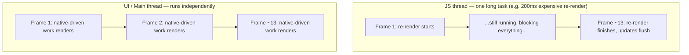

# React Native Senior Interview Q&A Handbook (Tier 4 — React Native Performance Internals)

> Tier 4 of the running, tiered senior React Native interview Q&A series — see [Tier 1](05-tire1-must-know-js-rn-native.md) for JS engine/runtime/threading foundations, [Tier 2](06-tire2-old-vs-new-architecture.md) for the Bridge/JSI/TurboModule/Fabric architecture story, and [Tier 3](07-tire3-native-js-communication.md) for Native↔JS communication mechanics. This tier is almost entirely sourced from [Document 2 — React Native Performance](02-performance.md), which was independently verified against the official React Native and React docs — answers here give a complete, direct response and link out to Document 2's deep dives (with code examples, tuning tables, and a full case study) rather than repeating their prose.

## Table of Contents

1. [How To Use This Tier](#1-how-to-use-this-tier)
2. [Tier 4 — React Native Performance Internals](#2-tier-4--react-native-performance-internals)
3. [Key Terms Glossary](#3-key-terms-glossary)
4. [Further Reading](#4-further-reading)

---

## 1. How To Use This Tier

Questions are kept in their original order and numbered 1–20 to match how they were given. They cluster into four themes — frame budget & JS/UI thread fundamentals (Q1–7), re-renders & memoization (Q8–10), memory management (Q11–17), and lists & large-scale rendering (Q18–20). Where a question overlaps with deeper mechanics already written up in [Document 2](02-performance.md) or [Document 1](01-architecture-and-internals.md), this tier gives a complete, direct answer and links to the relevant section for the full deep dive rather than repeating it.

---

## 2. Tier 4 — React Native Performance Internals

This tier covers four clusters: frame budget and JS/UI thread fundamentals (**Q1–7**), re-renders and memoization (**Q8–10**), memory management (**Q11–17**), and lists and large-scale rendering (**Q18–20**).

### 1. Why does blocking the JS thread make a React Native application feel slow?

The JS thread is where React's render logic, business logic, and touch/gesture event processing all happen. When it's blocked (a long synchronous computation, an expensive re-render), nothing on that thread can run until it frees up: timers don't fire, touch responders (`TouchableOpacity`, etc.) can't process raw touch events, and any JS-driven state update or animation visibly freezes — see [Document 2 §4](02-performance.md#4-frame-budget-fundamentals-js-thread-vs-ui-thread). The app doesn't crash, it just stops *responding*, which reads to a user as "slow" or "frozen."



Native-only work (scrolling, native-driven animations) keeps running underneath on the UI thread the whole time, which is why a "frozen" app can sometimes still visually scroll (Q5) even though it can't react to anything.

### 2. What causes dropped frames in React Native?

A frame is "dropped" whenever either thread fails to produce its half of the next frame within the ~16.67ms budget (Q3):
- **JS-thread causes**: an expensive re-render, a large synchronous computation/loop, heavy inline data transforms, `console.log` spam in production, or any other long synchronous JS task — see [Document 2 §4](02-performance.md#4-frame-budget-fundamentals-js-thread-vs-ui-thread).
- **UI/native-thread causes**: too many views to traverse/measure/draw, overdraw from stacked transparent views, animating layout properties (`width`/`height`/`top`/`left`) forcing a Yoga recalculation every frame — see [Document 2 §13](02-performance.md#13-native-thread-bottlenecks-and-expensive-components).

A single long JS task can drop many frames at once — e.g., a 200ms re-render is roughly 12 dropped frames in one go, not one (Q4).

### 3. What is the 16.67 ms frame budget?

Devices target **60 frames per second**, which arithmetically gives **1000ms ÷ 60 ≈ 16.67ms** per frame to do all the work needed to produce it. In React Native, this budget effectively applies **twice over** — once for the JS thread (React render + business logic) and once for the UI/main thread (native layout/draw) — because RN's Perf Monitor tracks them as two independent frame rates (Q6). Missing the budget on either thread for a given frame means that frame is dropped or delayed; see [Document 2 §4](02-performance.md#4-frame-budget-fundamentals-js-thread-vs-ui-thread).

### 4. What happens when JavaScript takes longer than one frame to execute?

The excess time doesn't "spill over" gracefully — the JS thread simply stays busy with that one task for as long as it takes, and every frame that would have needed JS work during that window is skipped or delayed. Concretely: a state update that triggers a 200ms re-render of an expensive subtree costs roughly **12 consecutive dropped frames** (200ms ÷ 16.67ms ≈ 12) — any JS-driven animation visibly freezes for that whole stretch, and gesture responders can't process touches because the JS thread can't get to the raw touch events in time (see [Document 2 §4](02-performance.md#4-frame-budget-fundamentals-js-thread-vs-ui-thread)). Once the task finishes, batched updates flush together and the UI "catches up" in one jump rather than smoothly.

### 5. Can a React Native application have 60 FPS while the JS thread is blocked?

Yes — for work that lives entirely on the **UI/native thread**. Native-driven animations (`Animated` with `useNativeDriver: true`, or `react-native-reanimated` worklets running via JSI directly on the UI thread), native-stack navigation transitions (`@react-navigation/native-stack`), and native `ScrollView` scrolling all continue at the native frame rate independent of the JS thread's state — see [Document 2 §4](02-performance.md#4-frame-budget-fundamentals-js-thread-vs-ui-thread), which explicitly notes "you can keep scrolling a ScrollView even while the JS thread is locked up." What *can't* hit 60fps while JS is blocked is anything that requires a JS round-trip per frame — JS-driven animations, state-update-triggered re-renders, touch-handler-driven visual feedback.

### 6. What is the difference between JS FPS and UI FPS?

RN's Dev Menu "Perf Monitor" reports **two separate frame rates**, because two separate threads each have their own 16.67ms budget (Q3):
- **JS FPS** — how fast the JS thread is completing its work per frame: React rendering, business logic, event-handler code.
- **UI FPS** — how fast the native/main thread is completing its work per frame: view layout, drawing, gesture recognition.

They can diverge in either direction — a busy JS thread (expensive re-renders) drops JS FPS while UI FPS can stay smooth (native-driven work, Q5); conversely, a native-rendering-heavy screen (huge view count, overdraw) can drop UI FPS while JS FPS stays fine. See [Document 2 §4](02-performance.md#4-frame-budget-fundamentals-js-thread-vs-ui-thread).

### 7. How would you identify whether a performance issue is on the JS thread or UI thread?

Follow the start of the systematic debugging flow from [Document 2 §5](02-performance.md#5-the-systematic-debugging-flow):

1. **Profile in a release build** (dev mode is always slower and misleading) using the Perf Monitor (JS vs UI fps side by side), the React DevTools Profiler, Hermes's sampling profiler, or native tools (Android Studio Profiler / Xcode Instruments).
2. **Watch which fps counter drops during the janky interaction.** If **JS FPS** tanks while UI FPS stays fine → the problem is in your JS/React code (expensive renders, bad data transforms, unmemoized computation — go to re-render/memoization checks, [§6](02-performance.md#6-preventing-unnecessary-rerenders--reactmemo--usememo--usecallback)). If **UI FPS** tanks while JS FPS stays fine → the problem is native-side rendering (too many views, overdraw, layout-property animation — go to [§13](02-performance.md#13-native-thread-bottlenecks-and-expensive-components)).
3. If **both** drop together, suspect something crossing the boundary repeatedly (chatty native calls, see [Tier 3 Q20](07-tire3-native-js-communication.md#20-why-can-excessive-js--native-communication-hurt-performance)) or a single root cause with knock-on effects on both — e.g. a layout-property animation triggers both a JS-driven callback per frame *and* a native Yoga recalculation.

---

### 8. What causes unnecessary React Native re-renders?

From [Document 2 §6](02-performance.md#6-preventing-unnecessary-rerenders--reactmemo--usememo--usecallback) and its "unnecessary state updates" notes:
- **A parent re-rendering** — by default, every child re-renders whenever its parent does, regardless of whether its own props meaningfully changed.
- **New object/array/function identity passed as props every render** — inline literals and unmemoized callbacks are a new reference every time, which defeats `memo`'s shallow (`Object.is`) comparison even when the *content* is identical.
- **Broad context/state subscriptions** — a context whose value is a new object every provider render re-renders *every* consumer regardless of `memo`; a global store subscribed to without selectors re-renders on unrelated state changes.
- **Derived data stored in state** instead of computed with `useMemo` during render — creates an extra render cycle every time it's recomputed-then-`setState`.
- **Unthrottled high-frequency updates** (e.g., `setState` on every `onScroll` pixel) triggering far more renders than the UI actually needs.

### 9. How do memo, useMemo, and useCallback affect React Native performance?

All three exist to avoid redoing work that would produce the same result, but they cache different things (see [Document 2 §6](02-performance.md#6-preventing-unnecessary-rerenders--reactmemo--usememo--usecallback) for full detail and code examples):
- **`React.memo`** — skips re-rendering a component entirely if every prop is shallowly equal to last time; valuable only when a component re-renders often with unchanged props *and* its render is genuinely non-trivial.
- **`useMemo`** — caches a computed **value** between renders, recomputing only when a dependency changes; used either to skip a slow calculation or to keep a value referentially stable for a `memo`'d child or an effect dependency.
- **`useCallback`** — caches a **function identity** between renders; functionally `useMemo(() => fn, deps)` in disguise — its entire purpose is unlocking `memo` on a child that receives a callback prop (an inline function is a new reference every render, defeating memoization otherwise).

None of them make anything faster by default — they trade a small bookkeeping cost (dependency comparison, cache storage) for *skipping* a potentially larger cost, and are only a net win when that larger cost is real and measured (Q10).

### 10. When can useMemo actually make performance worse?

Several concrete cases, per [Document 2 §6](02-performance.md#6-preventing-unnecessary-rerenders--reactmemo--usememo--usecallback)'s explicit guidance ("don't memoize reflexively"):
- **The computation is cheap.** `useMemo` itself has overhead — a dependency-array comparison and a cache slot — every render. If the wrapped calculation is cheaper than that bookkeeping (most simple RN state transforms are, per the doc's own guidance), you've added overhead and code complexity for zero benefit.
- **The dependencies change on every render anyway.** Then the cache never hits — you pay the comparison cost *and* still recompute every time, which is strictly worse than not wrapping it at all.
- **It's memoizing a value for a child that isn't actually `memo`-wrapped**, or whose other props are still unstable — the referential stability bought by `useMemo` accomplishes nothing if nothing downstream benefits from it.
- **A custom deep-equality comparator** (for `memo`, or a manually-compared dependency) that's slower than just re-rendering/recomputing — called out explicitly as a real risk, not just a theoretical one.
- **Relying on it for correctness, not just performance** — React may discard a memoized value for its own internal reasons (e.g., a component suspending), so code that *needs* a side effect to only run once should not rely on `useMemo` to guarantee that.

---

### 11. How would you diagnose a React Native application consuming excessive memory?

Mirrors the memory-investigation steps from [Document 2's crash case study, §10](02-performance.md#10-case-study-app-crashes-while-scrolling-product-images):

1. **Confirm it's actually a memory problem**, not a JS exception — check device logs (Android `OutOfMemoryError`/low-memory-killer events, iOS Xcode memory warnings/jetsam crash logs).
2. **Profile while reproducing** — Android Studio Profiler or Xcode Instruments' "Allocations" tool, watching the memory graph while exercising the suspected flow (e.g., scrolling a list, navigating back and forth between two screens repeatedly).
3. **Look for a climbing-and-never-returning curve** — a healthy app's memory should rise and fall as screens mount/unmount; a curve that only climbs, screen after screen, is the signature of a leak (Q12) rather than just "this screen uses a lot of memory."
4. **Narrow down the source** by isolating flows (does memory climb on every navigation, every list scroll, every socket message?) and cross-referencing against the common leak sources in [§8](02-performance.md#8-memory-leaks) — listeners, timers, subscriptions, sockets, native resources, unbounded caches.
5. **Re-measure after each fix** in a release build to confirm the curve actually flattens.

### 12. What causes memory leaks in React Native?

Anything that keeps a reference alive after it's no longer needed, so the garbage collector can never reclaim it — see the full catalogue in [Document 2 §8](02-performance.md#8-memory-leaks):
- **Event listeners** not removed (Q13).
- **Subscriptions** (Redux/RxJS/Firebase) not unsubscribed (Q15).
- **Timers** (`setInterval`/`setTimeout`) not cleared (Q14).
- **WebSocket connections** left open.
- **Retained closures** — a long-lived callback capturing a component's entire scope.
- **Navigation references** — screens not cleaning up on `blur` (only on unmount), so listeners/timers accumulate across every screen ever visited in a kept-alive navigator stack.
- **Native resources** — camera sessions, location watchers, audio/video players holding OS-level handles independent of JS garbage collection.
- **Large objects retained "just in case"** — full API responses, decoded images, or stale screen data cached without any eviction strategy.

The universal fix shape: **everything subscribed to in `useEffect`/`componentDidMount` must be undone in its cleanup function/`componentWillUnmount`.**

### 13. How can event listeners cause memory leaks?

Modern RN APIs (`Dimensions`, `AppState`, `BackHandler`, Keyboard events, React Navigation listeners) return a subscription object with a `.remove()` method from `addEventListener`. If that return value is discarded and never called, the handler — and everything its closure captured — stays alive for as long as the emitter exists, even after the component that registered it has unmounted (see [Document 2 §8](02-performance.md#8-memory-leaks)):

```tsx
// Leak: handler (and whatever it closes over) stays alive after unmount
useEffect(() => {
  Dimensions.addEventListener('change', onChange);
}, []);

// Fixed
useEffect(() => {
  const sub = Dimensions.addEventListener('change', onChange);
  return () => sub.remove();
}, []);
```

### 14. How can timers cause memory leaks?

`setInterval`/`setTimeout` keep running — and keep whatever variables their closure captured alive — after the component that created them has unmounted, often eventually trying to call `setState` on a component that no longer exists (Q16). The fix is always to capture the timer ID and clear it in the effect's cleanup function (see [Document 2 §8](02-performance.md#8-memory-leaks)):

```tsx
useEffect(() => {
  const id = setInterval(tick, 1000);
  return () => clearInterval(id);
}, []);
```

### 15. How can subscriptions cause memory leaks?

Redux store subscriptions, RxJS/event-emitter subscriptions, and Firebase listeners (`onSnapshot`, `onValue`) keep firing — and keep their captured closures alive — for as long as the underlying store/stream exists, unless explicitly unsubscribed (see [Document 2 §8](02-performance.md#8-memory-leaks)):

```tsx
useEffect(() => {
  const unsubscribe = firestore().collection('products').onSnapshot(handleSnapshot);
  return unsubscribe;
}, []);
```

Each firing callback after unmount is wasted work at minimum, and a correctness bug if it tries to update state tied to the gone component.

### 16. What happens if a component unmounts while an asynchronous operation is still running?

The async operation itself (a `fetch`, a `Promise`, a timer) **keeps running to completion** — unmounting a component doesn't cancel in-flight work on its own; JS has no automatic lifecycle hook into arbitrary async work. When it eventually resolves, one of two things happens:
- If the `.then()`/callback tries to call a state setter tied to the unmounted component, React warns ("can't perform a state update on an unmounted component") and discards the update — wasted work, and a possible race condition if a *newer* request's response arrives after an older one and overwrites fresher state (a correctness bug, not just a performance one — see [Document 2 §12](02-performance.md#12-network-bottlenecks)).
- The closure captured by the callback (component props/state/refs at the time it was created) stays alive in memory for as long as the pending operation is unresolved — exactly the "retained closures" leak source from [Document 2 §8](02-performance.md#8-memory-leaks) and Q12.

The fix is to make the operation cancellable and cancel it on cleanup (Q17).

### 17. How would you cancel an asynchronous operation in React Native?

The right mechanism depends on what kind of async work it is — all share the same shape of "do the cleanup in the `useEffect` cleanup function" (see [Document 2 §8](02-performance.md#8-memory-leaks) and [§12](02-performance.md#12-network-bottlenecks)):

| Async work | Cancel with |
|---|---|
| Network request (`fetch`) | `AbortController` — pass `signal` to `fetch`, call `.abort()` in cleanup |
| HTTP client (e.g. Axios) | The client's own cancellation token/`AbortController` support |
| Timer (`setTimeout`/`setInterval`) | `clearTimeout`/`clearInterval` in cleanup |
| Subscription (Redux/RxJS/Firebase) | Call the `unsubscribe`/`.remove()` function returned at subscribe time |
| A plain `Promise` with no native cancel support | An `isMounted`-style guard (commonly a ref) checked before acting on the resolved value, so the result is discarded instead of applied |

```tsx
useEffect(() => {
  const controller = new AbortController();
  fetch(url, { signal: controller.signal })
    .then(res => res.json())
    .then(setData)
    .catch(err => { if (err.name !== 'AbortError') throw err; });
  return () => controller.abort();
}, [url]);
```

---

### 18. How do you optimize a large FlatList?

Full deep dive in [Document 2 §7](02-performance.md#7-large-lists-and-flatlist-deep-dive); the condensed checklist:
- **Tune the virtualization props** for the specific list: `windowSize` (mount-window size vs. memory trade-off), `initialNumToRender` (first-paint coverage), `maxToRenderPerBatch`/`updateCellsBatchingPeriod` (fill rate vs. JS-work-per-batch trade-off).
- **Use `getItemLayout`** whenever rows are a fixed size — skips async measurement entirely, a major win past a few hundred items.
- **Use a stable `keyExtractor`** (a real ID, not array index) so React can track item identity across reorders.
- **Memoize the row component** (`memo()`) and **never define `renderItem`/`keyExtractor` inline** — hoist them and wrap in `useCallback`, otherwise every row re-renders on every parent update.
- **Pass `extraData`** if `renderItem` depends on anything outside the `data` array — `FlatList` is a `PureComponent` and won't know to re-render rows otherwise.
- **Use cached, right-sized images** in rows (see [Document 2 §9](02-performance.md#9-image-optimization)).
- **Keep row components "basic/light"** — push heavy logic to a detail screen instead of the list row.
- **If still janky after tuning**, move to a recycling-based list (FlashList/Legend List) instead of `FlatList`'s mount/unmount model (Q19).

### 19. ScrollView vs FlatList — what happens internally?

The mechanical difference is **what gets mounted, and when** (see [Document 2 §7](02-performance.md#7-large-lists-and-flatlist-deep-dive) and [§14's list-rendering-strategy table](02-performance.md#14-comparison-cheat-sheets)):

| | `ScrollView` + `.map()` | `FlatList` | `FlashList` / `Legend List` |
|---|---|---|---|
| What's mounted | **Every** item, always, regardless of visibility | A **window** of items around the viewport (default `windowSize` 21), mounted/unmounted as you scroll | A small, **fixed, recycled pool** of row instances reused as content scrolls (like native `RecyclerView`/`UICollectionView`) |
| Memory for N items | Scales with the **entire dataset** — N live native views at once | Scales with the **window size**, not the dataset | Scales with the **pool size**, not the dataset — typically lowest |
| Mount/unmount cost while scrolling | None (already all mounted) — but everything paid up front | Rows mount/unmount continuously as the window shifts | No mount/unmount at all — rows are reused in place |
| Best for | Small, fixed-size lists only (a handful of items) | Most medium/large lists | Very large lists or heavy rows where `FlatList` tuning isn't enough |

The practical consequence: a `ScrollView.map()` over a 5,000-item array creates 5,000 live native views immediately — expensive, and past a certain size simply impossible without crashing — which is exactly why non-virtualized long lists are "the single most common concrete cause" of the OOM-while-scrolling crash pattern in [Document 2's case study](02-performance.md#10-case-study-app-crashes-while-scrolling-product-images).

### 20. Why can rendering thousands of components cause JS performance problems?

Cost scales with component **count**, on both sides of the JS/native boundary:
- **React reconciliation cost (JS thread)** — every render walks the Fiber tree (`beginWork`/`completeWork`) and diffs it against the previous tree; more components means more fiber nodes to create, diff, and bubble effects up from, even if most of them didn't meaningfully change — see [Document 1 §12](01-architecture-and-internals.md#12-react-reconciliation-and-fiber).
- **Shadow Tree cost (still largely JS-thread-synchronous)** — React's commit phase synchronously creates/updates Fabric's Shadow Nodes via JSI (the Shadow Tree's Render step); more host-rendering components means more Shadow Nodes created and diffed on that same critical path — see [Document 1 §9](01-architecture-and-internals.md#9-fabric) and [§12](01-architecture-and-internals.md#12-react-reconciliation-and-fiber).
- **Layout and native view cost (downstream)** — more nodes means more work for Yoga's layout pass and more native views for the UI thread to create/traverse/draw — the same scaling problem [Document 2 §13](02-performance.md#13-native-thread-bottlenecks-and-expensive-components) describes for deep, non-flattened hierarchies, just driven by raw component count instead of nesting depth.

This is precisely why unbounded, non-virtualized lists (Q19) are the textbook example: rendering "thousands of components" is rarely intentional — it's almost always an unvirtualized list or an unnecessarily deep/duplicated component tree, and the fix is the same either way (render only what's visible, flatten/simplify the tree).

---

## 3. Key Terms Glossary

| Term | Meaning |
|---|---|
| **Frame budget** | The ~16.67ms available per frame at 60fps to do all rendering work; RN tracks this separately for the JS thread and the UI thread. |
| **JS FPS / UI FPS** | The two independent frame-rate counters shown by RN's Perf Monitor — JS thread work vs. native/main thread work. |
| **Dropped frame** | A frame where either thread failed to complete its work inside the frame budget, causing a visible stutter/skip. |
| **`AbortController`** | A standard JS API for cancelling an in-flight `fetch` (or other abortable async work) by calling `.abort()` on its paired `signal`. |

*(See [Document 2's glossary](02-performance.md#16-key-terms-glossary) for Virtualization/Viewport/Memoization/Shallow equality/Memory leak/Overdraw/Recycling terms, [Tier 2's glossary](06-tire2-old-vs-new-architecture.md#3-key-terms-glossary) for Reconciliation/Fiber/Fabric/Shadow Tree terms, and [Tier 1's glossary](05-tire1-must-know-js-rn-native.md#3-key-terms-glossary) for JS engine/runtime/threading terms.)*

---

## 4. Further Reading

- Performance Overview — https://reactnative.dev/docs/performance
- Optimizing FlatList Configuration — https://reactnative.dev/docs/optimizing-flatlist-configuration
- FlatList API reference — https://reactnative.dev/docs/flatlist
- React `memo` — https://react.dev/reference/react/memo
- React `useMemo` — https://react.dev/reference/react/useMemo
- React `useCallback` — https://react.dev/reference/react/useCallback
- Related: [Document 2 — React Native Performance](02-performance.md) (frame budget, re-renders, memory leaks, FlatList tuning, image optimization, the full crash case study)
- Related: [Document 1 — React Native Architecture & Internals](01-architecture-and-internals.md) (reconciliation/Fiber, Fabric, threading model)
- Related: [Tier 1](05-tire1-must-know-js-rn-native.md) (JS thread blocking, threading model), [Tier 2](06-tire2-old-vs-new-architecture.md) (Fabric/Shadow Tree mechanics), and [Tier 3](07-tire3-native-js-communication.md) (native-call blocking, chatty JS↔Native communication)
