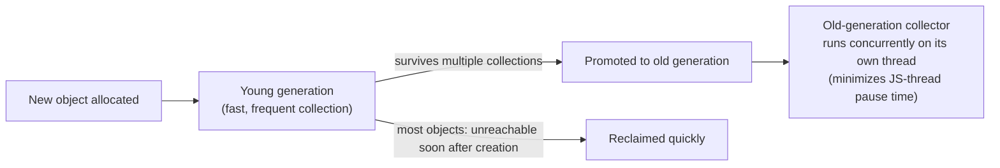
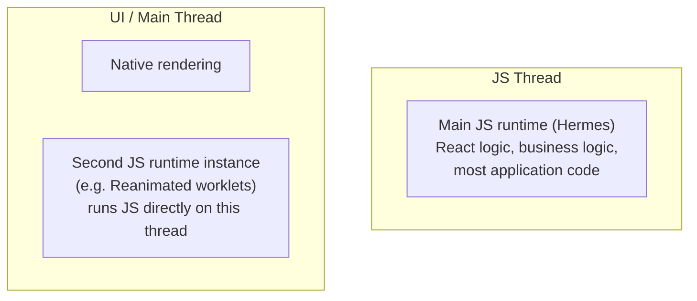

# React Native Senior Interview Q&A Handbook (Tier 5 — JavaScript Internals)

> Tier 5 of the running, tiered senior React Native interview Q&A series — see [Tier 1](05-tire1-must-know-js-rn-native.md) for JS engine/runtime/threading foundations, [Tier 2](06-tire2-old-vs-new-architecture.md) for Bridge/JSI/Fabric, [Tier 3](07-tire3-native-js-communication.md) for Native↔JS communication, and [Tier 4](08-tire4-performance-internals.md) for React Native performance internals. This tier goes one layer deeper than Tier 1 — into the JavaScript language and engine mechanics themselves (garbage collection, closures, the event loop, `async`/`await`) rather than RN-specific plumbing — and leans heavily on [Document 1 §14](01-architecture-and-internals.md#14-hermes) (Hermes/GC) and Tier 1's event-loop material, extending both rather than repeating them. New external facts (Reanimated's UI-thread worklet runtime, the Web Workers API) were independently verified this session against their official docs.

## Table of Contents

1. [How To Use This Tier](#1-how-to-use-this-tier)
2. [Tier 5 — JavaScript Internals](#2-tier-5--javascript-internals)
3. [Key Terms Glossary](#3-key-terms-glossary)
4. [Further Reading](#4-further-reading)

---

## 1. How To Use This Tier

Questions are kept in their original order and numbered 1–15 to match how they were given. They cluster into four themes — memory & garbage collection (Q1–4), event loop & async mechanics (Q5–10), JS threading & runtimes (Q11–13), and practical application & theory synthesis (Q14–15). Where a question overlaps with deeper mechanics already written up in [Tier 1](05-tire1-must-know-js-rn-native.md), [Document 1](01-architecture-and-internals.md), or [Document 2](02-performance.md)/[Tier 4](08-tire4-performance-internals.md), this tier gives a complete, direct answer and links to the relevant section for the full deep dive rather than repeating it.

---

## 2. Tier 5 — JavaScript Internals

This tier covers four clusters: memory and garbage collection (**Q1–4**), event loop and async mechanics (**Q5–10**), JS threading and runtimes (**Q11–13**), and practical application and theory synthesis (**Q14–15**).

### 1. How does JavaScript garbage collection work in Hermes?

Hermes uses a **generational garbage collector** — internally called the "Hades" GC — built specifically around mobile memory constraints (see [Document 1 §14](01-architecture-and-internals.md#14-hermes), "Garbage collection" subsection):



- **Young generation** — most objects are short-lived (temporary values, intermediate computation results), so new allocations go into a small young-generation space that's collected **fast and frequently**; most garbage is reclaimed here without ever touching the more expensive old-generation collector.
- **Old generation** — objects that survive enough young-generation collections get promoted here. Critically, the old-generation collector runs **concurrently with JS execution, on a separate thread** — specifically to avoid the long stop-the-world pauses that would otherwise stall the JS thread (and transitively, new UI updates, [Tier 4 Q1](08-tire4-performance-internals.md#1-why-does-blocking-the-js-thread-make-a-react-native-application-feel-slow)) while GC does its work.

The practical takeaway for an interview: Hermes trades some raw throughput (it's an interpreter, not a tiered JIT — see [Document 1 §14](01-architecture-and-internals.md#14-hermes)) for **predictable, low-pause memory management**, which matters more for a UI-driven mobile app's frame budget ([Tier 4 Q3](08-tire4-performance-internals.md#3-what-is-the-1667-ms-frame-budget)) than peak numeric throughput does.

### 2. What causes JavaScript memory leaks?

At the language level, a "leak" is never really a leak in the C/C++ sense (there's no manual `free()` to forget) — it's **a reference that outlives its usefulness**, keeping an object reachable so the garbage collector can never reclaim it. The classic causes, several of which are RN-specific in practice (see [Tier 4 Q12](08-tire4-performance-internals.md#12-what-causes-memory-leaks-in-react-native) and [Document 2 §8](02-performance.md#8-memory-leaks) for the full RN catalogue):

- **Closures that outlive their purpose** and keep their entire captured scope alive (Q3).
- **Forgotten timers/intervals** whose callback closure stays alive for as long as the timer is armed.
- **Event listeners/subscriptions** never removed, keeping both the handler and whatever it closes over alive indefinitely.
- **Global variables or module-level caches/arrays** that only ever grow, with nothing evicting old entries.
- **Long-lived collections holding references to short-lived objects** — e.g., a cache keyed by object identity that never removes stale entries.
- **Accidental retention via logging/debugging code** that holds a reference to a large object (e.g., keeping every API response in an array "for debugging") shipped into production.

The unifying fix, in every case: make sure *something* explicitly breaks the reference (clear the timer, unsubscribe, null out a ref, evict from a cache) once the object is genuinely no longer needed.

### 3. What is a closure, and how can closures cause memory retention?

A **closure** is a function bundled together with a reference to its entire **lexical environment** — every variable in scope at the point the function was defined, not just the ones it actually uses. That's the key, counter-intuitive detail that causes memory retention: **a closure keeps its whole enclosing scope reachable, not just the specific variables it reads**, per [Document 2 §8](02-performance.md#8-memory-leaks)'s explicit framing ("a closure captures its entire enclosing scope").

```js
function setup() {
  const smallFlag = true;
  const hugeDataset = loadMillionRowDataset(); // large, otherwise unused by the returned function

  return function logFlag() {
    console.log(smallFlag); // only this is actually used...
  };
  // ...but hugeDataset is still reachable through logFlag's closure,
  // and can never be garbage collected for as long as logFlag is.
}

const logFlag = setup(); // hugeDataset is retained in memory indefinitely
```

In React Native terms, this is exactly why a long-lived callback — passed to a singleton, a module-level event emitter, a timer, or a native module — that closes over a component's props/state/large data keeps that *entire* scope alive long after the component itself has unmounted, until the callback itself is unregistered (see [Tier 4 Q12](08-tire4-performance-internals.md#12-what-causes-memory-leaks-in-react-native)/[Q16](08-tire4-performance-internals.md#16-what-happens-if-a-component-unmounts-while-an-asynchronous-operation-is-still-running)). The fix: keep long-lived callbacks' captured scope as small as possible (prefer refs for values that must survive, avoid capturing entire large objects when only one field is needed), and always unregister/clean up the callback itself.

### 4. What happens when you create thousands of JavaScript objects?

Mechanically, each allocation lands in Hermes's young generation (Q1). A burst of thousands of short-lived objects (e.g., building a large intermediate array during a data transform) is exactly what the young-generation collector is designed for — most are reclaimed quickly, and this is normally cheap. The actual performance risk is about **what survives**, not raw allocation count:

- If most of those objects are **short-lived and genuinely garbage immediately after use**, young-gen GC handles them efficiently and it's rarely a real-world problem on its own.
- If a meaningful fraction **survive and get promoted to the old generation** (e.g., they're all stored in a long-lived array/cache/component state), old-gen collection work scales up proportionally — more live objects to trace on every old-gen pass, even though Hermes runs that concurrently to avoid blocking the JS thread (Q1).
- **Allocation itself still costs JS-thread time** — creating thousands of objects synchronously, in a tight loop, is still synchronous JS work that occupies the call stack and can itself blow the frame budget (see [Tier 4 Q2/Q4](08-tire4-performance-internals.md#2-what-causes-dropped-frames-in-react-native)), independent of GC entirely.
- In a React Native UI context specifically, "thousands of objects" very often means "thousands of React elements/components" — which additionally costs reconciliation/Fiber-tree and Shadow Tree work on top of raw GC pressure (see [Tier 4 Q20](08-tire4-performance-internals.md#20-why-can-rendering-thousands-of-components-cause-js-performance-problems)).

The practical answer: it's rarely the *allocation* that's expensive by itself — it's unnecessary **retention** (Q2/Q3) and **synchronous creation cost on the JS thread** that turn "thousands of objects" into an actual performance problem.

---

### 5. How does the JavaScript Event Loop interact with React rendering?

A React state update doesn't render anything by itself — it only **schedules** work, and that scheduled work is processed through the same event-loop machinery as everything else:

1. An event handler (e.g., `onPress`) runs as ordinary synchronous JS on the call stack.
2. Calling a state setter inside it doesn't synchronously re-render — React (since React 18, with **automatic batching**) collects state updates made within the same synchronous block and schedules **one** re-render covering all of them, rather than one render per `setState` call.
3. That scheduled re-render — the reconciliation/diff (render phase) and the commit phase that synchronously creates/updates Fabric's Shadow Nodes via JSI — typically runs to completion before the call stack unwinds back to the event loop, within the same macrotask that handled the original event (see [Document 1 §12](01-architecture-and-internals.md#12-react-reconciliation-and-fiber) for the render/commit split, and [Document 1 §13](01-architecture-and-internals.md#13-react-native-rendering-pipeline-and-threading-model) for the specific thread/scenario breakdown).
4. Only once all of that synchronous work finishes does control return to the event loop, which then drains any pending microtasks and moves on to the next task.

In short: **the event loop doesn't run React's renderer on a schedule of its own** — a render is just more synchronous JS work that happens to be triggered by (and run inside) whatever task/microtask invoked `setState`, which is exactly why an expensive render blocks everything else in [Tier 4 Q1/Q4](08-tire4-performance-internals.md#1-why-does-blocking-the-js-thread-make-a-react-native-application-feel-slow) the same way any other long synchronous JS would.

### 6. Microtask vs macrotask — what is the difference?

(Full mechanics already covered in [Tier 1 Q12 and Q14](05-tire1-must-know-js-rn-native.md#12-what-are-the-call-stack-task-queue-microtask-queue-and-event-loop) — direct answer here for completeness):

- A **microtask** (the spec calls these "Jobs") is `Promise` reactions (`.then`/`.catch`/`.finally`), `queueMicrotask()` callbacks, and `async`/`await` continuations. The **entire** microtask queue is drained — including any new microtasks added while draining — before the event loop is allowed to move on to anything else.
- A **macrotask** (a.k.a. "task") is everything else that arrives from outside the currently running JS: a fired `setTimeout`/`setInterval`, an incoming Bridge/JSI message, a resolved native-module call. Only **one** macrotask is processed per trip through the event loop, and the microtask queue is fully drained again before the *next* one.

The practical consequence (Q15 below, and [Tier 1 Q15](05-tire1-must-know-js-rn-native.md#15-which-executes-first-a-promise-callback-or-a-settimeout-0-callback)'s worked example): microtasks always run before the next macrotask, no matter how small that macrotask's delay was.

### 7. Where does Promise.then() execute?

On the **JS thread** — the only thread JS ever executes on in React Native by default (Q11) — scheduled as a **microtask**. Concretely: resolving a promise doesn't synchronously invoke its `.then()` callback; it schedules a PromiseReactionJob onto the microtask queue, which runs once the currently executing synchronous code finishes, but before any macrotask gets a turn (see [Tier 1 Q13](05-tire1-must-know-js-rn-native.md#13-what-happens-internally-when-a-promise-resolves-in-react-native)). There is no sense in which `.then()` runs "elsewhere" — it's ordinary JS running on the single JS thread's call stack, just scheduled for a specific later point within the current event-loop turn.

### 8. Where does async/await execute?

Also entirely on the **JS thread** — `async`/`await` is syntactic sugar over Promises, not a new execution context (Q10). Specifically:

- The code in an `async` function **before its first `await`** runs **synchronously**, immediately, as part of whatever call invoked the function — exactly like any normal function call.
- Each `await` suspends the function at that point and hands control back to the event loop; when the awaited value settles, the **rest of the function resumes as a microtask** (functionally, each `await` is sugar for a `.then()` continuation).

So an `async` function's body is really a sequence of synchronous chunks, each one a separate microtask (after the first), all still running on the one JS thread — never a separate thread, and never truly "paused" in the OS sense.

### 9. How does async/await interact with the Event Loop?

Directly — because it's built entirely out of Promises and microtasks (Q6–Q8), with no event-loop concept of its own:

```js
console.log('1: sync start');

async function demo() {
  console.log('2: inside async fn, before await');
  await null; // suspends here; resumes as a microtask
  console.log('4: inside async fn, after await');
}

demo();

console.log('3: sync end');

// Output, in order: 1, 2, 3, 4
```

- Calling `demo()` runs synchronously up to the `await` (`'2'` logs immediately — Q8).
- `await null` suspends the function and returns control to the caller, which finishes its own synchronous code (`'3'` logs next).
- Only once the call stack is empty does the event loop drain the microtask queue, resuming `demo()`'s continuation (`'4'`) — exactly like a `.then()` callback, because that's literally what it compiles down to.

This is why `await`ing an already-resolved value still yields at least one microtask turn — it never "skips the queue" just because there's nothing to actually wait for.

### 10. Why doesn't async/await create a new thread?

Because `async`/`await` is a **control-flow construct**, not a concurrency primitive — it's purely syntactic sugar that lets you write Promise chains in a linear-looking style; under the hood it's still the exact same single-threaded, single-call-stack, microtask-based machinery as a hand-written `.then()` chain (Q8–Q9). "Asynchronous" in JavaScript means **"non-blocking via callback/microtask scheduling,"** not **"runs on another thread."** Whatever genuine parallelism exists behind an awaited operation (a native network call, a native timer countdown — [Tier 1 Q1](05-tire1-must-know-js-rn-native.md#1-what-actually-happens-when-you-call-settimeout-in-react-native)) happens entirely **outside** JS — on an OS thread, in native code — and `await` just gives JS a clean way to say "pause this function's logic until that external work reports back," resuming later on the very same single JS thread (Q11).

---

### 11. Does JavaScript run on one thread in React Native?

Yes — this is the half of [Tier 1 Q20](05-tire1-must-know-js-rn-native.md#20-does-react-native-have-a-single-thread-or-multiple-threads)'s answer that's unconditionally true: there is exactly **one JS thread**, running a single JS VM instance (Hermes by default) with a single call stack, executing all of your application's JavaScript — React rendering logic, event handlers, business logic. What's multi-threaded is **React Native as a whole** (the UI thread, Shadow/layout thread, native module threads all run separately and in parallel) — not JavaScript execution itself, with one notable, narrow exception (Q12).

### 12. Can React Native execute JavaScript on multiple threads?

Mostly no, with one important, senior-level exception worth naming precisely. By default, an RN app has exactly one JS thread running exactly one JS engine instance (Q11). The exception: libraries like **`react-native-reanimated`** run "worklets" — plain JavaScript functions — directly **on the UI thread**, via JSI (its own docs describe animations/gestures as running "natively on the UI thread" rather than round-tripping to the main JS thread every frame). Mechanically, that requires a **second, separate JS engine instance living on the UI thread**, distinct from the main JS thread's runtime — genuinely two JS execution contexts running on two different OS threads, which is real JS-level parallelism, not just native-vs-JS concurrency.



This is the exception that proves the rule: it's not that "the JS thread" itself becomes multi-threaded — it's that a *second, independent* JS runtime can exist on a *different* thread, purpose-built for latency-critical, per-frame work ([Tier 4 Q5](08-tire4-performance-internals.md#5-can-a-react-native-application-have-60-fps-while-the-js-thread-is-blocked), [Tier 3 Q15](07-tire3-native-js-communication.md#15-how-would-you-move-cpu-heavy-work-away-from-the-js-thread)) that can't afford to cross the JS-thread/UI-thread boundary every frame.

### 13. What is a Web Worker, and is it the same as a React Native JS thread?

A **Web Worker** is a standard browser (and Node, via `worker_threads`) API for running a script "in a background thread separate from the main execution thread," with its **own** independent global scope and event loop, no shared memory with the main thread — communication happens only via message-passing (`postMessage()`/`onmessage`), with data **copied, not shared**, between the two sides (confirmed directly against [MDN's Web Workers API docs](https://developer.mozilla.org/en-US/docs/Web/API/Web_Workers_API)). It's the standard, spec-level mechanism for real JS-level parallelism in a browser/Node environment.

**No, it is not the same as React Native's "JS thread."** React Native has no DOM/browser environment, so the Web Worker API doesn't exist in RN by default at all — RN's "JS thread" is just **the one thread** the single JS engine instance runs on, not a worker-style parallel execution context. The closest RN-ecosystem equivalent to a genuine Worker-style second JS context is the Reanimated worklet runtime from Q12 (a real, separate JS engine instance, just purpose-built for UI-thread animation work and not a general-purpose Worker API), or dedicated community libraries (e.g., `react-native-threads`) that explicitly provide Worker-like separate JS execution contexts via JSI for general-purpose parallel computation.

---

### 14. How would you perform CPU-intensive JavaScript work without blocking the UI?

Precisely worded, this question has a built-in trap worth naming: the **UI thread is already a separate OS thread from the JS thread** ([Tier 1 Q19–20](05-tire1-must-know-js-rn-native.md#19-what-is-the-relationship-between-the-js-thread-and-the-uimain-thread)), so pure JS computation never directly blocks it — what it blocks is the **JS thread**, which indirectly freezes anything that needs a fresh instruction from JS (new renders, touch handling — [Tier 4 Q1](08-tire4-performance-internals.md#1-why-does-blocking-the-js-thread-make-a-react-native-application-feel-slow)). With that framing, the real options:

- **Move the work to native** — a Native Module whose implementation dispatches the actual computation to a native background thread, returning the result asynchronously (`Promise`) — the right call for genuinely CPU-heavy work (see [Tier 3 Q15/Q18](07-tire3-native-js-communication.md#15-how-would-you-move-cpu-heavy-work-away-from-the-js-thread)).
- **Chunk the work across multiple event-loop turns** — break a large synchronous loop into smaller pieces interleaved with `setTimeout`/`requestAnimationFrame`, so the JS thread yields back regularly instead of monopolizing the call stack in one long block; total JS-thread time is unchanged, but it stops starving everything else for one long stretch.
- **Defer it** with `InteractionManager.runAfterInteractions()` until current animations/interactions finish, so it doesn't compete with urgent work at the worst possible moment (see [Tier 1 Q16](05-tire1-must-know-js-rn-native.md#16-what-happens-when-the-js-thread-is-blocked-for-5-seconds)).
- **Move it to a second JS runtime** — Reanimated worklets (Q12) for latency-critical, per-frame UI work, or a community JS-worker-style library (Q13) for general-purpose parallel JS computation.
- **Move it off-device entirely** — if the computation doesn't inherently need to run on the phone, do it server-side and fetch the result.

### 15. What is the difference between concurrency and parallelism in JavaScript?

| | Concurrency | Parallelism |
|---|---|---|
| Definition | Managing multiple tasks **in progress** over the same period, making progress by **interleaving** | Multiple tasks executing at the **literal same instant** |
| Requires | A single execution unit (one thread/call stack) that switches between tasks | Multiple genuine execution units (multiple threads/cores) running simultaneously |
| How plain JS achieves it | The event loop — async operations interleave via the microtask/macrotask queues (Q6), cooperatively yielding at `await`/`.then()` boundaries | Plain single-threaded JS **cannot** do this by itself — one call stack can only ever run one thing at a time |
| Where React Native has it | Within the single JS thread — many in-flight `Promise`s, timers, and native-call callbacks all make progress "at once" by interleaving on one thread | Across React Native's multiple **native** threads (JS thread + UI thread + native module threads genuinely running simultaneously — [Tier 1 Q20](05-tire1-must-know-js-rn-native.md#20-does-react-native-have-a-single-thread-or-multiple-threads)), and across genuinely separate JS engine instances (Reanimated's UI-thread runtime, Q12) |

The concise version worth saying out loud in an interview: **concurrency is about dealing with many things at once (structure); parallelism is about doing many things at once (execution).** JavaScript's single-threaded model gives you concurrency for free via the event loop, but never parallelism on its own — any real parallelism in a React Native app comes from crossing out of plain JS into multiple OS threads (native code, or a second JS runtime instance).

---

## 3. Key Terms Glossary

| Term | Meaning |
|---|---|
| **Generational GC ("Hades")** | Hermes's garbage collector — fast/frequent young-generation collection plus a concurrent old-generation collector that runs alongside JS execution to minimize JS-thread pauses. |
| **Closure** | A function bundled with a reference to its entire enclosing lexical scope, not just the variables it uses — the root cause of many memory-retention bugs. |
| **Web Worker** | A standard browser/Node API for running JS in a genuinely separate thread with its own event loop and global scope; communicates via copied messages, not shared memory. No equivalent exists in React Native by default. |
| **Worklet** | A plain JS function (e.g., in `react-native-reanimated`) that runs on a second JS runtime instance living on the UI thread, instead of round-tripping to the main JS thread every frame. |
| **Concurrency** | Making progress on multiple tasks over the same period via interleaving on one execution unit — not simultaneous execution. |
| **Parallelism** | Multiple tasks executing at the literal same instant, requiring multiple genuine execution units (threads/cores). |

*(See [Tier 1's glossary](05-tire1-must-know-js-rn-native.md#3-key-terms-glossary) for Microtask/Macrotask/JS engine/JS runtime/`InteractionManager` terms, and [Document 2's glossary](02-performance.md#16-key-terms-glossary) for Memory leak/Memoization terms.)*

---

## 4. Further Reading

- Using Hermes — https://reactnative.dev/docs/hermes
- Bundled Hermes — https://reactnative.dev/architecture/bundled-hermes
- Hermes engine source/README — https://github.com/facebook/hermes
- Web Workers API (MDN) — https://developer.mozilla.org/en-US/docs/Web/API/Web_Workers_API
- React Native Reanimated (worklets run on the UI thread) — https://docs.swmansion.com/react-native-reanimated/
- Related: [Document 1 — React Native Architecture & Internals](01-architecture-and-internals.md) (Hermes internals, reconciliation/Fiber, threading model)
- Related: [Document 2 — React Native Performance](02-performance.md) (memory leaks, retained closures)
- Related: [Tier 1](05-tire1-must-know-js-rn-native.md) (event loop, microtask/macrotask, JS/UI threading) and [Tier 4](08-tire4-performance-internals.md) (frame budget, memory-leak catalogue, reconciliation cost)
