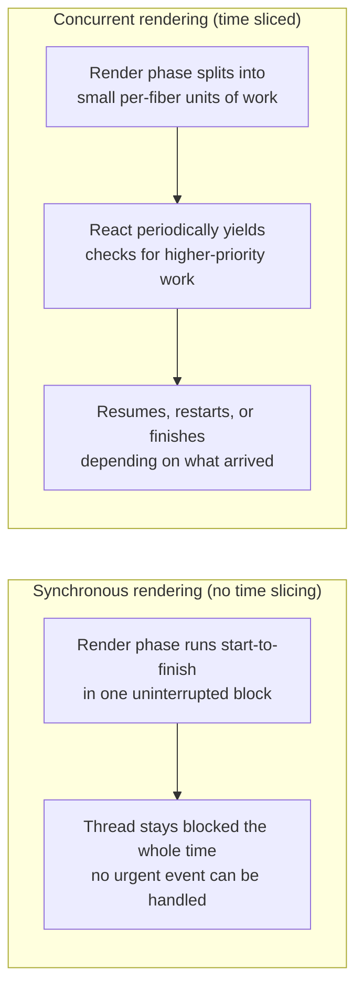
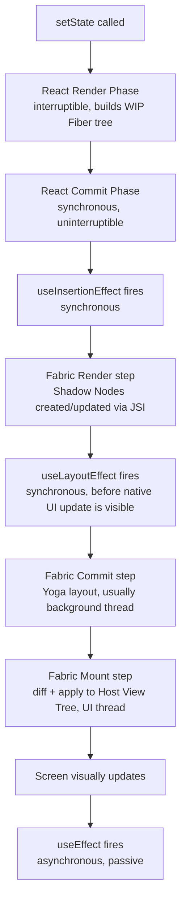

# React Native Senior Interview Q&A Handbook (Tier 6 — React Internals in React Native)

> Tier 6 of the running, tiered senior React Native interview Q&A series — see [Tier 1](05-tire1-must-know-js-rn-native.md) for JS/RN/Native foundations, [Tier 2](06-tire2-old-vs-new-architecture.md) for Bridge/JSI/Fabric, [Tier 4](08-tire4-performance-internals.md) for performance internals, and [Tier 5](09-tire5-javascript-internals.md) for JavaScript-language internals. This tier goes deep on **React itself** — reconciliation, Fiber, concurrent rendering, and the render/commit split — and specifically how those React-core mechanics map onto React Native's Fabric pipeline rather than the browser DOM. Most of the RN-specific mechanics here were already laid down in [Document 1 §9/§12/§13](01-architecture-and-internals.md#9-fabric) and [Tier 2 Q21–30](06-tire2-old-vs-new-architecture.md#21-why-was-fabric-introduced); this tier extends that material into the `useEffect`/`useLayoutEffect`/`useInsertionEffect` timing questions, which are new ground verified directly against React's official docs this session.

## Table of Contents

1. [How To Use This Tier](#1-how-to-use-this-tier)
2. [Tier 6 — React Internals in React Native](#2-tier-6--react-internals-in-react-native)
3. [Key Terms Glossary](#3-key-terms-glossary)
4. [Further Reading](#4-further-reading)

---

## 1. How To Use This Tier

Questions are kept in their original order and numbered 1–20 to match how they were given. They cluster into six themes — state updates & re-render triggers (Q1–3), reconciliation & the Virtual DOM/Shadow Tree (Q4–7), Fiber & concurrent rendering (Q8–13), render-vs-commit internals (Q14–16), batching (Q17–18), and Effect-timing hooks (Q19–20). Where a question's full mechanics already live in [Document 1](01-architecture-and-internals.md) or [Tier 2](06-tire2-old-vs-new-architecture.md), this tier gives a direct, complete answer and links out rather than repeating the prose.

---

## 2. Tier 6 — React Internals in React Native

This tier covers six clusters: state updates and re-render triggers (**Q1–3**), reconciliation and the Virtual DOM/Shadow Tree (**Q4–7**), Fiber and concurrent rendering (**Q8–13**), render-vs-commit internals (**Q14–16**), batching (**Q17–18**), and Effect-timing hooks (**Q19–20**).

### 1. What happens internally when setState() is called?

Calling a state setter does **not** synchronously mutate anything in place — it tells React "schedule an update for this fiber with this new value":

1. React creates an **update object** and enqueues it on the target fiber's update queue, tagged with a **priority** (a user-initiated press is higher priority than, say, a background data refresh).
2. If this call happens inside an already-synchronous block (an event handler, or anywhere under React 18's automatic batching), React doesn't start rendering immediately — it marks the root as having pending work and waits for the current synchronous block to finish so it can process every queued update together (Q17/Q18).
3. React then runs (or schedules) the **render phase**: it builds a new work-in-progress Fiber tree, re-invoking the affected component functions/hooks and replaying the update queue to compute the new state — interruptible the whole way through (Q12/Q13).
4. The resulting diff is applied in the **commit phase** — synchronously, via Fabric's host config, creating/updating React Shadow Nodes through JSI (Q15).

The full pipeline, including exactly where effects fire, is diagrammed in Q15.

### 2. What causes a React component to re-render?

Mechanically, there are only a small number of real triggers:

- **Its own state changes** — a `useState`/`useReducer` setter is called with a value that's not `Object.is`-equal to the current one.
- **Its parent re-renders** — by default, every child re-renders whenever its parent does, regardless of whether its own props changed at all (this is the big one in practice, and the reason `React.memo` exists — see [Tier 4 Q8/Q9](08-tire4-performance-internals.md#8-what-causes-unnecessary-react-native-re-renders)).
- **A context it consumes changes value.**
- **A hook that subscribes to external state changes** (e.g. `useSyncExternalStore`, or a store library's hook) reports a new value.

Note what's conspicuously *not* on this list: "props changed," by itself, isn't a separate trigger — props only ever change as a side effect of the parent re-rendering with a new value. Giving a component a different `key` doesn't cause a re-render either — it causes React to treat it as a **different component instance entirely** (old one unmounted/destroyed, new one mounted from scratch), which is a distinct mechanism from updating in place.

### 3. Does every state update immediately update the native UI?

**No** — several layers stand between calling a setter and a pixel changing on screen:

- Calling the setter only **schedules** work (Q1); it doesn't synchronously render, and it certainly doesn't synchronously touch a native view.
- **Batching** (Q17/Q18) means multiple state updates inside the same synchronous block collapse into a single scheduled render, not one render per call.
- Even once React's render+commit phases run, React's commit phase only synchronously creates/updates **React Shadow Nodes** in C++ (Fabric's own **Render** step) — the actual native-view mutation is Fabric's separate **Mount** step, which per [Document 1 §13](01-architecture-and-internals.md#13-react-native-rendering-pipeline-and-threading-model)'s scenario table may run in the same tick (if the whole pipeline ran on the UI thread) or be deferred to the UI thread's next tick (the common case, when the commit ran on a background thread).
- In **concurrent mode**, a given render can be interrupted and thrown away entirely before it ever reaches commit (Q12/Q13) — so calling `setState` doesn't even guarantee that *specific* render ever makes it to screen unmodified.
- Some state isn't React state at all: a native-owned value (e.g. `ScrollView`'s scroll offset) can update the UI by committing directly in C++, **skipping React's render phase entirely**.

### 4. What is React reconciliation?

**Reconciliation** is the algorithm React uses to diff a previous element tree against a new one and compute the minimal set of changes needed, so React never has to tear down and rebuild the whole UI on every update (see [Document 1 §12](01-architecture-and-internals.md#12-react-reconciliation-and-fiber)). Its core heuristics: elements of a *different type* at the same position cause the old subtree to be torn down and rebuilt from scratch; elements of the *same type* have their props/children diffed and patched in place; **keys** let React match list items across renders instead of needlessly recreating them. This is pure React core — identical in `react-dom` and React Native; only what happens *after* the diff (the host config) differs.

### 5. What is the Virtual DOM?

The **Virtual DOM** is the popular, historical name for a lightweight, in-memory representation of the UI that React diffs against the previous version to compute the minimal set of real-UI mutations needed, rather than touching the actual rendered output for every single change (Q4). In practice, modern React material talks less about a literally-named "Virtual DOM" object and more concretely about the **React element tree**/**Fiber tree** (Q8) — but it's the same underlying idea: an abstraction React can cheaply read, diff, and discard/rebuild in memory, so expensive, real UI mutations only happen for the specific things that actually changed. The "DOM" half of the name is a literal reference to the browser's Document Object Model — which is exactly why the name doesn't really fit outside a browser (Q6).

### 6. Does React Native actually use the browser DOM?

**No.** React Native doesn't run inside a browser at all, so there is no Document Object Model, no `document` global, no DOM nodes, and no CSSOM. Its renderer (Fabric) targets real native platform views (`UIView` on iOS, `android.view.View` on Android) directly, not HTML elements (see [Document 1 §9](01-architecture-and-internals.md#9-fabric)). This is also why DOM-specific browser APIs (`document.querySelector`, `window`, etc.) simply don't exist in a React Native JS environment.

### 7. If there is no DOM, what does React reconcile against?

React's reconciler (Fiber) doesn't actually know or care what sits underneath it — that's precisely the point of the **host config** abstraction: Fabric is "just another React renderer," conceptually a sibling of `react-dom`, implementing React's host-config interface against C++ Shadow Tree APIs instead of the DOM (see [Document 1 §13](01-architecture-and-internals.md#13-react-native-rendering-pipeline-and-threading-model)). Concretely, in React Native: React reconciles its own element/Fiber tree, and on commit, synchronously creates/updates the **React Shadow Tree** — Fabric's C++ Shadow Nodes — via JSI. That Shadow Tree is RN's "Virtual-DOM-equivalent" target. Fabric then separately diffs the new Shadow Tree against the previously-mounted one to compute the actual native view mutations — see [Tier 2 Q24](06-tire2-old-vs-new-architecture.md#24-what-is-the-difference-between-the-react-tree-shadow-tree-and-native-view-hierarchy) for the full three-tree (React Tree / Shadow Tree / Host View Tree) breakdown and diagram.

---

### 8. What is React Fiber?

**Fiber** is React's reconciliation engine (since React 16) — both an algorithm and a data structure (see [Document 1 §12](01-architecture-and-internals.md#12-react-reconciliation-and-fiber)). Each **Fiber node** is a plain JS object representing one unit of work — roughly one element/component instance — holding its type, pending props, memoized state, pointers to its `child`/`sibling`/`return` (parent), and an `alternate` pointer linking it to its counterpart in the other tree. React keeps **two** Fiber trees — the **current** tree (on screen) and a **work-in-progress** tree (being built for the next render) — a "double buffering" scheme that lets React build the next tree without touching the one currently rendered. Representing work as small, discrete, linked units is exactly what makes rendering **interruptible** (Q12/Q13).

### 9. How does Fiber relate to React Native?

Directly, and in two distinct ways. First, mechanically: the **same** Fiber reconciler that powers `react-dom` powers React Native — there's no RN-specific reconciler; only the host config at the very bottom differs (Document 1 §12's framing, reused in [Tier 2 Q22](06-tire2-old-vs-new-architecture.md#22-how-does-react-rendering-differ-between-the-old-architecture-and-fabric)). Second, historically: Fiber shipped originally for `react-dom`, but React Native couldn't safely expose Fiber's *concurrent* capabilities (Q10) until Fabric replaced the old Bridge-based `UIManager` host config — the old architecture's rigid, asynchronous, JSON-serializing Bridge wasn't thread-safe or interruptible-compatible, so concurrent/time-sliced rendering was architecturally impossible on it (see [Tier 2 Q21](06-tire2-old-vs-new-architecture.md#21-why-was-fabric-introduced)). Fabric's immutable, structurally-shared C++ Shadow Tree is specifically what finally let RN use the same concurrent-mode Fiber features natively that web already had.

### 10. What is concurrent rendering?

**Concurrent rendering** is React's ability to work on a render **without that work being all-or-nothing and uninterruptible** — React can pause an in-progress render, abandon it, or resume it later, and can even have multiple tree versions in flight, all without corrupting what's currently on screen (see [Document 1 §9](01-architecture-and-internals.md#9-fabric), "Concurrent rendering" subsection). It's the foundation under React 18's headline features — transitions, Suspense, automatic batching (Q18). In React Native specifically, concurrent rendering is only possible because Fabric's Shadow Tree is **immutable with structural sharing** (updating anything clones just the path from the changed node to the root) — which makes it safe to read/write across threads without locks, exactly what Fiber's double-buffering (Q8) needs underneath it.

### 11. What is time slicing?

**Time slicing** is the specific mechanism concurrent rendering uses to stay interruptible: instead of running an entire render phase start-to-finish in one uninterrupted synchronous block, React breaks the work into small units — one per Fiber node, since each fiber is already a small, discrete, linked unit of work (Q8) — and periodically checks whether it should yield control back before continuing, rather than monopolizing the thread until the whole tree is done.

The practical payoff ties directly back to the JS thread's [frame budget](08-tire4-performance-internals.md#3-what-is-the-1667-ms-frame-budget): a single enormous render is how a frame budget gets blown; a time-sliced one gives React repeated chances to let something more urgent (a touch, an animation frame) cut in first.

### 12. Can React rendering be interrupted?

**Yes — but only the render phase, never the commit phase.** Per [Document 1 §12](01-architecture-and-internals.md#12-react-reconciliation-and-fiber)'s "Render phase" description, it's explicitly "interruptible — in concurrent mode, React can pause, abort, or restart this phase; it may run partially, get thrown away, and run again." This is safe specifically because the render phase has **no visible side effects** — nothing it does is observable by the user until commit. The commit phase, by contrast, is synchronous and **cannot** be interrupted once started (Q14) — half-applied host mutations would be a visible, broken UI state, which React's architecture never allows.

### 13. What happens if a render is interrupted?

One of a few outcomes, depending on *why* it was interrupted (see [Document 1 §13](01-architecture-and-internals.md#13-react-native-rendering-pipeline-and-threading-model)'s scenario table for the React-Native-specific versions of these):

- **Pause and resume** — if nothing more urgent has invalidated the work so far, React simply picks back up later from where it left off.
- **Discard and restart** — if a higher-priority update affects the same part of the tree, React throws away the entire in-progress work-in-progress tree and restarts the render phase incorporating the new update. This is only safe because of Fiber's double buffering (Q8): the **current** tree already on screen is never touched by any of this, so there's nothing to visually roll back.
- **Switch threads** — React Native's specific "discrete event interruption" scenario: a high-priority UI-thread event interrupts an in-progress JS-thread render, and the render is resumed/finished **synchronously on the UI thread** instead.

In every case, the user never sees any of this happen — the render phase is pure and side-effect-free (Q12), so an interrupted or discarded render was never visible in the first place.

---

### 14. What is the difference between rendering and committing?

Straight from [Document 1 §12](01-architecture-and-internals.md#12-react-reconciliation-and-fiber)'s "Render phase" and "Commit phase" subsections — two phases with almost opposite properties:

| | Render phase | Commit phase |
|---|---|---|
| Also called | Reconciliation phase | — |
| Interruptible? | Yes — can pause, abort, restart (Q12/Q13) | No — synchronous, uninterruptible, runs to completion |
| Side effects? | None — must be pure; nothing here is user-visible yet | Yes — this is where host mutations actually get applied |
| What it does | Walks the tree (`beginWork`/`completeWork`), re-runs components/hooks, diffs against the current tree | Applies the diffed result via the host config; swaps work-in-progress tree in as the new current tree |

The React-Native-specific wrinkle — that React's own commit phase is not the same thing as **Fabric's** commit phase — is significant enough to get its own question (Q15).

### 15. What happens during the React commit phase in React Native?

This is the single most commonly conflated pair of concepts in this whole tier, and worth stating precisely (see [Document 1 §12](01-architecture-and-internals.md#12-react-reconciliation-and-fiber)'s "React Native nuance"): React's own commit phase — synchronous, uninterruptible — applies the render phase's diffed result via Fabric's host config. Concretely, that means **synchronously creating/updating React Shadow Nodes in C++, through JSI**. From *Fabric's* point of view, this is actually Fabric's own separate **Render** step (not Fabric's commit) — Fabric then runs its *own*, further Commit (Yoga layout) and Mount (diff + apply to real native views) steps afterward, potentially on a different thread and a later tick.

Reasoning this through to its logical conclusion (a direct consequence of the above, rather than something stated verbatim in any single official source): `useLayoutEffect`'s documented guarantee is that it fires synchronously right after the renderer's host-config mutations are applied and before the update becomes visible to the user (verified against [react.dev's `useLayoutEffect` docs](https://react.dev/reference/react/useLayoutEffect)). In React Native, "the renderer's host-config mutations are applied" is exactly React's commit phase described above — so `useLayoutEffect` fires immediately after Fabric's **Render** step, *before* Fabric's own Commit/Mount steps have even run. Full hook-ordering detail in Q19.

### 16. How does React decide which native views need to change?

In two separate layers, not one:

1. **React's reconciliation** (Q4) decides, at the element/Fiber level, which parts of the tree actually changed during its own render phase (type+key+props diffing).
2. That result is what React's commit phase applies as JSI calls to create/update/delete the corresponding **Shadow Nodes** (Q15).
3. **Separately**, Fabric's own Mount step independently re-diffs — at the C++ Shadow Tree level — the new Shadow Tree against the previously-mounted one, to compute the actual minimal `createView`/`updateView`/`removeView`/`deleteView` operations (see [Document 1 §9](01-architecture-and-internals.md#9-fabric), "Mounting" subsection). This second diff is also exactly where **View Flattening** can decide a "changed" element doesn't need a distinct native view at all.

So the honest answer is "twice, at two different layers": React decides *what logically changed* first; Fabric independently re-diffs to decide *what physically needs to change in the native view tree*.

---

### 17. What is batching in React?

**Batching** is grouping multiple state updates that occur within the same synchronous block of code into a **single** re-render, instead of re-rendering once per individual `setState` call. For example, calling two different state setters inside one `onPress` handler produces exactly one render covering both changes, not two separate renders. The point is to avoid wasted intermediate renders/commits — and, just as importantly, to avoid ever showing the user a partially-updated UI halfway through a multi-step state change.

### 18. How does automatic batching work in modern React Native?

Before React 18, batching only happened reliably **inside React's own event handlers** — state updates made inside a promise callback, a `setTimeout` callback, or a native event handler each triggered their own separate, unbatched render. React 18 introduced **automatic batching**: every state update is batched by default regardless of where it originates — timers, promises, native-module callbacks included — unless explicitly opted out via `flushSync` (see [Tier 5 Q5](09-tire5-javascript-internals.md#5-how-does-the-javascript-event-loop-interact-with-react-rendering) for the event-loop framing of this same mechanism). This matters more in React Native than it might first appear: a large share of RN app code reacts to **native-originated async callbacks** (a resolved TurboModule promise, a `NativeEventEmitter` event) rather than DOM-style synchronous event handlers — exactly the category of call site that used to bypass batching entirely pre-React-18.

---

### 19. How do useEffect, useLayoutEffect, and useInsertionEffect differ in React Native?

All three are plain React-core hooks (identical API surface on web and RN), but they fire at three distinct points relative to the commit/mount pipeline from Q15 — verified directly against React's official hook references this session:

| Hook | Fires relative to commit | Blocks the visual update? | Can call a state setter directly? | Typical React Native usage |
|---|---|---|---|---|
| `useInsertionEffect` | First — synchronously, right as the component commits, before any layout effects fire | N/A — runs before layout work even starts | No — disallowed | Almost never in app code; exists for CSS-in-JS library authors to inject styles before layout reads. RN has no runtime `<style>` injection or CSSOM at all (Q6), so this hook is close to irrelevant in practice. |
| `useLayoutEffect` | Second — synchronously, right after React's commit phase (Fabric's Render step, Q15), before the update is visible | Yes — it (and any state update it triggers) must finish before the screen updates | Yes — triggering one causes React to immediately process remaining effects before anything is shown | Measuring a ref's layout (`onLayout`/`measure`) and synchronously correcting state to avoid a visible flicker — e.g. positioning a tooltip based on its just-rendered size. |
| `useEffect` | Third — asynchronously, as a "passive effect," generally after the update is already visible | No | Yes, normally | The default choice for nearly everything: data fetching, subscriptions, timers, logging — anything that doesn't need to block the user from seeing the update. |

Per [react.dev's `useLayoutEffect` docs](https://react.dev/reference/react/useLayoutEffect) (quoted directly): *"The code inside `useLayoutEffect` and all state updates scheduled from it block the browser from repainting the screen. When used excessively, this makes your app slow. When possible, prefer `useEffect`."* React Native has no literal "browser repaint," but the equivalent boundary is Fabric's Commit+Mount steps actually applying the change to the real Host View Tree (Q15) — a `useLayoutEffect` callback can still measure/adjust something and force a re-render/re-commit before that frame is ever shown to the user, at the cost of directly eating into whatever's left of the [frame budget](08-tire4-performance-internals.md#3-what-is-the-1667-ms-frame-budget). Default to `useEffect`; reach for `useLayoutEffect` only when a visible flicker would otherwise occur; essentially never reach for `useInsertionEffect` in application code.

### 20. When exactly does useEffect execute relative to rendering and committing?

**After both phases have fully finished**, and — deliberately — generally after the update is already visible on screen. Per [react.dev's `useEffect` docs](https://react.dev/reference/react/useEffect) (quoted directly): *"If your Effect wasn't caused by an interaction (like a click), React will generally let the browser paint the updated screen first before running your Effect."* The full, concrete ordering (diagrammed in Q15): render phase (interruptible, builds the new tree) → commit phase (synchronous: host mutations applied, refs attached, `useLayoutEffect` fires here) → Fabric Commit+Mount apply the change to real native views → the screen visually updates → **`useEffect` fires afterward, asynchronously, in a separate, lower-priority pass.**

One documented nuance worth knowing for an interview: if the effect *was* caused by a direct interaction (e.g. a press), React may run it before the next paint specifically so its results are observable by the event system — but this is a narrow exception, not the headline rule, and either way `useEffect` never blocks the synchronous render+commit work the way `useLayoutEffect` can. Dependency-array semantics are standard and unchanged in RN: the effect runs after the initial mount's commit, and again after every subsequent commit where a listed dependency changed; its cleanup function runs before the next setup and once more on unmount.

---

## 3. Key Terms Glossary

| Term | Meaning |
|---|---|
| **Virtual DOM** | The popular name for an in-memory UI representation that gets diffed instead of touching the real rendered output directly on every change; in React Native this role is played by Fabric's Shadow Tree, not any literal DOM. |
| **Double buffering** | Fiber's scheme of keeping two trees (current + work-in-progress) so the next render can be built without touching what's already on screen. |
| **Time slicing** | Breaking a render phase into small, per-fiber units of work so React can periodically yield instead of monopolizing the thread. |
| **Concurrent rendering** | React's ability to pause, abort, resume, or run multiple versions of a render without corrupting the currently-committed UI. |
| **`useInsertionEffect`** | A hook firing synchronously before any layout effects, intended for CSS-in-JS libraries to inject styles ahead of layout reads. |
| **Passive effect** | React's internal name for a `useEffect` callback — "passive" because it's deferred and doesn't block the visual update. |
| **Layout effect** | React's internal name for a `useLayoutEffect` callback — fires synchronously before the user sees the update. |
| **Automatic batching** | React 18's behavior of batching all state updates into one render regardless of where they originate (timers, promises, native callbacks), not just inside React event handlers. |

*(See [Document 1's glossary](01-architecture-and-internals.md#18-key-terms-glossary) and [Tier 2's glossary](06-tire2-old-vs-new-architecture.md#3-key-terms-glossary) for Fiber, Reconciliation, Shadow Tree, and View Flattening — not repeated here.)*

---

## 4. Further Reading

- `useEffect` reference (React) — https://react.dev/reference/react/useEffect
- `useLayoutEffect` reference (React) — https://react.dev/reference/react/useLayoutEffect
- `useInsertionEffect` reference (React) — https://react.dev/reference/react/useInsertionEffect
- Preserving and Resetting State (React) — https://react.dev/learn/preserving-and-resetting-state
- Related: [Document 1 — React Native Architecture & Internals](01-architecture-and-internals.md) (§9 Fabric, §12 Reconciliation/Fiber, §13 Rendering Pipeline/Threading)
- Related: [Tier 2](06-tire2-old-vs-new-architecture.md) (Q21–30: Fabric, Shadow Tree, three-tree comparison, rendering differences old vs new)
- Related: [Tier 4](08-tire4-performance-internals.md) (frame budget, unnecessary re-renders, memoization) and [Tier 5](09-tire5-javascript-internals.md) (event loop/React-rendering interaction, automatic batching)
