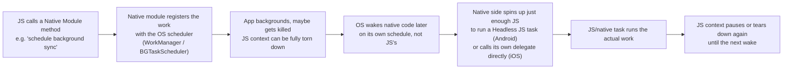
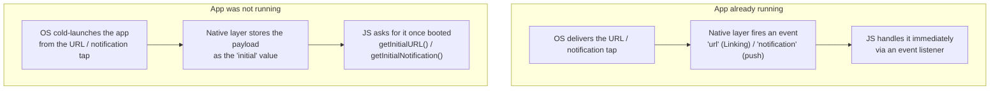

# React Native Senior Interview Q&A Handbook (Tier 7 — Communication & Architecture Scenarios)

> Tier 7 of the running, tiered senior React Native interview Q&A series — see [Tier 1](05-tire1-must-know-js-rn-native.md#16-what-happens-when-the-js-thread-is-blocked-for-5-seconds) for the JS-thread-blocked foundations this tier builds on, [Document 1 §13/§14](01-architecture-and-internals.md#13-react-native-rendering-pipeline-and-threading-model) for the threading model and Hermes, [Document 3](03-native-integration.md) and [Tier 3](07-tire3-native-js-communication.md) for the Native Module shape that every OS-integration answer below ultimately reduces to, and [Document 4 §6.5/§7.4/§9.4](04-app-architecture-and-production-concerns.md#65-deep-link-security) for deep-link security and crash-reporting practice. This tier is scenario-based: "what actually happens when X fails / backgrounds / fires" questions about threads, timers, backgrounding, push notifications, deep linking, and permissions. Several answers (notably Q1–4, the crash/fault questions) combine RN's already-documented threading model with general, well-established OS-process fundamentals rather than a single quotable RN doc sentence — flagged inline as reasoning, not a direct citation, consistent with how earlier tiers handled similar synthesis. Everything else (AppState, Linking, PermissionsAndroid, Headless JS, and the now-deprecated-but-mechanically-instructive PushNotificationIOS) was freshly verified against official `reactnative.dev` docs this session, and the timer-drift questions against MDN.

## Table of Contents

1. [How To Use This Tier](#1-how-to-use-this-tier)
2. [Tier 7 — Communication & Architecture Scenarios](#2-tier-7--communication--architecture-scenarios)
3. [Key Terms Glossary](#3-key-terms-glossary)
4. [Further Reading](#4-further-reading)

---

## 1. How To Use This Tier

Questions are kept in their original order and numbered 1–15 to match how they were given. They cluster into six themes — JS/native/Hermes fault semantics (Q1–4), app backgrounding & timer reliability (Q5–8), reliable background work & OS background services (Q9–10), push notifications (Q11–12), deep linking (Q13–14), and device permissions (Q15). Where a question overlaps with deeper mechanics already written up in [Tier 1](05-tire1-must-know-js-rn-native.md), [Document 1](01-architecture-and-internals.md), [Document 4](04-app-architecture-and-production-concerns.md), or [Tier 3](07-tire3-native-js-communication.md), this tier gives a complete, direct answer and links to the relevant section for the full deep dive rather than repeating it.

---

## 2. Tier 7 — Communication & Architecture Scenarios

This tier covers six clusters: JS/native/Hermes fault semantics (**Q1–4**), app backgrounding and timer reliability (**Q5–8**), reliable background work and OS background services (**Q9–10**), push notifications (**Q11–12**), deep linking (**Q13–14**), and device permissions (**Q15**).

### 1. If JS thread is blocked, can a button still visually respond?

**It depends entirely on whether the visual response is still waiting on JS, or has already been handed off to native.** Two sub-cases:

- **No, if the feedback is JS-driven** — the default mental model for a `Pressable`/`TouchableOpacity`-style component is: the OS detects the touch, delivers it toward JS, a JS handler runs (e.g., setting `opacity` via state), React re-renders, and the new style is committed to the native view. Every one of those steps after "OS detects the touch" needs the JS thread. If the JS thread is genuinely blocked — a long synchronous loop, a huge synchronous JSON parse — none of that can happen until it unblocks, because **JavaScript has no preemptive multitasking**: a single, run-to-completion call stack can't be interrupted by anything, "high priority" or not, until it returns control on its own. The finger is still physically touching the glass, and the OS still knows it, but nothing new can be *rendered* in response.
- **Yes, if the feedback was already handed off to native** — an animation running via `Animated` with `useNativeDriver: true`, or a `react-native-reanimated` worklet, keeps running on the UI thread with zero further JS involvement once it's been handed off (established in [Tier 1 Q17/18](05-tire1-must-know-js-rn-native.md#17-can-native-code-execute-while-the-js-thread-is-blocked)); similarly, some platform-native feedback (e.g., Android's `TouchableNativeFeedback` ripple, drawn by the native `RippleDrawable` straight off the raw touch-down/up events) doesn't route through JS for the *visual* effect at all, even though the resulting `onPress` callback still does.

**One nuance worth stating explicitly in an interview**: Document 1 §13's "discrete event interruption" scenario (a high-priority UI event interrupting an in-progress render and finishing synchronously on the UI thread) is about **React's own render phase being cooperatively interruptible** — React's scheduler chooses safe points to yield between units of work. It is *not* a general claim that high-priority events can always preempt the JS thread; if your own synchronous code never returns control to that scheduler, there's no yield point for anything, discrete or not, to interrupt.

### 2. If JS thread crashes, what happens to the native application?

Two genuinely different situations hide behind the word "crashes" — worth separating cleanly:

- **An uncaught JS exception (a "soft" error)** — this is the common case: a `TypeError`, a rejected promise with no handler, a render throwing. React Native's JS runtime installs a global exception handler (`ErrorUtils`, used internally by RN's own `ExceptionsManager`) that intercepts this, tags it (including an `isFatal` flag), and reports it to native. In development this surfaces as the RedBox/LogBox overlay — the app is still "up," just frozen on its last rendered frame until you reload. In production, the default behavior for a genuinely fatal JS error is often to let it crash the app outright — continuing with a broken JS context is unsafe since no further state updates or business logic can be trusted — but this is a **choice**, not a hard requirement: you can install your own global handler (or a library like `react-native-exception-handler`) to show fallback UI or force a JS-bundle-only reload instead of a full native crash.
- **A hard native-level fault *inside* the JS engine itself** (not a catchable JS exception — an actual VM-level bug) — this is really the same situation as Q4, covered there: because it's a native fault, not JS-catchable, and the JS thread lives in the **same OS process** as the UI thread and everything else, it takes the whole app down with it, native UI included.

The underlying reasoning for the second branch (flagged as reasoning, not a single quoted doc sentence): an OS process's threads share one address space, and a fatal native signal is a process-level event — you cannot lose "just" the JS thread while the UI thread calmly continues, the way you *can* merely **block** the JS thread without anything crashing (Q1, [Tier 1 Q17](05-tire1-must-know-js-rn-native.md#17-can-native-code-execute-while-the-js-thread-is-blocked)).

### 3. If the native UI thread crashes, what happens to JavaScript?

The converse of Q2, and more severe in practice. The UI/Main thread owns the app's primary run loop on both platforms (iOS's main run loop, Android's main `Looper`/`ActivityThread`) — it is, in a real sense, *the process* from the OS's point of view. A fatal, uncaught crash on this thread (a native exception, a failed assertion) takes the entire process down immediately, and since the JS thread, Hermes, and all its in-memory state live in that same process, they die with it — there's no scenario where "JS survives a UI-thread crash."

Android has one extra, commonly-tested wrinkle: if the Main thread is merely **blocked** (not crashed) for too long, the OS's watchdog can raise an **ANR** (Application Not Responding) and offer the user a force-kill — a distinct, more aggressive failure mode than a blocked *JS* thread (which never triggers ANR on its own, since ANR specifically watches the UI/main thread's responsiveness, per the threading model in [Document 1 §13](01-architecture-and-internals.md#13-react-native-rendering-pipeline-and-threading-model)).

### 4. If Hermes crashes, what happens to the React Native application?

Hermes isn't a thread running "alongside" your JS — it **is** the execution engine (bytecode interpreter + GC) for whatever runs on the JS thread. So a genuine "Hermes crash" means a native-level fault inside that C++ engine (a VM bug), not an ordinary thrown JS error — which is really Q2's second branch: since Hermes executes in-process (not sandboxed into a separate OS process), a fatal fault there is a process-level event and brings down the **entire** app, native UI included, the same as a crash on any other thread. It's rare in practice, and when it happens it typically surfaces in crash-reporting tools as a *native* crash (a C++ stack trace), not a JS stack trace — a useful diagnostic signal for telling the two failure modes apart in production (see [Document 4 §9.4](04-app-architecture-and-production-concerns.md#94-unexpected-crashes-and-crash-reporting) on crash reporting generally). Worth noting Hermes has shipped version-locked/bundled with React Native since 0.69 specifically to reduce this class of bug (ABI mismatches between a mismatched Hermes/RN pairing), per [Document 1 §7](01-architecture-and-internals.md#7-jsi--javascript-interface).

The three fault scenarios above, side by side:

| Scenario | Same OS process as everything else? | Practical consequence |
|---|---|---|
| Uncaught JS exception (soft error) | Yes, but it's a catchable JS-level error | Intercepted by RN's own exception-handling layer; RedBox/LogBox in dev, configurable fallback/restart in production — doesn't have to kill the app |
| Hard native fault inside Hermes/the JS engine (Q4) | Yes — same process, just a different thread | Not catchable as a JS exception; a fatal native signal takes the **whole process** down, native UI included |
| Native UI/Main thread crash, or an OS-triggered ANR force-kill (Q3) | Yes — this thread effectively owns the process's run loop | Whole process dies; JS and all its state are torn down with it |
| JS thread merely **blocked**, not crashed (Q1) | Yes, nothing has actually faulted | Nothing crashes; the UI thread keeps running already-committed/native-driven work, the app just stops producing *new* output |

### 5. What happens when the application goes into the background?

Per the official [`AppState`](https://reactnative.dev/docs/appstate) docs, RN exposes (and lets you listen to) the OS's real app-lifecycle states:

| State | Platform(s) | Meaning |
|---|---|---|
| `active` | iOS & Android | The app is running in the foreground |
| `background` | iOS & Android | The user is in another app, on the home screen, or (Android) on another `Activity`, including temporary system activities like an autofill picker |
| `inactive` | iOS only | A transitional state between foreground and background — the multitasking view, Notification Center, or an incoming call |
| `focus` / `blur` *(events, not states)* | Android only | Fired when the app gains/loses interaction focus without a full state change — e.g. the user pulling down the notification drawer |

Practically, once an app is backgrounded, the OS stops giving it screen time and, before long, stops giving it meaningful CPU time too — iOS in particular suspends ordinary apps within seconds of backgrounding unless they've declared a specific Background Mode entitlement, and Android, while generally more lenient, still imposes background execution limits and can kill the process outright under memory pressure. `AppState.addEventListener('change', ...)` is how JS learns about the transition *before* that happens, which is the hook point for persisting state or pausing work proactively, rather than discovering it only on relaunch. This is also the moment a security-sensitive app should blank/blur its UI in the app-switcher preview — see [Document 4 §6.7 Screenshot Protection](04-app-architecture-and-production-concerns.md#67-screenshot-protection) for why that's a separate concern from simply backgrounding.

### 6. What happens to timers when an app goes into the background?

Directly extending Q5 and the point already made in [Tier 1](05-tire1-must-know-js-rn-native.md): *"Browsers typically throttle/clamp timers in inactive tabs. React Native's analogous concept is the app being backgrounded by the OS, where JS execution can be suspended outright rather than merely throttled."* Concretely: once the OS actually suspends the app, **JS execution itself stops** — not just "runs slower" — so every pending `setTimeout`/`setInterval` simply does not fire until (if) the app returns to the foreground and JS resumes. Two important, honestly-hedged practical points:

- Exactly what happens to a *missed* timer on resume (does it fire immediately once, does it just re-arm going forward, is it silently dropped) isn't something a single official doc page specifies definitively, and can vary by RN version/platform — which is itself the real interview answer: **don't design around an assumption here.**
- If the OS kills the process outright (rather than merely suspending it), all in-memory JS state, including every pending timer, is gone — a relaunch starts an entirely fresh JS context, not a resumed one.

The robust real-world pattern is to treat timers as **not** surviving backgrounding at all: listen for `AppState` transitions and, on returning to `active`, recompute anything time-based from real timestamps (`Date.now()`) rather than trusting that a timer kept ticking invisibly in the background.

### 7. Does setInterval() guarantee execution at exact intervals?

**No** — and this is true in browsers, Node, and React Native alike, because it's a property of how JS timers are specified, not a platform quirk. Per [MDN](https://developer.mozilla.org/en-US/docs/Web/API/Window/setInterval): *"the actual amount of time that elapses between calls to the callback may be longer than the given delay."* The `delay` argument is a **minimum**, not a schedule — a floor under which the callback definitely won't fire, with no corresponding ceiling. Two things must both be true for a tick to fire on time: the delay must have elapsed, **and** the JS thread's call stack must actually be free to run it — and single-threaded, run-to-completion JS makes no promise about the second condition at all (Q1's "no preemption" point applies here too).

### 8. Why can setInterval() drift?

Several independent, additive causes, each documented and each relevant to RN:

1. **Queueing delay.** If the JS thread is busy (handling another event, running a big re-render) exactly when a tick is due, the callback simply waits until the stack frees up — and that wait is **not** subtracted from the next interval, so a delay on one tick doesn't self-correct; it can compound.
2. **Execution-time creep.** If the interval's own callback body takes non-trivial or *variable* time to run, successive calls aren't evenly spaced relative to wall-clock time. MDN's own recommendation is to avoid `setInterval` for this exact reason when overlap is possible, in favor of a **recursive `setTimeout`**, which only schedules the next call after the current one finishes:

    ```js
    function loop(delay = 1000) {
      setTimeout(() => {
        doWork();
        loop(delay); // only re-arms after doWork() finishes
      }, delay);
    }
    loop();
    ```

    This guarantees no overlapping runs, at the cost of the same lack-of-exact-cadence guarantee (each cycle is now `delay` + however long `doWork()` took).
3. **Engine/OS-level throttling or coalescing.** Browsers clamp nested `setTimeout`/`setInterval` calls to a 4&nbsp;ms minimum after five levels of nesting, and apply additional throttling to inactive tabs — RN's direct analogue is the app-backgrounding suspension from Q5/Q6, a much coarser but conceptually identical "the environment just won't run this on schedule" force.
4. **No real-time guarantees anywhere in the stack.** General-purpose OS thread schedulers, and single-threaded JS's run-to-completion semantics, are not designed for microsecond-accurate periodic execution — if genuinely precise timing matters (audio, a stopwatch), the fix isn't a "better" timer call, it's computing elapsed time from timestamps each tick and correcting for drift explicitly, rather than trusting `tick count × delay` to equal elapsed wall-clock time.

### 9. How would you implement reliable background work in React Native?

The first thing worth saying is the one Q5–Q8 already set up: **"reliable" and "kept alive by a JS timer" are in tension**, since JS execution itself isn't guaranteed to keep running once the app is backgrounded. Real background work has to be delegated to an OS-sanctioned native mechanism:

- **Android — Headless JS** (an official, core RN feature, not a community add-on). You register an async JS task function on `AppRegistry`, which can do "network requests, timers and so on, as long as it doesn't touch UI" (direct from the [official docs](https://reactnative.dev/docs/headless-js-android)):

    ```js
    // index.js
    AppRegistry.registerHeadlessTask('SyncTask', () => require('./SyncTask'));

    // SyncTask.js
    module.exports = async (taskData) => {
      await syncPendingData();
    };
    ```

    A native `HeadlessJsTaskService` you write (thin — just a `getTaskConfig` override) actually starts this, typically from a `BroadcastReceiver` or a periodic native trigger, with an explicit timeout (the docs' own example uses 5000&nbsp;ms) and an optional retry policy. React Native spins up just enough JS to run the task, then goes back to "paused" once the promise resolves. By default it will **crash the app if you try to run one while it's in the foreground** — a deliberate guardrail against doing heavy work on the UI's time budget.
- **iOS — no Headless-JS equivalent ships in RN core.** Real background execution here means a native module written directly against Apple's own **Background Modes** entitlements (background fetch, remote notification, audio, location, Bluetooth) and/or `BGTaskScheduler`, each carrying a strict, OS-enforced execution budget measured in seconds, not minutes. This is fundamentally native-module authorship — community wrappers (`react-native-background-fetch`, etc.) exist specifically to expose a JS-callable surface over it.
- **Across both platforms**, the one thing to explicitly avoid is relying on an in-JS `setInterval`/`setTimeout` loop to "keep polling in the background" — it stops the moment the app is actually suspended (Q6), silently and without warning.

### 10. How does React Native communicate with OS-level background services?

The general shape behind Q9's specifics, and it's the same **Native Module** pattern established in [Tier 3](07-tire3-native-js-communication.md#16-what-is-a-js-thread-vs-native-modules-thread-vs-ui-thread): JS never talks to an OS scheduler directly — a native module wraps the platform API (Android's `JobScheduler`/`WorkManager`/`BroadcastReceiver` + `HeadlessJsTaskService`; iOS's `BGTaskScheduler` or a background-mode delegate callback), and that native code is the thing actually registered with the OS.



Two directions worth stating explicitly: **JS → OS** is a normal native-module call that registers/schedules work; **OS → JS** happens only when the OS decides to wake the native side, which then *optionally* spins up a slice of JS (Headless JS) to do the actual work, or emits a normal event via `NativeEventEmitter`/`DeviceEventEmitter` (Tier 3's established event pattern) if the full app happens to already be foregrounded.

### 11. How do push notifications communicate with the React Native application?

There are exactly two real delivery services involved — **APNs** (Apple Push Notification service, iOS) and **FCM** (Firebase Cloud Messaging, the de facto standard on Android) — and **React Native core ships no abstraction over either today**. `PushNotificationIOS` used to be that abstraction; the official docs now mark it explicitly: *"🗑️ PushNotificationIOS ... DEPRECATED. Use one of the community packages instead"* ([source](https://reactnative.dev/docs/pushnotificationios)) — in practice, `@react-native-firebase/messaging`, `notifee`, or similar. That said, the deprecated doc is still the clearest *official* description of the underlying mechanism every replacement library re-implements:

1. **Registration.** The app registers for remote notifications at launch; the OS asynchronously hands back a device token to a native delegate callback (`application:didRegisterForRemoteNotificationsWithDeviceToken:` on iOS). The native module bridges this to a JS `register` event carrying the token — your backend is what actually calls APNs/FCM with it later.
2. **Delivery while running.** When a push arrives with the app already open, the OS invokes a native listener (`UNUserNotificationCenterDelegate` methods on iOS, `FirebaseMessagingService.onMessageReceived` on Android); the native module turns this into a JS event (`notification`) via the same `NativeEventEmitter` shape used for any other native→JS event ([Tier 3](07-tire3-native-js-communication.md)).
3. **Delivery while backgrounded/killed** is genuinely different and covered in Q12.

### 12. What happens when a notification is received while the app is killed?

Splits cleanly by payload type, grounded in the mechanics the (deprecated but instructive) official doc documents:

- **A normal, visible/alert notification** — the OS renders the system notification banner **directly from the push payload**; no app code runs at all. If the user taps it, the OS cold-launches the app, and the native layer records that the launch was notification-triggered (`setInitialNotification:`, per the docs) so JS can retrieve it once it boots, via `getInitialNotification()` — the exact same cold-start pattern deep linking uses (Q13/14).
- **A silent/data/background push** — on iOS, a `content-available: 1` payload can briefly wake the app in the background to run `application:didReceiveRemoteNotification:fetchCompletionHandler:`, under a short OS-enforced time budget, calling `finish()` with a result code when done; there's no foreground UI and no guarantee of being woken at all if iOS judges the app's background behavior poorly over time. Android's FCM equivalent is a data message handled by `FirebaseMessagingService`, which can itself kick off a Headless JS task (Q9) to do brief JS-side work.

The common theme across both: **a killed app being "woken" for a push is always native code running first**; JS only gets involved if the native side explicitly chooses to spin it up, and even then, under a hard OS time limit — the same cold-start-vs-warm dichotomy as deep linking, visualized together in Q13.

### 13. How does deep linking travel from the OS to React Native?

[Document 4 §7.4](04-app-architecture-and-production-concerns.md#74-deep-linking) already covers the layer *above* this — how React Navigation's `linking` config maps an incoming URL to a screen. This question is the layer *below* it: how the URL gets from the OS into RN's hands at all, per the official [`Linking`](https://reactnative.dev/docs/linking) docs.

- **iOS**: either a custom URL scheme (declared in `Info.plist`/`CFBundleURLTypes`) or a Universal Link (a verified `https://` domain) is opened outside the app; iOS launches/foregrounds your app and calls your `AppDelegate`'s `application:openURL:options:` (custom scheme) or `application:continueUserActivity:restorationHandler:` (Universal Link) — RN's `RCTLinkingManager`, wired up in your own `AppDelegate` per the doc's exact integration code, captures this.
- **Android**: an Intent Filter in `AndroidManifest.xml` (a `scheme`/`host`/`pathPattern`, or an auto-verified App Link) matches an incoming `Intent`; the OS routes it to your `MainActivity`, delivered via `onNewIntent()` (already running) or `getIntent()` (cold start) — RN's `Linking` native module reads it from there.
- **The JS-visible result is identical either way** — that's the whole point of the abstraction, and it mirrors Q12's push-notification dichotomy exactly:



### 14. How does an app receive a URL from iOS/Android?

The mechanical half of Q13, concretely: RN's `Linking` module exposes exactly the two retrieval paths the diagram above shows, and nothing else —

```js
useEffect(() => {
  // Warm: app already running, a new link arrives
  const sub = Linking.addEventListener('url', ({ url }) => handleUrl(url));

  // Cold: the app itself was launched by the link
  Linking.getInitialURL().then((url) => {
    if (url) handleUrl(url);
  });

  return () => sub.remove();
}, []);
```

On the native side, that's backed by: iOS's `application:openURL:options:` / `application:continueUserActivity:restorationHandler:` delegate methods (for a custom scheme vs. a Universal Link respectively), and Android's `onNewIntent()` / `getIntent()` on `MainActivity`. Two documented edge cases worth knowing: `getInitialURL()` can return `null` while Remote JS Debugging is active (per the docs — disable the debugger if it's not showing up), and `Linking` also exposes the *outbound* direction (`canOpenURL()`, `openURL()`, and Android's `sendIntent()`) for an app that wants to open or hand off to another app, which is the mirror image of everything above.

### 15. How does React Native handle device permissions internally?

There's a real asymmetry between the two platforms here, and it's a good one to know cold:

| | Android | iOS |
|---|---|---|
| Core RN module? | **Yes** — [`PermissionsAndroid`](https://reactnative.dev/docs/permissionsandroid) ships in core | **No** core module |
| API shape | `check()`, `request()` (with an optional `rationale` dialog), `requestMultiple()` — all Promise-based | None unified — each framework has its own native authorization API (`AVCaptureDevice.requestAccess`, `CLLocationManager`, …) |
| Declaration requirement | Permission listed in `AndroidManifest.xml` | A usage-description string in `Info.plist` (e.g. `NSCameraUsageDescription`) — **the OS kills the app outright** if you request access without the matching key |
| "Normal" vs "dangerous" | "Normal" permissions auto-granted at install if declared; "dangerous" ones require this module's runtime-prompt flow (pre-API-23 devices auto-grant everything declared) | No such split — every protected resource prompts once, via its own framework, the first time it's touched |
| Result values | `PermissionsAndroid.RESULTS`: `GRANTED` / `DENIED` / `NEVER_ASK_AGAIN` | Framework-specific authorization-status enums |
| Typical JS access pattern | Direct: `PermissionsAndroid.request(...)` | Indirect — a hand-written native module per permission domain, or a community wrapper (`react-native-permissions`) that normalizes dozens of these into one `PermissionsAndroid`-shaped API |

Internally, the pattern is identical to every other OS-integration question in this tier: **JS never talks to the permission system directly.** A native module calls the real platform API and returns the result across the bridge/JSI boundary as a Promise — the same Native Module shape from [Tier 3](07-tire3-native-js-communication.md#3-what-is-a-native-module). The first request triggers the OS's own native modal, whose appearance and exact wording RN/JS has no control over; every subsequent check just reads cached OS-held state back out.

---

## 3. Key Terms Glossary

| Term | Meaning |
|---|---|
| **`AppState`** | RN's core API for reading the current foreground/background lifecycle state and subscribing to its changes. |
| **ANR (Application Not Responding)** | Android's watchdog mechanism that offers to force-kill an app whose **Main/UI thread** has been blocked too long — distinct from (and more aggressive than) a merely-blocked JS thread. |
| **Headless JS** | An Android-only, core RN mechanism for running a JS task in the background (no UI) via a native-triggered `HeadlessJsTaskService`, used for things like syncing data or handling a push notification while backgrounded. |
| **`PermissionsAndroid`** | RN's core Android-only module wrapping Android M's runtime "dangerous permission" prompt flow (`check`/`request`/`requestMultiple`). |
| **APNs** | Apple Push Notification service — the OS-level delivery channel for all iOS push notifications. |
| **FCM** | Firebase Cloud Messaging — the de facto standard OS-level push delivery channel on Android. |
| **Device token** | An opaque identifier a push service hands back once an app registers for remote notifications; your backend targets this token when sending a push. |
| **Silent/background push** | A push payload (`content-available: 1` on iOS, a "data message" on Android/FCM) that can briefly wake an app's native/JS code without showing any visible alert. |
| **Intent Filter** | An Android manifest declaration stating which URL schemes/hosts/paths an `Activity` can receive, the Android-side entry point for deep links. |
| **Initial value pattern (cold start)** | The shared idiom where a native layer stores a payload (a URL, a notification) that arrived *before* JS was running, for JS to retrieve once booted — `Linking.getInitialURL()` and `PushNotificationIOS.getInitialNotification()` are the two concrete examples in this tier. |

*(See [Document 4's glossary](04-app-architecture-and-production-concerns.md#14-key-terms-glossary) for **Universal Link / App Link**, and [Tier 3's glossary](07-tire3-native-js-communication.md#3-key-terms-glossary) for **Native Module thread** — not repeated here.)*

---

## 4. Further Reading

- `AppState` reference (React Native) — https://reactnative.dev/docs/appstate
- `Linking` reference (React Native) — https://reactnative.dev/docs/linking
- `PermissionsAndroid` reference (React Native) — https://reactnative.dev/docs/permissionsandroid
- Headless JS (React Native) — https://reactnative.dev/docs/headless-js-android
- `PushNotificationIOS` reference (React Native, deprecated but mechanically instructive) — https://reactnative.dev/docs/pushnotificationios
- `Window.setInterval()` (MDN) — https://developer.mozilla.org/en-US/docs/Web/API/Window/setInterval
- `Window.setTimeout()`, incl. "Reasons for longer delays than specified" (MDN) — https://developer.mozilla.org/en-US/docs/Web/API/Window/setTimeout
- Related: [Document 1 — React Native Architecture & Internals](01-architecture-and-internals.md) (§13 threading model, §14 Hermes)
- Related: [Document 4](04-app-architecture-and-production-concerns.md) (§6.5 deep-link security, §6.7 screenshot protection, §7.4 deep linking, §9.4 crash reporting)
- Related: [Tier 1](05-tire1-must-know-js-rn-native.md) (Q16–20: JS-thread-blocked behavior, single-vs-multi-threaded RN)
- Related: [Tier 3](07-tire3-native-js-communication.md) (Native Module threading/design, the pattern behind every OS-integration answer here)
- Related: [Tier 4](08-tire4-performance-internals.md) (Q1: why a blocked JS thread feels slow)
