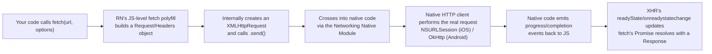

# React Native Senior Interview Q&A Handbook (Tier 8 — Networking Internals)

> Tier 8 of the running, tiered senior React Native interview Q&A series — see [Tier 3](07-tire3-native-js-communication.md) for the Native Module pattern every answer below reduces to, [Document 4 §5](04-app-architecture-and-production-concerns.md#5-networking) for the application-level networking patterns (interceptors, refresh tokens, retries, pagination) this tier does **not** repeat, and [Document 4 §6.4](04-app-architecture-and-production-concerns.md#64-certificate-pinning) for certificate pinning's security rationale. Where Document 4 §5 answers "how should you structure networking code in a production app," this tier answers "what actually happens, mechanically, below that layer" — verified directly against the official [Networking](https://reactnative.dev/docs/network) docs this session.

## Table of Contents

1. [How To Use This Tier](#1-how-to-use-this-tier)
2. [Tier 8 — Networking Internals](#2-tier-8--networking-internals)
3. [Key Terms Glossary](#3-key-terms-glossary)
4. [Further Reading](#4-further-reading)

---

## 1. How To Use This Tier

Questions are kept in their original order and numbered 1–11. They cluster into four themes: how `fetch()`/`XMLHttpRequest` actually execute under the hood (Q1–5), how RN's `fetch()` differs from the browser's, including CORS (Q6–8), and TLS/certificate-pinning mechanics (Q9–10), closing with a JS-thread-busy interaction scenario (Q11) that ties back to this series' recurring threading themes ([Tier 1](05-tire1-must-know-js-rn-native.md), [Tier 7](11-tire7-communication-and-architecture-scenarios.md)).

---

## 2. Tier 8 — Networking Internals

### 1. What happens internally when you call fetch() in React Native?

`fetch()` in React Native is **not** native code and **not** part of the JS engine — it's a JavaScript-level implementation of the standard [WHATWG Fetch API](https://developer.mozilla.org/en-US/docs/Web/API/Fetch_API) that ships as part of React Native's own JS codebase, and it's built **on top of** `XMLHttpRequest` (Q5), not a separate mechanism:



So the full chain for one `fetch()` call is: JS polyfill → `XMLHttpRequest` → Native Module (bridge call on the old architecture, direct JSI/TurboModule call on the new one) → the platform's own native HTTP stack → native-to-JS events reporting progress/completion → the `Promise` `fetch()` returned to you finally resolves (or rejects). None of the actual network I/O ever happens in JS.

### 2. Who actually performs an HTTP request in React Native?

**The native platform's own HTTP client — never JS, never the JS engine.** Concretely: `NSURLSession` on iOS, and (per React Native's own Android implementation) **OkHttp** on Android, both wrapped by RN's native Networking module (`RCTNetworking` on iOS; a `NetworkingModule` built on OkHttp on Android). Every part of what makes an HTTP request expensive and complex — DNS resolution, opening a TCP socket, the TLS handshake, connection pooling/keep-alive, following redirects, decompressing the response — is 100% native platform work, identical to what any other native iOS/Android app does. JS's only role is describing *what* request to make (URL, method, headers, body) and later being told the result.

### 3. Is React Native's fetch() implemented by the JavaScript engine?

**No — this is a common misconception worth correcting directly in an interview.** The JS engine (Hermes, JSC, or V8) is purely an *execution environment* for JavaScript — it runs whatever JS code is handed to it, but `fetch` is not a language primitive the way `Array.prototype.map` is. It's a **host-environment API**: a JS-level polyfill function that RN provides, which itself calls out to native code. This is exactly the same relationship already established for `setTimeout`/`setInterval` in [Tier 1](05-tire1-must-know-js-rn-native.md) and [Tier 7](11-tire7-communication-and-architecture-scenarios.md#7-does-setinterval-guarantee-execution-at-exact-intervals) — neither is "part of JavaScript" either; both are environment-provided functions the engine merely executes.

### 4. How does JavaScript communicate with the native networking stack?

Through the same **Native Module** mechanism used for every other JS↔native interaction in this series ([Tier 3](07-tire3-native-js-communication.md#3-what-is-a-native-module)) — there is no separate, special-cased pipe just for networking. Specifically:

- **Old architecture:** `XMLHttpRequest.send()` calls into the `RCTNetworking`/`NetworkingModule` Native Module across the asynchronous, JSON-serializing Bridge.
- **New architecture:** the same module exposed as a TurboModule, called directly through JSI — no JSON serialization round-trip.

Because a network request is inherently asynchronous and often streamed (you don't get the whole response in one atomic step), the module doesn't just return a value — it **emits a sequence of events back to JS** as the request progresses (data received, response complete, error), which is what `XMLHttpRequest`'s `readyState` transitions and `onreadystatechange` callback are actually built on.

### 5. How does XMLHttpRequest work in React Native?

Per the official docs, **"The `XMLHttpRequest` API is built into React Native."** It's the lower-level primitive `fetch()` itself is built on (Q1), and it's deliberately kept close enough to the browser's `XMLHttpRequest` that unmodified third-party libraries written against it — axios, frisbee — work in RN without changes:

```js
const request = new XMLHttpRequest();
request.onreadystatechange = (e) => {
  if (request.readyState !== 4) return;
  if (request.status === 200) {
    console.log('success', request.responseText);
  } else {
    console.warn('error');
  }
};
request.open('GET', 'https://mywebsite.com/endpoint/');
request.send();
```

Every one of `.open()`, `.send()`, `.readyState`, `.status`, and `.responseText` is backed by the Native Module round-trip described in Q4 — `.send()` is the call that actually crosses into native code, and the native layer's progress/completion events are what drive `readyState` forward and fire `onreadystatechange`.

### 6. What is the difference between browser fetch() and React Native fetch()?

They share the same JS-facing API surface (both implement the Fetch API spec closely enough that code looks identical), but diverge in several concrete, documented ways:

| | Browser `fetch()` | React Native `fetch()` |
|---|---|---|
| Transport | The browser's own networking stack, integrated with its cookie jar, HTTP cache, and tab-level security model | Native `XMLHttpRequest` → Native Module → `NSURLSession`/OkHttp |
| CORS | Enforced (Q7/Q8) | **Not enforced at all** — no concept of origin |
| `redirect: 'manual'` | Supported | **Not currently working** (per official docs) |
| `credentials: 'omit'` | Supported | **Not currently working** (per official docs) |
| Cookie-based auth | Works reliably | Documented as **"currently unstable"**, with known issues around redirects and `Set-Cookie` |
| Transport security defaults | Governed by the page's own origin/HTTPS state | iOS: App Transport Security enforces HTTPS by default; Android API 28+: cleartext blocked by default (Q9) |
| Duplicate-named headers | Preserved | On Android, **only the last one is kept** (a documented quirk) |

### 7. Does React Native have browser CORS restrictions?

**No.** This is stated directly in the official docs: *"The security model for XMLHttpRequest is different than on web as there is no concept of [CORS] in native apps."* A React Native app can call any HTTPS (or, if permitted, HTTP) endpoint directly — no preflight `OPTIONS` request, no checking an `Access-Control-Allow-Origin` response header, no same-origin policy of any kind.

### 8. Why does CORS behave differently in React Native?

Because **CORS is a browser-enforced policy, not an HTTP-level or server-level one** — and a React Native app isn't a browser. CORS exists to protect a very specific, browser-specific risk: a page from origin A running JS that could otherwise silently make authenticated requests (riding the user's existing cookies/session) to origin B on the user's behalf, inside a shared browsing context the user didn't consciously choose to trust. The browser's own networking stack and JS sandbox are the things that check the `Origin` header and enforce the policy — there is no separate "CORS server" or "CORS protocol feature" being bypassed; the *enforcer* itself simply isn't present in a compiled native app making direct native socket connections.

**One nuance worth adding unprompted:** a `WebView` embedded inside a React Native app *does* enforce CORS, because a WebView is a real embedded browser engine with its own origin model. It's specifically RN's own `fetch`/`XMLHttpRequest` — which bypass any WebView entirely and call straight into the native HTTP client (Q2) — that have no concept of origin to enforce in the first place.

### 9. How does React Native handle SSL/TLS?

By default, **entirely natively, the same way any other native app on that platform does** — React Native does not reimplement, intercept, or weaken TLS itself. The actual handshake and certificate validation against the device's trusted root CA store is handled by whichever native HTTP client is doing the real work (Q2): `NSURLSession`'s TLS stack on iOS, OkHttp's on Android. Two platform defaults worth knowing cold, both confirmed in the official docs:

- **iOS 9+ enforces App Transport Security (ATS) by default**, which requires all connections to use HTTPS. A cleartext `http://` URL needs an explicit ATS exception added to `Info.plist` (ideally scoped to only the specific domains that need it) — and Apple's App Store review requires reasonable justification for disabling ATS broadly.
- **Android API level 28+ (Pie) blocks cleartext traffic by default** too, overridable via `android:usesCleartextTraffic` in the manifest.

Both defaults exist for the same reason: to make it hard to *accidentally* ship a production app that talks to a backend over plain, unencrypted HTTP.

### 10. Where would you implement certificate pinning?

**Always natively — it is not something JS can implement or even meaningfully call into directly**, because the pin check has to happen at the exact moment the TLS handshake's certificate chain is being validated, which is native platform code (see [Document 4 §6.4](04-app-architecture-and-production-concerns.md#64-certificate-pinning) for why you'd want pinning at all). Concretely:

- **Android:** OkHttp's built-in `CertificatePinner` (configured with the expected public-key hashes), or a custom `TrustManager`, both set up wherever the OkHttp client RN's networking module uses is constructed/configured.
- **iOS:** either a manual `URLSession` delegate implementing `urlSession:didReceiveChallenge:completionHandler:` that inspects the server's presented certificate/public key against a bundled pinned value, or a dedicated library (e.g., TrustKit) that does this for you. React Native's own networking doc confirms there's a supported native hook for exactly this kind of customization — `RCTSetCustomNSURLSessionConfigurationProvider`, called early in `application:didFinishLaunchingWithOptions:`, lets you supply a custom `NSURLSessionConfiguration` for the session RN uses for every request.
- **In practice:** most RN teams reach for a community native module (e.g., `react-native-ssl-pinning`) that wraps an already-pinned native HTTP client and exposes a JS-callable API, rather than hand-writing the native delegate code themselves — but the underlying mechanism is always native, never JS.

### 11. What happens when the network request completes while the JS thread is busy?

**Nothing is lost — the response is already fully received natively — but delivery to JS is delayed, not broken.** The actual socket I/O, response download, and (per Q2) native HTTP client work all happen off the JS thread entirely, on the OS's own networking threads. When the native layer is ready to tell JS "the response is ready" (Q4's event-emission step), that event has to be delivered onto the JS thread's queue like any other native→JS message — and if the JS thread's call stack is currently busy (or blocked, per [Tier 1 Q16](05-tire1-must-know-js-rn-native.md#16-what-happens-when-the-js-thread-is-blocked-for-5-seconds)/[Tier 7 Q1](11-tire7-communication-and-architecture-scenarios.md#1-if-js-thread-is-blocked-can-a-button-still-visually-respond)), that event simply queues up behind whatever's running. The `fetch()` Promise doesn't resolve, and `XMLHttpRequest`'s `onreadystatechange` doesn't fire, until the JS thread frees up and works through its backlog — at which point it fires exactly as it would have, just later than the data actually arrived. This is purely a **latency** problem (the UI reacting to the response is delayed), never a correctness or data-loss problem.

---

## 3. Key Terms Glossary

| Term | Meaning |
|---|---|
| **Polyfill** | A JS-level implementation of a standard API (here, `fetch`), as opposed to something built into the engine or provided natively. |
| **`RCTNetworking` / `NetworkingModule`** | React Native's own Native Module wrapping the platform's real HTTP client; the thing `XMLHttpRequest.send()` actually calls into. |
| **`NSURLSession`** | Apple's native HTTP client API on iOS; the actual transport underneath every RN network request on that platform. |
| **OkHttp** | The HTTP client library React Native's Android implementation uses under the hood to perform real network requests. |
| **ATS (App Transport Security)** | iOS's default policy (since iOS 9) requiring HTTPS for all connections unless an explicit exception is declared. |
| **Cleartext traffic** | Unencrypted (plain `http://`) network traffic; blocked by default on Android API 28+. |
| **CORS (Cross-Origin Resource Sharing)** | A browser-enforced policy restricting cross-origin requests from web pages; not applicable to native apps, which have no "origin." |

*(See [Document 4 §6.4](04-app-architecture-and-production-concerns.md#64-certificate-pinning) for **Certificate Pinning** itself — not redefined here — and [Tier 3's glossary](07-tire3-native-js-communication.md#3-key-terms-glossary) for **Native Module** / **Bridge** / **JSI**.)*

---

## 4. Further Reading

- Networking (React Native) — https://reactnative.dev/docs/network
- `Fetch API` (MDN) — https://developer.mozilla.org/en-US/docs/Web/API/Fetch_API
- `XMLHttpRequest` (MDN) — https://developer.mozilla.org/en-US/docs/Web/API/XMLHttpRequest
- Cross-Origin Resource Sharing (Wikipedia, linked directly from the official RN networking doc) — https://en.wikipedia.org/wiki/Cross-origin_resource_sharing
- Related: [Document 4 §5](04-app-architecture-and-production-concerns.md#5-networking) (application-level networking: interceptors, refresh tokens, retries, pagination)
- Related: [Document 4 §6.4](04-app-architecture-and-production-concerns.md#64-certificate-pinning) (why certificate pinning matters)
- Related: [Tier 3](07-tire3-native-js-communication.md) (the Native Module/Bridge/JSI mechanics every answer here builds on)
- Related: [Tier 1](05-tire1-must-know-js-rn-native.md) / [Tier 7](11-tire7-communication-and-architecture-scenarios.md) (JS-thread-blocked behavior, referenced in Q11)
