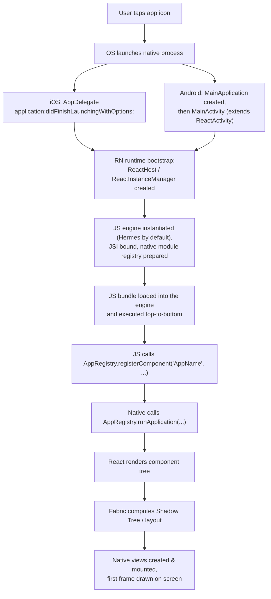
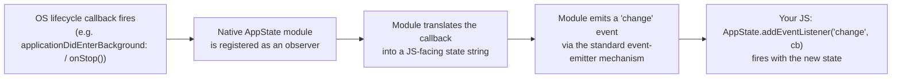

# React Native Senior Interview Q&A Handbook (Tier 9 — Native App Lifecycle)

> Tier 9 of the running, tiered senior React Native interview Q&A series — see [Document 1 §9 (Fabric/TurboModules)](01-architecture-and-internals.md#9-fabric) and [§14 (Hermes)](01-architecture-and-internals.md#14-hermes) for the engine/module internals this tier assumes, [Tier 3](07-tire3-native-js-communication.md) for the Native Module pattern every lifecycle hook below relies on, and [Tier 7 Q5–6](11-tire7-communication-and-architecture-scenarios.md#5-what-happens-when-the-application-goes-into-the-background) for the JS-facing `AppState` API — this tier instead walks the **native-side mechanics** from process launch to backgrounding that produce those JS-facing effects.

## Table of Contents

1. [How To Use This Tier](#1-how-to-use-this-tier)
2. [Tier 9 — Native App Lifecycle](#2-tier-9--native-app-lifecycle)
3. [Key Terms Glossary](#3-key-terms-glossary)
4. [Further Reading](#4-further-reading)

---

## 1. How To Use This Tier

Questions stay in original order, numbered 1–12, and cluster into three themes: the end-to-end app-launch sequence from icon tap to first rendered frame (Q1–6), what concretely differs between Debug and Release builds and where Metro fits into (and out of) that picture (Q7–10), and the native OS lifecycle callbacks behind foreground/background transitions (Q11–12). Several answers intentionally point back to [Tier 7](11-tire7-communication-and-architecture-scenarios.md) rather than repeating it — this tier adds the native layer underneath what Tier 7 already covered from the JS side.

---

## 2. Tier 9 — Native App Lifecycle

### 1. What happens when a React Native application starts?

At a high level, five phases happen in strict order, each one a prerequisite for the next:

1. **OS process launch** — the operating system launches the app's native process and calls its platform-specific entry point.
2. **Native bootstrap** — platform code (`AppDelegate` on iOS, `MainApplication`/`MainActivity` on Android) creates and configures the React Native runtime, pointing it at a JS bundle location and a registered app name.
3. **Runtime initialization** — the JS engine (Hermes, by default) is instantiated, the JSI binding is wired up, and the native module registry is prepared (Q3).
4. **Bundle load and execution** — the JS bundle is loaded into the engine and executed top to bottom, ending in a call to `AppRegistry.registerComponent(...)` (Q5–6).
5. **First render** — native code calls `AppRegistry.runApplication(...)`, React renders its component tree, Fabric computes the initial layout, native views are created and mounted, and the first frame is drawn.

Q2 below walks this same sequence with platform-specific function/class names named explicitly.

### 2. What happens from tapping the app icon until the first React component renders?

Platform specifics worth naming in an interview:

- **iOS:** the app's `main()` hands off to `UIApplicationMain`, which calls `AppDelegate`'s `application:didFinishLaunchingWithOptions:` — the conventional place where (depending on RN version/template) an `RCTBridge`+`RCTRootView` (old architecture) or an `RCTAppDelegate` subclass / `ReactNativeFactory` (new architecture) is configured.
- **Android:** the OS instantiates the `Application` subclass (`MainApplication`, implementing `ReactApplication`) before anything else, then launches `MainActivity` (extending `ReactActivity`), which obtains the RN instance from the host's `ReactNativeHost`/`ReactHost`.

Everything from "RN runtime bootstrap" onward is platform-agnostic from JS's point of view — by the time your JS code starts running, the engine, JSI, and module registry already exist.

### 3. How is the React Native runtime initialized?

"Runtime initialization" is step 3 from Q1/Q2, zoomed in: it's the moment the JS engine (Hermes) is instantiated as a VM instance, the **JSI** binding is created so native and JS objects can reference each other directly, and the **native module registry** is prepared so JS can later look up modules by name. The one detail most worth citing here, because it materially affects startup cost, is already established in [Document 1 §9](01-architecture-and-internals.md#9-fabric): under the legacy architecture, *"Legacy Native Modules were all instantiated eagerly at app startup — even modules the app never actually used"*; under the new architecture, **TurboModules are lazily initialized** — *"the native object is only created the first time JS actually references it"* — which directly reduces the amount of work done during this initialization phase and is one of the New Architecture's concrete, measurable startup-time wins.

### 4. When is Hermes initialized?

Very early — Hermes has to exist as a running VM **before** any JS can execute, so its initialization is part of the runtime-initialization step (Q3), happening before the bundle is loaded (Q5). The important distinction to draw out in an interview is that **"Hermes initializing" and "Hermes compiling" are two different moments, separated by a long time**: the VM instance is created fresh at every app launch (milliseconds of work), but the expensive part — compiling your JS source into Hermes Bytecode — already happened once, ahead of time, **at build time**, via Hermes's own compiler `hermesc`, as [Document 1 §14](01-architecture-and-internals.md#14-hermes) already establishes: *"Hermes precompiles JS to bytecode ahead of time (via its compiler, `hermesc`, as part of the Metro/build pipeline) and ships that bytecode in the app bundle."* So by the time Hermes initializes at runtime in a Release build, there's no parsing or compiling left to do — it just loads precompiled bytecode directly off disk.

### 5. When is the JS bundle loaded?

Immediately after the runtime initializes (Q3–4) — it's the very next substantive step, and the very first JS-thread work that happens. What "loading" means differs by build type:

- **Release:** a static bundle file (plain JS, or more commonly Hermes Bytecode `.hbc`) embedded inside the installed app package is read directly off local disk and executed. No network involved.
- **Debug (when running against a Metro dev server):** the bundle is instead fetched over HTTP from the Metro server (e.g., `http://localhost:8081/index.bundle?platform=ios&dev=true`), which is why Debug cold starts are slower and why Debug mode requires either the same Wi-Fi network or USB port-forwarding (`adb reverse` on Android) to reach the dev machine.

### 6. How does the native application find the JavaScript bundle?

Through a small, explicitly native piece of configuration — JS has no say in where its own bundle comes from, since JS doesn't exist yet at this point in the sequence:

- **iOS:** the app delegate (or `RCTAppDelegate` subclass, on newer templates) implements a bundle-URL-providing method. In Debug, it typically returns a `localhost:8081` URL via `RCTBundleURLProvider`; in Release, it returns a `file://` URL pointing at `main.jsbundle` inside the app's own bundle resources (`[[NSBundle mainBundle] URLForResource:@"main" withExtension:@"jsbundle"]`).
- **Android:** the `ReactNativeHost`'s `getUseDeveloperSupport()` flag (tied to whether it's a debug or release build) governs the same branch. In Release, the bundle is read from the assets packaged into the APK/AAB (conventionally `index.android.bundle` under `android/app/src/main/assets`, generated by Gradle's bundling task during the build).

### 7. What happens differently in Debug vs Release builds?

| Aspect | Debug | Release |
|---|---|---|
| **Dev Menu** | Available (shake gesture / keyboard shortcut) | **Automatically disabled** (confirmed in official docs) |
| **Bundle source** | Live from Metro dev server (Q5) | Static bundle baked into the binary at build time |
| **Fast Refresh / hot reload** | Enabled | N/A — no live connection to Metro |
| **Hermes bytecode** | May compile on-device on first load if served raw JS from Metro | Precompiled to `.hbc` ahead of time, at build time |
| **Error UI** | RedBox/LogBox overlays for JS errors ([Tier 7 Q2](11-tire7-communication-and-architecture-scenarios.md#2-if-js-thread-crashes-what-happens-to-the-native-application)) | No dev overlay — handled by your own error boundaries / crash reporting |
| **Android permissions** | Includes `SYSTEM_ALERT_WINDOW` (used by dev-only error overlays) | **Stripped** — not present in the shipped app |
| **Signing** | Debug keystore / development provisioning profile | Real release signing config ([Tier 11](15-tire11-app-store-play-store-release.md)) |
| **Performance** | Deliberately slower (extra logging, dev-only warnings/checks, no release optimizations) | Representative of real user performance |
| **Works offline from dev machine** | Only if a static bundle was also generated for the device (see note below) | Always — JS is bundled locally into the binary |

One nuance confirmed directly in the official publishing docs: on iOS, a static JS bundle is actually generated **even for a Debug build**, any time you target a physical device (not just Release/Archive builds) — this can be skipped for faster local iteration by setting `SKIP_BUNDLING=true` as an environment variable on the "Bundle React Native code and images" Xcode build phase, which is only safe to do because the device-targeted Debug build can instead talk live to Metro over the network.

### 8. Where does Metro fit into the React Native architecture?

Metro is React Native's **JavaScript bundler** — a build/dev-time tool, not something that runs inside the shipped app. Per its own documentation, *"Metro is a JavaScript bundler. It takes in an entry file and various options, and gives you back a single JavaScript file that includes all your code and its dependencies."* It operates in three distinct stages:

1. **Resolution** — starting from your entry file, build the full module dependency graph by following every `import`/`require`.
2. **Transformation** — transpile each module individually into a target-understandable format (this is where Babel-based JSX/TypeScript transpilation happens), parallelized across CPU cores for speed.
3. **Serialization** — combine all transformed modules into one (or more) final bundle file(s).

In **Debug/dev mode**, Metro additionally runs as a **live HTTP + WebSocket dev server** (`localhost:8081` by default) that serves bundles on demand, supports Fast Refresh (re-transforming and re-serving just the changed part of the module graph), and provides the transport for remote JS debugging and stack-trace symbolication. In **Release mode**, Metro's role shrinks to a **single, one-time, build-time invocation** — triggered by Gradle's bundling task on Android or the "Bundle React Native code and images" build phase script in Xcode — that produces the static JS bundle file which then gets embedded into the APK/AAB or IPA. After that build step finishes, Metro is completely out of the picture.

### 9. Why isn't Metro required in a normal production application?

Because Metro's entire job is *producing* a bundle file, and a Release build already has that file baked into the installed binary (Q6) from the moment it was built. The installed app never makes a network call to Metro, never asks it to resolve, transform, or serialize anything live — it just reads its own embedded static bundle off local disk, the same way it would read any other bundled resource. This is also exactly why a Release build works with zero network connection to a development machine at all — the official publishing docs confirm this directly: Release mode *"will also bundle the JavaScript locally, so you can put the app on a device and test whilst not connected to the computer."*

### 10. What is the difference between a Metro bundle and an OTA bundle?

They're the **same kind of artifact** produced by the **same tool** (Metro's serialization stage, Q8) — the difference is entirely about **delivery mechanism and timing**, not format:

- A plain **"Metro bundle"**, in the normal production sense, is produced at build time and embedded directly inside the native binary (APK/AAB/IPA) that goes through app-store review and gets installed by the user (Q6).
- An **OTA bundle** ([Tier 10](14-tire10-ota-and-release-architecture.md)) is also a Metro-produced JS bundle (typically also Hermes-compiled), but instead of being embedded at build time, it's uploaded separately to an update service/CDN and downloaded at runtime by an **already-installed** app, which then swaps it in for the bundle it originally shipped with — without any new app-store submission.

The OTA bundle carries one extra constraint the build-time bundle never has to worry about: it must remain compatible with whatever **native code is already installed** on the device, since no new native code is shipping alongside it — a theme [Tier 10 Q5](14-tire10-ota-and-release-architecture.md#5-how-do-you-guarantee-ota-compatibility-with-the-installed-native-binary) covers in depth.

### 11. What happens when the application moves foreground → background → foreground?

This is covered from the JS-facing side in [Tier 7 Q5–6](11-tire7-communication-and-architecture-scenarios.md#5-what-happens-when-the-application-goes-into-the-background) (the `AppState` values, and what happens to timers) — this answer adds the **native OS callbacks underneath** that actually drive those JS-facing effects:

- **Going to background — iOS:** `applicationWillResignActive:` fires first (transitional — losing focus, e.g. a system alert or an incoming call could also trigger this transiently), then `applicationDidEnterBackground:` once fully backgrounded.
- **Going to background — Android:** `onPause()` fires first, then `onStop()`. Under severe memory pressure, the OS can kill the process outright without any further callback.
- **Returning to foreground — iOS:** `applicationWillEnterForeground:` fires, then `applicationDidBecomeActive:`.
- **Returning to foreground — Android:** `onRestart()` → `onStart()` → `onResume()`.

These are the exact native lifecycle hooks Q12's `AppState` module listens to.

### 12. How does React Native know about AppState changes?

Through the same **Native Module** mechanism used everywhere else in this series ([Tier 3](07-tire3-native-js-communication.md)) — `AppState` is not magic; it's a native module that **observes the OS lifecycle callbacks from Q11** and re-emits them as a JS event:

Concretely: on iOS, the native `AppState` module subscribes via `NotificationCenter` to the system notifications that correspond 1:1 with the `UIApplicationDelegate` callbacks in Q11 (`UIApplicationDidBecomeActiveNotification`, `UIApplicationWillResignActiveNotification`, `UIApplicationDidEnterBackgroundNotification`, `UIApplicationWillEnterForegroundNotification`); on Android, it registers via `ActivityLifecycleCallbacks` on the `Application` instance (or receives forwarded calls from `ReactActivity`'s own lifecycle methods). Either way, the moment the OS fires one of these, the native module emits a JS event through the same device-event-emitter pattern used for push notifications ([Tier 7 Q11](11-tire7-communication-and-architecture-scenarios.md#11-how-do-push-notifications-communicate-with-the-react-native-application)) — which is exactly what your `AppState` listener is subscribed to.

---

## 3. Key Terms Glossary

| Term | Meaning |
|---|---|
| **`AppDelegate`** | iOS's native application entry-point class; hosts the callbacks that drive both app launch and foreground/background transitions. |
| **`MainApplication` / `MainActivity`** | Android's native application/activity entry-point classes; analogous role to `AppDelegate` on iOS. |
| **`ReactNativeHost` / `ReactHost`** | The native-side object that knows how to create/configure the RN runtime instance (bundle location, dev-mode flag, package list). |
| **Metro** | React Native's JS bundler; runs resolution → transformation → serialization to produce a JS bundle, and doubles as a live dev server in Debug mode. |
| **`.hbc` (Hermes Bytecode)** | The precompiled artifact Hermes's compiler (`hermesc`) produces ahead of time at build time, loaded directly at runtime instead of raw JS. |
| **OTA bundle** | A Metro-produced bundle delivered to an already-installed app at runtime, rather than embedded at build time — see [Tier 10](14-tire10-ota-and-release-architecture.md). |

*(See [Tier 3's glossary](07-tire3-native-js-communication.md#3-key-terms-glossary) for **Native Module** / **Bridge** / **JSI**, and [Tier 7's glossary](11-tire7-communication-and-architecture-scenarios.md#3-key-terms-glossary) for **`AppState`**.)*

---

## 4. Further Reading

- Hermes (React Native) — https://reactnative.dev/docs/hermes
- Signed APK (React Native, Android build/signing flow) — https://reactnative.dev/docs/signed-apk-android
- Publishing to Apple App Store (React Native) — https://reactnative.dev/docs/publishing-to-app-store
- Metro — Concepts — https://metrobundler.dev/docs/concepts/
- Related: [Document 1 §9 (Fabric/TurboModules)](01-architecture-and-internals.md#9-fabric) and [§14 (Hermes)](01-architecture-and-internals.md#14-hermes)
- Related: [Tier 3](07-tire3-native-js-communication.md) (Native Module pattern)
- Related: [Tier 7 Q5–6](11-tire7-communication-and-architecture-scenarios.md#5-what-happens-when-the-application-goes-into-the-background) (`AppState` JS API, timers in background)
- Related: [Tier 10](14-tire10-ota-and-release-architecture.md) (OTA bundles vs. build-time bundles, in depth)
