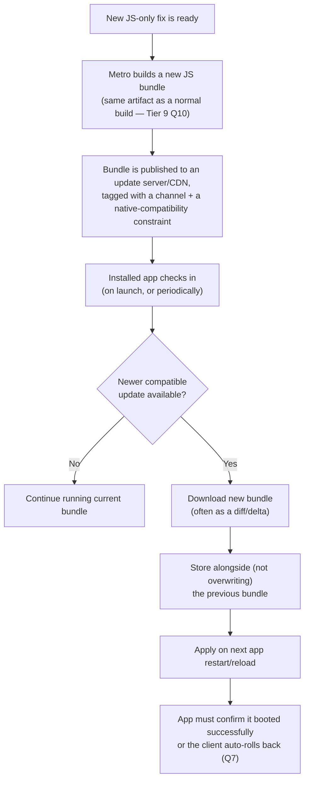

# React Native Senior Interview Q&A Handbook (Tier 10 — OTA & Release Architecture)

> Tier 10 of the running, tiered senior React Native interview Q&A series — see [Document 4 §11.6 (OTA Updates)](04-app-architecture-and-production-concerns.md#116-ota-updates) and [§11.7 (Rollback Strategy)](04-app-architecture-and-production-concerns.md#117-rollback-strategy) for the high-level summary this tier expands on in depth, and [Tier 9 Q10](13-tire9-native-app-lifecycle.md#10-what-is-the-difference-between-a-metro-bundle-and-an-ota-bundle) for how an OTA bundle relates to a normal build-time bundle.
>
> **A critical, current fact stated up front:** Microsoft's **CodePush** (the tool historically synonymous with "OTA updates for React Native") was retired along with the rest of Visual Studio App Center on **March 31, 2025**, and its GitHub repository was archived on **May 20, 2025** — it is now read-only. Several answers below still use CodePush's design as an **illustrative reference mechanism** (it remains the clearest publicly documented example of how a mobile OTA system's mechanics work), but it is explicitly **not** a tool you should recommend standing up fresh today. The current standard for OTA updates — including for bare/CLI React Native apps, not just Expo-managed ones — is **EAS Update** (built on the open-source `expo-updates` library), referenced throughout. Apple's exact phased-release percentages (Tier 11 Q11) could not be freshly re-verified via official Apple documentation this session (the pages 404'd); that one detail is flagged accordingly where it appears.

## Table of Contents

1. [How To Use This Tier](#1-how-to-use-this-tier)
2. [Tier 10 — OTA & Release Architecture](#2-tier-10--ota--release-architecture)
3. [Key Terms Glossary](#3-key-terms-glossary)
4. [Further Reading](#4-further-reading)

---

## 1. How To Use This Tier

Questions stay in original order, numbered 1–17, clustering into: the core OTA mechanism and its hard boundaries (Q1–6), rollback and staged-rollout design (Q7–8, Q11–13, Q15–16), release-strategy vocabulary (Q9–10), failure-mode scenarios (Q14–15), and the policy/technical limits of what OTA can never do (Q17). This is the most scenario/design-heavy tier so far — most answers describe a mechanism you'd build or configure, not just a fact to recall.

---

## 2. Tier 10 — OTA & Release Architecture

### 1. How does OTA updating actually work in a React Native CLI application?

At its core, every OTA mechanism — whether EAS Update today, historically CodePush, or a custom in-house system — follows the same general sequence:

For a bare/CLI React Native app specifically (not using the Expo managed workflow), this is most commonly implemented today by integrating the open-source `expo-updates` library directly (it doesn't require adopting all of Expo) and publishing through **EAS Update**, which downloads updates inside the app and applies them on the next launch/reload — no user reinstall needed.

### 2. What exactly gets updated during an OTA update?

**Only the JavaScript bundle and whatever JS-bundled assets Metro packages alongside it** (images, fonts, and other files pulled in via `require()`/`import` that end up in the bundle's asset graph). Explicitly **not** updated: any native code (Java/Kotlin/Objective-C/Swift), native dependencies or SDKs, declared app permissions (`Info.plist`/`AndroidManifest.xml`), or anything else that would require a newly compiled binary. This maps directly onto EAS Update's own documented guidance on what's appropriate to ship this way: JS bug/crash fixes, copy/styling/layout changes, and business logic expressible purely in JS — versus native code/dependency changes, permission changes, and Expo/React Native SDK version bumps, which are explicitly **not** appropriate for this channel (Q17 goes further into this boundary).

### 3. Can native code be updated through OTA?

**No — never, under any implementation.** This follows directly from Q2: an OTA update only ever replaces the JS bundle that an *already-compiled* native shell loads and interprets. The native shell itself — everything it was compiled with — is fixed at install time and stays that way until the user installs an actual new binary through the App Store or Google Play (Tier 11). There is no OTA mechanism, past or present, capable of modifying compiled native code; this isn't a current tooling limitation, it's a structural property of how JS bundles and native binaries relate to each other (Tier 9 Q6/Q10).

### 4. Why can't a new native module safely be delivered through OTA?

Two independent reasons:

1. **It's mechanically impossible, not just unsafe.** A Native Module is compiled code — a Java/Kotlin or Objective-C/Swift class registered into the native module registry *at native build time* ([Tier 3](07-tire3-native-js-communication.md)). JS cannot create, compile, or load new native code at runtime under any circumstance — it can only call methods on native modules that **already exist** in the currently-installed binary. An OTA bundle whose JS code references a module that was never compiled into that binary has nothing to call (this is exactly Q6's crash scenario).
2. **Even a hypothetical workaround would be a policy violation.** Apple's App Store Review Guideline 3.3.2 (quoted in full in Q17) exists specifically to prevent interpreted-code updates from bypassing App Store review of new functionality — and explicitly prohibits anything that would "bypass signing, sandbox, or other security features of the OS," which is precisely what smuggling compiled native code through a JS-bundle channel would attempt to do.

### 5. How do you guarantee OTA compatibility with the installed native binary?

This is the single most important design question in this tier, and it has a concrete, directly-documented answer in EAS Update: **runtime version policies**. Per Expo's own documentation: *"EAS Update uses runtime version policies to ensure updates are only sent to builds with compatible native code. If your native code changes, you create a new runtime version."* Mechanically: every native binary build is tagged with a runtime version string (bumped manually, or derived automatically — e.g., a hash of native config); every OTA update you publish is tagged with the runtime version(s) it targets; the update server strictly refuses to serve an update to a device whose installed binary's runtime version doesn't match. A device on an incompatible runtime version simply never sees that update at all — the mismatch (Q6) becomes structurally unreachable rather than something you have to hope doesn't happen.

The same idea, implemented differently, is what CodePush did historically: each release could be tagged with a semver range via `--target-binary-version "~1.1.0"`, and since the client SDK reports its own installed app version at check-in time, the server only offered updates whose range included that version.

### 6. What happens if an OTA JavaScript bundle expects a native module that doesn't exist?

A **hard runtime failure**, not a graceful degradation — this is exactly the scenario Q5's version-gating exists to make structurally impossible. Concretely, when the bundle's JS eventually calls into the missing module:

- **Old architecture:** accessing `NativeModules.MyNewModule` typically yields `undefined`, so the subsequent method call throws a JS `TypeError` ("Cannot read property 'someMethod' of undefined").
- **New architecture (TurboModules):** the lookup goes through `TurboModuleRegistry.getEnforcing('MyNewModule')`, which is deliberately designed to **fail loudly and immediately** — an invariant violation / native-level crash — rather than silently return `undefined`.

Either way, this is typically an unrecoverable crash for the affected screen/app session — which is exactly why both Q5 (prevent the mismatch from ever being servable) and Q7/Q15 (auto-rollback as a last line of defense if one somehow slips through) matter.

### 7. How would you implement OTA rollback?

Two complementary layers, both worth naming explicitly:

- **Device-side, crash-triggered automatic rollback.** The OTA client library keeps the previous known-good bundle on-device rather than deleting it the moment a new one is applied. The app is required to make an explicit "I booted successfully" acknowledgment shortly after launching on a new bundle (CodePush's documented API for this was `codePush.notifyApplicationReady()`) — if that call never happens, because the app crashed before reaching it, the client library concludes the update is bad and **automatically reverts to the last-known-good bundle** on the next launch, with zero user or server action required. CodePush's own docs put it plainly: without that call, *"the plugin will think your update failed and roll it back."*
- **Server-side, instant distribution-level revert.** Independently of any individual device's crash detection, you can stop serving a bad release outright, or explicitly republish a previous, already-validated bundle as the new "current" one — EAS Update's **republish** feature does exactly this, letting you instantly make an older update current again so every subsequent check-in receives the good bundle instead of the bad one.

A robust design uses **both**: the device-side mechanism protects the specific device that already downloaded the bad update; the server-side mechanism protects everyone else who hasn't yet.

### 8. How would you implement staged OTA rollout?

Publish the new bundle to only a **percentage** of the target channel's devices initially, rather than 100% at once, then watch crash/error telemetry and key product metrics for that cohort before incrementally increasing the percentage (manually or on a schedule), with the ability to freeze or reverse at any point. CodePush's CLI illustrates the two-step shape of this well: first `appcenter codepush promote -a <owner>/<app> -s Staging -d Production -r 20` (ship to ~20% of Production), monitor, then `appcenter codepush patch -a <owner>/<app> Production -r 100` (expand to everyone) once confidence is established. The selection of *which* devices land in a given percentage should be done via consistent hashing of a stable per-device identifier server-side — not re-randomized on every check-in — so a device doesn't flip in and out of the cohort between checks (the same statistical property Google Play's own staged rollout relies on — Tier 11 Q10).

### 9. What is a canary release?

A release strategy where a new version ships first to a small, representative, closely-monitored subset of users — the "canary" group (named for the historical coal-mine canary used as an early-warning system) — while the majority of users stay on the current stable version. The canary cohort's crash rates, errors, and key metrics are watched closely; the release only proceeds to the wider population if the canary group shows no regressions, and gets pulled before most users are ever affected if it doesn't. In the mobile-OTA world, this is conceptually the same mechanism as a staged rollout (Q8) — "canary" emphasizes the *purpose* (limit blast radius, get an early warning signal), while "staged rollout" emphasizes the *mechanism* (percentage-based, incrementally expanding).

### 10. Canary vs blue-green vs rolling release — what is the difference?

| Strategy | Core idea | How rollback works | Fit for mobile OTA |
|---|---|---|---|
| **Canary** | Small, closely-monitored subset first; expand only if healthy | Pull the canary release before wide exposure | Strong fit — this *is* a staged/percentage rollout (Q8–9) |
| **Blue-green** | Two **complete**, fully parallel environments; one atomic traffic cutover from old ("blue") to new ("green") | Instant — switch traffic back to blue | **Weak fit** — there's no load balancer to flip in a mobile app; the closest analogue is instantly changing which channel/deployment is "current" (e.g., EAS Update's republish, Q7) |
| **Rolling** | Gradual, incremental replacement over time, without maintaining two full parallel environments | Typically slower — has to roll back increment by increment | Reasonable fit for a percentage rollout that ramps on a timer **without** active health-gating at each step |

Worth stating directly in an interview: all three terms originate from **backend/server deployment practice**, and none map perfectly onto mobile OTA — mobile has no load balancer, and (per Q3–4) can never run two different *native* binaries side by side for the same installed app the way blue-green runs two full server environments. Only the JS layer can be canaried, rolled, or staged at all.

### 11. How would you release an OTA update to only 5% of users?

Publish the update targeting exactly 5% of the channel — in the CodePush/App Center model this was the `-r 5` percentage flag on the promote/patch commands; EAS Update and most custom OTA servers expose an equivalent percentage-based rollout field. The 5% itself should be selected via consistent hashing of a stable per-device or per-user identifier on the server side, not re-rolled randomly on every check-in, so the **same** 5% keeps receiving the update on every subsequent check rather than a different random slice each time (this mirrors Google Play's staged rollout guarantee that halting and resuming affects the same user set — Tier 11 Q10). From there, monitor the 5% cohort's crash rate and relevant product metrics for an agreed bake-time window before deciding whether to expand the percentage (Q8) or roll back (Q7).

### 12. How would you automatically rollback an OTA update if crash rates increase?

Neither CodePush's nor EAS Update's stock tooling does this completely automatically out of the box — so frame this as a design you'd build on top of them:

1. **Tag every crash report with the active OTA release identifier.** Whatever crash-reporting tool you use (Sentry, Bugsnag, Crashlytics) should record which specific OTA bundle/release was active when the crash happened, not just the overall app version — otherwise you can't attribute a crash spike to a specific OTA release at all.
2. **Define an automated threshold check** comparing the new release's crash rate (for its current rollout cohort, Q8/Q11) against a baseline — the previous release's rate, or an absolute ceiling — evaluated continuously or on a schedule during the bake-time window.
3. **Wire the threshold breach to an automated action**, via the crash-reporting platform's webhook/alerting integration or a scheduled job polling its API, that calls your OTA server's API to immediately halt the rollout and/or republish the last known-good bundle (Q7's server-side revert) — the point is that a human doesn't have to be watching a dashboard at 3am for this to happen.
4. **Layer this on top of, not instead of, the device-side crash-on-launch rollback** (Q7/Q15) — the device-side mechanism protects the device that already crashed; this server-side mechanism protects everyone who hasn't downloaded the bad bundle yet.

### 13. How would you version native binaries and OTA bundles?

Track **two independent version axes**, and make the mapping between them explicit and queryable:

| Axis | What it tracks | Cadence | Example |
|---|---|---|---|
| **Native binary version** | The compiled app submitted to a store | Low — every store release (Tier 11) | `versionName`/`CFBundleShortVersionString` + a build number |
| **Runtime/compatibility version** | Which native-code "shape" an OTA bundle is safe to run against | Bumped only when native code changes | EAS Update's runtime version string; CodePush's `--target-binary-version` semver range |
| **OTA bundle version** | Each individual JS-only release | High — as often as you ship JS fixes | An incrementing release number, content hash, or timestamp |

The critical piece is the explicit **cross-reference** between the OTA bundle version and the runtime/compatibility version it targets (Q5) — this is what makes "which OTA bundles are currently valid for binary version 4.2.0?" a question you can answer instantly from the OTA platform's dashboard/API, rather than something inferred from tribal knowledge or a spreadsheet.

### 14. What happens if the user loses network connectivity while downloading an OTA update?

This should be a **non-event from the user's perspective**, by design:

- A well-built OTA client downloads to a temporary location and only atomically swaps the new bundle in **after** the download is fully complete and checksum-verified — a partial/truncated download must never be mistaken for a complete one and applied.
- If connectivity drops mid-download, the client simply abandons or pauses that attempt and continues running on the **current** bundle exactly as before — the user experiences no disruption, they just don't have the update yet. The download is retried later (next launch, next periodic check, or on connectivity restoration, depending on the client's retry policy).
- Using **delta/diff downloads** (a documented CodePush feature — only changed files are downloaded, not the full bundle) reduces both the odds of a connectivity drop mid-download in the first place and the cost of retrying if one happens.

### 15. What happens if an OTA update is downloaded but the application crashes on startup?

This is Q7's rollback mechanism at its most concrete trigger point, worth describing step by step: the new bundle downloaded successfully and was applied (swapped in to be used starting with the next launch) — but the very next launch using that bundle crashes before the app ever reaches its "I booted successfully" acknowledgment call. Because that call never fires, the OTA client library's own early-startup logic (which exists specifically to guard against this) concludes the update is broken and **automatically reverts to the previous known-good bundle** on the next launch attempt — no user action, no store resubmission, no manual server intervention required. This acknowledgment call isn't a nice-to-have; it's the entire mechanism that makes it safe to auto-apply OTA updates at all. Without it, a single bad release could permanently brick every device that downloaded it, since there'd be no signal telling the client "this one didn't work, go back."

### 16. How would you design a safe OTA update mechanism?

Synthesizing everything above into one coherent design:

1. Build the bundle via Metro as normal (Tier 9); tag it with the runtime-version/native-compatibility range it targets (Q5/Q13).
2. Publish to a staged percentage, never 100% immediately (Q8/Q11), selecting the cohort via consistent per-device hashing.
3. Download to a temp location; verify completeness/checksum before atomically swapping it in (Q14) — never half-apply a bundle.
4. Apply on next restart, not hot-swapped mid-session, to avoid a half-old/half-new running app.
5. Require an explicit "booted successfully" acknowledgment shortly after launch on a new bundle; silent failure to acknowledge triggers automatic device-side rollback (Q7/Q15).
6. Feed per-release-tagged crash telemetry into an automated or human-gated bake-time check before expanding the rollout percentage (Q12); maintain a one-action server-side "halt and revert everyone" switch independent of any individual device's own crash detection.
7. Respect the hard technical boundary of what OTA can ever touch (Q2–4) — never attempt to route native changes through this pipeline.
8. Respect platform policy (Q17) — never use this channel to change what the app fundamentally does in a way that should have gone through store review.

### 17. What should NEVER be shipped through OTA?

Three boundaries, two of them backed by direct quotes:

- **Technical boundary:** any native code change at all (Q3–4) — new or changed native modules, new native dependencies/SDKs, permission changes, or anything requiring a recompiled binary.
- **Apple's policy boundary** — App Store Review Guideline 3.3.2, verbatim: *"Interpreted code may be downloaded to an Application but only so long as such code: (a) does not change the primary purpose of the Application by providing features or functionality that are inconsistent with the intended and advertised purpose of the Application as submitted to the App Store, (b) does not create a store or storefront for other code or applications, and (c) does not bypass signing, sandbox, or other security features of the OS."* So even a pure-JS change can still be a policy violation if it fundamentally changes the app's purpose, turns it into a storefront for other code/apps, or works around OS security/sandboxing.
- **Google Play's policy boundary** — the exception that legitimizes JS-only OTA updates at all is scoped specifically to code *"that runs in a virtual machine and has limited access to Android APIs (such as JavaScript in a webview or browser)"* — step outside that sandboxed, limited-API execution model and you fall outside the exception too.
- **Worth adding unprompted:** newly-introduced secrets or sensitive API keys don't belong in an OTA bundle either — not because OTA can't technically carry a string literal, but because an OTA bundle, by construction, bypasses app-store review entirely (see [Document 4 §6.11](04-app-architecture-and-production-concerns.md#611-secrets-management) on why secrets don't belong bundled into client code at all, OTA or otherwise) — if anything, an OTA pipeline deserves *more* scrutiny and signing/integrity verification than a store-reviewed binary, not less.

---

## 3. Key Terms Glossary

| Term | Meaning |
|---|---|
| **OTA (Over-the-Air) update** | Delivering a new JS bundle to an already-installed app at runtime, without app-store review or a new binary install. |
| **CodePush** | Microsoft's historical RN OTA tool, part of Visual Studio App Center; **retired March 31, 2025**, repo archived May 20, 2025. Referenced here only as an illustrative mechanism. |
| **EAS Update** | Expo's current OTA solution, built on the open-source `expo-updates` library; works with bare/CLI RN apps, not just Expo-managed ones. |
| **Runtime version** | A tag on both native binaries and OTA bundles ensuring an update is only served to binaries with compatible native code (EAS Update's core compatibility mechanism, Q5). |
| **Staged rollout** | Releasing to an increasing percentage of users over time rather than 100% at once (Q8). |
| **Canary release** | A staged rollout framed around its monitoring/early-warning purpose rather than its percentage mechanism (Q9). |
| **Republish** | EAS Update's feature for instantly making a previous update current again — the server-side half of rollback (Q7). |

*(See [Tier 9's glossary](13-tire9-native-app-lifecycle.md#3-key-terms-glossary) for **Metro bundle** / **`.hbc`**, and [Document 4 §6.11](04-app-architecture-and-production-concerns.md#611-secrets-management) for **Secrets Management**.)*

---

## 4. Further Reading

- `microsoft/react-native-code-push` (GitHub — retirement notice, archived repo) — https://github.com/microsoft/react-native-code-push
- EAS Update — Introduction (Expo) — https://docs.expo.dev/eas-update/introduction/
- Related: [Document 4 §11.6 (OTA Updates)](04-app-architecture-and-production-concerns.md#116-ota-updates) and [§11.7 (Rollback Strategy)](04-app-architecture-and-production-concerns.md#117-rollback-strategy)
- Related: [Tier 9 Q10](13-tire9-native-app-lifecycle.md#10-what-is-the-difference-between-a-metro-bundle-and-an-ota-bundle) (Metro bundle vs. OTA bundle)
- Related: [Tier 11](15-tire11-app-store-play-store-release.md) (App Store/Play Store release mechanics, including Google Play's own staged rollout and Apple's phased release)
