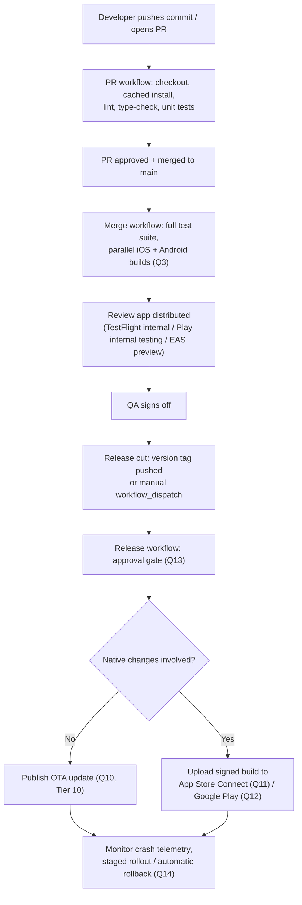

# React Native Senior Interview Q&A Handbook (Tier 12 — GitHub Actions / CI-CD)

> Tier 12 — the final tier of this series' current question bank — see [Document 4 §11.1 (The Pipeline)](04-app-architecture-and-production-concerns.md#111-the-pipeline) and [§11.2 (Environment Variables And Secrets)](04-app-architecture-and-production-concerns.md#112-environment-variables-and-secrets) for the pipeline-shape and secrets-vs-config summary this tier implements concretely in GitHub Actions, [Tier 10](14-tire10-ota-and-release-architecture.md) for OTA deployment mechanics, and [Tier 11](15-tire11-app-store-play-store-release.md) for the App Store/Play Store release mechanics this tier's workflows automate.
>
> **Workspace note:** several answers below follow this workspace's own conventions — `bby-ubuntu` runners instead of `ubuntu-latest`, Artifactory-hosted registries for npm/Maven/Gradle/container dependencies, and the `bby-corp/tplat-gha-configure-github-credentials` action for GIAM credential configuration — called out explicitly wherever they're relevant, not as generic GitHub Actions advice.

## Table of Contents

1. [How To Use This Tier](#1-how-to-use-this-tier)
2. [Tier 12 — GitHub Actions / CI-CD](#2-tier-12--github-actions--ci-cd)
3. [Key Terms Glossary](#3-key-terms-glossary)
4. [Further Reading](#4-further-reading)

---

## 1. How To Use This Tier

Questions stay in original order, numbered 1–20, clustering into: overall pipeline design (Q1–3), secrets and credential handling (Q4–7), environment/configuration management (Q8–9), deployment automation per release channel (Q10–12), production-safety controls (Q13–16), and operational efficiency/governance (Q17–20).

---

## 2. Tier 12 — GitHub Actions / CI-CD

### 1. How would you design a React Native CI/CD pipeline?

Start from the gated-stages shape already established in [Document 4 §11.1](04-app-architecture-and-production-concerns.md#111-the-pipeline) — lint → type-check → unit tests → build → security scan → review app → QA → release — and map it onto concrete GitHub Actions constructs:

- **Separate workflows per trigger**, not one monolithic file: a fast `pull_request`-triggered workflow for lint/type-check/unit-tests; a heavier build workflow for native compilation, often gated to run only once PR checks pass or only on merge to the default branch; a release workflow triggered by a version tag push or manual `workflow_dispatch`.
- **Jobs with `needs:`** express the dependency graph explicitly (build can't start until lint passes; deploy can't start until build and tests succeed) — independent stages (e.g., lint and unit tests) should have no `needs:` between them so they run in parallel.
- **Reusable workflows / composite actions** share common setup (checkout, dependency install) across jobs/workflows without duplicating YAML.
- **Runner choice**: Linux-based jobs (lint, type-check, unit tests, Android builds) use `bby-ubuntu` per this workspace's convention instead of `ubuntu-latest`; iOS builds require a macOS runner regardless, since Xcode only runs on macOS.
- **Environments** (Q13) gate the actual production deployment step specifically, separate from the mechanical build/test stages that don't need human approval.

### 2. What happens from git push to production release?



The one branch decision worth calling out explicitly in an interview is step **I** — whether the change needs native code at all directly determines which of two very differently-paced release paths it takes ([Tier 11 Q14–15](15-tire11-app-store-play-store-release.md#14-how-would-you-handle-a-critical-production-bug-that-doesnt-require-native-changes)).

### 3. How would you build iOS and Android simultaneously using GitHub Actions?

Define them as **two separate jobs within one workflow**, not as two values of a single `strategy.matrix` dimension — the platforms fundamentally need different operating systems, so they can't share a runner the way a true matrix axis (e.g., Node version, or build flavor) can:

```yaml
jobs:
  build-android:
    runs-on: bby-ubuntu
    steps: [...]
  build-ios:
    runs-on: macos-14
    steps: [...]
```

Jobs with **no `needs:` dependency between them run in parallel automatically** — that's the entire mechanism; nothing extra has to be configured to make them "simultaneous" beyond simply not declaring a dependency from one to the other. `strategy.matrix` is still useful *within* each platform's job for a different axis — e.g., building `dev`/`staging`/`production` flavors (Q8) in parallel sub-jobs for the same platform. Shared setup (checkout, installing JS dependencies) is commonly factored into a composite action so both jobs don't duplicate that YAML.

### 4. How would you securely store signing certificates and provisioning profiles?

Certificates (`.p12`) and provisioning profiles (`.mobileprovision`) are **binary files**, and GitHub secrets are plain text fields, so the standard pattern is:

1. **Base64-encode** the binary file locally: `base64 -w 0 cert.p12 > cert.base64`.
2. Store the resulting text as a secret: `gh secret set IOS_CERTIFICATE_BASE64 < cert.base64` (and the certificate's own import passphrase as a separate secret).
3. **Decode it back to a binary file at workflow runtime**: `echo "$IOS_CERTIFICATE_BASE64" | base64 --decode > cert.p12`, typically imported into a temporary keychain created just for that CI run and destroyed afterward.

In practice, most teams avoid juggling N separate base64 secrets per cert/profile/environment by using **Fastlane `match`** instead ([Document 4 §11.3](04-app-architecture-and-production-concerns.md#113-signing)): it stores pre-encrypted certs/profiles in a private git repository, so CI only needs **one** secret — the `match` repo's decryption passphrase — and `match` itself fetches and decrypts everything else at build time. Either approach: never commit these files to the repository itself, and scope the secrets to a protected production **environment** (Q13) rather than making them available to every branch/PR.

### 5. How would you securely store Android keystores?

The same base64 pattern as Q4, applied to the `.keystore`/`.jks` file:

1. `base64 -w 0 release.keystore > release.keystore.base64`, stored as `ANDROID_KEYSTORE_BASE64`.
2. The keystore password, key alias, and key password are each stored as their **own** separate secrets (`ANDROID_KEYSTORE_PASSWORD`, `ANDROID_KEY_ALIAS`, `ANDROID_KEY_PASSWORD`) rather than concatenated into one value.
3. At workflow runtime: `echo "$ANDROID_KEYSTORE_BASE64" | base64 --decode > release.keystore`, written to the path Gradle's `signingConfigs.release` block expects, with the other three secrets injected as environment variables that `gradle.properties` reads — exactly the mechanism [Tier 11 Q8](15-tire11-app-store-play-store-release.md#8-what-is-android-app-signing) describes.

Worth flagging directly: the keystore file itself should **never** be committed to the repository — only its base64'd form inside GitHub's encrypted secret store (or a dedicated secrets vault) should exist outside a password manager. This is a surprisingly common real-world mistake worth naming unprompted in an interview.

### 6. What are GitHub Actions secrets?

Encrypted values stored at the **repository**, **environment**, or **organization** level, referenced in workflow YAML as `${{ secrets.NAME }}` and managed via the Settings UI or the `gh secret set SECRET_NAME` CLI command. Key properties worth knowing precisely:

- GitHub automatically **redacts** any log output that exactly matches a registered secret's value.
- Secrets are **not** passed to workflows triggered by a pull request from a forked repository by default — a deliberate boundary preventing an external contributor from exfiltrating secrets just by opening a PR.
- **OIDC** (OpenID Connect) is the recommended modern alternative to storing long-lived cloud credentials as secrets at all — it lets a workflow request short-lived, auto-expiring credentials directly from a cloud provider at runtime instead. For this workspace specifically, the **`bby-corp/tplat-gha-configure-github-credentials`** action is the recommended way to configure GIAM credentials in a workflow, rather than hand-rolling cloud-credential secrets.
- Secrets over 48KB require an unusual workaround: `gpg --symmetric --cipher-algo AES256`-encrypting the file and committing the encrypted blob, with only the decryption passphrase stored as the actual secret.

### 7. How would you prevent secrets from leaking into build logs?

- Rely on GitHub's automatic masking of exact-match secret values in logs — but know its limit: it only catches **exact string matches**, so a secret that's transformed (re-encoded, concatenated into a URL, etc.) before being printed might slip through.
- Explicitly mask any **derived** value yourself with the `::add-mask::VALUE` workflow command, so computed-from-a-secret values also get redacted.
- Avoid verbose shell tracing (`set -x`) in steps that handle secrets, since that would print the literal command line — including any inlined secret — to the log.
- Never add a "just to debug it" `echo`/print of a secret — a classic, entirely preventable way secrets leak into history.
- Pass secrets via the `env:` block rather than inlining them directly into a shell command string.
- Scope secret access to only the specific jobs/environments that actually need them (least privilege) — this limits blast radius if any *other* step in the workflow has an unrelated logging mistake.
- Be deliberate about secret exposure on low-trust triggers (e.g., `pull_request_target`, which can run with elevated permissions against external-contributor code).

### 8. How would you implement environment-specific builds?

Externalize environment-specific, **non-secret** configuration (API base URLs, public client IDs, feature-flag defaults) via `react-native-config`/`react-native-dotenv` or equivalent — per `.env.development`/`.env.staging`/`.env.production` files — which is explicitly **not** the same concern as secrets management ([Document 4 §11.2](04-app-architecture-and-production-concerns.md#112-environment-variables-and-secrets)). In GitHub Actions, pass which environment to target as a `workflow_dispatch` input (or derive it from the triggering branch/tag), then select the matching config at build time:

- **Android:** Gradle **product flavors** (`dev`, `staging`, `production`, each with its own `applicationId` suffix, endpoints, and icon) let you build genuinely different variants from one invocation per flavor.
- **iOS:** separate Xcode **schemes/configurations** (or `.xcconfig` files per environment) achieve the same result.

Dependency resolution itself stays constant across environments — builds for any app-environment still resolve from the same Artifactory-hosted registries this workspace recommends (`artifactory.tools.bestbuy.com/artifactory/api/npm/npm-virtual` for npm/yarn, `artifactory.tools.bestbuy.com/artifactory/java-virtual` for Gradle/Maven, `containers.artifactory.tools.bestbuy.com` for container images) — which app-environment variant you're building and which registry you resolve packages from are independent concerns.

### 9. Development vs QA vs staging vs production — how would you manage configurations?

| Tier | Config source | Secrets scope | Typical protection |
|---|---|---|---|
| Development | `.env.development` (committed) | Dev-only secrets, loosely scoped | None/minimal |
| QA | `.env.qa` (committed) | QA-only secrets | Light — maybe branch restriction |
| Staging | `.env.staging` (committed) | Staging-only secrets | Branch restriction |
| Production | `.env.production` (committed) | Production-only secrets, tightly scoped | Required reviewers + wait timer (Q13) |

Keep **all non-secret config** (the `.env.*` files themselves) in version control so it's reviewable/diffable like any other code — only genuine secrets move into GitHub's encrypted store, scoped per **environment** (Q13) so production's credentials are never reachable by a staging or dev workflow run. Map each tier to its own GitHub Actions **environment**, each with independently configurable protection rules — production gets required reviewers and branch restrictions; dev/QA typically don't need either. Most teams also map each tier to its own installable app variant (separate bundle ID/App ID, per [Document 4 §11.5](04-app-architecture-and-production-concerns.md#115-release-channels-and-app-store--play-store)'s "release channels") so a tester can have dev, staging, and production installed side-by-side on one device.

### 10. How would you automate OTA deployment through GitHub Actions?

1. **Trigger:** a manual `workflow_dispatch` is often the safer choice for production OTA pushes specifically — a deliberate human action rather than every merge to main silently auto-publishing to real users.
2. Checkout, install dependencies (cached, Q18), and run tests/lint as a safety gate even for a JS-only OTA change.
3. Authenticate with the OTA platform (e.g., Expo/EAS) using a CI-stored access-token secret.
4. Run the publish command (e.g., `eas update --branch production --message "<commit/PR title>"`) — this triggers a Metro build ([Tier 9](13-tire9-native-app-lifecycle.md)) and publishes the bundle tagged to the correct runtime version/channel ([Tier 10 Q5](14-tire10-ota-and-release-architecture.md#5-how-do-you-guarantee-ota-compatibility-with-the-installed-native-binary)).
5. Pass a staged-rollout percentage as a parameter of this step ([Tier 10 Q8/Q11](14-tire10-ota-and-release-architecture.md#8-how-would-you-implement-staged-ota-rollout)) rather than defaulting to 100%.
6. A follow-up scheduled workflow (or the same workflow's final job) watches crash telemetry during the bake-time window, with [Tier 10 Q12](14-tire10-ota-and-release-architecture.md#12-how-would-you-automatically-rollback-an-ota-update-if-crash-rates-increase)'s automatic-rollback design wired to call back into the OTA platform's revert/republish API if thresholds are breached.

### 11. How would you automate App Store deployment?

1. Triggered by a release tag push or manual `workflow_dispatch`.
2. `runs-on: macos-14` (or the latest available GitHub-hosted macOS runner) — unavoidable, since Xcode requires macOS.
3. Checkout, cached JS dependency install, cached CocoaPods install (Q18).
4. Resolve signing (Q4) — decode certs/profiles from secrets, or let Fastlane `match` fetch and decrypt them using its own CI-stored passphrase.
5. Run a Fastlane lane wrapping `gym` (archive + export) followed by `pilot`/`deliver` to upload to App Store Connect, authenticated via an **App Store Connect API key** secret (preferred over a personal Apple ID for automation — avoids fighting 2FA prompts in a non-interactive CI run).
6. Gate the final "submit for review" / "release to production" action behind an **environment**'s required reviewers (Q13) — the mechanical upload can be fully automated, but this step is close to a one-way door ([Tier 11 Q12–13](15-tire11-app-store-play-store-release.md#12-how-would-you-rollback-an-app-store-release)), so a human approval before it fires is worth the friction.

### 12. How would you automate Google Play deployment?

1. Triggered the same way as Q11, but `runs-on: bby-ubuntu` — Linux is sufficient for Android builds, no macOS needed, consistent with this workspace's runner convention.
2. Checkout, cached JS dependency install, decode the Android keystore from secrets (Q5).
3. `./gradlew bundleRelease` to produce the signed AAB.
4. Run Fastlane's `supply` action (or a dedicated Play-upload GitHub Action) authenticated via a **Google Cloud service account JSON key** secret granted Release Manager permissions in Play Console.
5. Configure the target track (internal/closed/open/production) and an initial staged-rollout percentage ([Tier 11 Q10](15-tire11-app-store-play-store-release.md#10-how-does-google-play-staged-rollout-work)) as parameters, rather than always shipping straight to 100% on the production track.
6. Same as Q11: gate the final production-track publish behind the `production` environment's approval rules (Q13).

### 13. How would you implement approval gates before production deployment?

Configure a GitHub **environment** named `production` with:

- **Required reviewers** — up to 6 people/teams configurable, but by default **only one** of them needs to approve for the job to proceed (a precise, easily-misunderstood detail worth stating correctly: adding 3 reviewers does not mean all 3 must approve).
- Optional **"Prevent self-review"**, so whoever triggered the run can't also approve it.
- A **wait timer** adding a mandatory delay before the job proceeds, even after approval — useful as a final cancellation window.
- **Deployment branch/tag restrictions**, limiting which branches/tags are even allowed to target this environment, independent of approvals.

A job referencing `environment: production` in its YAML simply **pauses** at that point in the run until a configured reviewer approves (via the GitHub UI or API) — that pause is the entire gating mechanism. Critically, **environment-scoped secrets** (the signing credentials and store API keys from Q4/Q5/Q11/Q12) are only released to the job **after** these protection rules pass — so even an unauthorized or accidental workflow run reaching this job still can't access production's credentials without first clearing the approval gate.

### 14. How would you implement automatic rollback in CI/CD?

Split by release type, since the two are very different in practice:

- **OTA releases:** fully automatable, as covered in [Tier 10 Q12](14-tire10-ota-and-release-architecture.md#12-how-would-you-automatically-rollback-an-ota-update-if-crash-rates-increase) — a scheduled monitoring workflow queries the crash-reporting platform's API for the currently-rolling-out release's crash rate; a threshold breach triggers an automatic call to the OTA platform's revert/republish API. No human needs to be watching a dashboard at 3am.
- **Store releases:** genuinely automatic *rollback* isn't realistically achievable — you can't un-release a downloaded binary ([Tier 11 Q12–13](15-tire11-app-store-play-store-release.md#12-how-would-you-rollback-an-app-store-release)). The realistic automatable action is narrower: automatically **halt further staged-rollout percentage increases** the moment a threshold is breached (both stores expose this programmatically via their APIs), paired with an automatic **incident notification** (a Slack/Teams post, an auto-created tracking issue) — rather than pretending a full automatic binary revert exists.

Either path requires the CI/CD system and the crash-telemetry system to be wired together via API calls in both directions — tagging releases at publish time so crashes can be attributed, and querying/acting on crash rates at monitor time. This glue doesn't come free from either GitHub Actions or a crash reporter in isolation.

### 15. How would you prevent two production releases from running simultaneously?

Use the workflow-level **`concurrency`** key:

```yaml
concurrency:
  group: production-release
  cancel-in-progress: false
```

The nuance worth getting exactly right here: **`cancel-in-progress: true` is the wrong setting for this case.** That would *cancel* an in-flight production release if a second one gets triggered — almost certainly not what you want, since abandoning a production deploy mid-flight is dangerous. What you actually want is for a second trigger to **queue and wait** for the first to finish, not cancel it and not run alongside it. GitHub Actions' concurrency groups with `cancel-in-progress: false` achieve exactly that — only one run in the `production-release` group executes at a time, and any additional trigger queues behind it rather than being dropped or run in parallel. This is a meaningfully different (and correct) choice compared to how you'd configure concurrency for, say, redundant PR-check runs, where cancelling a stale in-progress run *is* the desirable behavior.

### 16. How would you design a release pipeline that supports canary releases?

1. The release workflow accepts a rollout-percentage input (via `workflow_dispatch`, defaulting to something small like 5–10%, not 100%) rather than always shipping to every user immediately.
2. That percentage flows straight into whichever deployment step applies: EAS Update's rollout percentage for OTA, or the Play Developer API's staged-rollout fraction / App Store Connect's phased-release setting for store builds.
3. A separate, scheduled "bake-time" job (or a manually re-triggered follow-up run) queries crash telemetry for the canary cohort and either expands the percentage automatically (if healthy) or halts/alerts (if not) — effectively Q14's monitoring loop wired directly as the release pipeline's own next step, rather than a disconnected system.
4. Expanding the percentage can be gated by the same **environment** approval rules as the initial release (Q13), or fully automated if confidence in the threshold-based monitoring (Q14) is high enough — a judgment call based on team maturity and how well-instrumented the monitoring already is.

### 17. How would you handle failed builds and automatic retries?

- GitHub Actions supports **re-running failed jobs** ("re-run failed jobs only," not the entire workflow) from the UI/API — useful for transient infra flakiness without re-paying for already-passed, expensive steps.
- For specific known-flaky steps (e.g., an occasional registry timeout during dependency install), wrap *that step* with a retry-with-backoff mechanism — a community action (e.g., `nick-fields/retry`) or a small inline shell loop — rather than retrying the whole job just to recover from one flaky step.
- Distinguish **transient failures** (network blips, registry hiccups, shared-runner resource contention — good candidates for automatic retry) from **deterministic failures** (a genuinely failing test, a real compile error — these should *not* be auto-retried, since retrying won't fix a real bug and just wastes CI time while masking the signal).
- Use `continue-on-error` sparingly, only for genuinely non-blocking steps (an optional coverage upload, say) — never on the actual build/test/deploy steps, since that would silently let real failures through the gate.
- Surface failures clearly — a Slack/Teams notification on workflow failure, or relying on GitHub's own status checks to block the PR merge button — so a failed build doesn't quietly go unnoticed.

### 18. How would you cache Node, Gradle and CocoaPods dependencies in GitHub Actions?

| Dependency | Mechanism | Notes |
|---|---|---|
| **Node** (npm/Yarn/pnpm) | `actions/setup-node` with `cache: 'npm'` (or `'yarn'`/`'pnpm'`) | **Built-in** — handles lockfile hashing and restore/save automatically, no manual `actions/cache` needed |
| **Gradle** | `actions/setup-java` with `cache: 'gradle'` | **Built-in**, same automatic lockfile-hash-based behavior (also supports Maven) |
| **CocoaPods** | Hand-rolled `actions/cache` | **No dedicated `setup-*` action exists for CocoaPods** — must be configured manually |

The CocoaPods case is the one worth describing in detail, since it's the exception to the "just use a built-in cache input" pattern:

```yaml
- uses: actions/cache@v4
  with:
    path: |
      ~/Library/Caches/CocoaPods
      ios/Pods
    key: pods-${{ hashFiles('ios/Podfile.lock') }}
    restore-keys: |
      pods-
```

Worth adding a security-conscious note, given this series' OWASP focus: caches have a trust model — workflow runs triggered from low-trust contexts (e.g., `pull_request_target` on an external fork) get **read-only** cache access by default, specifically to prevent **cache poisoning**, where a malicious PR populates a cache with tampered content that a later, more-trusted workflow run would then unknowingly restore and trust. Note also that caching doesn't replace using the right upstream registry in the first place — this workspace's Artifactory-hosted registries (`artifactory.tools.bestbuy.com/artifactory/api/npm/npm-virtual` for npm, `artifactory.tools.bestbuy.com/artifactory/java-virtual` for Gradle/Maven) remain the actual source these caches are fronting; caching just avoids re-downloading from them on every single run.

### 19. How would you reduce React Native CI build time?

- **Dependency caching** (Q18) — the single highest-leverage, lowest-effort win available.
- **Parallelize independent work across jobs** (Q3) — iOS/Android builds, and lint/type-check/unit-tests, should be separate parallel jobs rather than sequential steps crammed into one job wherever there's no real dependency between them.
- **Skip unnecessary rebuilds** — use `paths:` filters on workflow triggers (or an explicit change-detection step) to skip the Android/iOS build jobs entirely for a JS-only PR that can't have affected native output.
- **Layer in Gradle's own build cache and daemon** (`org.gradle.caching=true`, parallel execution settings) in addition to GHA-level dependency caching — these are two distinct caching layers: GHA caches *downloaded* Gradle dependencies across workflow runs, while Gradle's own build cache avoids *recompiling* unchanged modules within and across builds.
- **Right-size and standardize runners** — this workspace's `bby-ubuntu` convention for Linux jobs keeps cold-start behavior consistent rather than over- or under-provisioning per workflow.
- **Confirm caching is actually effective**, not force-reinstalling dependencies regardless of cache hits.
- **Consider larger/self-hosted runners** for consistently slow steps (e.g., a bigger macOS runner specifically for iOS archive builds) if default runner specs are the real bottleneck.
- Hermes's precompiled-bytecode build step ([Tier 9 Q4](13-tire9-native-app-lifecycle.md#4-when-is-hermes-initialized)) already happens as part of a normal release build and doesn't need separate CI-specific tuning — worth knowing it's not an extra cost layered on top.

### 20. How would you make a release pipeline auditable?

- Ensure every release is traceable to an exact **git commit SHA** (and ideally the PR(s) that went into it) — avoid "mystery builds" where it's unclear exactly what code is actually live.
- GitHub's own **Actions run history** already provides a timestamped log of every workflow run, who/what triggered it, and full step-by-step output — meaningful auditability "for free," but don't rely on it as the *only* record, since log retention windows expire.
- **Environment** protection rules (Q13) generate their own approval audit trail automatically — who approved a production deployment, and when, is recorded by GitHub without any extra tooling.
- Tag releases with structured, consistent metadata — version number, git SHA, build number, target environment, and (for OTA) the runtime version/channel it targets ([Tier 10 Q13](14-tire10-ota-and-release-architecture.md#13-how-would-you-version-native-binaries-and-ota-bundles)) — surfaced in a release-notes artifact or a dedicated releases log, not left buried only in CI logs.
- For store releases, App Store Connect and Google Play Console each maintain independent release history — a useful secondary source of truth to cross-reference against your own CI logs.
- For OTA releases specifically, the OTA platform's own dashboard/log (who published what, when, to which channel/percentage) is arguably **more** important to preserve than for store releases, precisely because OTA bypasses store review and has no external reviewer acting as a secondary record-keeper.
- Ship deployment events to the same observability stack used for crash telemetry (Q14) — "deploy markers" overlaid on a metrics/crash dashboard make it trivial to correlate "did error rates change right after this specific release" after the fact.

---

## 3. Key Terms Glossary

| Term | Meaning |
|---|---|
| **GitHub Actions environment** | A named deployment target (e.g., `production`) with its own scoped secrets and protection rules (required reviewers, wait timer, branch restrictions). |
| **`concurrency` group** | A workflow-level key limiting how many runs in the same group can execute at once; `cancel-in-progress: false` queues instead of cancelling. |
| **OIDC (OpenID Connect)** | A mechanism for workflows to obtain short-lived cloud credentials at runtime instead of storing long-lived secrets. |
| **Cache poisoning** | An attack where a low-trust workflow run populates a shared cache with tampered content for a later, more-trusted run to unknowingly restore. |
| **Fastlane `match`** | A tool that stores iOS signing certificates/profiles pre-encrypted in a shared git repo, needing only one CI secret (its decryption passphrase). |
| **Product flavor (Android) / Scheme (iOS)** | Platform-native mechanisms for building distinct environment-specific app variants from one codebase. |

*(See [Tier 10](14-tire10-ota-and-release-architecture.md#3-key-terms-glossary) / [Tier 11](15-tire11-app-store-play-store-release.md#3-key-terms-glossary) glossaries for OTA- and store-release-specific terms referenced throughout this tier.)*

---

## 4. Further Reading

- Using secrets in GitHub Actions — https://docs.github.com/en/actions/security-guides/using-secrets-in-github-actions
- Using environments for deployment — https://docs.github.com/en/actions/deployment/targeting-different-environments/using-environments-for-deployment
- Caching dependencies to speed up workflows — https://docs.github.com/en/actions/using-workflows/caching-dependencies-to-speed-up-workflows
- Control the concurrency of workflows and jobs — https://docs.github.com/en/actions/using-jobs/using-concurrency
- Related: [Document 4 §11 (CI/CD)](04-app-architecture-and-production-concerns.md#11-cicd) (the pipeline-shape and secrets/config summary this tier implements)
- Related: [Tier 10](14-tire10-ota-and-release-architecture.md) (OTA deployment mechanics automated in Q10)
- Related: [Tier 11](15-tire11-app-store-play-store-release.md) (App Store/Play Store mechanics automated in Q11–12)

---

*This concludes the current tiered Q&A series (Tiers 1–12) alongside [Documents 1–4](01-architecture-and-internals.md).*
