# React Native Interview Mental Model — The Complete Recall Map

> This is **not** a summary or a README. It is a recall tool spanning all 16 existing documents ([Documents 1–4](01-architecture-and-internals.md) + [Tiers 1–12](05-tire1-must-know-js-rn-native.md)). For each diagram below: cover the source doc, look only at the nodes, and try to narrate the full mechanism out loud before checking the "Recall triggers" or the linked file. If a node doesn't instantly trigger a complete explanation, that's the section to re-read.

## Table of Contents

1. [How To Use This Map](#how-to-use-this-map)
2. [Part 1: The Big Picture](#part-1-the-big-picture)
3. [Part 2: How The Series Fits Together](#part-2-how-the-series-fits-together)
4. [Part 3: Per-Document Recall Maps](#part-3-per-document-recall-maps)
   - [Document 1: Architecture and Internals](#document-1-architecture-and-internals)
   - [Document 2: Performance](#document-2-performance)
   - [Document 3: Native Integration](#document-3-native-integration)
   - [Document 4: App Architecture and Production Concerns](#document-4-app-architecture-and-production-concerns)
   - [Tier 1: JS, RN and Native Basics](#tier-1-js-rn-and-native-basics)
   - [Tier 2: Old vs New Architecture](#tier-2-old-vs-new-architecture)
   - [Tier 3: Native and JS Communication](#tier-3-native-and-js-communication)
   - [Tier 4: Performance Internals](#tier-4-performance-internals)
   - [Tier 5: JavaScript Internals](#tier-5-javascript-internals)
   - [Tier 6: React Internals in React Native](#tier-6-react-internals-in-react-native)
   - [Tier 7: Communication and Architecture Scenarios](#tier-7-communication-and-architecture-scenarios)
   - [Tier 8: Networking Internals](#tier-8-networking-internals)
   - [Tier 9: Native App Lifecycle](#tier-9-native-app-lifecycle)
   - [Tier 10: OTA and Release Architecture](#tier-10-ota-and-release-architecture)
   - [Tier 11: App Store and Play Store Release](#tier-11-app-store-and-play-store-release)
   - [Tier 12: GitHub Actions and CI/CD](#tier-12-github-actions-and-cicd)
5. [Part 4: The Capstone Walkthrough](#part-4-the-capstone-walkthrough)

---

## How To Use This Map

Each diagram is a compressed trigger, not an explanation — the node text is deliberately short. The discipline: look at a diagram for 10 seconds, explain each node and arrow out loud (what it is, why it exists, what would break without it), *then* check the recall-trigger bullets for the sharp facts/numbers a diagram can't carry. If you go blank on a node, that's a signal — follow the "↳ Full doc" link at the end of that section and re-read before moving on.

---

## Part 1: The Big Picture

One diagram for the entire series — every other diagram in this document zooms into one piece of this picture.

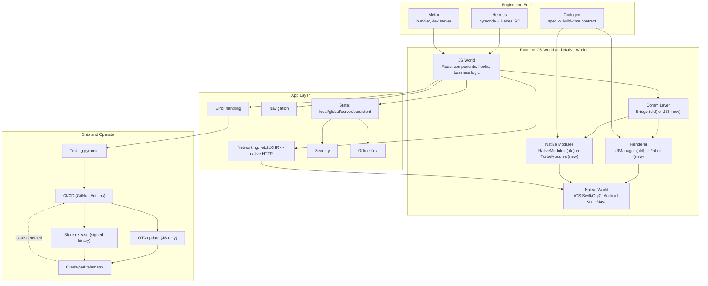

**Recall triggers:**
- Everything below React is swappable: Bridge↔JSI, UIManager↔Fabric, NativeModules↔TurboModules — React itself (Fiber) never changed.
- Hermes and Codegen are build/engine-time concerns that feed the runtime, not runtime concerns themselves.
- "Ship and Operate" (right side) is the part most interviews skip — it's Documents 4's §11 plus Tiers 8–12 in full depth.
- The feedback loop (telemetry → CI/CD) is the entire premise of staged rollout, canary, and auto-rollback.

---

## Part 2: How The Series Fits Together

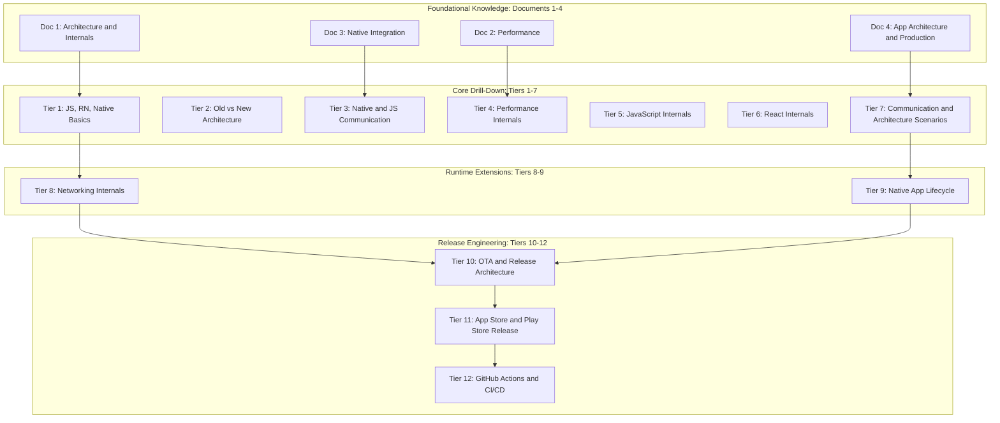

**Recall triggers:**
- Documents 1–4 are the reference layer; Tiers 1–7 are the same material reshaped into "explain this out loud" scenario form.
- Tiers 8–9 extend the runtime story into two areas Documents 1–3 only touched lightly: networking and the native boot/lifecycle sequence.
- Tiers 10–12 are a self-contained release-engineering arc: how code ships (OTA), how binaries ship (stores), how the pipeline that does both is built (GitHub Actions).
- Every tier file cross-links back to its owning document instead of re-deriving mechanics — the map above is literally the cross-link graph.

---

## Part 3: Per-Document Recall Maps

### Document 1: Architecture and Internals

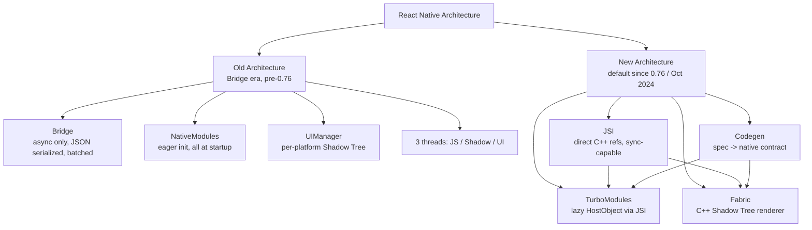

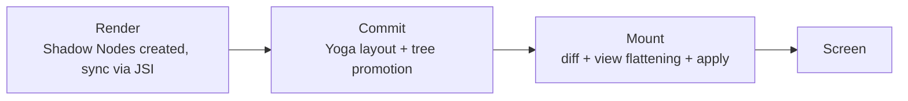

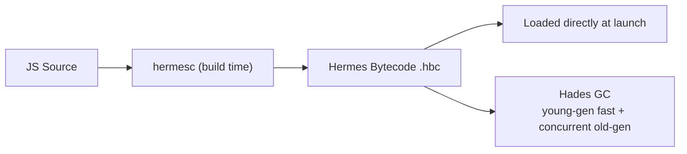

**Recall triggers:**
- 4 pillars of New Architecture: JSI, Fabric, TurboModules, Codegen — all required together, none adoptable alone.
- Fabric pipeline runs on JS thread OR UI thread depending on priority — same immutable C++ structures either way.
- React's own commit phase ≠ Fabric's commit phase — React's commit *triggers* Fabric's render step.
- VisionCamera example: ~30MB/frame, ~2GB/s — only possible via JSI host-object references, never the old Bridge.
- Hermes ships bundled/version-locked with RN since 0.69 (no ABI mismatch risk).

↳ [Full doc](01-architecture-and-internals.md)

### Document 2: Performance

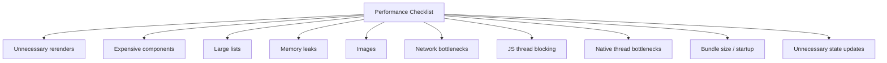

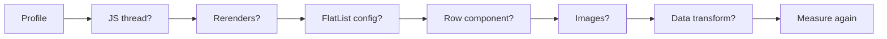

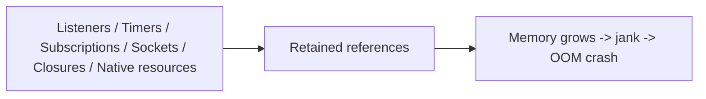

**Recall triggers:**
- 60fps = 16.67ms/frame budget; JS FPS and UI FPS are two independent, independently-droppable numbers.
- `memo`/`useMemo`/`useCallback` only help when the thing they guard is otherwise referentially unstable.
- FlatList defaults: `windowSize` 21, `initialNumToRender` 10, `maxToRenderPerBatch` 10, batching period 50ms.
- `getItemLayout` skips async measurement entirely — fixed-row-height lists only.
- FlashList/Legend List recycle a pool of views instead of mounting/unmounting like FlatList.
- Decoded image memory cost = pixel dimensions, not file size and not display size.
- Crash-while-scrolling-images diagnostic order: size → memory → caching → virtualization → native handling.
- Startup's two biggest levers: Hermes precompiled bytecode + lazy TurboModule init.

↳ [Full doc](02-performance.md)

### Document 3: Native Integration

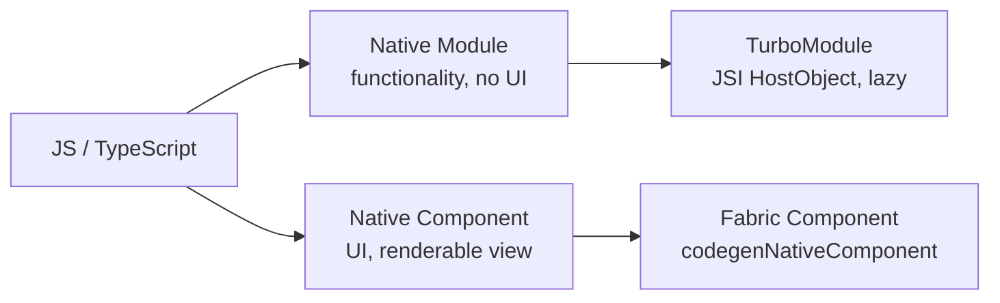

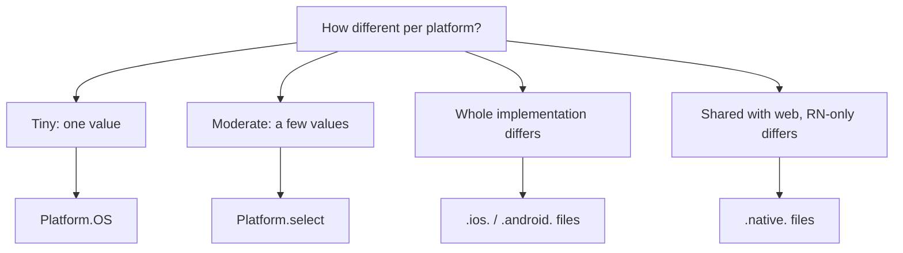

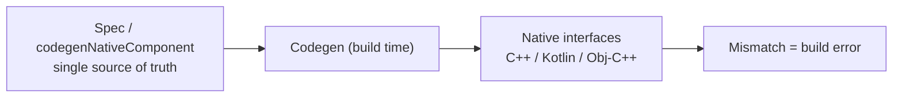

**Recall triggers:**
- Native Module = functionality (no visual output); Native Component = UI — never conflate the two.
- `Platform.select` precedence: platform-specific key (`ios`/`android`) > `native` > `default`.
- `Platform.Version`: Android = integer API level; iOS = version string from `UIDevice.systemVersion`.
- `Platform.OS` is runtime (both branches ship in the bundle); file-extension splitting is build-time (Metro picks one file, the other is never bundled).
- Toggle flags: `newArchEnabled` (Android `gradle.properties`) / `RCT_NEW_ARCH_ENABLED` (iOS `Podfile`).

↳ [Full doc](03-native-integration.md)

### Document 4: App Architecture and Production Concerns

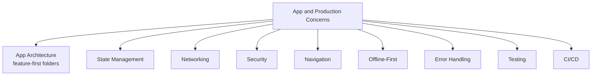

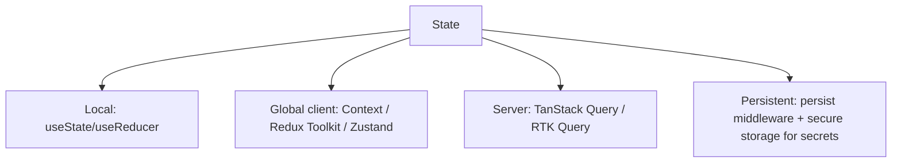

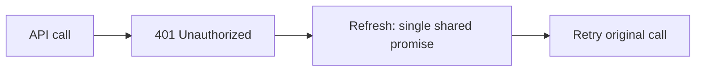

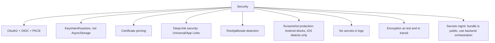

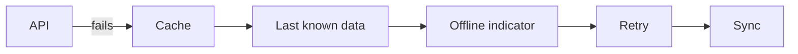

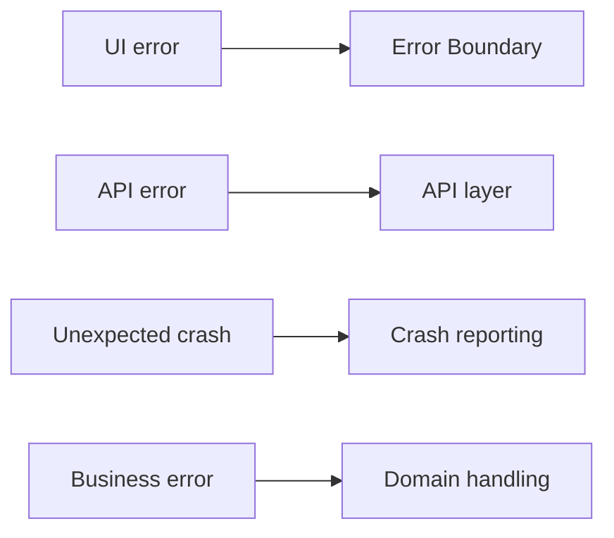

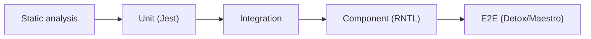

**Recall triggers:**
- Feature-first folders: `app/`, `features/*`, shared `components/`/`hooks/`/`services/`/`state/`.
- 4 kinds of state need 4 different tools — the anti-pattern is forcing all of them into one store.
- TanStack Query defaults: `staleTime` 0, `gcTime` 5 minutes, retry 3x with exponential backoff.
- A single shared in-flight refresh promise prevents a parallel-refresh race on concurrent 401s.
- OAuth2 = authorization only; OIDC = identity layer on top; PKCE required on mobile because there's no centralized URL-scheme registry.
- AsyncStorage is unencrypted (web `localStorage` equivalent); Keychain/Keystore is encrypted — never persist secrets in Redux/AsyncStorage.
- Android `FLAG_SECURE` truly blocks screenshots; iOS can only detect after the fact and blank the app-switcher preview.
- Optimistic updates fit low-stakes UI, not money-moving actions — use an explicit pending state instead.
- OTA = JS/assets only, never native code — the hard boundary that Tier 10 goes on to fully unpack.

↳ [Full doc](04-app-architecture-and-production-concerns.md)

### Tier 1: JS, RN and Native Basics

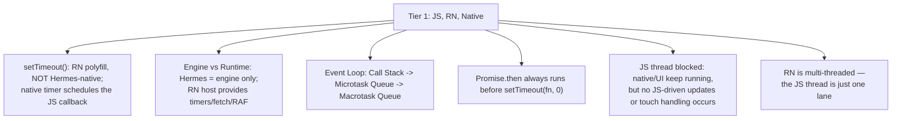

**Recall triggers:**
- Official quote: "React Native implements the browser timers" — Hermes itself does not implement `setTimeout`/`fetch`/`requestAnimationFrame`.
- `requestAnimationFrame` ≠ `setTimeout(fn, 0)` — RAF fires after frame flush, timeout fires as soon as possible.
- Pre-Hermes-native-Promise, the docs noted Promise used `setImmediate`; Hermes now implements Promise natively per spec.
- Chrome remote-debugging mode runs JS in V8 on the **dev machine**, over WebSocket — timers literally don't execute on-device in that mode.

↳ [Full doc](05-tire1-must-know-js-rn-native.md)

### Tier 2: Old vs New Architecture

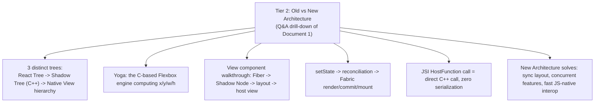

**Recall triggers:**
- This tier reuses Document 1's own pillar diagram almost entirely — the value-add is the "walk me through it" scenario framing.
- The React Tree / Shadow Tree / Native View hierarchy distinction is the single most-tested three-way confusion point.
- Every Bridge-era performance complaint traces back to one of: async-only, JSON serialization, batching latency, eager module init.

↳ [Full doc](06-tire2-old-vs-new-architecture.md)

### Tier 3: Native and JS Communication

```mermaid
flowchart LR
    JS4["JS calls native"] -->|"via Native Module / TurboModule"| NAT4["Native code: Swift / Kotlin"]
    NAT4 -->|"via NativeEventEmitter"| JS4
    NAT4 --> THR4["Executes on its own native thread —<br/>not JS thread, not UI thread"]
    THR4 --> NOBLOCK4["Never updates UI directly —<br/>must hop back through the renderer"]
```

```mermaid
flowchart TB
    THREE4["3-thread model"]
    THREE4 --> JST4["JS thread"]
    THREE4 --> NMT4["Native Module thread(s)"]
    THREE4 --> UIT4["UI thread"]
```

**Recall triggers:**
- Native Module = functionality; TurboModule = its JSI-backed form; Native Component = UI; Native Event = a native-initiated push JS didn't ask for.
- A native module performing a 5-second operation runs on its own background thread, never blocking JS or UI.
- Large data transfer efficiency = JSI host-object references, not JSON serialization — same mechanism VisionCamera relies on.
- Chatty JS↔Native communication still costs under JSI — call-count still matters, not just payload size.

↳ [Full doc](07-tire3-native-js-communication.md)

### Tier 4: Performance Internals

```mermaid
flowchart TB
    T4["Tier 4: Performance Internals"]
    T4 --> TWOFPS4["JS FPS (React/logic) vs UI FPS (native) —<br/>independently measured, independently droppable"]
    T4 --> MEMOBACK4["useMemo backfires when the calculation is cheap,<br/>or its deps change on every render anyway"]
    T4 --> LEAKCAT4["Leak catalogue: listeners, timers, subscriptions, unmount-during-async"]
    T4 --> ABORT4["AbortController cancels in-flight async work tied to component lifecycle"]
    T4 --> SVF4["ScrollView mounts everything; FlatList windows; FlashList recycles a pool"]
    T4 --> MANYCOMP4["1000s of components: reconciliation + Shadow Tree + Yoga cost all scale together"]
```

**Recall triggers:**
- A React Native app CAN hold 60 UI FPS while JS FPS tanks — the two threads are genuinely independent.
- Diagnosing JS-thread vs UI-thread issues: watch which fps number drops during the slow interaction.
- Five concrete leak sources to name on demand: listeners, timers, subscriptions, sockets, native resources.
- FlatList optimization checklist overlaps Document 2 §7 exactly — same tuning props, same defaults.

↳ [Full doc](08-tire4-performance-internals.md)

### Tier 5: JavaScript Internals

```mermaid
flowchart TB
    T5["Tier 5: JavaScript Internals"]
    T5 --> HADES5["Hermes Hades GC: young-gen fast/frequent;<br/>old-gen collected concurrently on its own thread"]
    T5 --> CLOSURE5["Closures retain their ENTIRE lexical scope,<br/>not just the variables actually used"]
    T5 --> BATCH5["One event-loop tick -> React automatic batching of state updates within it"]
    T5 --> MVM5["Microtasks (Promise) always fully drain<br/>before the next macrotask (setTimeout)"]
    T5 --> NOTHREAD5["async/await is sugar over Promises —<br/>no new thread is ever spawned"]
    T5 --> REANIM5["Exception: Reanimated worklets =<br/>a second JS runtime instance on the UI thread"]
    T5 --> WW5["Web Worker = a real separate thread + its own event loop<br/>(not the same model as RN's JS thread)"]
    T5 --> CVSP5["Concurrency = interleaved on one thread;<br/>Parallelism = truly simultaneous on multiple threads"]
```

**Recall triggers:**
- Hermes GC nickname: "Hades" (Meta's own engineering-blog term for its generational collector).
- Creating thousands of JS objects costs allocation + eventual GC pressure — same underlying cost as Tier 4's "1000s of components" question, different angle.
- The Reanimated worklet claim is explicitly flagged in-text as an ecosystem/community-library fact, not core RN.
- CPU-intensive work without blocking UI: chunk it, defer it, or move it off-thread (native module/worklet) — never just "await" it and hope.

↳ [Full doc](09-tire5-javascript-internals.md)

### Tier 6: React Internals in React Native

```mermaid
flowchart LR
    SS6["setState()"] --> SCHED6["Scheduled, not synchronous"] --> RENDER6["Render phase<br/>interruptible, pure"] --> COMMIT6["Commit phase<br/>sync, React host mutations"] --> FABRENDER6["= Fabric's own Render step<br/>Shadow Nodes via JSI"] --> FABCOMMIT6["Fabric Commit<br/>Yoga layout"] --> FABMOUNT6["Fabric Mount<br/>diff + apply to UI thread"] --> PAINT6["Paint"]
```

```mermaid
flowchart TB
    EFF6["Effect timing in RN"]
    EFF6 --> UIE6["useInsertionEffect: before all style/host mutations"]
    EFF6 --> ULE6["useLayoutEffect: after Fabric Render, before Commit/Mount"]
    EFF6 --> UE6["useEffect: asynchronous, after paint"]
```

**Recall triggers:**
- The sharpest nuance in this whole tier: React's own "commit phase" is not Fabric's commit phase — React's commit *is* Fabric's render step.
- Two separate diff layers decide what changes: React reconciliation (what changed) then Fabric's own mount-step diff (which native view mutations).
- Fiber = double-buffered tree (current + work-in-progress) — this is what makes interruption/resumption possible at all.
- RN has no browser DOM — "Virtual DOM" is web vocabulary; on native, React reconciles against the Shadow Tree instead.

↳ [Full doc](10-tire6-react-internals-in-react-native.md)

### Tier 7: Communication and Architecture Scenarios

```mermaid
flowchart TB
    T7["Tier 7: Scenario Questions"]
    T7 --> CRASH7["Crash propagation: JS/UI/Hermes share one OS process —<br/>a fatal native signal on any thread kills the whole app"]
    T7 --> BG7["Background: AppState active -> background -> active"]
    T7 --> TIMERDRIFT7["setInterval has no exact-interval guarantee and drifts;<br/>recursive setTimeout self-corrects"]
    T7 --> HEADLESS7["Reliable background work: Headless JS (Android) /<br/>BGTaskScheduler (iOS) — no shared core-RN API"]
    T7 --> PUSH7["Push: APNs/FCM -> native -> JS event<br/>(no core-RN abstraction)"]
    T7 --> DEEPLINK7["Deep link: OS -> native handoff -><br/>Linking.getInitialURL() / 'url' event"]
    T7 --> PERM7["Permissions: PermissionsAndroid (core) vs<br/>iOS (no core API, native config only)"]
```

**Recall triggers:**
- "Can a button visually respond with JS blocked?" — no, touch handling for JS-driven responses needs the JS thread; purely native-driven feedback can still work.
- `PushNotificationIOS` is explicitly marked DEPRECATED in the official docs — a deliberately-cited nuance, not an oversight.
- Cold start (`getInitialURL`) vs warm start (`'url'` event) is the same pattern used for both push notifications and deep links.
- This tier leans on general OS/process-model reasoning (shared process → shared crash fate), explicitly flagged as reasoning, not a single quotable line.

↳ [Full doc](11-tire7-communication-and-architecture-scenarios.md)

### Tier 8: Networking Internals

```mermaid
flowchart LR
    FETCH8["fetch()"] -->|"JS polyfill built on"| XHR8["XMLHttpRequest"] --> NM8["Native Module"] --> NATHTTP8["Native HTTP client:<br/>NSURLSession (iOS) / OkHttp (Android)"] --> EVT8["Events queued back to JS"]
```

**Recall triggers:**
- `fetch()` is a JS polyfill built ON TOP of `XMLHttpRequest`, not the other way around.
- Neither is implemented by the JS engine — both are RN host-environment APIs, same category as `setTimeout`.
- Official quote: "no concept of CORS in native apps" — there's no browser origin/shared-browsing-context to protect; an embedded WebView still enforces CORS.
- TLS/ATS/Android-cleartext-blocking are handled entirely natively; certificate pinning is ALWAYS implemented natively, never in JS.
- If the JS thread is busy when a response arrives, the native layer doesn't wait — the event just queues (a latency problem, not a correctness/data-loss problem).

↳ [Full doc](12-tire8-networking-internals.md)

### Tier 9: Native App Lifecycle

```mermaid
flowchart LR
    TAP9["Tap icon"] --> NATIVEINIT9["Native: AppDelegate/didFinishLaunching (iOS);<br/>MainApplication/MainActivity/ReactActivity (Android)"] --> RNINIT9["RN runtime init<br/>Hermes VM created"] --> BUNDLE9["JS bundle loaded<br/>Debug: Metro dev server / Release: embedded"] --> FIRSTRENDER9["First React component renders"]
```

```mermaid
flowchart LR
    FG9["Foreground"] -->|"resign / pause"| BG9["Background"]
    BG9 -->|"resume"| FG9
    BG9 --> NATIVECB9["Native callbacks: iOS resignActive/EnterBackground;<br/>Android onPause/onStop"]
    NATIVECB9 --> APPSTATEMOD9["Native AppState module observes -> emits JS 'change' event"]
```

**Recall triggers:**
- Hermes INIT (VM creation, happens every launch) vs Hermes COMPILE (`hermesc` bytecode generation, build time only) — two entirely different moments.
- Debug build: Metro dev server serves the bundle live (Fast Refresh). Release build: bundle is embedded in the binary; Metro isn't needed at runtime at all.
- Metro bundle vs OTA bundle = the same kind of artifact, just a different delivery mechanism/timing — this is the exact bridge concept into Tier 10.
- The JS-facing `AppState` 'change' event is just the JS layer on top of native OS lifecycle callbacks — Tier 7 owns the JS-facing table, this tier owns the native layer underneath it.

↳ [Full doc](13-tire9-native-app-lifecycle.md)

### Tier 10: OTA and Release Architecture

```mermaid
flowchart LR
    BUILDOTA10["Build JS bundle"] --> PUBLISH10["Publish to OTA server"] --> CHECKIN10["App checks in"] --> DOWNLOAD10["Download, checksum verified"] --> APPLY10["Apply on restart"] --> ACK10["notifyApplicationReady() or auto-rollback"]
```

**Recall triggers:**
- CodePush/App Center was RETIRED March 31 2025 (repo archived May 20 2025) — EAS Update is the current standard, built on open-source `expo-updates`.
- OTA can touch JS + assets ONLY — never native code, permissions, or dependencies (mechanical impossibility + Apple policy, two independent reasons).
- EAS's "runtime version policies" is the concrete, named mechanism that guarantees OTA/native-binary compatibility.
- Missing native module referenced by an OTA bundle: `TurboModuleRegistry.getEnforcing` fails loud and hard (new architecture) vs a quieter `undefined`-then-`TypeError` (old architecture).
- Staged rollout/canary uses consistent hashing for a stable user cohort; canary/blue-green/rolling are backend-deployment vocabulary mapped imperfectly onto mobile OTA.
- Never ship via OTA: anything that violates Apple Guideline 3.3.2, or falls outside Google Play's "limited-API virtual machine" exception.

↳ [Full doc](14-tire10-ota-and-release-architecture.md)

### Tier 11: App Store and Play Store Release

```mermaid
flowchart TB
    T11["Tier 11: Store Release"]
    T11 --> TRIGGER11["New binary required: native code, permissions, SDKs, icons, or metadata change"]
    T11 --> IOSFLOW11["iOS: xcodebuild archive -> export -> gym/pilot/deliver -> App Store Connect"]
    T11 --> ANDFLOW11["Android: gradlew bundleRelease (AAB) -> supply -> Google Play"]
    T11 --> SIGNIOS11["iOS signing: certificate + provisioning profile<br/>App ID + device list + entitlements"]
    T11 --> SIGNAND11["Android signing: keystore;<br/>Play App Signing = your upload key + Google's app-signing key"]
    T11 --> ROLLOUT11["Google Play staged rollout (confirmed mechanics) vs<br/>Apple phased release (general knowledge, % unverified)"]
    T11 --> NOREVERT11["Can't truly un-release a downloaded binary —<br/>halting rollout / expedited review are the real levers"]
```

**Recall triggers:**
- APK vs AAB: AAB "defers APK generation and signing to Google Play" (Google's own definition) — mandatory for new apps since August 2021.
- Play App Signing's two-key model: your upload key is recoverable if lost, unlike the old single-key model.
- iOS App Store distribution profiles skip the device list that ad-hoc/development profiles require.
- Apple's 7-stage phased-release percentage model is explicitly flagged as well-known general knowledge here, not a freshly-quoted official source.
- The two-branch incident pattern: no native change needed → OTA (fast, Tier 10); native change needed → kill-switch first, then the full signed pipeline.

↳ [Full doc](15-tire11-app-store-play-store-release.md)

### Tier 12: GitHub Actions and CI/CD

```mermaid
flowchart TB
    PUSH12["git push"] --> PRWF12["PR workflow: lint / typecheck / unit tests"] --> MERGEWF12["Merge workflow: full tests + parallel iOS/Android build jobs"] --> REVIEWAPP12["Review app: TestFlight / Play internal / EAS preview"] --> QA12["QA sign-off"] --> RELEASEWF12["Release workflow: environment approval gate"]
    RELEASEWF12 --> NATIVECHANGE12{"Native changes?"}
    NATIVECHANGE12 -->|"no"| OTAPUB12["OTA publish"]
    NATIVECHANGE12 -->|"yes"| STOREUP12["Signed upload to App Store / Play"]
    OTAPUB12 --> MONITOR12["Monitor crash telemetry -> rollback if needed"]
    STOREUP12 --> MONITOR12
```

**Recall triggers:**
- iOS and Android are two SEPARATE jobs (different OS/runner requirement) — not one matrix dimension; matrix is reserved for a different axis within each platform job.
- Certs/keystores: base64-encode locally → store as a GitHub secret → decode back to a file at workflow runtime; Fastlane `match` is the one-secret team alternative.
- GitHub environments allow up to 6 required reviewers, but by default only ONE approval is needed to proceed — an easy-to-misstate detail.
- `concurrency` with `cancel-in-progress: false` correctly queues a second production-release trigger; `true` would wrongly cancel an in-flight release.
- CocoaPods has NO dedicated `setup-*` caching action — must hand-roll via `actions/cache`; Node (`setup-node`) and Gradle (`setup-java`) both have built-in caching.
- This workspace's own conventions apply here specifically: `bby-ubuntu` runners, Artifactory-hosted registries, and the `bby-corp/tplat-gha-configure-github-credentials` action.

↳ [Full doc](16-tire12-github-actions-cicd.md)

---

## Part 4: The Capstone Walkthrough

The final synthesis — one feature, from a line of code to a monitored production release, touching every layer in this document.

```mermaid
flowchart TB
    CODE13["Write JS/TS + React code"] --> RECON13["React reconciliation (Fiber)"]
    RECON13 --> FABRIC13["Fabric: Render -> Commit -> Mount"]
    FABRIC13 --> SCREEN13["Pixels on screen (UI thread)"]
    CODE13 --> NATIVECALL13["Need a native capability?"]
    NATIVECALL13 -->|"yes"| TURBO13["TurboModule via JSI"]
    TURBO13 --> SCREEN13
    CODE13 --> COMMIT13["git commit / push"] --> CIPIPE13["CI: lint / typecheck / test / build (GitHub Actions)"]
    CIPIPE13 --> BRANCH13{"Native code changed?"}
    BRANCH13 -->|"no"| OTASHIP13["Ship via OTA (EAS Update)"]
    BRANCH13 -->|"yes"| STORESHIP13["Sign + submit to App Store / Play"]
    OTASHIP13 --> USERDEVICE13["User's installed app"]
    STORESHIP13 --> USERDEVICE13
    USERDEVICE13 --> TELEMETRY13["Crash/perf telemetry"]
    TELEMETRY13 -->|"issue found"| ROLLBACK13["Rollback / halt rollout / feature flag"]
    TELEMETRY13 -->|"healthy"| RAMP13["Ramp rollout % to 100"]
```

**Recall triggers:**
- The left branch (code → Fabric → screen) is Document 1 + Tiers 2/6. The right branch (commit → CI → ship) is Document 4 §11 + Tiers 10/11/12.
- The single `BRANCH13` decision — does this change touch native code — is the hinge the entire release-engineering arc (Tiers 10–12) is organized around.
- Everything in this diagram is reversible except one step: once a binary is actually downloaded by a user, Tier 11 is explicit that it cannot be truly un-released — only rollout-halting, feature flags, and OTA patches are real levers.

---

*This map covers [Documents 1–4](01-architecture-and-internals.md) and [Tiers 1–12](05-tire1-must-know-js-rn-native.md) — the complete question bank as of this writing. If a new tier (13+) is added later, extend Part 2's diagram and add a matching subsection to Part 3.*
